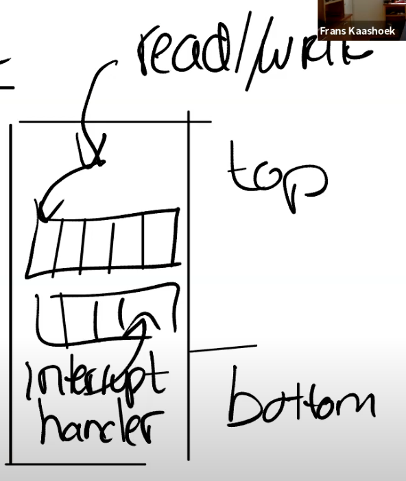
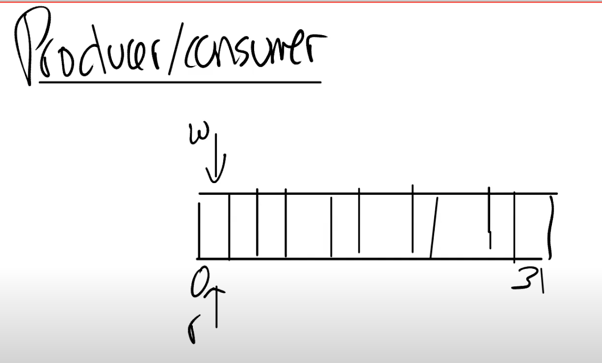
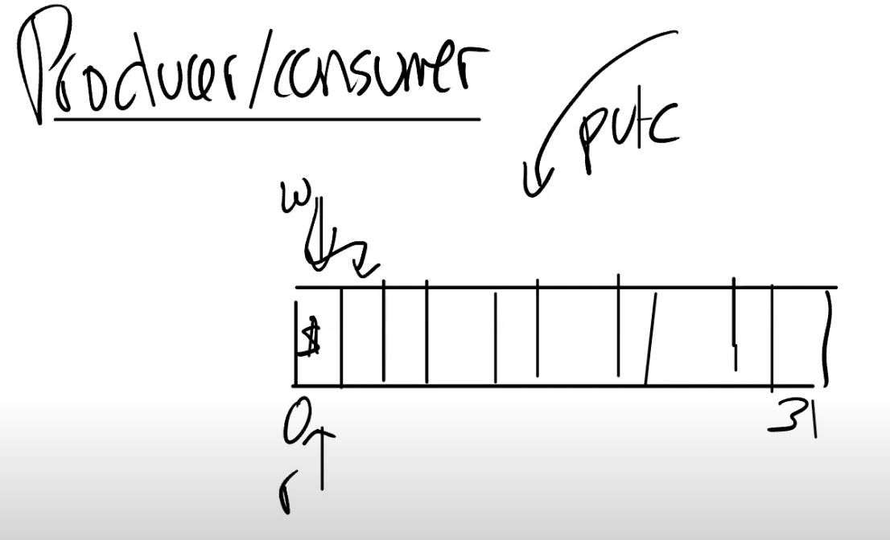
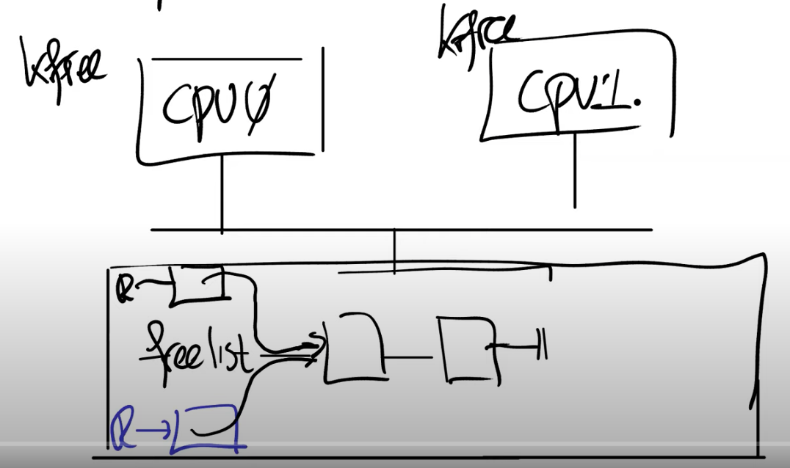
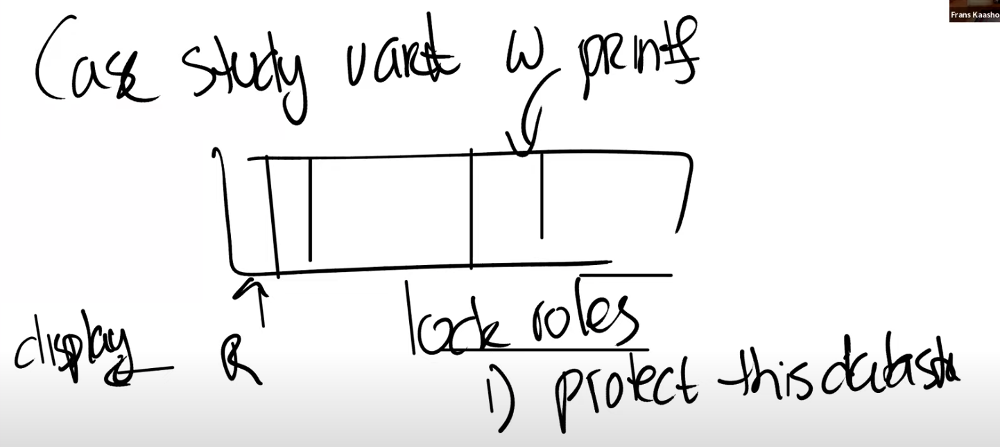

# Interrupts（中断）

大部分操作系统运行时几乎没有任何空闲的内存。这意味着如果应用程序或者内核需要使用新的内存，那么我们需要丢弃一些已有的内容。在某个时间点如果需要大量内存的话，要么是从应用程序，要么是从buffer/cache中，需要撤回已经使用的一部分内存。**实际使用的内存数量远小于地址空间的大小。基于虚拟内存和page fault提供的非常酷的功能在这都有使用，比如说demand paging。**

## 中断的处理流程与硬件设备

中断对应的场景很简单，就是硬件想要得到操作系统的关注。

操作系统需要做的是：保存当前的工作---->处理中断---->恢复之前的工作。这里的保存和恢复工作与之前系统调用过程非常相似。所以系统调用、page fault、中断都使用相同的机制。

### 中断与系统调用的区别：

①asynchronous(异步)。当硬件生成中断时，**中断处理程序与CPU上当前运行的进程没有任何关联。**但如果是系统调用的话，需要进入内核，然后在调用进程的上下文中运行。

②concurrency(并发)。**对于中断来说，CPU和生成中断的设备是并行运行。**网卡自己独立处理来自网络的网络包，然后在某个时间点产生中断。同时，CPU也在正常运行。所以CPU和设备之间是并行运行的，我们必须管理这里的并行。

③program devices(对硬件编程)。我们这节课主要关注外部设备，例如网卡、UART。这些设备需要被编程，每个设备都有一个编程手册，就像RISC-V有一个包含了指令和寄存器的手册一样。设备的编程手册包含了它有什么样的寄存器、它能执行什么样的操作、在读写控制寄存器时设备会如何响应。

### 中断的产生

**我们这节课会讨论的内容：**
----控制台中的提示符`$ `是如何显示出来的。
----如果你在键盘输入`ls`，这个ls字符是怎么读入并显示在控制台。
----实现上述目标所需要的所有机制。

**我们首先要关心的是：中断是从哪里产生的？**

因为我们主要关心的是外部设备的中断，而不是定时器中断或软件中断。外设中断来自于主板上的设备，

[外部设备中断（以SFive主板为例）](https://blog.csdn.net/InnerPeaceHQ/article/details/126420871)

**这里的流程总结如下：**
①PLIC通知当前有一个待处理的中断
②其中一个CPU核会声称接收中断，这样PLIC就不会把中断发给其他的CPU处理
③CPU核处理完中断之后，CPU会通知PLIC处理完毕
④PLIC将不再保存中断的信息

PLIC有没有什么执行机制来确保公平？

这里取决于内核以什么样的方式来对PLIC进行编程。PLIC只是分发中断，而内核需要对PLIC进行编程来告诉它中断应该分发到哪。实际上，内核可以对中断优先级进行编程，这里非常的灵活。

## 驱动

### 驱动的概念

通常来说，**管理设备的代码称为驱动，xv6中所有的驱动都在内核中。**我们今天要看的是UART设备的驱动，代码在uart.c文件中。

大部分驱动都分为两个部分：**`bottom`和`top`。**

----bottom部分通常是中断处理程序(Interrupt handler)。当一个中断送到了CPU并且CPU接收这个中断，CPU会调用相应的中断处理程序。中断处理程序并不运行在任何特定进程的上下文中，它只是处理中断。

----top部分是用户进程或者内核的其他部分调用的接口。对于UART来说，这里有read/write接口，这些接口可以被更高层级的代码调用。

通常情况下，驱动中会有一些队列(或者说buffer)，top部分的代码会从队列中读写数据，而中断处理程序(bottom部分)同时也会向队列中读写数据。这里的队列可以将顶部和底部解耦，并允许设备和CPU上的其他代码并行运行。

----通常对于中断处理程序来说存在一些**限制，因为它并没有运行在任何进程的上下文中，所以进程的页表并不知道该从哪个地址读写数据**，也就**无法直接从中断处理程序读写数据。**所以驱动的top部分通常与用户的进程交互，进行数据的读写。

### 设备编程

通常来说，对设备编程是通过内存映射I/O(memory mapped I/O)完成的。

设备地址出现在物理地址的特定区间内，这个区间由主板制造商决定。

----操作系统需要知道这些设备位于物理地址空间的具体位置，然后再通过普通的load/store指令对这些地址进行编程。

----load/store指令实际上的工作就是读写设备的控制寄存器。例如，对网卡执行store指令时，CPU会修改网卡的某个控制寄存器，进而导致网卡发送一个网络包。所以这里的load/store指令不会读写内存，而是会操作设备。

学生提问：如果你写入数据到Transmit Holding Register，然后再次写入，那么前一个数据不会被覆盖掉吗？
Frans教授：我们通过load将数据写入到这个寄存器中，之后UART芯片会**通过串口线将这个Byte送出。当完成了发送，UART会生成一个中断给内核，这个时候才能再次写入下一个数据。**所以内核和设备之间需要遵守一些协议才能确保一切工作正常。上图中的UART芯片会有一个容量是16的FIFO，但是你还是要小心，因为如果阻塞了16个Byte之后再次写入还是会造成数据覆盖。

## 在xv6中设置中断

**控制台显示$的原理**

对于`$ `来说，实际上就是设备会将字符传输给UART的寄存器，UART之后会在发送完字符之后产生一个中断。在QEMU中，模拟的线路的另一端会有另一个UART芯片，这个UART芯片连接到了虚拟的控制台，它会进一步将`$ `显示在控制台上。

**键盘输入ls并显示在控制台的原理**

对于ls，这是用户输入的字符。键盘连接到了UART的输入线路，当你在键盘上按下一个按键，UART芯片会将按键字符通过串口线发送到另一端的UART芯片。另一端的UART芯片先将数据bit合并成一个Byte，之后再产生一个中断，并告诉处理器这里有一个来自于键盘的字符。之后中断处理程序会处理来自于UART的字符。
**RISC-V与中断相关的寄存器**

①SIE(Supervisor Interrupt Enable)寄存器。这个寄存器中有一个bit(E)专门针对类似UART的外部设备的中断。有一个bit(S)专门针对软件中断，软件中断可能由一个CPU核触发给另一个CPU核。还有一个bit(T)专门针对定时器中断。
②SSTATUS(Supervisor Status)寄存器。这个寄存器中有一个bit来打开或者关闭中断。每一个CPU核都有独立的SIE和SSTATUS寄存器，除了通过SIE寄存器来单独控制特定的中断，还可以通过SSTATUS寄存器中的一个bit来控制所有的中断。
③SIP(Supervisor Interrupt Pending)寄存器。当发生中断时，处理器可以通过查看这个寄存器知道当前是什么类型的中断。
④SCAUSE寄存器。它会表明当前状态的原因是中断。
⑤STVEC寄存器。它会保存当trap、page fault、中断发生时，CPU运行的用户程序的程序计数器，这样才能在稍后恢复程序的运行。
**xv6中设置中断**

[流程具体](https://blog.csdn.net/InnerPeaceHQ/article/details/126420871)

机器启动时，start.c中的start函数被调用，它以M模式运行，禁用了页表。很快过后，内核又进入Supervisor Mode，可以设置页表。

机器启动时，start.c中的start函数被调用，它以M模式运行，禁用了页表。很快过后，内核又进入Supervisor Mode，可以设置页表。

第一个外设是console

这里首先初始化了锁，然后调用了uart.c中的uartinit函数。这个函数实际上就是配置好UART芯片使其可以被使用。

这里的流程是先关闭中断，之后设置波特率，设置字符长度为8bit，重置FIFO，最后再重新打开中断。

运行完这个函数之后，原则上UART就可以生成中断了。但是因为我们还没有对PLIC编程，所以中断不能被CPU感知。最终，在main函数中需要调用plicinit函数。

plicinit之后就是plicinithart函数。plicinit是由0号CPU运行，之后每个CPU的核都需要调用plicinithart函数表明对于哪些外设中断感兴趣。

到目前为止，我们有了生成中断的外部设备，有了PLIC可以传递中断到单个的CPU。但是CPU自己还没有设置好接收中断，因为我们还没有设置好SSTATUS寄存器。在main函数的最后，程序调用了scheduler函数。

scheduler函数主要是运行进程。但是在实际运行进程之前，会执行intr_on函数来使得CPU能接收中断。

## UART驱动的top部分

### 输出`$ `的流程

从Shell程序输出提示符`$`到Console的流程：

①首先我们看init.c中的main函数，这是系统启动后运行的第一个进程。

②Shell程序首先打开文件描述符0、1、2，之后Shell向文件描述符2打印提示符`$ `

**fprintf工作原理**

在Unix系统中，设备是由文件表示。我们来看一下这里的fprintf是如何工作的。

代码只是调用了write系统调用，会走向sys_write()函数，之后filewrite函数，根据文件包描述符类型执行特定设备的write函数，这里先通过either_copyin将字符拷入，之后调用uart.c中的uartputc函数。uartputc函数将字符写入给UART设备，并完成实际的打印字符。所以你可以认为consolewrite是一个UART驱动的top部分。

在UART的内部会有一个buffer用来发送数据，buffer的大小是32个字符。同时还有一个为consumer提供的读指针和为producer提供的写指针，来构建一个环形的buffer(可以认为是环形队列)。

对于我们来说，buffer必然不是满的，所以代码会走到else，字符会被送到buffer中，更新写指针，之后再调用uartstart函数。uartstart就是通知设备执行操作。

----首先是检查当前设备是否空闲，如果空闲的话，我们会从buffer中读出数据，然后将数据写入到THR(Transmission Holding Register)发送寄存器。这里相当于告诉设备，我这里有一个字节需要你来发送。
----一旦数据送到了设备，系统调用会返回，用户应用程序Shell就可以继续执行。这里从内核返回到用户空间的机制与lec06的trap机制是一样的。
----与此同时，UART设备会将数据送出。在某个时间点，我们会收到中断，因为
我们之前设置了要处理UART设备中断。

## UART驱动的bottom部分

### 发生中断时，实际会发生的事情

 我们之前已经在SSTATUS寄存器中打开了中断，所以处理器会被中断。假设键盘生成了一个中断并且发向了PLIC，PLIC会将中断路由给一个特定的CPU核。如果这个CPU核设置了SIE寄存器的E bit(针对外部中断的bit位)，那么会发生以下事情：

①**清除SIE寄存器相应的bit，这样可以阻止CPU核被其他中断打扰**，该CPU核可以专心处理当前中断。处理完成之后，可以再次恢复SIE寄存器相应的bit。

②**设置SEPC寄存器为当前的程序计数器。**我们假设Shell正在用户空间运行，突然来了一个中断，那么当前Shell的程序计数器会被保存。

③**保存当前的mode。**在我们的例子里面，因为当前运行的是Shell程序，所以会记录user mode。

④**将mode设置为Supervisor mode。**

⑤**最后将程序计数器的值设置成STVEC的值(STVEC用来保存trap处理程序的地址)。**在XV6中，STVEC保存的是uservec或者kernelvec函数的地址，具体取决于发生中断时程序运行是在用户空间还是内核空间。

### xv6的中断处理流程

在我们的例子中，Shell运行在用户空间，所以STVEC保存的是uservec函数的地址。而从之前的课程我们可以知道uservec函数会调用usertrap函数。所以接下来看一下trap.c文件中的usertrap函数，我们在lec06和lec08分别在这个函数中处理了系统调用和page fault，今天我们将要看一下如何处理中断。

①在trap.c的devintr函数中，首先会通过SCAUSE寄存器判断当前中断是否是来自于外设的中断。如果是的话，再调用plic_claim函数来获取中断。

②plic_claim函数位于plic.c文件中。在这个函数中，当前CPU核会告知PLIC自己要处理中断，PLIC_SCLAIM会将中断号返回。对于UART来说，返回的中断号是10。

③从devintr函数可以看出，如果是UART中断，那么会调用uart.c中的uartintr函数。uartintr会从UART的接收寄存器中读取数据，然后将获取到的数据传递给consoleintr函数。这里讨论的是向UART发送数据，但是我们现在还没有通过键盘输入任何数据，所以UART的接受寄存器现在为空。所以uartgetc()会返回-1，然后break出来。

④所以uartintr代码会直接运行到uartstart函数，这个函数会将Shell存储在buffer中的任意字符送出。实际上在提示符$之后，Shell还会输出一个空格字符。write系统调用可以在UART发送提示符$的同时，并发的将空格字符写入到buffer中。所以UART的发送中断触发时，可以发现在buffer中还有一个空格字符，之后会将这个空格字符送出。这样，驱动的top部分和bottom部分就解耦开了。
学生提问：UART对于键盘来说很重要，来自于键盘的字符通过UART走到CPU再到我们写的内核代码。但是我不太理解UART对于Shell输出字符究竟有什么作用？因为在这个场景中，并没有键盘的参与。
Frans教授：显示设备与UART也是相连的。所以UART连接了两个设备，一个是键盘，另一个是显示设备，也就是Console。QEMU也是通过模拟的UART与Console进行交互，而Console的作用就是将字符在显示器上画出来。

## Interrupt相关的并发

并发加大了中断编程的难度。这里的并发包括以下几个方面：

①设备与CPU是并行运行的。例如当UART向Console发送字符的时候，CPU会返回执行Shell，而Shell会调用其它的系统调用向buffer中写入另一个字符。这里的并行称为producer-consumer并行。
②中断会停止当前运行的程序。例如，Shell正在运行第212个指令，突然来了个中断，Shell的执行会立即停止。
----对于用户空间代码，这并不是一个大的问题。因为当我们从中断中返回时，我们会恢复用户空间代码，并继续执行执行停止的指令。我们已经在trap和page fault中看过了这部分内容。
----当内核被中断打断时，事情就不一样了。所以，代码运行在kernel mode也会被中断，这意味着即使是内核代码，也不是直接串行运行的。在两个内核指令之间，取决于中断是否打开，可能会被中断打断执行。对于一些代码来说，如果不能在执行期间被中断，这时内核需要临时关闭中断，来确保这段代码的原子性
③驱动的top和bottom部分是并行运行的。例如，Shell会在传输完提示符$之后再调用write系统调用传输空格字符。代码会走到UART驱动的top部分(uartputc函数)，将空格写入到buffer中。但是同时在另一个CPU核，可能会收到来自于UART的中断，进而执行UART驱动的bottom部分，查看相同的buffer。所以一个驱动的top和bottom部分可以并行的在不同的CPU上运行，这里我们通过锁来管理并行。因为这里有共享的数据，我们想要buffer在一个时间只被一个CPU核所操作。
producer/consumser并发
这里我们主要关注producer/consumser并发，这是驱动中的非常常见的典型现象。正如你们所见，在驱动中会有一个buffer，在我们之前的例子中，buffer是32字节大小。除此之外还有两个指针，分别是读指针和写指针。

如果两个指针相等，那么buffer是空的。当Shell调用uartputc函数时，会将字符(例如提示符$)写入到写指针的位置，并将写指针加1。这就是producer对于buffer的操作。

----producer可以一直写入数据，直到写指针+1等于读指针，因为这时buffer已经满了。当buffer满了的时候，producer必须停止运行。我们之前在uartputc函数中看过，如果buffer满了，代码会sleep，暂时搁置Shell并运行其他的进程。
----中断处理程序(也就是uartintr函数)在这个场景下是consumer，每当有一个中断，并且读指针落后于写指针，uartintr函数就会从读指针中读取一个字符再通过UART设备发送，并且将读指针加1。当读指针追上写指针，也就是两个指针相等的时候，buffer为空，这时就不用做任何操作

**这里的buffer对于所有的CPU核都是共享的吗？**

这里的buffer存在于内存中并且只有一份，所以所有的CPU核都并行的与这一份数据交互，因此我们才需要锁。

sleep会让当前运行的进程进入睡眠状态，sleep函数传入的是正在等待的东西。在这个例子中传入的是uart_tx_r的地址。在uartstart函数中，一旦buffer中有了空间，会调用与sleep对应的函数wakeup，传入的也是uart_tx_r的地址。

任何等待在这个地址的进程都会被唤醒。所以sleep和wakeup这两个调用是相互的，有时候这种机制被称为conditional synchronization(条件同步)。以上就是Shell输出提示符$ 的全部内容。如你们所见，过程还挺复杂的，许多代码一起工作才将这两个字符传输到了Console。

## UART读取键盘输入

在某个时候，Shell打印`$`和` `，然后会调用read读取来自键盘的输入。在read系统调用的底层，会调用fileread函数。在这个函数中，如果读取的文件类型是设备，会调用相应设备的read函数。

在我们的例子中，read函数就是console.c文件中的consoleread函数。

这里与UART类似，也有一个buffer，其他的基本一样，也有producer和consumser。但是在这个场景下Shell变成了consumser，因为Shell是从buffer中读取数据。而键盘是producer，它将数据写入到buffer中。

从consoleread函数中可以看出，当读指针和写指针一样时，说明buffer为空，进程会sleep。
----所以Shell在打印完`$ `之后，如果键盘没有输入，Shell进程会sleep，直到键盘有一个字符输入。

----所以在某个时间点，假设用户通过键盘输入了`l`，这会导致`l`被发送到主板上的UART芯片，产生中断之后再被PLIC路由到某个CPU核。

----之后会触发devintr函数，devintr可以发现这是一个UART中断，然后通过uartgetc函数获取到相应的字符，之后再将字符传递给consoleintr函数。

---默认情况下，字符会通过consputc输出到console上给用户查看。之后，字符被存放在buffer中。在遇到换行符的时候，唤醒之前sleep的进程(也就是Shell)，再从buffer中将数据读出。
----所以这里也是通过buffer将consumer和producer之间解耦，这样它们才能按照自己的速度独立地并行运行。如果某一个运行的过快了，那么buffer要么是满的要么是空的，consumer和producer其中一个会sleep并等待另一个追上来。

## 中断的演进

轮询(polling)。除了依赖Interrupt，CPU可以一直读取外设的控制寄存器来检查是否有数据。对于UART来说，我们可以一直读取RHR寄存器来检查是否有数据。

----这种方法浪费了CPU cycles，当我们在使用CPU不停地检查寄存器的内容时，我们并没有用CPU来运行任何程序。在我们之前的例子中，如果没有数据，内核会让Shell进程sleep，这样可以运行另一个进程。
----所以，对于一个慢设备，你肯定不想一直轮询它来得到数据，我们想要在没有数据的时候切换出来运行一些其他程序。但是如果是一个快设备，那么中断的开销也会很高，那么我们最好还是轮询设备，因为我们很快就能获得数据 。
----所以对于一个高性能的网卡，如果有大量的包要传入，那么应该用polling。对于一些精心设计的驱动，它们会在轮询和中断之间动态切换（也就是网卡的NAPI）。

# [xv6参考手册第5章]-＞中断与设备驱动程序

驱动程序是操作系统中管理特定设备的代码，它负责做以下等工作：

**①配置硬件设备
②指示设备执行操作
③处理产生的中断
④与可能正在等待设备I/O的进程进行交互**

----需要操作系统关注的设备通常可以被配置为生成中断(trap的一种)。内核trap处理代码在设备产生中断时进行识别，然后调用驱动程序的中断处理程序。在xv6中，这种调度发生在`devintr`中(kernel/trap.c:177)。

**许多设备驱动在两种情况下执行代码：**
上半部分在进程的内核线程中运行，下半部分在中断时执行。
----上半部分通过系统调用被调用，如希望设备执行I/O操作的read和write。这段代码可能会要求硬件执行一个操作(如要求磁盘读取块)。然后代码等待操作完成。最终设备完成操作并引发中断。
----驱动程序的中断处理程序充当下半部分，找出已经完成的操作，如果合适的话唤醒一个等待中的进程，并告诉硬件开始执行下一个正在等待的操作。

## 代码：控制台输入

### 控制台输入大致流程

控制台驱动程序通过连接到RISC-V的UART串口硬件接收人们输入的字符。控制台驱动程序一次累积一行输入，处理如backspace和Ctrl-u的特殊输入字符。用户进程(如Shell)使用read系统调用从控制台获取输入行。当你在QEMU中通过键盘向xv6输入信息时，你的按键将通过QEMU模拟的UART硬件交付给xv6。
驱动程序管理的UART硬件，运行QEMU时，它连接到你的键盘和显示器。

### UART在软件中的视图

-----UART硬件在软件中看起来是一组内存映射的控制寄存器。也就是说，存在一些RISC-V硬件连接到UART的物理地址，以便载入(load)和存储(store)操作与设备硬件而不是RAM交互。
----UART的内存映射地址起始于0x10000000或UART0(kernel/memlayout.h:21)。有几个宽度为一字节的UART控制寄存器，它们相对于UART0的偏移量在(kernel/uart.c:22)中定义。

### 控制台输入具体过程

①xv6的`main`函数调用`consoleinit`(kernel/console.c:184)来**初始化UART硬件**。该代码配置UART：**UART对接收到的每个字节的输入生成一个接收中断，对发送完的每个字节的输出生成一个发送完成中断**(kernel/uart.c:53)。

②xv6的**shell通过init.c(user/init.c:19)中打开的文件描述符从控制台读取输入**。consoleread等待输入到达(通过中断)，并在cons.buf中缓存，将输入复制到用户空间，然后(在整行到达后)返回给用户进程。如果用户还没有键入整行，任何读取进程都将在sleep系统调用中等待(kernel/console.c:98)(第7章解释了sleep的细节)。
③当用户输入一个字符时，UART硬件要求RISC-V发出一个中断，从而激活xv6的trap处理程序。trap处理程序调用devintr(kernel/trap.c:177)，它查看RISC-V的scause寄存器以发现中断来自外部设备。然后它要求一个名为PLIC的硬件单元告诉它哪个设备中断了(kernel/trap.c:186)。如果是UART，devintr调用uartintr。
④uartintr(kernel/uart.c:180)从UART硬件读取所有等待输入的字符，并将它们交给consoleintr(kernel/console.c:138)。**它不会等待字符，因为未来的输入将引发一个新的中断。consoleintr的工作是在cons.buf中积累输入字符，直到一整行到达。**consoleintr对backspace和其他少量字符进行特殊处理。当换行符到达时，consoleintr唤醒一个等待的consoleread(如果有的话)。
⑤一旦被唤醒，`consoleread`将监视`cons.buf`中的一整行，将其复制到用户空间，并返回(通过系统调用机制)到用户空间。

## 代码：控制台输出

①在连接到控制台的文件描述符上执行write系统调用，最终将到达uartputc(kernel/uart.c:87) 。设备驱动程序维护一个输出缓冲区(uart_tx_buf)，这样写进程就不必等待UART完成发送。相反，uartputc将每个字符附加到缓冲区，调用uartstart来启动设备传输(如果还未启动)，然后返回。导致uartputc等待的唯一情况是缓冲区已满。
②每当UART发送完一个字节，它就会产生一个中断。uartintr调用uartstart，检查设备是否真的完成了发送，并将下一个缓冲的输出字符交给设备。因此，如果一个进程向控制台写入多个字节，通常第一个字节将由uartputc调用uartstart发送，而剩余的缓冲字节将由uartintr调用uartstart发送，直到传输完成中断到来。
注： 需要注意，这里的一般模式是通过缓冲区和中断机制将设备活动与进程活动解耦。即使没有进程等待读取输入，控制台驱动程序仍然可以处理输入，而后续的读取将看到这些输入。类似地，进程无需等待设备就可以发送输出。这种解耦可以通过允许进程与设备I/O并发执行来提高性能，当设备很慢(如UART)或需要立即关注(如回声型字符(echoing typed characters))时，这种解耦尤为重要。这种想法有时被称为I/O并发。
驱动程序的并发性

## 驱动程序的并发性

你或许注意到了在consoleread和consoleintr中对acquire的调用。这些调用获得了一个保护控制台驱动程序的数据结构不受并发访问的锁。这里有三种并发风险：
①运行在不同CPU上的两个进程可能同时调用consoleread
②硬件或许会在consoleread正在执行时要求CPU传递控制台中断
③硬件可能在当前CPU正在执行consoleread时向其他CPU传递控制台中断
一个进程可能正在等待来自设备的输入，但是输入的中断信号可能是在另一个进程(或者根本没有进程)正在运行时到达的。因此中断处理程序不允许考虑他们已经中断的进程或代码。例如，中断处理程序不能安全地使用当前进程的页表调用copyout(注：因为你不知道是否发生了进程切换，当前进程可能并不是原先的进程)。中断处理程序通常做相对较少的工作(例如，只需将输入数据复制到缓冲区)，并唤醒上半部分代码来完成其余工作。

## 定时器中断

xv6使用定时器中断来维持其时钟，并使其能够在计算密集的进程(compute-bound processes)之间切换。usertrap和kerneltrap中的yield调用会导致这种切换。定时器中断来自每个RISC-V CPU上的时钟硬件。xv6对该时钟硬件进行编程，以定期中断每个CPU。

### 定时器中断的运行模式

----RISC-V要求定时器中断在机器模式而不是管理员模式下发生。RISC-V机器模式无需分页即可执行，并且有一组单独的控制寄存器，因此在机器模式下运行普通的xv6内核代码是不实际的。因此，xv6处理定时器中断完全不同于上面列出的trap机制。
----机器模式下执行的代码位于main之前的start.c中，它设置了接收定时器中断(kernel/start.c:57)。工作的一部分是对CLINT(core-local interruptor)硬件编程，以在特定延迟后生成中断。另一部分是设置一个类似于trapframe的scratch区域，以帮助定时器中断处理程序保存寄存器和CLINT寄存器的地址。最后，start将mtvec设置为timervec，并使能定时器中断。

### 定时器中断发生的时间点

----定时器中断可能发生在用户或内核代码正在执行的任何时间点。内核无法在执行关键操作期间禁用计时器中断。因此，计时器中断处理程序必须保证不干扰被中断的内核代码。基本策略是处理程序要求RISC-V发出“软件中断”并立即返回。RISC-V用普通trap机制将软件中断传递给内核，并允许内核禁用它们。处理由定时器中断产生的软件中断的代码可以在devintr(kernel/trap.c:204)中看到。
----机器模式定时器中断向量是timervec(kernel/kernelvec.S:93)。它在start准备的scratch区域中保存一些寄存器，以告诉CLINT何时生成下一个定时器中断，要求RISC-V引发软件中断，恢复寄存器，并且返回。定时器中断处理程序中没有C代码。

# 锁

## 为什么需要锁

系统调用并行地运行在多个CPU核上，它们可能会**并行地访问内核中共享的数据结构**。

当并行地访问数据结构时，例如一个核在读取数据，另一个核在写入数据，我们需要使用锁来协调对于共享数据的更新，以确保数据的一致性。所以，我们需要锁来控制并确保共享的数据是正确的。

### 不使用锁的结果：race condition

当一份共享数据同时被读写时，如果没有锁的话，可能会出现race condition，进而导致程序出错。

## 锁如何避免race condition

### race condition例子

我们假设现在有多个CPU核在运行，CPU0在运行指令，CPU1也在运行指令，这两个CPU核都连接到同一个内存上。在前面的代码中，数据freelist位于内存中，它里面记录了2个内存page。

假设两个CPU核在相同的时间调用kfree。kfree函数接收一个物理地址pa作为参数，并将pa作为freelist这个单链表的新的头节点，并更新freelist指向pa(也就是将空闲的内存page加在单链表的头部)。

kfree中首先将对应内存page的变量R指向当前的freelist(也就是单链表当前的head节点)。
----我们假设CPU0先运行，那么CPU0会将它的变量R的next指向当前的freelist。
----如果CPU1在同一时间运行，它可能在CPU0运行第二条指令(kmem.freelist = r)之前运行代码。所以它也会完成相同的事情，它会将自己的变量R的next指向当前的freelist。
----现在两个物理page对应的变量r都指向了同一个freelist(也就是原来单链表的head节点)。

接下来，剩下的代码也会并行的执行(kmem.freelist = r)，这行代码会更新freelist为R。因为我们这里只有一个内存，所以总是有一个CPU会先执行，另一个后执行。
----我们假设CPU0先执行，那么freelist会等于CPU0的变量R。
----之后CPU1再执行，它又会将freelist更新为CPU1的变量R。
----这样的结果是：我们丢失了CPU0对应的page，CPU0想要释放的内存page最终没有出现在freelist数据中。
----这是一种具体的坏的结果，当然可能会有更多坏的结果，因为可能会有更多的CPU尝试执行这个freelist。例如第三个CPU可能会短暂的发现freelist等于CPU0对应的变量R，并且使用这个page，但是之后很快freelist又被CPU1更新了。所以，拥有越多的CPU，我们就可能看到比丢失page更奇怪的现象。
解决方案： 用来解决这里的问题的最常见方法就是使用锁。

### 锁的概念

**锁：** 锁就是一个对象，就像其他在内核中的对象一样。有一个结构体叫做lock，它包含了一些字段，这些字段中维护了锁的状态。

**锁的API：**
①acquire，接收指向lock的指针作为参数。acquire确保了在任何时间，只会有一个进程能够成功的获取锁。
②release，接收指向lock的指针作为参数。在同一时间尝试获取锁的其他进程需要等待，直到持有锁的进程对锁调用release。

**critical section**

锁的acquire和release之间的代码，通常被称为critical section(临界区间)。通常会在这里以原子的方式执行共享数据的更新。acquire和release之间有多条指令，它们要么会一起执行，要么一条也不会执行。

**为什么需要多种锁**

----如果内核中只有一把大锁，我们暂时将之称为大内核锁。基本上所有的系统调用都会被这把大锁保护而被序列化。系统调用会按照这样的流程处理：一个系统调用获取到了big kernel lock，完成自己的操作，之后释放这个big kernel lock，再返回到用户空间，之后下一个系统调用才能执行。这样的话，如果我们有一个应用程序并行地调用多个系统调用，这些系统调用会串行地执行，因为我们只有一把锁。
----所以通常来说，例如XV6的操作系统会有多把锁，这样就能获得某种程度的并发执行。如果两个系统调用使用了两把不同的锁，那么它们就能完全的并行运行。

## 什么时候使用锁

**思考：是否可以自动创建锁来避免race condition？**

不能。

[具体分析简单理解](https://blog.csdn.net/InnerPeaceHQ/article/details/126655378)

## 死锁

### 锁的三种作用

①锁可以避免丢失更新。回想我们之前在kalloc.c中的例子，丢失更新是指我们丢失了对于某个内存page在kfree函数中的更新。如果没有锁，在出现race condition的时候，空闲的内存page不会被加到freelist中。但是加上锁之后，我们就不会丢失这里的更新。
②锁可以打包多个操作，使它们具有原子性。我们之前介绍了加锁解锁之间的区域是critical section，在critical section的所有操作会都会作为一个原子操作执行。
③锁可以维护共享数据结构的不变性。共享数据结构如果不被任何进程修改的话是会保持不变的。如果某个进程获取了锁并且做了一些更新操作，共享数据的不变性暂时会被破坏。但是在释放锁之后，数据的不变性又恢复了。可以回想一下之前在kfree函数中的freelist数据，所有的free page都在一个单链表上。但是在kfree函数中，这个单链表的head节点会更新。

### 单个锁出现死锁的场景：

例：
----首先acquire一个锁，然后进入到critical section
----在critical section中，再acquire同一个锁
----第二个acquire必须要等到第一个acquire状态被release了才能继续执行。但是不继续执行的话又走不到第一个release，所以程序就一直卡在这了。这就是一个死锁。
这是死锁的一个最简单的例子，XV6会探测这样的死锁。如果XV6看到了同一个进程多次acquire同一个锁，就会触发一个panic。

### 多个锁出现死锁的场景：

例： 假设现在我们有两个CPU，一个是CPU1，另一个是CPU2。
----CPU1执行rename将文件名d1/x移到d2/y，CPU2执行rename将文件名d2/a移到d1/b。这里CPU1将文件名从d1移到d2，CPU2正好相反将文件名从d2移到d1。
----我们假设我们按照参数的顺序来acquire锁，那么CPU1会先获取d1的锁，如果程序是真正的并行运行，CPU2同时也会获取d2的锁。之后CPU1需要获取d2的锁，这里不能成功，因为CPU2现在持有锁，所以CPU1会停在这个位置等待d2的锁释放。而另一个CPU2，接下来会获取d1的锁，它也不能成功，因为CPU1现在持有锁。这也是死锁的一个例子，有时候这种场景也被称为deadly embrace，这里的死锁就没那么容易探测了。
这里的解决方案是：如果你有多个锁，你需要对锁进行排序，所有的操作都必须以相同的顺序获取锁。

所以对于一个系统设计者，你需要确定对于所有的锁对象的全局的顺序。例如在这里的例子中，我们让d1一直在d2之前，这样我们在rename的时候，总是先获取排序靠前的目录的锁，再获取排序靠后的目录的锁。如果对于所有的锁有了一个全局的排序，这里的死锁就不会出现了。

### 定义锁的顺序面临的问题

[简易看](https://blog.csdn.net/InnerPeaceHQ/article/details/126655378)

## 锁与性能

我们前面已经看过了两类锁带来的挑战，一个是死锁，另一个是破坏了程序的模块化。这一部分来看看第三个挑战，也就是锁与性能之间的权衡。

基本上来说，如果你想获得更高的性能，你需要拆分数据结构和锁。如果你只有一个大内核锁，那么操作系统只能被一个CPU运行。如果你想要性能随着CPU的数量增加而增加，你需要将数据结构和锁进行拆分。

这里就有矛盾点了。我们想要获得更好的性能，那么我们需要有更多的锁，但是这又引入了大量的工作。通常来说，开发的流程是：

**①先以coarse-grained lock(大锁)开始。**

**②再对程序进行测试，来看一下程序是否能使用多核。**

----如果可以的话，那么工作就结束了，你对于锁的设计足够好了。
----如果不可以的话，那意味着锁存在竞争，多个进程会尝试获取同一个锁，因此它们将会序列化的执行，性能也上不去，之后你就需要重构程序。

## xv6中UART模块对于锁的使用

我们首先查看一下uart.c，可以看到看UART只有一个锁。

所以可以认为对于UART模块来说，现在是一个coarse-grained lock的设计。这个锁保护了UART的的传输缓存、写指针、读指针。当我们传输数据时，写指针会指向传输缓存的下一个空闲槽位，而读指针指向的是下一个需要被传输的槽位。所以读指针的内容需要被显示，写指针接收来自例如printf的数据。这是我们对于并行运算的一个标准设计，它叫做消费者-生产者模式。
**①锁的第一个任务是维护数据结构的特性不变**：数据结构有一些不变的特性，例如读指针需要追赶写指针、从读指针到写指针之间的数据是需要被发送到显示端、从写指针到读指针之间的是空闲槽位。

**uartputc函数**
我们接下来看一下uart.c中的uartputc函数。

函数首先获得了锁，然后查看当前缓存是否还有空槽位，如果有的话将数据放置于空槽位中、写指针加1、调用uartstart、最后释放锁。

**uartstart函数**
接下来我们看一下uartstart函数

②如果uart_tx_w不等于uart_tx_r，那么缓存不为空，说明需要处理缓存中的一些字符。锁确保了我们可以在下一个字符写入到缓存之前，处理完缓存中的字符，这样缓存中的数据就不会被覆盖。
②最后，锁确保了一个时间只有一个CPU上的进程可以写入UART的寄存器，THR。所以这里锁确保了硬件寄存器只有一个写入者。

**中断处理函数中的锁**

当UART硬件完成传输，会产生一个中断。在前面的代码中我们知道了uartstart的调用者会获得锁以确保不会有多个进程同时向THR寄存器写数据。但是UART中断本身也可能与调用printf的进程并行执行。如果一个进程调用了printf，它运行在CPU0上；CPU1处理了UART中断，那么CPU1也会调用uartstart。因为我们想要确保对于THR寄存器只有一个写入者，同时也确保传输缓存的特性不变(这里指的是在uartstart中对于uart_tx_r指针的更新)，我们需要在中断处理函数中也获取锁。
**所以，在XV6中，驱动的bottom部分(也就是中断处理程序)和驱动的up部分(uartputc函数)可以完全的并行运行，所以中断处理程序也需要获取锁。**

## 自旋锁(spin lock)的实现

锁的特性就是只有一个进程可以获取锁，在任何时间点都不能有超过一个锁的持有者。我们接下来看一下锁是如何确保这里的特性。

我们先来看一个有问题的锁的实现，这样我们才能更好的理解这里的挑战是什么。实现锁的主要难点在于锁的acquire接口：

**示例：锁的一种错误实现**

----在acquire里面有一个死循环，循环中判断锁对象的locked字段是否为0
----如果为0那表明当前锁没有持有者，当前对于acquire的调用可以获取锁
----之后我们通过设置锁对象的locked字段为1来获取锁
----最后返回

两个进程可能同时读到锁的locked字段为0。

为了解决这里的问题并得到一个正确的锁的实现方式，

最常见的方法是依赖于一个特殊的硬件指令。这个特殊的硬件指令会保证一次test-and-set操作的原子性。在RISC-V上，这个特殊的指令就是`amoswap`(atomic memory swap)。这个指令接收3个参数，分别是address、寄存器r1、寄存器r2。

----这条指令会先锁定住address，将address中的数据保存在一个临时变量中(tmp)
----之后将r1中的数据写入到地址中
----之后再将保存在临时变量中的数据写入到r2中
----最后再对于地址解锁。

通过这里的加锁，可以确保address中的数据存放于r2，而r1中的数据存放于address中，并且这一系列的指令打包具备原子性。

这里我们通过将一个软件锁转变为硬件锁最终实现了原子性。具体的实现依赖于内存系统是如何工作的，比如说：

①多个处理器共用一个内存控制器对内存进行读写，内存控制器可以支持这里的操作，比如给一个特定的地址加锁，然后让一个处理器执行2-3个指令，然后再解锁。因为所有的处理器都需要通过这里的内存控制器完成读写，所以内存控制器可以对操作进行排序和加锁。

②如果内存位于一个共享的总线上，那么需要总线控制器（bus arbiter）来支持。总线控制器需要以原子的方式执行多个内存操作。

③如果处理器有缓存，那么高速缓存一致性协议会确保对于持有了我们想要更新的数据的cache line只有一个写入者，相应的处理器会对cache line加锁，完成两个操作。

**总结： 硬件原子操作的实现可以有很多种方法。但是基本上都是对于地址加锁，读出数据，写入新数据，然后再返回旧数据(也就是实现了atomic swap)。**

**xv6中自旋锁的实现**
接下来我们看一下如何使用这条指令来实现自旋锁，首先看一下XV6中的acquire和release的实现。

**1、先来看一下acquire函数：**

在函数中有一个while循环，这就是刚刚提到的test-and-set循环。总的来说，一种情况下我们跳出循环，另一种情况我们继续执行循环。

①如果锁没有被持有，那么锁对象的locked字段会是0，流程如下：
----如果locked字段等于0，我们调用test-and-set将1写入locked字段，并且返回locked字段之前的数值0。
----如果返回0，那么意味着没有人持有锁，循环结束。

②如果locked字段之前是1，那么这里的流程是：

----先将之前的1读出，然后写入一个新的1。但是这不会改变任何数据，因为locked之前已经是1了。
----之后__sync_lock_test_and_set会返回1，表明锁之前已经被人持有了。
----这样的话，判断语句不成立，程序会持续自旋(spin)，直到锁的locked字段被设置回0。
**2、接下来我们看一下release的实现：**

可以看出release也使用了atomic swap操作，将0写入到了s1。

**关于自旋锁实现的细节**

在acquire函数的最开始会先关闭中断，为什么会是这样呢？让我们回到uart.c中，先来假设acquire在一开始并没有关闭中断。

问题： uartputc函数会acquire锁，UART本质上就是传输字符，当UART完成了字符传输它会做什么？
答案： 它会产生一个中断之后会运行uartintr函数。在uartintr函数中，会获取同一把锁，但是这把锁正在被uartputc持有。如果这里只有一个CPU的话，那这里就是死锁。中断处理程序uartintr函数会一直等待锁释放，但是CPU不出让给uartputc执行的话锁又不会释放。
在XV6中，这样的场景会触发panic，因为同一个CPU会再次尝试acquire同一个锁。所以**spinlock需要处理两类并发，一类是不同CPU之间的并发，一类是相同CPU上中断和普通程序之间的并发。**针对后一种情况，我们需要在acquire中关闭中断。中断会在release的结束位置再次打开，因为在这个位置才能再次安全的接收中断。

③第三个细节就是内存排序(memory ordering)。

对于并发执行，很明显这将会是一个灾难。如果我们将critical section与加锁解锁放在不同的CPU执行，将会得到完全错误的结果。所以指令重新排序在并发场景是错误的。为了禁止，或者说为了告诉编译器和硬件不要这样做，我们需要使用memory fence或者叫做synchronize指令，来确定指令的移动范围。对于synchronize指令，任何在它之前的load/store指令，都不能移动到它之后。锁的acquire和release函数都包含了synchronize指令。
有没有可能在锁acquire之前的一条指令被移到锁release之后？或者说这里会有一个界限不允许这么做？

acquire和release都有自己的界限（注，也就是(__sync_synchronize函数)的调用点）。所以发生在锁acquire之前的指令不会被移到acquire的   

__sync_synchronize)函数调用之后，这是一个界限。在锁的release函数中有另一个界限。所以在第一个界限之前的指令会一直在这个界限之前，在两个界限之间的指令会保持在两个界限之间，在第二个界限之后的指令会保持在第二个界限之后。

# xv6 locking

并发 一词指的是由于多处理器并行、线程切换或中断而导致多个指令流交错的情况。

锁提供了相互排斥的功能，确保一次只有一个 CPU 可以持有锁。

## Race conditions

考虑两个进程在两个不同的 CPU 上调用 wait，wait 释放子进程的内存。

竞争条件是指同时访问 一个内存位置，并且至少有一次访问是写的情况。竞争通常是一个错误的标志，要么是丢失 更新（如果访问是写），要么是读取一个不完全更新的数据结构。

锁确保了相互排斥，因此一次只能有一个CPU执行 push,acquire 和 release 之间的指令序列通常被称为临界区。这里的锁保护 list。

当我们说锁保护数据时，我们真正的意思是锁保护了一些适用于数据的不变式 (invariant）集合。

invariant 是数据结构的属性，这些属性在不同的操作中都得到了维护。通 常情况下，一个操作的正确行为取决于操作开始时的 invariant 是否为真。操作可能会暂时 违反 invariant，但必须在结束前重新建立 invariant。

例如，在链表的情况下，invariant 是 list 指向列表中的第一个元素，并且每个元素的下一个字段指向下一个元素。正确地使用锁可以保证一次只能有一个 CPU 对 关键部分的数据结构进行操作，所以当数据结构的 invariant 不成立时，没有 CPU 会执行数 据结构操作。

由同一个锁保护的临界区， 相互之间是原子的，这样每个临界区都只能看到来自之前临界区的完整变化，而永远不会看 到部分完成的更新。

内核 设计的一个主要挑战是避免锁的争用。Xv6 在这方面做得很少，但是复杂的内核会专门组织 数据结构和算法来避免锁争用。

##  Code: Locks

Xv6 有两种类型的锁：自旋锁和睡眠锁。

Xv6 将自旋锁表示为一个 结构体 spinlock（kernel/spinlock.h:2）。该结构中重要的字段是 locked，当锁可获得时， locked 为零，当锁被持有时，locked 为非零。**在获取锁时要注意原子性的问题。**

原子版的指令amoswap r, a。

amoswap 读取内存地址 a 处的值，将寄存器 r 的内容写入该地址，并 将其读取的值放入 r 中，也就是说，它将寄存器的内容和内存地址进行了交换。

Xv6 的 acquire (kernel/spinlock.c:22) 使 用 了 可 移 植 的 C 库调用 __sync_lock_test_and_set，它本质上为 amoswap 指令；返回值是 lk->locked 的旧（交换） 内容。

**acquire 函数循环交换，重试（旋转）直到获取了锁。每一次迭代都会将 1 交换到 lk->locked 中，并检查之前的值；如果之前的值为 0，那么我们已经获得了锁，并且交换将 lk->locked 设置为 1。如果之前的值是 1，那么其他 CPU 持有该锁，而我们原子地将 1 换 成 lk->locked 并没有改变它的值。**

**一旦锁被获取，acquire 就会记录获取该锁的 CPU，这方便调试。lk->cpu 字段受到锁 的保护，只有在持有锁的时候才能改变。**

release 使用 C 库函数 __sync_lock_release 执行原子赋值。这个函数也是使用了 RISC-V 的 amoswap 指令。

## Code: Using locks

使用锁的一个难点是决定使用多少个锁，以及每个锁应该保护哪些数据和 invariant。有 几个基本原则。

**首先，任何时候，当一个 CPU 在另一个 CPU 读写数据的同时，写入变量， 都应该使用锁来防止这两个操作重叠。其次，记住锁保护的是 invariant：如果一个 invariant 涉及到多个内存位置，通常需要用一个锁保护所有的位置，以确保 invariant 得到维护。**

## 死锁和锁排序

对全局锁获取顺序的需求意味着锁实际上是每个函数规范的一部分：调用者调 用函数的方式必须使锁按照约定的顺序被获取。

由于 sleep 的工作方式（见第 7 章），Xv6 有许多长度为 2 的锁序链，涉及到进程锁 （struct proc 中的锁）。例如，consoleintr(kernel/console.c:138)是处理类型化字符的中断 routine。当一个新数据到达时，任何正在等待控制台输入的进程都应该被唤醒。为此，consoleintr 在调用 wakeup 时持有 cons.lock，以获取进程锁来唤醒它。因此，全局避免死 锁的锁顺序包括了 cons.lock 必须在任何进程锁之前获取的规则。文件系统代码包含 xv6 最 长的锁链。例如，创建一个文件需要同时持有目录的锁、新文件的 inode 的锁、磁盘块缓冲 区的锁、磁盘驱动器的 vdisk_lock 和调用进程的 p->lock。为了避免死锁，文件系统代码总 是按照上一句提到的顺序获取锁。

## 锁和中断处理程序

自旋锁和中断的相互作用带来了一个潜在的危险。假设 sys_sleep 持有 tickslock，而它 的 CPU 被一个定时器中断。 clockintr 会尝试获取 tickslock，看到它被持有，并等待它被 释放。在这种情况下，tickslock 永远不会被释放：只有 sys_sleep 可以释放它，但 sys_sleep 不会继续运行，直到 clockintr 返回。所以 CPU 会死锁，任何需要其他锁的代码也会冻结。

为了避免这种情况，如果一个中断处理程序使用了自旋锁，CPU 决不能在启用中断的情 况下持有该锁。

Xv6 比较保守：当一个 CPU 获取任何锁时，xv6 总是禁用该 CPU 上的中断。 中断仍然可能发生在其他 CPU 上，所以一个中断程序获取锁会等待一个线程释放自旋锁； 它们不在同一个 CPU 上。

xv6 在 CPU 没有持有自旋锁时重新启用中断；它必须做一点记录来应对嵌套的临界区。 acquire调用push_off(kernel/spinlock.c:89)和release调用pop_off(kernel/spinlock.c:100) 来跟踪当前 CPU 上锁的嵌套级别。当该计数达到零时，pop_off 会恢复最外层临界区开始时的中断启用状态。intr_off 和 intr_on 函数分别执行 RISC-V 指令来禁用和启用中断。

xv6 在 CPU 没有持有自旋锁时重新启用中断；它必须做一点记录来应对嵌套的临界区。 acquire调用push_off(kernel/spinlock.c:89)和release调用pop_off(kernel/spinlock.c:100) 来跟踪当前 CPU 上锁的嵌套级别。当该计数达到零时，pop_off 会恢复最外层临界区开始 时的中断启用状态。intr_off 和 intr_on 函数分别执行 RISC-V 指令来禁用和启用中断。 在设置 lk->locked 之前，严格调用 push_off 是很重要的(kernel/spinlock.c:28)。如果两 者反过来，那么在启用中断的情况下，锁会有一个窗口（未锁到的位置），在未禁止中断时 持有锁，不幸的是，一个定时的中断会使系统死锁。同样，释放锁后才调用 pop_off 也很重 要（kernel/spinlock.c:66）。

## 指令和存储器排序

为了告诉硬件和编译器不要执行这样的 re-ordering，xv6 在获取(kernel/spinlock.c:22) 和释放(kernel/spinlock.c:47)中都使用了__sync_synchronize()。__sync_synchronize() 是 一个内存屏障(memory barrier)：它告诉编译器和 CPU 不要在屏障上 re-order 加载或存 储。xv6 中的屏障几乎在所有重要的情况下都会 acquire 和 release 强制顺序，因为 xv6 在 访问共享数据的周围使用锁。

## 6.7 Sleep locks

有时 xv6 需要长时间保持一个锁。例如，文件系统（第 8 章）在磁盘上读写文件内容 时，会保持一个文件的锁定，这些磁盘操作可能需要几十毫秒。如果**另一个进程想获取一个自旋锁，那么保持那么长的时间会导致浪费，因为获取进程在自旋的同时会浪费CPU很长时间**。**自旋锁的另一个缺点是，一个进程在保留自旋锁的同时不能让出 CPU；**希望其他进程可以在拥有锁的进程等待磁盘的时候使用CPU。在保留自旋锁的同时让出是非法的，因为如果第二个线程试图获取自旋锁，可能会导致死锁；因为获取自旋锁不 会让出 CPU，第二个线程的自旋可能会阻止第一个线程运行并释放锁。**在持有锁的同时让出也会违反在持有自旋锁时中断必须关闭的要求。** ***因此，我们希望有一种锁，在等待获取的过程中产生 CPU，并在锁被持有时允许让出 cpu（和中断）。***

Xv6以睡眠锁(sleep-locks)的形式提供了这样的锁锁。acquiresleep在等待的过程中让出 CPU。sleep-lock 有一个由 spinlock 保护的 locked 字段，而 acquiresleep 对 sleep 的调用会原子性地让出 CPU 并释放 spinlock。其结果是，在 acquiresleep 等待时，其他线程可以执行。

**因为睡眠锁会使中断处于启用状态，所以不能在中断处理程序中使用睡眠锁。因为 acquiresleep 可能会让出 CPU，所以睡眠锁不能在 spinlock 临界区内使用（虽然 spinlocks 可 以在睡眠锁临界区内使用）。**

自旋锁最适合短的临界区，因为等待它们会浪费 CPU 时间；睡眠锁对长时间的操作很 有效。
