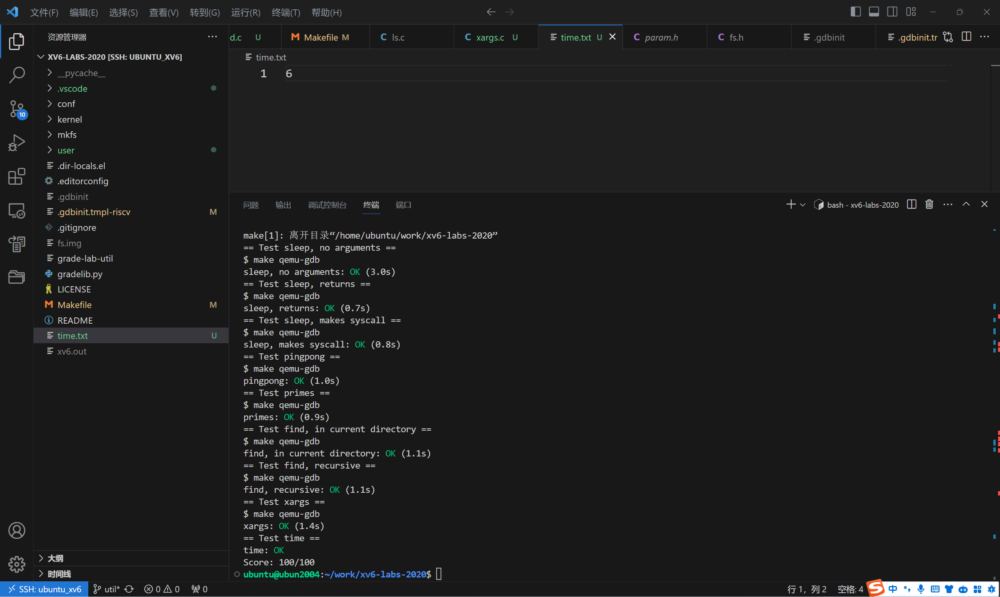

# lab1

## Unix 实用程序 通过本实验，您将熟悉 xv6 及其系统调用。

启动 xv6（简单）

为xv6实现UNIX程序睡眠;您的睡眠应该在用户指定的时间内暂停。tick是由xv6内核定义的时间概念，即来自计时器芯片的两次中断之间的时间。您的解决方案应该在user/sleep.c文件中。

在开始编写代码之前，请阅读此书的第1章。
查看user/目录下的其他一些程序(例如，user/echo.c、user/grep.c和user/rm.c)，了解如何获取传递给程序的命令行参数。
如果用户忘记传递参数，sleep应该打印一条错误消息。
命令行参数作为字符串传递;您可以使用atoi将其转换为整数(参见user/ulib.c)。
使用系统调用sleep。
有关实现sleep系统调用的xv6内核代码，请参阅kernel/sysproc.c(查找sys_sleep)，关于可从用户程序调用的sleep的C定义，请参阅user/user.h，以及user/usys。S表示从用户代码跳转到内核休眠的汇编代码。
确保main调用exit()以退出程序。
在Makefile中将你的睡眠程序添加到UPROGS中;这样做之后，make qemu将编译您的程序，并且您将能够在xv6 shell中运行它。

## pingpong ([easy](https://pdos.csail.mit.edu/6.S081/2020/labs/guidance.html))

任务是编写一个程序，使用UNIX系统调用在两个进程之间通过一对管道（一个用于每个方向）来“ping-pong”一个字节。具体要求如下：

1. 创建两个进程：父进程和子进程。
2. 父进程向子进程发送一个字节。
3. 子进程接收到字节后，打印"<pid>: received ping"，其中<pid>是子进程的进程ID。然后，子进程将接收到的字节写入管道，传回给父进程。
4. 父进程接收到子进程传回的字节后，打印"<pid>: received pong"，其中<pid>是父进程的进程ID。
5. 子进程完成任务后退出。
6. 父进程完成任务后退出。

这样，父进程和子进程之间就会在两个方向上通过管道传递一个字节，完成“ping-pong”的过程。

你需要将这个程序写入`user/pingpong.c`文件中，并使用UNIX系统调用来实现这个功能。

这些提示是关于如何完成任务的指导。让我们逐一解释每个提示：

1. 使用`pipe`系统调用创建一个管道，它将返回两个文件描述符：一个用于读取管道数据，另一个用于写入管道数据。
2. 使用`fork`系统调用创建一个子进程。父进程会得到子进程的进程ID（PID），而子进程会得到0作为返回值。
3. 在子进程中，使用`read`系统调用从管道中读取父进程发送的字节，并使用`write`系统调用将字节写回管道，传回给父进程。
4. 使用`getpid`系统调用来获取当前进程的进程ID，以便在子进程中打印进程ID。
5. 将你编写的程序添加到`UPROGS`变量中的Makefile中，这样它将被编译并成为用户程序。
6. 请注意，在xv6中，用户程序仅有限地可用于库函数。可以在`user/user.h`中查看可用的库函数列表，并在`user/ulib.c`、`user/printf.c`和`user/umalloc.c`中找到它们的实现（除了系统调用以外的部分）。

## primes ([moderate](https://pdos.csail.mit.edu/6.S081/2020/labs/guidance.html))/([hard](https://pdos.csail.mit.edu/6.S081/2020/labs/guidance.html))

使用管道编写一个并发版本的prime sieve。

您的目标是使用pipe和fork来设置管道。第一个过程将数字2到35输入管道。对于每个素数，您将安排创建一个进程，该进程通过一个管道从其左侧邻居读取数据，并通过另一个管道向其右侧邻居写入数据。由于xv6的文件描述符和进程数量有限，第一个进程可以在35个时停止。

一个生成过程可以输入数字2,3,4，…， 1000进入管道的左端:该行中的第一个进程消除2的倍数，第二个进程消除3的倍数，第三个进程消除5的倍数，以此类推:

## find ([moderate](https://pdos.csail.mit.edu/6.S081/2020/labs/guidance.html))

编写一个简单版本的UNIX查找程序:查找目录树中具有特定名称的所有文件。您的解决方案应该在user/find.文件中.

## xargs ([moderate](https://pdos.csail.mit.edu/6.S081/2020/labs/guidance.html))

编写 xargs 工具，从标准输入读入数据，将每一行当作参数，加入到传给 xargs 的程序名和参数后面作为额外参数，然后执行。

