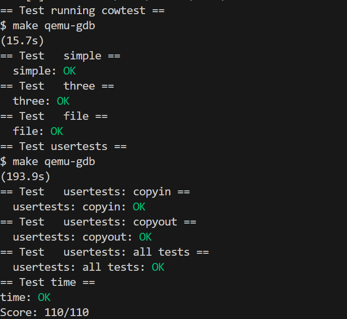

# copy-on-write fork

----copy-on-write(COW) fork()的目标是推迟为子进程分配和复制物理内存页面，直到真正需要副本。

----COW fork()只为子进程创建一个页表，用户内存的PTE指向父进程的物理页面。COW fork()将父进程和子进程中的所有用户PTE标记为不可写。当任一进程尝试写入这些COW页之一时，CPU将强制发生page fault。内核的page fault处理程序检测到这种情况，为出错进程分配物理内存页面，将原始页面复制到新页面中，并修改出错进程中的相关PTE以引用新页面，将这次使用的PTE标记为可写。当任一进程尝试写入这些COW页之一时，CPU将强制发生page fault。内核的page fault处理程序检测到这种情况，为出错进程分配物理内存页面，将原始页面复制到新页面中，并修改出错进程中的相关PTE以引用新页面，将这次使用的PTE标记为可写。

----COW fork()使实现用户内存的物理页面的释放变得有点棘手。一个给定的物理页可以被多个进程的页表引用，并且只有在最后一个引用消失时才应该被释放。

## 合理的攻克计划

①修改uvmcopy()以将父进程的物理页面映射到子进程，而不是分配新页面。在子级和父级的PTE中清除PTE_W。
②修改usertrap()以识别page fault。当COW页面发生缺页时，使用kalloc()分配新页面，将旧页面复制到新页面，并将新页面安装到PTE中并设置PTE_W。
③确保每个物理页面在对它的最后一个PTE引用消失时被释放。做到这一点的一个好方法是为每个物理页保留一个“引用计数”，该“引用计数”是指引用该页的用户页表的数量。当 kalloc() 分配页面时，将页面的引用计数设置为1。当fork导致子进程共享页面时增加页面的引用计数，并在每次任何进程从其页表中删除页面时减少页面的计数。kfree() 只应在其引用计数为0时将页面放回空闲列表。可以将这些计数保存在固定大小的整数数组中。你必须制定一个方案来确定如何索引数组以及如何选择其大小。**例如，你可以使用页的物理地址除以4096来索引数组，并为数组提供等于kalloc.c 中 kinit() 放置在空闲列表中的任何页的最高物理地址的元素数。**
④修改copyout()以在遇到COW页面时使用与页面错误相同的方案。

## 实验提示

①lazy page allocation实验可能让您熟悉与写时复制相关的大部分xv6内核代码。但是，你不应该基于lazy page allocation实验来完成本实验的解决方案。相反，请按照上面的说明从xv6的新副本开始。
②对于每个PTE，有一种方法来记录它是否是COW映射可能很有用。为此，你可以使用RISC-V PTE中的RSW(为软件保留)位。
③usertests探索了cowtest没有测试的场景，所以不要忘记检查所有测试是否都通过了。
④一些有用的宏和页表标志定义在kernel/riscv.h的末尾。
⑤如果发生COW页面错误并且没有可用内存，则应终止该进程。

## 实验思路

**整体思路**

①标记COW页面
要实现COW机制，我们首先需要标记一个页面是否为COW页面。
②引用计数(准备工作)
要实现COW机制，还需要做一些准备工作。
----COW机制推迟为子进程分配和复制物理内存页面，直到真正需要时才会调用kalloc进行分配。使用完成后不需要该物理内存页面时，调用kfree进行释放。
----值得注意的是，一个给定的物理页可以被多个进程的页表引用，并且只有在最后一个引用消失时才应该被释放。因此，不能直接调用kalloc和kfree进行分配与释放，还需要标记物理页的引用数。在进行kalloc分配时，将引用数初始化为1。在进行kfree释放时，只能等引用数为0时才能释放。
----当有一个新的进行引用物理页时，需要将引用数加1。
----由于对物理页的引用计数必须是原子操作，所以需要使用锁。
**总结：** **需要定义一个引用计数数据结构，包含一个成员数组用于记录所有物理页面的引用数，**同时包含一把**锁用于保证引用数增减操作的原子性**。需要**定义物理页面引用数的增减操作。需要在kalloc和kfree中增加对引用数的操作。需要对锁进行初始化。**

**③uvmcopy(完成COW机制的延迟分配物理页面)**
fork系统调用通过uvmcopy将父进程的内存复制给子进程，现在修改uvmcopy将父进程的物理页面映射给子进程，而不是新分配内存，同时将这些物理页面标记为COW页面且不可写。

**④usertrap、copyout(完成COW机制的page fault处理程序)**
当用户态使用COW页面时，在usertrap完成对page fault的处理
当内核态使用COW页面时，在copyout完成对page fault的处理

### 2.2 引用计数

根据攻克计划③的提示，可以使用数组记录每个物理页面对应的引用数量。同时，多个进程有可能对同一父进程进行fork()等操作，从而引起引用计数的变化，因此需要锁结构进行数据一致性的保护。基于以上分析，我们在kernel/kalloc.c中定义一个全局的结构体，里面包含引用计数数组和锁。
**①引用计数数组**
----数组的容量
将最大物理地址PHYSTOP右移12位(相当于除以4096，即一个物理页面的大小)即可，即数组的容量为PHYSTOP >> 12。
注： 实际上物理地址KERNBASE以下映射的是外设，不涉及COW机制，可以将数组容量缩小至(PHYSTOP-KERNBASE)>>12节省空间，我这里没有进行缩小
数组中每个元素需要记录对应物理页面的引用数量，xv6最多可分配的进程数`NPROC`为64，所以使用8 bit的`uint8`数据类型存储每个物理页面的引用数量即可。

**②自旋锁**
由于此处引用计数的变化比较简单，且考虑到实现的难度，因此考虑使用全局的自旋锁。在XV6中，引用计数数组中的不同元素(即不同物理页)的引用计数之间不存在并发问题，因此不再对每一个物理页的引用计数对应一个自旋锁，节省内存开销。

### 锁的初始化

调用**kernel/kalloc.c**中kinit函数中的initlock()函数对锁进行初始化。

### 修改uvmcopy

思路

COW机制并非进行实际拷贝，而是将子进程虚拟页同样映射在与父进程相同的物理页上。因此，根据实验提示②、攻克计划可知，需要修改kernel/vm.c中的uvmcopy，完成以下功能：
①将原本的kalloc()分配内存功能删除，同时将子进程的虚拟页映射到父进程的物理页上。
②对父进程和子进程对应的虚拟页PTE的标志位进行处理，移除原本的写标志位PTE_W，并添加COW标志位PTE_COW。
③在最后需要调用incref()对当前物理页的引用计数加1。

### 用户态和内核态

完成cow页面修改后，接着去完成page fault处理程序。有两种情况会导致page fault：
①在用户态访问cow页面会由于缺页发生page fault，在usertrap中处理。
②内核缓存复制到用户空间(如read系统调用)会在copy_out中写入cow页面引起page fault。
大致处理思路为：
----判断虚拟地址的合理性
----将虚拟地址对应的pte映射到新的物理内存
----取消原物理地址的映射(减少引用计数)

# 注意两个地方

usertrap()中else if(r_scause()==15)如果写成else if(r_scause()==15 || r_scause()==13) 会有一些通过不了，需要了解13与15 代表的原因差别

还有copyout中if(dstva > MAXVA - len) return -1; //添加 

这一行也有用，虽然代码框架本身没有判断这个，但测试中似乎需要。

