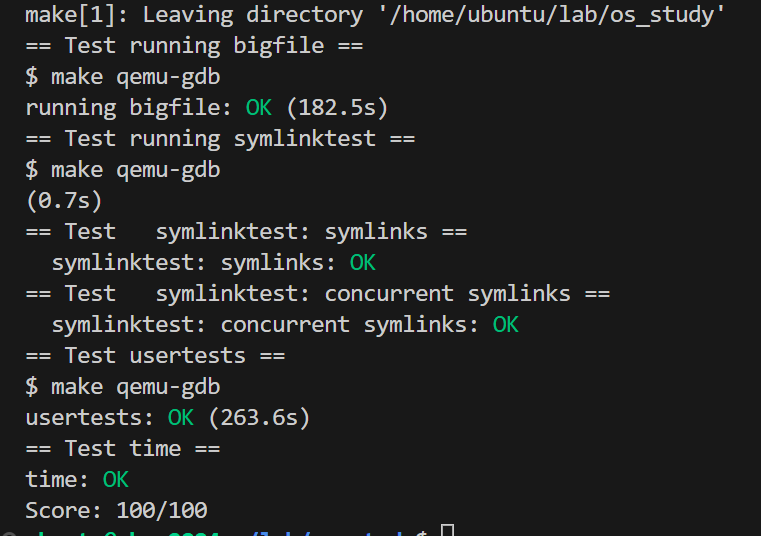

# Large files

在本作业中，您将增加 xv6 文件的最大大小。目前，xv6 文件的最大限制是 268 个块，即 268*BSIZE 字节（xv6 中的 BSIZE 为 1024）。这一限制源于一个 xv6 inode 包含 12 个 "直接 "块号和一个 "单个-直接 "块号，单个-直接块号指的是一个最多可容纳 256 个以上块号的块，总计 12+256=268 个块。

bigfile 命令可以创建最长的文件，并报告该文件的大小：

测试失败的原因是，bigfile 希望能够创建一个包含 65803 个块的文件，但未修改的 xv6 将文件限制为 268 个块。
你将修改 xv6 文件系统代码，在每个 inode 中支持一个 "双向 "块，其中包含 256 个单向块地址，每个单向块最多可包含 256 个数据块地址。这样，一个文件最多可以包含 65803 个数据块，即 256*256+256+11 个数据块（11 个而不是 12 个，因为我们将牺牲一个直接数据块的编号来使用双向数据块）。

## 准备工作

mkfs程序创建xv6文件系统磁盘镜像，并决定文件系统总共有多少blocks；尺寸由kernel/param.h的FSSIZE控制。
那你将看到本实验仓库中的FSSIZE设置为了200000个blocks。
你应该可以在make输出中，看到来自mkfs/mkfs的输出：

```
nmeta 70（boot, super, log blocks 30 inode blocks 13, bitmap 25）blocks 1999930 total 200000	
```

这行描述了mkfs/mkfs构建的文件系统：它有70个meta-data blocks（blocks用于描述文件系统），并且199930个数据blocks，总共200000blocks。
实验中任何时候，如果你发现你不得不从scratch重构文件系统，你可以执行make clean，强制make来重构fs.img。

## 要看什么

一个磁盘inode的格式定义在fs.h的struct dinode。
你要特别注意NDIRECT、NINDIRECT、MAXFILE以及struct dinode的addrs[]元素。
xv6 text中的图8.3，看标准xv6 inode图解。
查看磁盘上文件数据的代码在fs.c的bmap()。查看它，并确认你理解它做了什么。
bmap()在读写文件时被调用。
当写时，bmap()按需分配新blocks来持有文件内容，而且如果需要持有block地址，分配一个indirect block。
bmap()处理两种block编号。
bn参数是一个逻辑block编号，文件中的block编号，与文件起始位置有关。
ip->addrs[]中的block编号，bread()中的参数，是磁盘block编号。
你可以将bmap()视作：将一个文件内的逻辑block编号映射为磁盘block编号。

## 你的工作

修改bmap()，以便于除了direct blocks和singly-indirect block之外，实现一个doubly-indirect block。
你将只有11个direct blocks，而不是12个，为你的新doubly-indirect block制作空间；
你不被允许改变磁盘inode的尺寸。
ip->addrs[]的前11个元素应该是direct blocks；第12个应该是singly-indirect block（就想当前这个）；
第13个应该是你的新doubly-indirect block。
当bigfile写65803 blocks，且usertests执行成功时，你完成了此练习。

**bigfile将花费至少1分半来执行。**

## 提示

确保你理解bmap()。写出ip->addrs[]的关系图，indirect block，doubly-indirect block、singly-indirect block、data blocks。 
确保你理解为什么添加一个doubly-indirect block，可以提升文件最大尺寸256*256blocks（实际还要-1，因为你不得不减少一个direct blocks编号）。
考虑如何用逻辑block编号，来索引doubly-indirect block以及它指向的indirect block。
如果你改变NDIRECT的定义，你将可能不得不改变file.h struct inode addrs[]的声明。确保struct inode和struct dinode在它们的addrs[]数组中有同样的元素编号。
如果你修改NDIRECT的定义，确保创建一个新的fs.img，因为mkfs使用NDIRECT来构建文件系统。
如果你的文件系统陷入错误状态，可能由于崩溃，删除fs.img（在unix中做，并非xv6）。make将构建一个新的、干净的文件系统镜像给你。
不要忘记brelse()每个你bread()的block。
你该仅在需要时分配indirect blocks和doubly-indirect blocks，像原始的bmap()。
确认itrunc()释放掉文件所有blocks，包括double-indirect blocks。

# Symbolic links

## 实验要求

在本练习中，你将添加符号链接到xv6。
符号链接（或软链接）指的是一个通过路径名称进行链接的文件；
当一个符号链接是打开时，kernel通过link找到指向的文件。
符号链接与hard links相似，但hard links被限制为指向同一磁盘上的文件，然而符号链接可以跨磁盘设备。
尽管xv6不支持多设备，实现这个system call是一个好的练习，用于理解路径名称查询机制。

## 你的工作

你将实现symlink(char *target, char *path) system call，它在path创建一个新符号链接，指向名为target的文件。
更多信息，看symlink操作手册页。
为了测试，添加symlinktest到Makefile并执行它。
当测试产生下面输出（包括usertests succeeding）你的方案就完成了。

## 提示

首先，为symlink创建一个system call编号，在user/usys.pl、user/user.h添加一个入口，并在kernel/sysfile.c实现空sys_symlink。
添加新文件类型（T_SYMLINK）到kernel/stat.h来代表一个符号链接。
添加一个新标志位到kernel/fcntl.h，（O_NOFOLLOW），可以用在open system call中。注意传到open的标志位，用位运算OR操作符结合，因此你的新标志位，不应该遮盖任何已存在标志位。一旦你把它加到Makefile，这将让你编译user/symlinktest.c。
实现symlink(target, path)system call，在path（指向target）创建一个新符号链接。注意，对于system call成功，target无需存在。**你将需要选择某处来存储符号链接的target path，例如，在inode的data blocks中。**symlink应该返回一个整数，0代表成功，-1代表失败，与link和unlink相似。
更改open system call来处理这种情况：path指的是一个符号链接。如果文件不存在，open必须失败。当进程在传到open的标志位中明确O_NOFOLLOW，open应该打开symlink（且不follow符号链接）。
如果被链接的文件也是一个符号链接，你必须递归查询，直到抵达一个非链接文件。如果链接构成一个循环，你必须返回一个错误码。你可以近似判断，如果链接深度达到阈值（比如10）返回错误码。
其他system call（比如link和unlink）必须不follow符号链接；这些system calls操作符号链表本身。
本实验中，你无需处理目录符号链表。

**符号链接与普通的文件一样，需要占用 inode 块。这里使用 inode 中的第一个 direct-mapped 块（1024字节）来存储符号链接指向的文件。**

需要注意的是关于文件系统的一些加锁释放的规则. **函数 create() 会返回创建的 inode, 此时也会持有其 inode 的锁.** 而后续 **writei() 是需要在持锁的情况下才能写入.** 在结束操作后(不论成功与否), 都需要调用 **iunlockput() 来释放 inode 的锁和其本身**, 该函数是 iunlock() 和 iput() 的组合, **前者即释放 inode 的锁; 而后者是减少一个 inode 的引用**(对应字段 ref, 记录着内存中指向该 inode 的指针数, 这里的 inode 实际上是内存中的 inode, 是从内存的 inode 缓存 icache 分配出来的, 当 ref 为 0 时就会回收到 icache 中), 表示当前已经不需要持有该 inode 的指针对其继续操作了.


最后考虑这个过程中的加锁释放的规则. **对于原本不考虑符号链接的情况, 在 sys_open() 中, 由 create() 或 namei() 获取了当前文件的 inode 后实际上就持有了该 inode 的锁**, **直到函数结束才会通过 iunlock() 释放(当执行成功时未使用 iput() 释放 inode 的 ref 引用, 笔者认为后续到 sys_close() 调用执行前该 inode 一直会处于活跃状态用于对该文件的操作, 因此不能减少引用)**. 而对于符号链接, 由于最终打开的是链接的目标文件, 因此一定**会释放当前 inode 的锁转而获取目标 inode 的锁**. 而在**处理符号链接时需要对 ip->type 字段进行读取, 自然此时也不能释放 inode 的锁**, 因此在进入 follow_symlink() 时一直保持着 inode 的锁的持有, **当使用 readi() 读取了符号链接中记录的目标文件路径后, 此时便不再需要当前符号链接的 inode, 便使用 iunlockput() 释放锁和 inode**. 当在对目标文件的类型判断是否不为符号链接时, 此时再对其进行加锁. 这样该函数正确返回时也会持有目标文件 inode 的锁, 达到了函数调用前后的一致.


