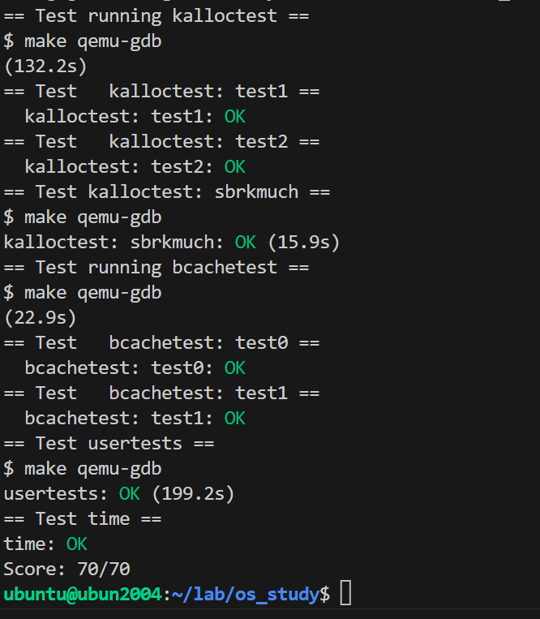

在本实验，你将在 重构代码以提升并行 上获得经验。
多核机器低并行的常见症状是high lock contention。
提高并行，通常包括改变数据结构和锁策略来减少争用。
你将为xv6 memory allocator和block cache这么做。
在写代码之前，确保阅读xv6 book的以下部分：
Chapter6："Locking"和对应代码
Section3.5："Code：Physical memory allocator"
Section8.1到8.3："Overview","Buffer cache layer","Code:Buffer cache"

[重点问题讲解](https://blog.miigon.net/posts/s081-lab8-locks/#运行结果)

[本次实验步骤](https://blog.csdn.net/u013577996/article/details/114639519)

