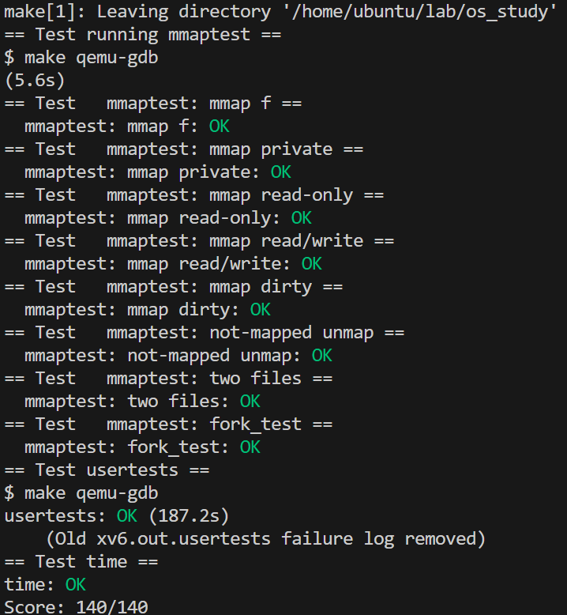

# 实验准备

支持将文件映射到一片用户虚拟内存区域内，并且支持将对其的修改写回磁盘。

mmap和munmap system call允许UNIX程序对其地址空间进行详细控制。它们可以被用来在进程间共享内存，映射文件到进程地址空间，作为用户级page fault方案的一部分，例如课堂上讨论的GC算法。在本实验中，你将添加mmap和munmap到xv6，聚焦于内存映射文件。

# mmap说明

操作手册页（执行man 2 mmap）展示mmap的声明：

```c
void *mmap(void *addr, size_t length, int prot, int flags,
           int fd, off_t offset);
//1. 第一个参数是一个你想映射到的特定地址，如果传入null表示不指定特定地址，这样的话内核会选择一个地址来完成映射，并从系统调用返回。
//2. 第二个参数是想要映射的地址段长度len。
//3. 第三个参数是Protection bit，例如读写R|W。
//4. 第四个参数我们会跳过不做讨论，它的值可以是MAP_PRIVATE。它指定了如果你更新了传入的对象，会发生什么。（注，第四个参数是flags，MAP_PRIVATE是其中一个值，在mmap文件的场景下，MAP_PRIVATE表明更新文件不会写入磁盘，只会更新在内存中的拷贝）
//5. 第五个参数是传入的对象，在上面的例子中就是文件描述符。
//6. 第六个参数是offset。
```

mmap可以用多种方式调用，但本实验仅需要特性（与内存映射文件相关）的子集。
你可以假设addr将总是为0，意味着kernel应该决定映射文件的虚拟地址。
mmap返回该地址，或失败时返回0xffffffffffffffff。length是map的字节数；它可以与文件长度不同。
prot表明内存是否应该被映射为可读、可写、可执行；你可以假设prot是PROT_READ、PROT_WRITE或两者都有。
flags将要么是MAP_SHARED，意味对映射内存的修改应该被写回文件，或为MAP_PRIVATE，意味着它们不会写回到文件。你无需实现flags中的任何其他位。
fd是打开的、要映射文件的文件描述符。
你可以假设offset为0（文件中要映射的起始点）。

# 实验要求

映射相同MAP_SHARED文件的进程没有共享物理内存是可以的。
munmap(addr, length)应该移除已知地址范围的mmap映射。
如果进程已经更改了内存，且映射为MAP_SHARED，更改应该首先被写到文件。
munmap调用可能只覆盖mmap-ed区域的一部分，但你可以假设：要么unmap起始，要么unmap结束、要么整个区域（而不是在region中打孔）。
你可以实现足够的map和munmap功能来通过mmaptest测试程序。
如果是mmaptest不用的mmap特性，你无需实现。

# 一些提示

1. 添加_mmaptest到UPROGS，添加mmap、munmap system calls，为了让user/mmaptest.c可以编译。

   现在，仅从mmap和munmap返回错误。我们在kernel/fcntl.h定义PROT_READ等等。

   执行mmaptest，首次mmap调用失败。

2. 懒填充页表，对page faults做出响应。
   mmap应该不分配物理内存或读取文件。
   而是，在usertrap page fault处理代码中，正如lazy page allocation实验中那样。
   lazy的原因是：保证mmap大文件较快，以及让mmap一个比物理内存大的文件成为可能。
3. 跟踪每个进程mmap已经map的东西。
   定义一个结构对应VMA（virtual memory area），第15节课描述过，记录地址、长度、权限、文件等待。用于mmap创建的虚拟内存。
   因为xv6内核在内核中没有内存分配器，声明一个固定尺寸的VMA数组，按需从数组分配是可行的。16应该就足够了。
4. 实现mmap：找一个进程地址空间中未使用区域来映射文件，添加一个VMA到进程映射区域表。
   VMA应该包含一个映射文件的struct file的指针；
   mmap应该提升文件引用数量，以便于当文件关闭时结构不会消失（提示：看filedup）。
   执行mmaptest：第一个mmap应该成功，但首次访问mmap-ed内存将导致page fault并杀掉mmaptest。
5. 添加代码让mmap-ed区域的page-fault分配一页物理内存，读取相关文件的4096字节到该page，并映射它到用户地址空间。
   用readi读取文件，可以接收一个偏移参数（在文件中从此处读取），但你不得不lock/unlock传到readi中的inode。
   不要忘记设置page正确的权限。
   执行mmaptest；它应该可以获取第一个munmap。
6. 实现munmap：找VMA对应地址范围，取消明确页的映射（提示：使用uvmunmap）。
   如果munmap移除之前mmap的所有页，它应该减少对应file的引用计数。
   如果一个未映射页更改了，且文件映射为MAP_SHARED，把页写回文件，看filewrite找灵感。
7. 你的实现应该只写回程序真正修改过、且为MAP_SHARED的页。
   RISC-V PTE的dirty位表明这个页是否已经写过。
   然而mmaptest不会检查：非dirty页不会写回；因此你可以不看dirty标志位把数据写回去。
8. 更改exit来unmap进程的已映射区域，就像调用了munmap一样。
   执行mmaptest；mmap_test应该通过，但fork_test可能不通过。
9. 更改fork确保：child有和parent一样的映射区域。
   不要忘记提升VMA struct file的引用数量。
   在child的page fault handler，可以分配一个新的物理页，而不是共享parent的页。
   后者是更好的，但它需要更多实现工作。
   执行mmaptest；它应该通过mmap_test和fork_test。

## 代码实现

为了效率, 我们并不直接分配物理页, 因为用户或许只会读到一个很大的文件的一小部分. 但是我们确实通过增加**p->sz**这个参数, 为整个文件大小在用户态的地址空间里预留了位置. 当用户试图去访问**mmap**所返回的地址时, 由于我们没有分配物理页, 将会触发**缺页中断**. 这个时候我们就需要在**usertrap**里把对应offset的文件内容读到一个新分配的物理页中, 并把这个物理页加入这个进程的虚拟内存映射表里. 然后, 在**munmap**时, 我们需要把分配的物理页释放掉, 而且如果flag是**MAP_SHARED**, 直接把**unmap**的区域复写更新回磁盘文件中.

首先需要在用户的地址空间(虚拟地址空间)内，找到一片空闲的区域，用于映射 mmap 页。


可以看到 xv6 对用户的地址空间的分配中，heap 的范围一直从 stack 到 trapframe。由于进程本身所使用的内存空间是从低地址往高地址生长的（sbrk 调用）。

为了尽量使得 map 的文件使用的地址空间不要和进程所使用的地址空间产生冲突，我们选择将 mmap 映射进来的文件 map 到尽可能高的位置，也就是刚好在 trapframe 下面。并且若有多个 mmap 的文件，则向下生长。（没有用这种该方法）

实现 munmap 调用，将一个 vma 所分配的所有页释放，并在必要的情况下，将已经修改的页写回磁盘。




# 傻狗bug

在trap.c判断trap 原因并做出处理的时候一定要注意最后的else，否则会卡死在这个循环里，作用可以看traps lab