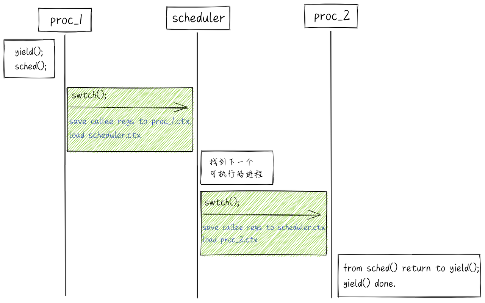
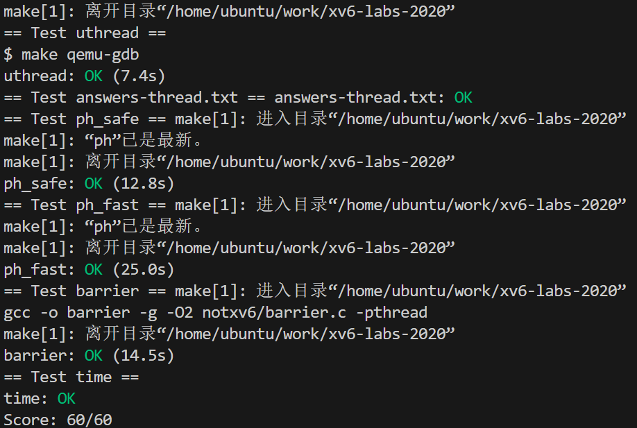

# Lab: Multithreading(多线程)

本实验将让您熟悉多线程。您将在用户级线程包中实现线程之间的切换，使用多线程来加快程序运行速度，并实现障碍。

## 神奇的swtch函数

swtch(ctx1, ctx2);

保存callee寄存器的内容到ctx1中；

恢复所有的ctx2的内容到callee寄存器里。

两个重要的寄存器ra、sp。

ra：ra寄存器保存了swtch函数的调用点。

sp：栈指针，指向函数调用栈的顶部（低地址）。

## Uthread:在线程间切换

在本练习中，您将为用户级线程系统设计上下文（context）切换机制，然后加以实现。 要开始学习，您的 xv6 有两个文件 user/uthread.c 和 user/uthread_switch. S，以及 Makefile 中用于构建 uthread 程序的规则。 uthread.c 包含用户级线程包的大部分内容，以及三个简单测试线程的代码。 线程包缺少创建线程和在线程间切换的部分代码。

你的工作是提出一个计划：创建线程、存储/恢复寄存器来进行多线程切换，然后实现该计划。 当你做完时，make grade应该说你的方案通过uthread test。

一旦你已经结束了，当你在xv6上执行uthread时，你应该看到下面输出（3个线程可能以不同顺序启动）：

这个输出来自3个测试线程，每个测试线程有一个循环（打印一行然后让出CPU到其他线程）。
基于这点，如果没有context切换代码，你将看不到输出。
你将需要添加代码到user/uthread.c中的thread_creat()和thread_schedule()，user/uthread_switch.S的thread_switch。
目标一是确保当thread_schedule()首次运行一个给定线程时，线程执行传到thread_create()中的函数，在它自己的栈上。
另外目标是确保thread_switch保存切换前线程的寄存器，恢复要切换线程的寄存器，返回到切换后的线程上次离开时的指令。
你将不得不决定哪里存储/恢复寄存器；更改struct thread来保存寄存器是一个好计划。
你将需要在thread_schedule添加thread_switch调用；你能传递任何需要的参数到thread_switch，但目的是从一个线程切换到下个线程。

线程进入同步屏障 barrier 时，将已进入屏障的线程数量增加 1，然后再判断是否已经达到总线程数。
如果未达到，则进入睡眠，等待其他线程。
如果已经达到，则唤醒所有在 barrier 中等待的线程，所有线程继续执行；屏障轮数 + 1；

「将已进入屏障的线程数量增加 1，然后再判断是否已经达到总线程数」这一步并不是原子操作，并且这一步和后面的两种情况中的操作「睡眠」和「唤醒」之间也不是原子的，如果在这里发生 race-condition，则会导致出现 「lost wake-up 问题」（线程 1 即将睡眠前，线程 2 调用了唤醒，然后线程 1 才进入睡眠，导致线程 1 本该被唤醒而没被唤醒，详见 xv6 book中的第 72 页，Sleep and wakeup）

「屏障的线程数量增加 1；判断是否已经达到总线程数；进入睡眠」这三步必须原子。**所以使用一个互斥锁 barrier_mutex 来保护这一部分代码。pthread_cond_wait 会在进入睡眠的时候原子性的释放 barrier_mutex，从而允许后续线程进入 barrier，防止死锁。**

pthread_cond_wait(&cond, &mutex);  // 进入睡眠状态，释放锁互斥，唤醒时获取
pthread_cond_broadcast(&cond);     // 唤醒沉睡在 cond 上的每个线程
调用pthread_cond_wait时，释放mutex，返回前重新获取mutex
我们已经给你barrier_init()。
你的工作是实现barrier()，以致于panic不会发生。
我们已经为你定义struct barrier；它的属性供你使用。

有两个问题使您的任务变得复杂： 您必须处理连续的障碍调用，我们将每个障碍调用称为一轮。 bstate. round 记录当前的回合。每次当所有线程都到达障碍时，都应递增 bstate.round。

您必须处理这样一种情况，即一个线程在其他线程退出障碍之前就绕着循环运行。特别是，你在一轮到下一轮之间重复使用 bstate.nthread 变量。请确保在前一轮仍在使用 bstate.nthread 时，离开障碍并在循环中运行的线程不会增加 bstate.nthread。

