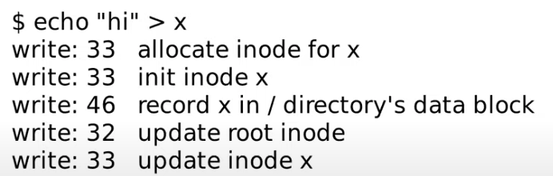
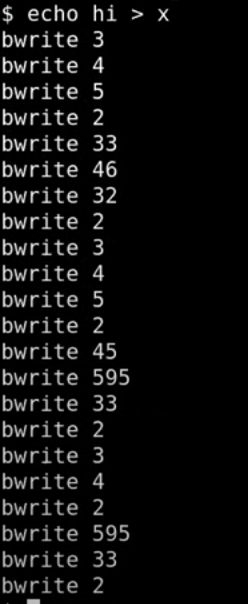
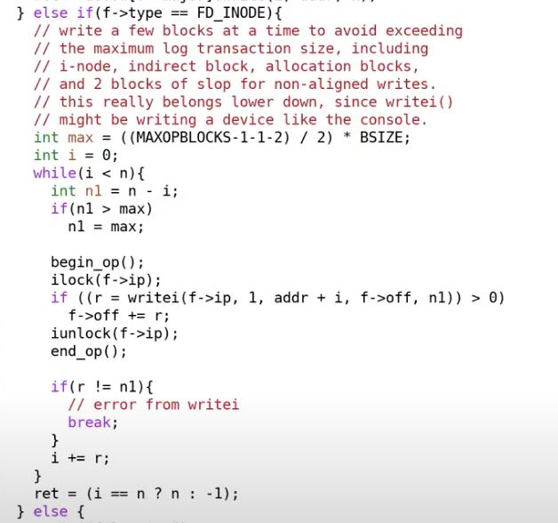

# File system crash概述

假设运行make指令时，停电了，电力恢复之后，你重启电脑并运行ls指令，你会期望你的文件系统仍然在一个好的可用的状态。这里我们关心的crash或者故障包括了：在文件系统操作过程中的电力故障；在文件系统操作过程中的内核panic。期望在故障重启之后还能使用文件系统。

**今天我们关心的是包含了多个步骤的文件系统操作过程中发生的故障。**我们今天会研究对于这类特定问题的解决方法，也就是logging。类似于创建文件，写文件这样的文件系统操作，都包含了多个步骤的写磁盘操作。我们上节课看过了如何创建一个文件，这里多个步骤的顺序是（注，实际步骤会更多，详见14.5）：

- 分配inode，或者在磁盘上将inode标记为已分配
- 之后更新包含了新文件的目录的data block

如果在这两个步骤之间，操作系统crash了。这时可能会使得文件系统的属性被破坏。这里的属性是指，每一个磁盘block要么是空闲的，要么是只分配给了一个文件。即使故障出现在磁盘操作的过程中，我们期望这个属性仍然能够保持。如果这个属性被破坏了，那么重启系统之后程序可能会运行出错，比如：

- 操作系0统可能又立刻crash了，因为文件系统中的一些数据结构现在可能处于一种文件系统无法处理的状态。
- 或者，更可能的是操作系统没有crash，但是数据丢失了或者读写了错误的数据。

# File system crash示例

看一些基于XV6的例子，在上节课介绍了XV6有一个非常简单的文件系统和磁盘数据的排布方式。

在super block之后就是log block，我们今天主要介绍的就是log block。log block之后是inode block，每个block可能包含了多个inode。之后是bitmap block，它记录了哪个data block是空闲的。最后是data block，这里包含了文件系统的实际数据。

在上节课中，我们看了一下在创建文件时，操作系统与磁盘block的交互过程（注，详见14.5）：

创建一个文件涉及到了多个操作：

- 首先是分配inode，因为首先写的是block 33
- 之后inode被初始化，然后又写了一次block 33
- 之后是写block 46，是将文件x的inode编号写入到x所在目录的inode的data block中
- 之后是更新root inode，因为文件x创建在根目录，所以需要更新根目录的inode的size字段，以包含这里新创建的文件x
- 最后再次更新了文件x的inode

现在我们想知道，哪里可能出错。假设我们在下面这个位置出现了电力故障或者内核崩溃。

在出现电力故障之后，因为内存数据保存在RAM中，所有的内存数据都丢失了。所有的进程数据，所有的文件描述符，内存中所有的缓存都没有了，因为内存数据不是持久化的。唯一剩下的就是磁盘上的数据，如果我们在上面的位置出现故障，并且没有额外的机制，没有logging，会有什么风险？

在这个位置，我们先写了block 33表明inode已被使用，之后出现了电力故障，然后计算机又重启了。这时，我们丢失了刚刚分配给文件x的inode。这个inode**虽然被标记为已被分配，但是它并没有放到任何目录中，所以也就没有出现在任何目录中**，因此我们也就没办法删除这个inode。所以在这个位置发生电力故障会导致我们丢失inode。

你或许会认为，我们应该改一改代码，将写block的顺序调整一下，这样就不会丢失inode了。

所以我们可以先写block 46来更新目录内容，之后再写block 32来更新目录的size字段，最后再将block 33中的inode标记为已被分配。如果在下面的位置发生了电力故障又会怎样？

在这个位置，目录被更新了，但是还没有在磁盘上分配inode。我们会读取一个未被分配的inode，因为inode在crash之前还未被标记成被分配。**更糟糕的是，如果inode之后被分配给一个不同的文件，这样会导致有两个应该完全不同的文件共享了同一个inode。**

所以调整写磁盘的顺序并不能彻底解决我们的问题，我们只是从一个问题换到了一个新的问题。

让我们再看一个例子，这个例子中会向文件x写入“hi”（注，也就是14.5介绍的第二个部分）

一旦成功的创建了文件x，之后会调用write系统调用，我们在上节课看到了write系统调用也执行了多个写磁盘的操作。

- 首先会从bitmap block，也就是block 45中，分配data block，通过从bitmap中分配一个bit，来表明一个data block已被分配。
- 上一步分配的data block是block 595，这里将字符“h”写入到block 595。
- 将字符“i”写入到block 595。
- 最后更新文件夹x的inode来更新size字段。

在下面的位置crash了会怎样？

这里我们从bitmap block中分配了一个data block，但是又还没有更新到文件x的inode中。当我们重启之后，磁盘处于一个特殊的状态，这里的风险是什么？是的，我们这里**丢失了data block，因为这个data block被分配了，但是却没有出现在任何文件中**，因为它还没有被记录在任何inode中。

**文件系统应该确保每一个data block要么属于且只属于一个文件，要么是空闲的。**

以上问题不在与操作的顺序，而是在于有多个的写磁盘操作，这些操作必须作为一个原子操作出现在磁盘上。

# File system logging

有一些好的属性：

- 首先，它可以确保文件系统的系统调用是原子性的。要么完全出现，要么完全不出现，这样就避免了一个系统调用只有部分写磁盘操作出现在磁盘上。
- 其次，它支持快速恢复（Fast Recovery）。

logging的基本思想还是很直观的。首先，你将磁盘分割成两个部分，其中一个部分是log，另一个部分是文件系统，文件系统可能会比log大得多。

（log write）当需要更新文件系统时，我们并不是更新文件系统本身。假设我们在内存中缓存了bitmap block，也就是block 45。当需要更新bitmap时，我们并不是直接写block 45，而是将数据写入到log中，并记录这个更新应该写入到block 45。对于所有的写 block都会有相同的操作，例如更新inode，也会记录一条写block 33的log。

所以基本上，**任何一次写操作都是先写入到log**，我们**并不是直接写入到block所在的位置，而总是先将写操作写入到log中。**

（commit op）之后在某个时间，当文件系统的操作都结束了，比如说我们前一节看到的4-5个写block操作都结束，并且都存在于log中，我们会commit文件系统的操作。这意味着我们需要在log的某个位置**记录属于同一个文件系统的操作的个数，例如5。**

（install log）当我们在log中存储了所有写block的内容时，如果我们**要真正执行这些操作，只需要将block从log分区移到文件系统分区。**我们知道第一个操作该写入到block 45，我们会直接将数据从log写到block45，第二个操作该写入到block 33，我们会将它写入到block 33，依次类推。

（clean log）一旦完成了，就可以清除log。清除log实际上就是将属于同一个文件系统的操作的个数设置为0。

假设我们crash并重启了。在重启的时候，文件系统会查看log的commit记录值，如果是0的话，那么什么也不做。如果大于0的话，我们就知道log中存储的block需要被写入到文件系统中，很明显我们在crash的时候并不一定完成了install log，我们可能是在commit之后，clean log之前crash的。所以这个时候我们需要做的就是reinstall（注，也就是将log中的block再次写入到文件系统），再clean log。

**要么将写操作所有相关的block都在文件系统中更新了，要么没有更新任何一个block，我们永远也不会只写了一部分block。**为什么可以确保呢？我们考虑crash的几种可能情况。

- 在第1步和第2步之间crash会发生什么？在重启的时候什么也不会做，就像系统调用从没有发生过一样，也像crash是在文件系统调用之前发生的一样。这完全可以，并且也是可接受的。
- 在第2步和第3步之间crash会发生什么？在第2步和第3步之间crash会发生什么？在这个时间点，所有的log block都落盘了，因为有commit记录，所以完整的文件系统操作必然已经完成了。我们可以将log block写入到文件系统中相应的位置，这样也不会破坏文件系统。所以这种情况就像系统调用正好在crash之前就完成了。
- 在install（第3步）过程中和第4步之前这段时间crash会发生什么？在下次重启的时候，我们会redo log，我们或许会再次将log block中的数据再次拷贝到文件系统。这样也是没问题的，因为log中的数据是固定的，我们就算重复写了文件系统，每次写入的数据也是不变的。重复写入并没有任何坏处，因为我们写入的数据可能本来就在文件系统中，所以多次install log完全没问题。当然在这个时间点，我们不能执行任何文件系统的系统调用。我们应该在重启文件系统之前，在重启或者恢复的过程中完成这里的恢复操作。换句话说，install log是幂等操作（注，idempotence，表示执行多次和执行一次效果一样），你可以执行任意多次，最后的效果都是一样的。

在上面的第2步，执行commit操作时，你只会在记录了所有的write操作之后，才会执行commit操作。所以在执行commit时，所有的write操作必然都在log中。而commit操作本身也有个有趣的问题，它究竟会发生什么？

**commit操作本身只会写一个block。**文件系统可以假设单个block或者单个sector的write是原子操作。这里的意思是，如果你执行写操作，要么整个sector都会被写入，要么sector完全不会被修改。所以sector本身永远也不会被部分写入，并且commit的目标sector总是包含了有效的数据。而**commit操作本身只是写log的header，如果它成功了只是在commit header中写入log的长度**，例如5，这样我们就知道log的长度为5。这时crash并重启，我们就知道需要重新install 5个block的log。如果commit header没能成功写入磁盘，那这里的数值会是0。我们会认为这一次事务并没有发生过（不会违反要么全发生，要么全不发生）。这里本质上是write ahead rule（提前书写），它表示logging系统在所有的写操作都记录在log中之前，不能install log。

所有实现Logging的方式都遵循write ahead rule，**也就是说在写入commit记录之前，你需要确保所有的写操作都在log中。**

XV6的log结构如往常一样也是极其的简单。我们在最开始有一个header block，也就是我们的commit record，里面包含了：

- 数字n代表有效的log block的数量
- 每个log block的实际对应的block编号

之后就是log的数据，也就是每个block的数据，依次为bn0对应的block的数据，bn1对应的block的数据以此类推。这就是log中的内容，并且log也不包含其他内容。

当文件系统在运行时，在**内存中也有header block的一份拷贝**，拷贝中也包含了n和block编号的数组。这里的block编号数组就是log数据对应的实际block编号，并且相应的block也会缓存在block cache中，与前一节课对应，log中第一个block编号是45，那么在block cache的某个位置，也会有block 45的cache。

# log_write函数

前面我提过事务（transaction），也就是我们不应该在所有的写操作完成之前写入commit record。这意味着文件系统操作必须表明事务的开始和结束。在XV6中，以创建文件的sys_open为例（在sysfile.c文件中）**每个文件系统操作，都有begin_op和end_op分别表示事务的开始和结束**。

begin_op表明想要开始一个事务，在最后有end_op表示事务的结束。并且事务中的所有写block操作具备原子性，这意味着这些写block操作要么全写入，要么全不写入。XV6中的文件系统调用都有这样的结构，最开始是begin_op，之后是实现系统调用的代码，最后是end_op。在end_op中会实现commit操作。

在begin_op和end_op之间，磁盘上或者内存中的数据结构会更新。但是在end_op之前，并不会有实际的改变（注，也就是不会写入到实际的block中）。在end_op时，我们会将数据写入到log中，之后再写入commit record或者log header。**这里有趣的是，当文件系统调用执行写磁盘时会发生什么？**

在这个函数中，并没有直接调用bwrite，这里实际调用的是log_write函数。log_write是由文件系统的logging实现的方法。任何一个文件系统调用的begin_op和end_op之间的写操作总是会走到log_write。log_write函数位于log.c文件，

log_write还是很简单直观的，我们已经向block cache中的某个block写入了数据。比如写block 45，我们已经更新了block cache中的block 45。接下来我们需要在内存中记录，在稍后的commit中，要将block 45写入到磁盘的log中。

这里的代码先获取log header的锁，之后再更新log header。首先代码会查看block 45是否已经被log记录了。如果是的话，其实不用做任何事情，因为block 45已经会被写入了。这种忽略的行为称为log absorbtion。如果block 45不在需要写入到磁盘中的block列表中，接下来会对n加1，并将block 45记录在列表的最后。之后，这里会通过调用bpin函数将block 45固定在block cache中，我们稍后会介绍为什么要这么做（注，详见15.8）。

以上就是log_write的全部工作了。任何文件系统调用，如果需要更新block或者说更新block cache中的block，都会将block编号加在这个内存数据中（注，也就是log header在内存中的cache），除非编号已经存在。

# end_op函数

位于log.c中的end_op函数中会发生什么？

跳到正常且简单情况的代码。在简单情况下，没有其他的文件系统操作正在处理中。这部分代码非常简单直观，首先调用了commit函数。让我们看一下commit函数的实现，

- 首先是write_log。这基本上就是将所有存在于内存中的log header中的block编号对应的block，从block cache写入到磁盘上的log区域中（注，也就是将变化先从内存拷贝到log中）。
- write_head会将内存中的log header写入到磁盘中。

函数中依次遍历log中记录的block，并写入到log中。它首先读出log block，将cache中的block拷贝到log block，最后再将log block写回到磁盘中。这样可以确保需要写入的block都记录在log中。但是在这个位置，我们还没有commit，现在我们只是将block存放在了log中。如果我们在这个位置也就是在write_head之前crash了，那么最终的表现就像是transaction从来没有发生过。

接下来看一下write_head函数，我之前将write_head称为commit point。

函数也比较直观，首先读取log的header block。将n拷贝到block中，将所有的block编号拷贝到header的列表中。最后再将header block写回到磁盘。函数中的倒数第2行，bwrite是实际的commit point吗？如果crash发生在这个bwrite之前，会发生什么？

这时虽然我们写了log的header block，但是数据并没有落盘。所以crash并重启恢复时，并不会发生任何事情。那crash发生在bwrite之后会发生什么呢？

这时header会写入到磁盘中，当重启恢复相应的文件系统操作会被恢复。在恢复过程的某个时间点，恢复程序可以读到log header并发现比如说有5个log还没有install，恢复程序可以将这5个log拷贝到实际的位置。**所以这里的bwrite就是实际的commit point。**在commit point之前，transaction并没有发生，在commit point之后，只要恢复程序正确运行，transaction必然可以完成。

回到commit函数，在commit point之后，就会实际应用transaction。这里很直观，就是读取log block再查看header这个block属于文件系统中的哪个block，最后再将log block写入到文件系统相应的位置。让我们看一下install_trans函数，

这里先读取log block，再读取文件系统对应的block。将数据从log拷贝到文件系统，最后将文件系统block缓存落盘。这里实际上就是将block数据从log中拷贝到了实际的文件系统block中。当然，可能在这里代码的某个位置会出现问题，但是这应该也没问题，因为在恢复的时候，我们会从最开始重新执行过。

在commit函数中，install结束之后，会将log header中的n设置为0，再将log header写回到磁盘中。将n设置为0的效果就是清除log。

# File system recovering

看一下发生在XV6的启动过程中的文件系统的恢复流程。当系统crash并重启了，在XV6启动过程中做的一件事情就是调用initlog函数。

initlog基本上就是调用recover_from_log函数。

recover_from_log先调用read_head函数从磁盘中读取header，之后调用install_trans函数。这个函数之前在commit函数中也调用过，它就是读取log header中的n，然后根据n将所有的log block拷贝到文件系统的block中。recover_from_log在最后也会跟之前一样清除log。

# Log写磁盘流程

我已经在bwrite函数中加了一个print语句。bwrite函数是block cache中实际写磁盘的函数，所以我们将会看到实际写磁盘的记录。

在上节课（Lec 14）我将print语句放在了log_write中，log_write只能代表文件系统操作的记录，并不能代表实际写磁盘的记录。我们这里会像上节课一样执行echo "hi" > x，并看一下实际的写磁盘过程。

很明显这里的记录要比只在log_write中记录要长的多。之前的log_write只有11条记录（注，详见14.5）但是可以看到实际上背后有很多个磁盘写操作，让我们来分别看一下这里的写磁盘操作：

- 首先是前3行的bwrite 3，4，5。因为block 3是第一个log data block，所以前3行是在log中记录了3个写操作。这3个写操作都保存在log中，并且会写入到磁盘中的log部分。
- 第4行的bwrite 2。因为block 2是log的起始位置，也就是log header，所以这条是commit记录。
- 第5，6，7行的bwrite 33，46，32。这里实际就是将前3行的log data写入到实际的文件系统的block位置，这里实际是install log。
- 第8行的bwrite 2，是清除log（注，也就是将log header中的n设置为0）。到此为止，完成了实际上的写block 33，46，32这一系列的操作。第一部分是log write，第二部分是install log，每一部分后面还跟着一个更新commit记录（注，也就是commit log和clean log）。

我们实际上不知道begin_op的位置，但是所有的文件系统操作都从begin_op开始。更新commit记录必然在end_op中，所以我们可以找到文件系统操作的end_op位置，之后就是begin_op（注，其实这里所有的操作都在end_op中，只需要区分每一次end_op的调用就可以找到begin_op）。

# File system challenges

前面说到XV6的文件系统有一定的复杂性，接下来我将介绍一下三个复杂的地方或者也可以认为是三个挑战。

第一个是cache eviction（缓存驱逐）。

假设transaction还在进行中，我们刚刚更新了block 45，正要更新下一个block，而整个buffer cache都满了并且决定撤回block 45。在buffer cache中撤回block 45意味着我们需要将其写入到磁盘的block 45位置，这里会不会有问题？如果我们这么做了的话，会破坏什么规则吗？是的，如果将block 45写入到磁盘之后发生了crash，就会破坏transaction的原子性。这里也破坏了前面说过的write ahead rule，**write ahead rule的含义是，你需要先将所有的block写入到log中，之后才能实际的更新文件系统block。所以buffer cache不能撤回任何还位于log的block。**

前面在介绍log_write函数时，其中调用了一个叫做bpin的函数，这个函数的作用就如它的名字一样，将block固定在buffer cache中。它是通过给block cache增加引用计数来避免cache撤回对应的block。在之前（注，详见14.6）我们看过，如果引用计数不为0，那么buffer cache是不会撤回block cache的。相应的在将来的某个时间，所有的数据都写入到了log中，我们可以在cache中unpin block（注，在15.5中的install_trans函数中会有unpin，因为这时block已经写入到了log中）。所以这是第一个复杂的地方，我们需要pin/unpin buffer cache中的block。

第二个挑战是，文件系统操作必须适配log的大小。

从这段代码可以看出，如果写入的block数超过了30，那么一个写操作会被分割成多个小一些的写操作。这里整个写操作不是原子的，但是这还好啦，因为write系统调用的语义并不要求所有1000个block都是原子的写入，它只要求我们不要损坏文件系统。所以XV6会将一个大的写操作分割成多个小的写操作，每一个小的写操作通过独立的transaction写入。这样文件系统本身不会陷入不正确的状态中。

这里还需要注意，**因为block在落盘之前需要在cache中pin住，所以buffer cache的尺寸也要大于log的尺寸。**

最后一个要讨论的挑战是并发文件系统调用。让我先来解释一下这里会有什么问题，再看对应的解决方案。假设我们有一段log，和两个并发的执行的transaction，其中transaction t0在log的前半段记录，transaction t1在log的后半段记录。可能我们用完了log空间，但是任何一个transaction都还没完成。

现在我们能提交任何一个transaction吗？我们不能，因为这样的话我们就提交了一个部分完成的transaction，这违背了write ahead rule，log本身也没有起到应该的作用。所以必须要保证多个并发transaction加在一起也适配log的大小。所以当我们还没有完成一个文件系统操作时，我们必须在确保可能写入的总的log数小于log区域的大小的前提下，才允许另一个文件系统操作开始。

XV6通过限制并发文件系统操作的个数来实现这一点。在begin_op中，我们会检查当前有多少个文件系统操作正在进行。如果有太多正在进行的文件系统操作，我们会通过sleep停止当前文件系统操作的运行，并等待所有其他所有的文件系统操作都执行完并commit之后再唤醒。这里的其他所有文件系统操作都会一起commit。有的时候这被称为**group commit，因为这里将多个操作像一个大的transaction一样提交了，这里的多个操作要么全部发生了，要么全部没有发生。**

最后我们再回到最开始，看一下begin_op，

首先，如果log正在commit过程中，那么就等到log提交完成，因为我们不能在install log的过程中写log；其次，如果当前操作是允许并发的操作个数的后一个，那么当前操作可能会超过log区域的大小，我们也需要sleep并等待所有之前的操作结束；最后，如果当前操作可以继续执行，需要将log的outstanding字段加1，最后再退出函数并执行文件系统操作。

再次看一下end_op函数，

在最开始首先会对log的outstanding字段减1，因为一个transaction正在结束；其次检查committing状态，当前不可能在committing状态，所以如果是的话会触发panic；如果当前操作是整个并发操作的最后一个的话（log.outstanding == 0），接下来立刻就会执行commit；如果当前操作不是整个并发操作的最后一个的话，我们需要唤醒在begin_op中sleep的操作，让它们检查是不是能运行。