# 会花三节课的时间来学习文件系统。前两节课基于XV6来做介绍，第三节课基于Linux来做介绍。

一些文件系统突出的特性：

1. **层级的路径名**，这可以帮助用户组织目录中的文件。
2. 通过将文件命名成方便易记的名字，可以**在用户之间和进程之间更简单的共享文件。**
3. **文件系统提供了持久化**。这一点与进程和其他资源不一样，这些资源在计算机重启时就会消失，之后你需要重新启动它们，但是文件系统就可以提供持久化。

出于以下原因，文件系统背后的机制还比较有意思：

1. **文件系统对硬件的抽象较为有用**，所以理解文件系统对于硬件的抽象是如何实现的还是有点意思的。
2. **还有个关键且有趣的地方就是crash safety。**有可能在文件系统的操作过程中，计算机崩溃了，在重启之后你的文件系统仍然能保持完好，文件系统的数据仍然存在，并且你可以继续使用你的大部分文件。
3. **之后是一个通用的问题，如何在磁盘上排布文件系统。**例如目录和文件，它们都需要以某种形式在磁盘上存在，这样当你重启计算机时，所有的数据都能恢复。所以在磁盘上有一些数据结构表示了文件系统的结构和内容。
4. 最后一个有趣的话题是**性能**。文件系统所在的硬件设备通常都较慢，比如说向一个SSD磁盘写数据将会是毫秒级别的操作，而在一个毫秒内，计算机可以做大量的工作，所以尽量避免写磁盘很重要，我们将在几个地方看到提升性能的代码。比如说，所有的文件系统都有buffer cache或者叫block cache。同时这里会有更多的并发，比如说你正在查找文件路径名，这是一个多次交互的操作，首先要找到文件结构，然后查找一个目录的文件名，之后再去查找下一个目录等等。你会期望当一个进程在做路径名查找时，另一个进程可以并行的运行。这样的并行运行在文件系统中将会是一个大的话题。

# File system实现概述

看一下一些与文件系统相关的基础系统调用。假设我们创建了文件“x/y”，或者说在目录x中创建了文件y，同时我们需要提供一些标志位。

eg：fd=open("x/y",---);

上面的系统调用会创建文件，并返回文件描述符给调用者。用户应用程序可以对文件描述符调用write，这里我们向文件写入“abc”三个字符。write(fd,"abc",3);

从这两个调用已经可以看出一些信息了：

- 出现在接口中的路径名是可读的名字，而不是一串数字，它是由用户选择的字符串。
- write系统调用并没有使用offset作为参数，所以**写入到文件的哪个位置是隐式包含在文件系统中，文件系统在某个位置必然保存了文件的offset。**因为如果你再调用write系统调用，新写入的数据会从第4个字节开始。

XV6和所有的Unix文件系统都支持**通过系统调用创建链接，给同一个文件指定多个名字。**你可以通过调用link系统调用，为之前创建的文件“x/y”创建另一个名字“x/z”。

eg：link("x/y","x/z");

**所以文件系统内部需要以某种方式跟踪指向同一个文件的多个文件名。**

我们还可能会在文件打开时，**删除或者更新文件的命名空间**。例如，用户可以通过unlink系统调用来删除特定的文件名。如果此时相应的文件描述符还是打开的状态，那我们还可以向文件写数据，并且这也能正常工作。

eg:unlink("x/y");  write(fd,"def",3);

**所以，在文件系统内部，文件描述符必然与某个对象关联，而这个对象不依赖文件名。**这样，即使文件名变化了，文件描述符仍然能够指向或者引用相同的文件对象。**所以，实际上操作系统内部需要对于文件有内部的表现形式，并且这种表现形式与文件名无关。**

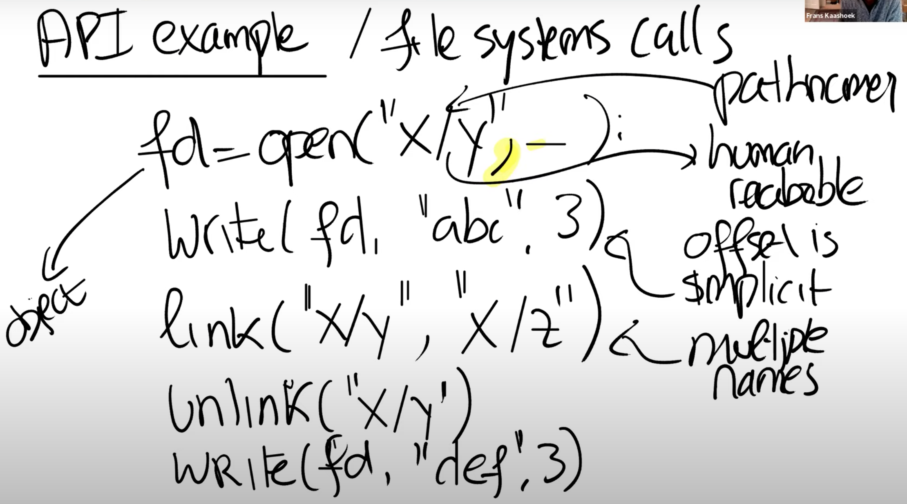

**文件系统的目的是实现上面描述的API，也即是典型的文件系统API。**但是，**这并不是唯一构建一个存储系统的方式。**如果只是在磁盘上存储数据，你可以想出一个完全不同的API。**数据库也能持久化的存储数据，但是数据库就提供了一个与文件系统完全不一样的API。**住这一点很重要：还存在其他的方式能组织存储系统。这节课关注在文件系统，文件系统通常由操作系统提供，而数据库如果没有直接访问磁盘的权限的话，通常是在文件系统之上实现的

**link是对inode做操作，而不是对文件描述符做操作**

## 接下来我们看一下文件系统的结构。文件系统究竟维护了什么样的结构来实现前面介绍的API呢？

**首先，最重要的可能就是inode，这是代表一个文件的对象，并且它不依赖于文件名。**

实际上，**inode是通过自身的编号来进行区分的，这里的编号就是个整数。所以文件系统内部通过一个数字，而不是通过文件路径名引用inode。**

inode必须有一个link count来跟踪指向这个inode的文件名的数量。一个文件（inode）只能在link count为0的时候被删除。实际中还有一个openfd count，一个文件只能在这两个计数器都为0的时候才能被删除。

write和read都没有针对文件的offset参数，所以**文件描述符必然自己悄悄维护了对于文件的offset。**

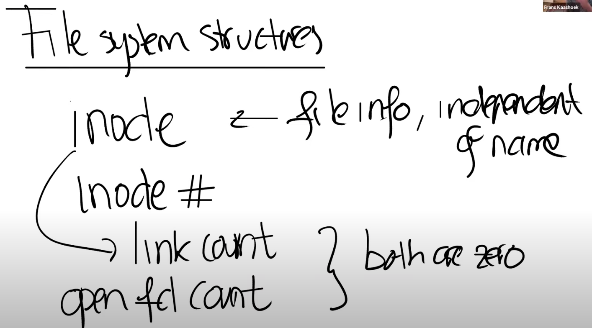

文件系统中核心的数据结构就是**inode和file descriptor**。后者主要与用户进程进行交互。

文件系统还挺复杂的，所以最好按照分层的方式进行理解。可以这样看：

- 在最底层是磁盘，也就是一些实际保存数据的存储设备，正是这些设备提供了持久化存储。
- 在这之上是buffer cache或者说block cache，这些cache可以避免频繁的读写磁盘。这里我们将磁盘中的数据保存在了内存中。
- 为了保证持久性，再往上通常会有一个logging层。许多文件系统都有某种形式的logging
- 在logging层之上，XV6有inode cache，这主要是为了同步（synchronization），我们稍后会介绍。inode通常小于一个disk block，所以多个inode通常会打包存储在一个disk block中。为了向单个inode提供同步操作，XV6维护了inode cache。
- 再往上就是inode本身了。它实现了read/write。
- 再往上，就是文件名，和文件描述符操作。

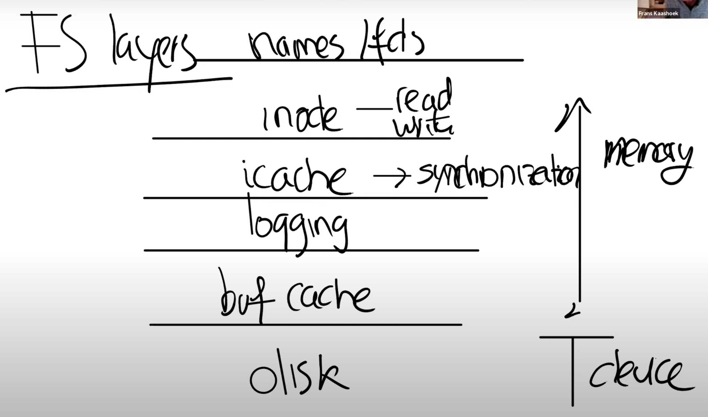

# How file system uses disk

简单的介绍最底层，也即是存储设备。设备的区别在于性能，容量，数据保存的期限等。熟悉的是SSD和HDD。

有些术语有点让人困惑，它们是sectors和blocks。

- sector通常是磁盘驱动可以读写的最小单元，它过去通常是512字节。
- block通常是操作系统或者文件系统视角的数据。它由文件系统定义，在XV6中它是1024字节。所以XV6中一个block对应两个sector。通常来说一个block对应了一个或者多个sector。

这些存储设备连接到了电脑总线之上，总线也连接了CPU和内存。**一个文件系统运行在CPU上，将内部的数据存储在内存，同时也会以读写block的形式存储在SSD或者HDD。**

这里的接口还是挺简单的，包括了read/write，然后以block编号作为参数。

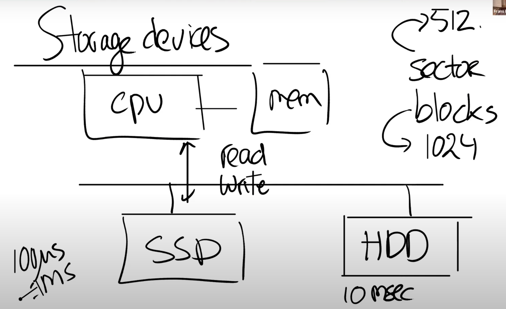

在内部，SSD和HDD工作方式完全不一样，但是对于硬件的抽象屏蔽了这些差异。磁盘驱动通常会使用一些标准的协议，例如PCIE，与磁盘交互。从**上向下看磁盘驱动的接口，大部分的磁盘看起来都一样**，你可以提供**block编号**，在**驱动中通过写设备的控制寄存器，然后设备就会完成相应的工作。**驱动的角度来看，你可以以大致相同的方式对它们进行编程。

- 学生提问：对于read/write的接口，是不是提供了同步/异步的选项？
- Frans教授：你可以认为一个磁盘的驱动与console的驱动是基本一样的。驱动向设备发送一个命令表明开始读或者写，过了一会当设备完成了操作，会产生一个中断表明完成了相应的命令。但是因为磁盘本身比console复杂的多，所以磁盘的驱动也会比我们之前看过的console的驱动复杂的多。不过驱动中的代码结构还是类似的，也有bottom部分和top部分，中断和读写控制寄存器

因为对于磁盘就是读写block或者sector，我们可以**将磁盘看作是一个巨大的block的数组，数组从0开始，一直增长到磁盘的最后。**而文件系统的工作就是**将所有的数据结构以一种能够在重启之后重新构建文件系统的方式**，存放在磁盘上。

xv6的布局结构。通常来说：

- block0要么没有用，要么被用作boot sector来启动操作系统。（里面通常包含了足够启动操作系统的代码。之后再从文件系统中加载操作系统的更多内容。）
- block1通常被称为super block，它描述了文件系统。它可能包含磁盘上有多少个block共同构成了文件系统这样的信息。我们之后会看到XV6在里面会存更多的信息，你可以通过block1构造出大部分的文件系统信息。
- 在XV6中，log从block2开始，到block32结束。实际上log的大小可能不同，这里在super block中会定义log就是30个block。
- 接下来在block32到block45之间，XV6存储了inode。我之前说过多个inode会打包存在一个block中，一个inode是64字节。
- 之后是bitmap block，这是我们构建文件系统的默认方法，它只占据一个block。它记录了数据block是否空闲。
- 之后就全是数据block了，数据block存储了文件的内容和目录的内容。

通常来说，bitmap block，inode blocks和log blocks被统称为metadata block。它们虽然不存储实际的数据，但是它们存储了能帮助文件系统完成工作的元数据。

假设inode是64字节，如果你想要读取inode10，那么你应该按照下面的公式去对应的block读取inode。

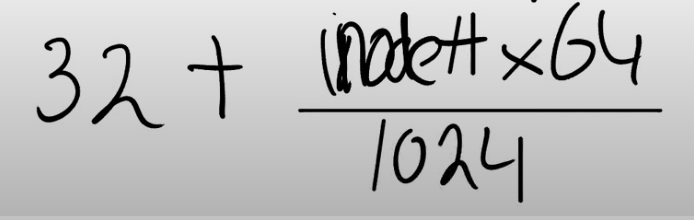

inode0在block32，inode17会在block33。只要有inode的编号，我们总是可以找到inode在磁盘上存储的位置。

# inode

看一下磁盘上存储的inode究竟是什么？首先我们前面已经看过了，**这是一个64字节的数据结构。**

- 通常来说它有一个type字段，表明inode是文件还是目录。
- nlink字段，也就是link计数器，用来跟踪究竟有多少文件名指向了当前的inode。
- size字段，表明了文件数据有多少个字节。
- 不同文件系统中的表达方式可能不一样，不过在XV6中接下来是一些block的编号，例如编号0，编号1，等等。XV6的inode中总共有12个block编号。这些被称为direct block number。这12个block编号指向了构成文件的前12个block。举个例子，如果文件只有2个字节，那么只会有一个block编号0，它包含的数字是磁盘上文件前2个字节的block的位置。
- 之后还有一个indirect block number，它对应了磁盘上一个block，这个block包含了256个block number，这256个block number包含了文件的数据。所以inode中block number 0到block number 11都是direct block number，而block number 12保存的indirect block number指向了另一个block。
- 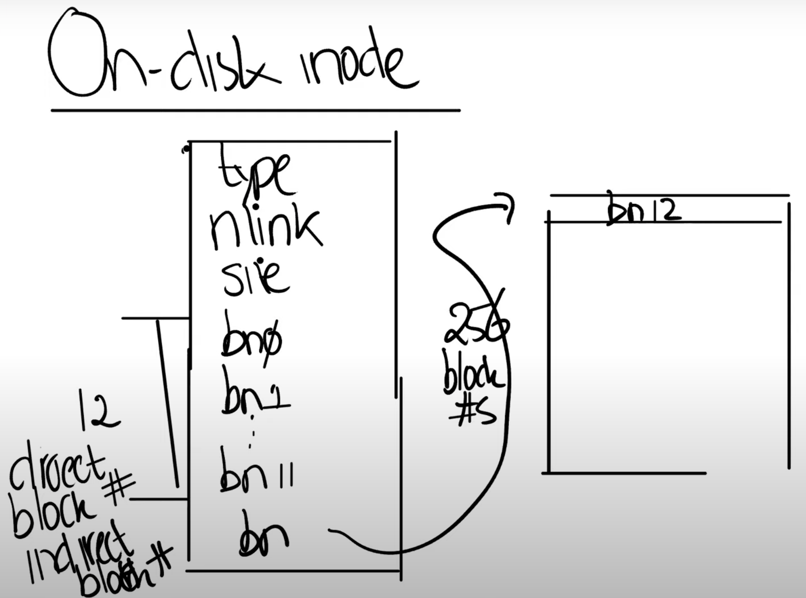

以上基本就是XV6中inode的组成部分。

基于上面的内容，XV6中文件最大的长度是多少呢？

max_file_size=(256+12)*1024

实际的文件系统，文件最大的长度会大的多得多。那可以做一些什么来让文件系统支持大得多的文件呢？可以扩展inode中indirect部分

是的，可以用类似page table的方式，构建一个双重indirect block number指向一个block，这个block中再包含了256个indirect block number，每一个又指向了包含256个block number的block。

**这里修改了inode的数据结构，你可以使用类似page table的树状结构，也可以按照B树或者其他更复杂的树结构实现。**

**因为每个编号是4个字节。1024/4 = 256。**如果block编号只是4个字节，磁盘最大能有多大？2的32次方（注，4TB）。有些磁盘比这个数字要大，所以通常人们会使用比32bit更长的数字来表示block编号。

接下来，我们想要实现read系统调用。假设我们需要读取文件的第8000个字节，那么你该读取哪个block呢？从inode的数据结构中该如何计算呢？

对于8000，我们首先除以1024，也就是block的大小，得到大概是7。这意味着第7个block就包含了第8000个字节。所以直接在inode的direct block number中，就包含了第8000个字节的block。

为了找到这个字节在第7个block的哪个位置，我们需要用8000对1024求余数，我猜结果是是832。所以为了读取文件的第8000个字节，文件系统查看inode，先用8000除以1024得到block number，然后再用8000对1024求余读取block中对应的字节。

inode中的信息完全足够用来实现read/write系统调用，至少**可以找到哪个disk block需要用来执行read/write系统调用。**

### 目录

一个**目录本质上是一个文件加上一些文件系统能够理解的结构**。在XV6中，这里的结构极其简单。每一个目录包含了directory entries（目录条目），每一条entry都有固定的格式：

- 前2个字节包含了目录中文件或者子目录的inode编号，
- 接下来的14个字节包含了文件或者子目录名。

所以每个entry总共是16个字节。

对于实现路径名查找，这里的信息就足够了。假设我们要查找路径名“/y/x”，我们该怎么做呢？

从路径名我们知道，**应该从root inode开始查找。**通常root inode会有固定的inode编号，在XV6中，这个编号是1。

**如何根据编号找到root inode呢？**从前一节我们可以知道，inode从block 32开始，如果是inode1，那么必然在block 32中的64到128字节的位置。所以文件系统可以直接读到root inode的内容。

对于路径名查找程序，接下来就是**扫描root inode包含的所有block，以找到“y”。**

**该怎么找到root inode所有对应的block呢？**

就是读取所有的direct block number和indirect block number。

结果可能是找到了，也可能是没有找到。如果找到了，那么目录y也会有一个inode编号，假设是251，

我们可以**继续从inode 251查找，先读取inode 251的内容，之后再扫描inode所有对应的block，找到“x”并得到文件x对应的inode编号**，最后将其作为路径名查找的结果返回。

# File system工作示例

首先我会启动XV6，这里有件事情我想指出。启动XV6的过程中，调用了makefs指令，来创建一个文件系统。

所以**makefs创建了一个全新的磁盘镜像**，在这个磁盘镜像中**包含了我们在指令中传入的一些文件。makefs为你创建了一个包含这些文件的新的文件系统。**

XV6总是会打印文件系统的一些信息，所以从指令的下方可以看出有46个meta block，其中包括了：

- boot block
- super block
- 30个log block
- 13个inode block
- 1个bitmap block

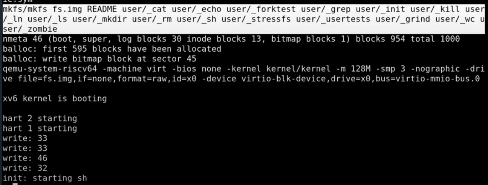

之后是954个data block。所以这是一个袖珍级的文件系统，总共就包含了1000个block。在File system lab中，你们会去支持更大的文件系统。

我还稍微修改了一下XV6，使得任何时候写入block都会打印出block的编号。我们从console的输出可以看出，在XV6启动过程中，会有一些对于文件系统的调用，并写入了block 33，45，32。

运行一些命令，来看一下特定的命令对哪些block做了写操作，并理解为什么要对这些block写入数据。通过echo “hi” > x，来创建一个文件x，并写入字符“hi”。

这里会有几个阶段

1. 1.第一阶段是创建文件
2. 2.第二阶段将“hi”写入文件
3. 3.第三阶段将“\n”换行符写入到文件

去看echo的代码实现，基本就是这3个阶段。一个阶段一个阶段的看echo的执行过程，并理解对于文件系统发生了什么。

### 第一阶段是创建文件

write 33代表了什么？我们正在创建文件，所以我们期望文件系统干什么呢？是在写inode。

是的，看起来给我们分配的inode位于block 33。**之所以有两个write 33，第一个是为了标记inode将要被使用。**在XV6中，我记得是使用inode中的type字段来标识inode是否空闲，这个字段同时也会用来表示inode是一个文件还是一个目录。所以**这里将inode的type从空闲改成了文件，并写入磁盘表示这个inode已经被使用了**。第二个write 33就是实际的写入inode的内容。inode的内容会包含linkcount为1以及其他内容。

write 46是向第一个data block写数据，那么这个data block属于谁呢？block 46是根目录的第一个block。为什么它需要被写入数据呢？

这里我们向根目录增加了一个新的entry，其中包含了文件名x，以及我们刚刚分配的inode编号。

接下来的write 32又是什么意思呢？block 32保存的仍然是inode，那么**inode中的什么发生了变化使得需要将更新后的inode写入磁盘？**是的，根目录的大小变了，因为我们刚刚添加了16个字节的entry来代表文件x的信息。

最后又有一次write 33，我在稍后会介绍这次写入的内容，这里我们再次更新了文件x的inode， 尽管我们又还没有写入任何数据。

### 第二阶段是向文件写入“hi”。

首先是write 45，这是更新bitmap。

文件系统首先会扫描bitmap来**找到一个还没有使用的data block**，未被使用的data block对应bit 0。找到之后，文件系统需要将该bit设置为1，表示对应的data block已经被使用了。所以**更新block 45是为了更新bitmap。**

接下来的两次write 595表明，文件系统挑选了data block 595。**所以在文件x的inode中，第一个direct block number是595。因为写入了两个字符，所以write 595被调用了两次。**

第二阶段最后的write 33是更新文件x对应的inode中的size字段，因为现在文件x中有了两个字符。

第二阶段最后的write 33是否会将block 595与文件x的inode关联起来？

会的。这里的write 33会发生几件事情：

- **首先inode的size字段会更新；**
- **第一个direct block number会更新。**

这两个信息都会通过write 33一次更新到磁盘上的inode中。

# XV6创建inode代码展示

前面已经分配了inode，我们先来看一下这是如何发生的。分配inode发生在sys_open（sysfile.c）函数中，这个函数会负责创建文件。

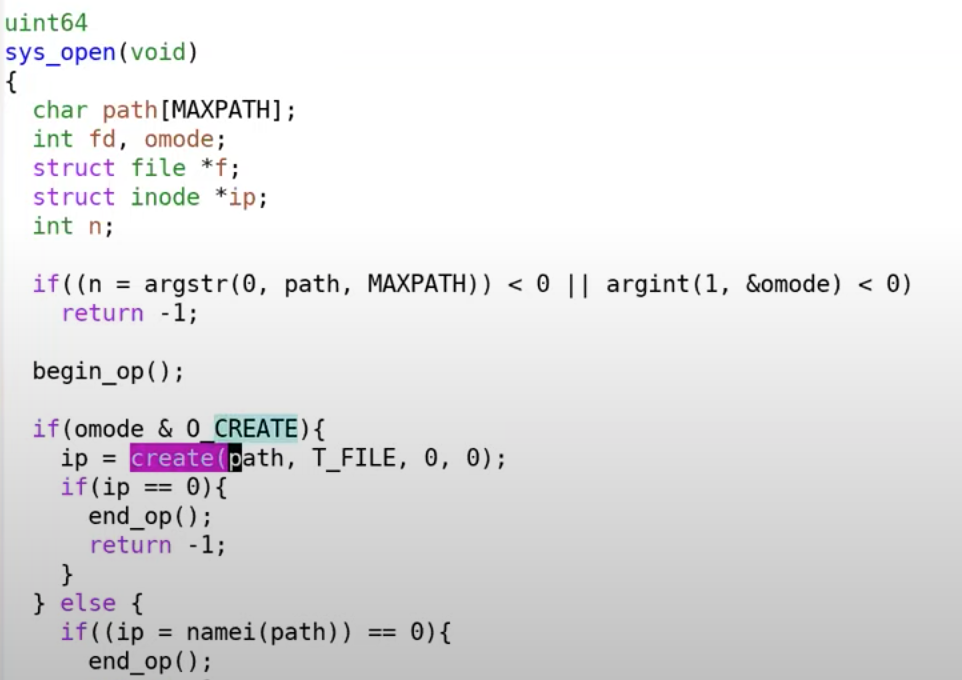

在sys_open函数中，会调用create函数。

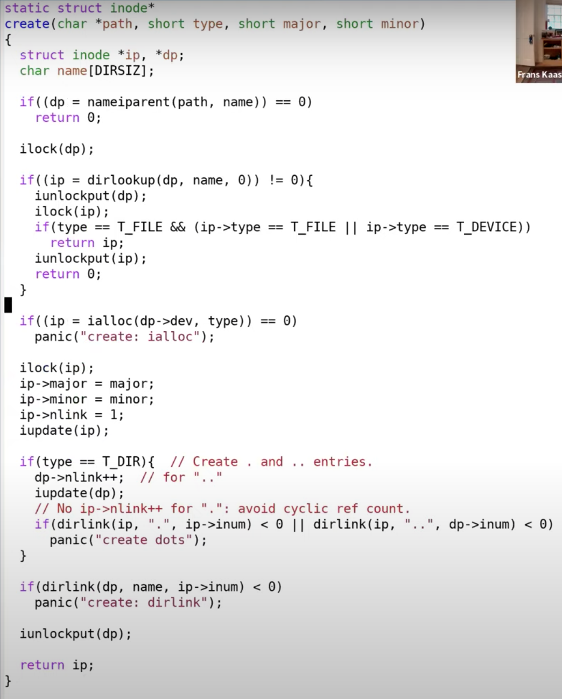

create函数中首先会解析路径名并找到最后一个目录，之后会查看文件是否存在，如果存在的话会返回错误。

之后就会调用**ialloc（inode allocate）**，这个函数会为文件x分配inode。ialloc函数位于fs.c文件中。

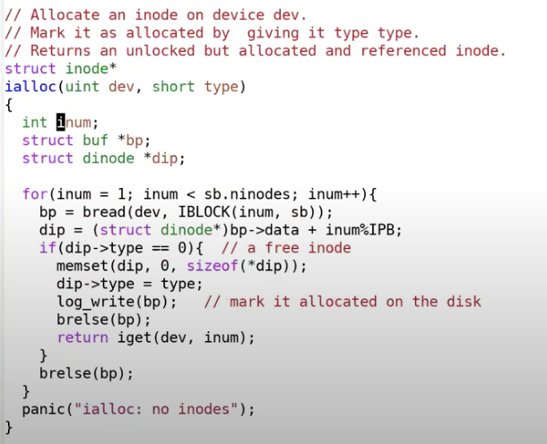

**它会遍历所有可能的inode编号，找到inode所在的block，再看位于block中的inode数据的type字段。**如果这是一个空闲的inode，那么将其type字段设置为文件，这会将inode标记为已被分配。函数中的log_write就是我们之前看到在console中有关写block的输出。这里的log_write是我们看到的整个输出的第一个。

如果有多个进程同时调用create函数会发生什么？

对于一个多核的计算机，进程可能并行运行，两个进程可能同时会调用到ialloc函数，然后进而调用bread（block read）函数。所以必须要有一些机制确保这两个进程不会互相影响。

让我们看一下位于bio.c的buffer cache代码。首先看一下bread函数

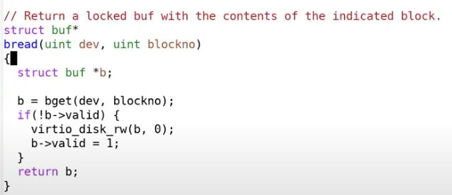

bread函数首先会调用bget函数，bget会为我们从buffer cache中找到block的缓存。让我们看一下bget函数

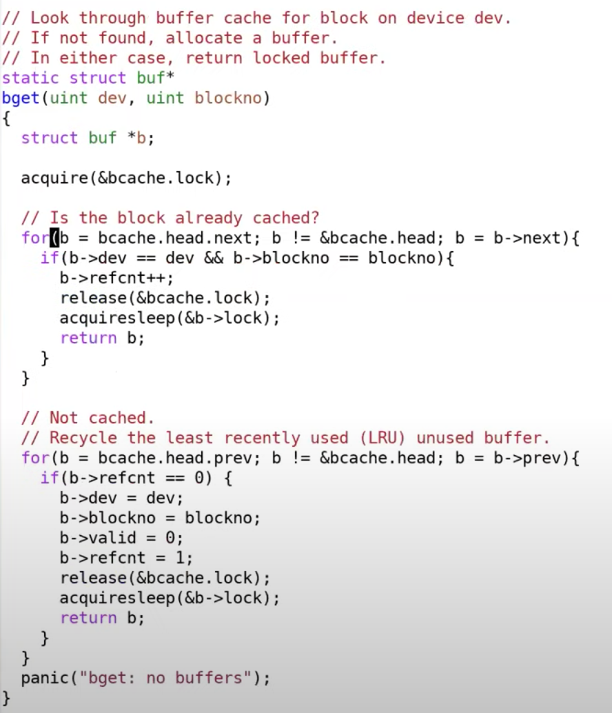

是的，我们这里看一下block 33的cache是否存在，如果存在的话，将block对象的引用计数（refcnt）加1，之后再释放bcache锁，因为现在我们已经完成了对于cache的检查并找到了block cache。之后，代码会尝试获取block cache的锁。

所以，如果有多个进程同时调用bget的话，其中一个可以获取bcache的锁并扫描buffer cache。此时，其他进程是没有办法修改buffer cache的。之后，进程会查找block number是否在cache中，如果在的话将block cache的引用计数加1，表明当前进程对block cache有引用，之后再释放bcache的锁。如果有第二个进程也想扫描buffer cache，那么这时它就可以获取bcache的锁。假设第二个进程也要获取block 33的cache，那么它也会对相应的block cache的引用计数加1。最后这两个进程都会尝试对block 33的block cache调用acquiresleep函数。

acquiresleep是另一种锁，我们称之为sleep lock，本质上来说它获取block 33 cache的锁。其中一个进程获取锁之后函数返回。在ialloc函数中会扫描block 33中是否有一个空闲的inode。而另一个进程会在acquiresleep中等待第一个进程释放锁。

- 学生提问：当一个block cache的refcnt不为0时，可以更新block cache吗？因为释放锁之后，可能会修改block cache。
- Frans教授：这里我想说几点；首先XV6中对bcache做任何修改的话，都必须持有bcache的锁；其次对block 33的cache做任何修改你需要持有block 33的sleep lock。所以在任何时候，release(&bcache.lock)之后，b->refcnt都大于0。block的cache只会在refcnt为0的时候才会被驱逐，任何时候refcnt大于0都不会驱逐block cache。所以当b->refcnt大于0的时候，block cache本身不会被buffer cache修改。这里的第二个锁，也就是block cache的sleep lock，是用来保护block cache的内容的。它确保了任何时候只有一个进程可以读写block cache。

如果buffer cache中有两份block 33的cache将会出现问题。

假设一个进程要更新inode19，另一个进程要更新inode20。如果它们都在处理block 33的cache，并且cache有两份，那么第一个进程可能持有一份cache并先将inode19写回到磁盘中，而另一个进程持有另一份cache会将inode20写回到磁盘中，并将inode19的更新覆盖掉。所以一个block只能在buffer cache中出现一次。你们在完成File system lab时，必须要维持buffer cache的这个属性。

- 学生提问：如果多个进程都在使用同一个block的cache，然后有一个进程在修改block，并通过强制向磁盘写数据修改了block的cache，那么其他进程会看到什么结果？
- Frans教授：如果第一个进程结束了对block 33的读写操作，它会对block的cache调用brelse（block cache release）函数。

这个函数会对refcnt减1，并释放sleep lock。这意味着，如果有任何一个其他进程正在等待使用这个block cache，现在它就**能获得这个block cache的sleep lock，并发现刚刚做的改动。**

假设两个进程都需要分配一个新的inode，且新的inode都位于block 33。如果第一个进程分配到了inode18并完成了更新，那么它对于inode18的更新是可见的。另一个进程就只能分配到inode19，因为inode18已经被标记为已使用，任何之后的进程都可以看到第一个进程对它的更新。

**如果一个进程创建了一个inode或者创建了一个文件，之后的进程执行读就应该看到那个文件。**

#  Sleep Lock

block cache使用的是sleep lock。sleep lock区别于一个常规的spinlock。我们先看来一下sleep lock。

首先是acquiresleep函数，它用来获取sleep lock。函数里首先获取了一个普通的spinlock，这是与sleep lock关联在一起的一个锁。之后，如果sleep lock被持有，那么就进入sleep状态，并将自己从当前CPU调度开。

既然sleep lock是基于spinlock实现的，为什么对于block cache，我们使用的是sleep lock而不是spinlock？

这里其实有多种原因。对于spinlock有很多限制:

- 其中之一是加锁时中断必须要关闭。所以如果使用spinlock的话，当我们对block cache做操作的时候需要持有锁，那么我们就永远也不能从磁盘收到数据。或许另一个CPU核可以收到中断并读到磁盘数据，但是如果我们只有一个CPU核的话，我们就永远也读不到数据了。**不能在持有spinlock的时候进入sleep状态。**
- sleep lock的优势就是，我们可以在持有锁的时候不关闭中断。我们可以在磁盘操作的过程中持有锁，我们也可以长时间持有锁。当我们在等待sleep lock的时候，我们并没有让CPU一直空转，我们通过sleep将CPU出让出去了。

接下来让我们看一下brelease函数。

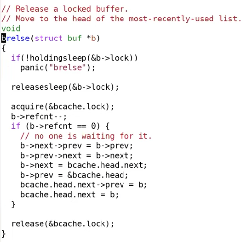

brelease函数中首先释放了sleep lock；之后获取了bcache的锁；之后减少了block cache的引用计数，表明一个进程不再对block cache感兴趣；最后如果引用计数为0，那么它会修改buffer cache的linked-list，将block cache移到linked-list的头部，这样表示这个block cache是最近使用过的block cache。

这一点很重要，当我们在bget函数中不能找到block cache时，我们需要在buffer cache中腾出空间来存放新的block cache，这时会使用LRU（Least Recent Used）算法找出最不常使用的block cache，并撤回它（注，而将刚刚使用过的block cache放在linked-list的头部就可以直接更新linked-list的tail来完成LRU操作）。**通常系统都遵循temporal locality策略，也就是说如果一个block cache最近被使用过，那么很有可能它很快会再被使用，所以最好不要撤回这样的block cache。**

注意：

- 首先在内存中，对于一个block只能有一份缓存。这是block cache必须维护的特性。
- 其次，这里使用了与之前的spinlock略微不同的sleep lock。与spinlock不同的是，可以在I/O操作的过程中持有sleep lock。
- 第三，它采用了LRU作为cache替换策略。
- 第四，它有两层锁。第一层锁用来保护buffer cache的内部数据；第二层锁也就是sleep lock用来保护单个block的cache。

# 总结

- 首先，文件系统是一个位于磁盘的数据结构。我们今天的主要时间都用来介绍这个位于磁盘的数据结构的内容。XV6的这个数据结构实现的很简单，但是你可以实现一个更加复杂的数据结构。
- 其次，我们花了一些时间来看block cache的实现，这对于性能来说是至关重要的，因为读写磁盘是代价较高的操作，可能要消耗数百毫秒，而block cache确保了如果我们最近从磁盘读取了一个block，那么我们将不会再从磁盘读取相同的block。

下节课我将会介绍crash safety（翻译为崩溃安全性，用于保持文件系统的持久保存能力），这是文件系统设计中非常棒的一部分。

下节课我们会看到基于log实现的crash safety机制，下下节课我们会看到Linux的ext3是如何实现的logging，这种方式要快得多。

如果我们释放了sleep lock，这时另一个进程正在等待锁，那么refcnt必然大于1，而b->refcnt --只是表明当前执行brelease的进程不再关心block cache。如果还有其他进程正在等待锁，那么refcnt必然不等于0，我们也必然不会执行if(b->refcnt == 0)中的代码。