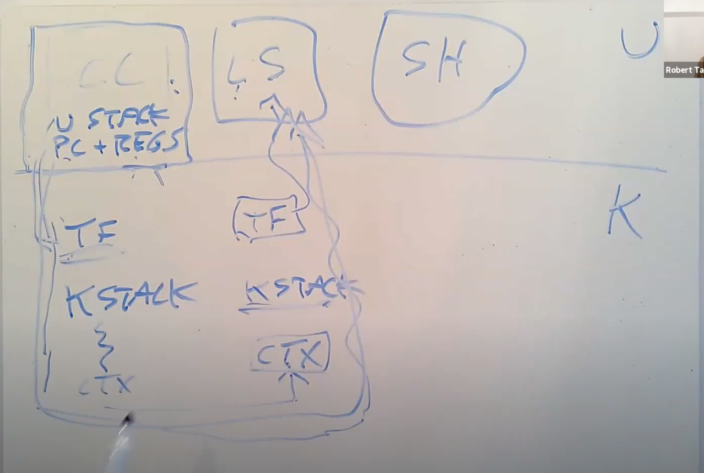
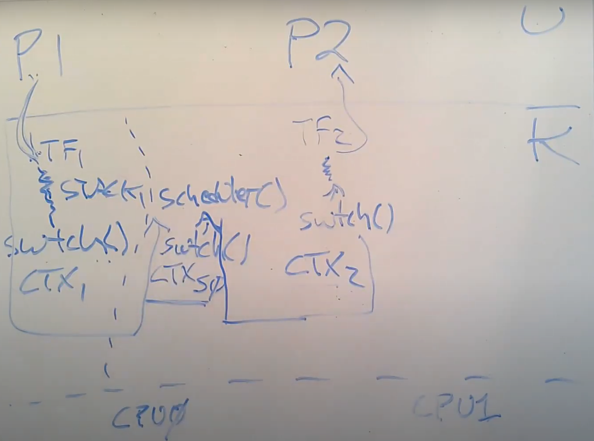
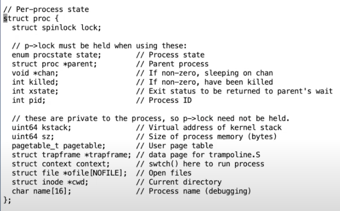
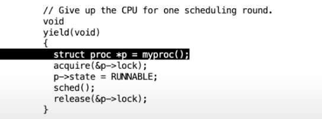
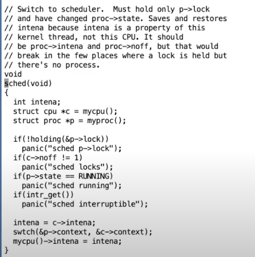
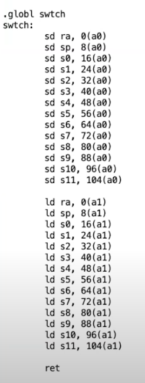
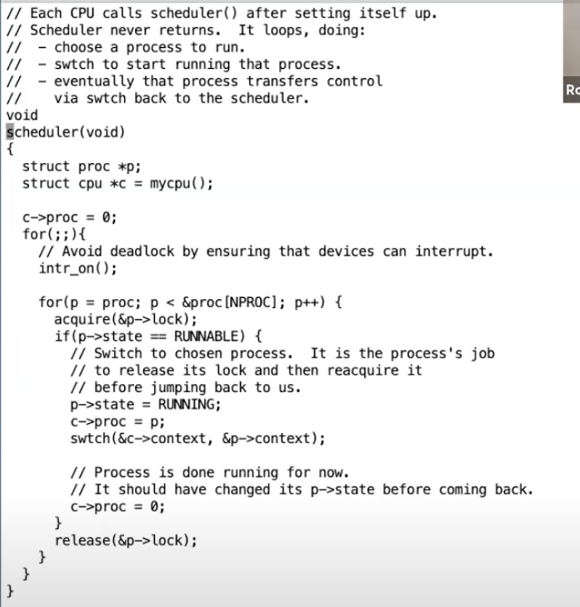
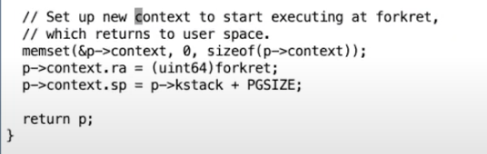
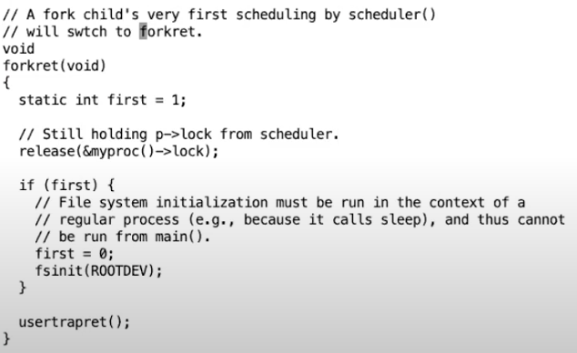

# 线程课程 

## 线程（Thread）概述

讨论线程以及XV6如何实现线程切换。

线程可以认为是一种在有多个任务时简化编程的抽象。一个线程可以认为是串行执行代码的单元。**在这里，我们认为线程就是单个串行执行代码的单元，它只占用一个CPU并且以普通的方式一个接一个的执行指令。**

除此之外，线程还具有状态，我们可以随时保存线程的状态并暂停线程的运行，并在之后通过恢复状态来恢复线程的运行。线程的状态包含了三个部分：

1. 程序计数器（Program Counter），它表示当前线程执行指令的位置。

2. 保存变量的寄存器。

3. 程序的Stack（注，详见5.5）。通常来说每个线程都有属于自己的Stack，Stack记录了函数调用的记录，并反映了当前线程的执行点。

操作系统中线程系统的工作就是管理多个线程的运行。我们可能会启动成百上千个线程，而线程系统的工作就是弄清楚如何管理这些线程并让它们都能运行。

**多线程的并行运行主要有两个策略：**

1. **第一个策略是在多核处理器上使用多个CPU，每个CPU都可以运行一个线程**，如果你有4个CPU，那么每个CPU可以运行一个线程。每个线程自动的根据所在CPU就有了程序计数器和寄存器。但是如果你只有4个CPU，却有上千个线程，每个CPU只运行一个线程就不能解决这里的问题了。

2. 第二个策略，也就是一个CPU在多个线程之间来回切换。假设我只有一个CPU，但是有1000个线程，我们接下来将会看到XV6是如何实现线程切换使得XV6能够先运行一个线程，之后将线程的状态保存，再切换至运行第二个线程，然后再是第三个线程，依次类推直到每个线程都运行了一会，再回来重新执行第一个线程。

**XV6结合了这两种策略**，首先线程会运行在所有可用的CPU核上，其次每个CPU核会在多个线程之间切换，因为通常来说，线程数会远远多于CPU的核数。

**不同线程系统之间的一个主要的区别就是，线程之间是否会共享内存。**一种可能是你有一个地址空间，多个线程都在这一个地址空间内运行，并且它们可以看到彼此的更新。比如说共享一个地址空间的线程修改了一个变量，共享地址空间的另一个线程可以看到变量的修改。所以当多个线程运行在一个共享地址空间时，我们需要用到上节课讲到的锁。

**XV6内核共享了内存**，并且XV6支持内核线程的概念，对于**每个用户进程都有一个内核线程来执行来自用户进程的系统调用。所有的内核线程都共享了内核内存，所以XV6的内核线程的确会共享内存。**

另一方面，XV6还有另外一种线程。每一个用户进程都有独立的内存地址空间（注，详见4.2），并且包含了一个线程，**这个线程控制了用户进程代码指令的执行**。所以XV6中的用户线程之间没有共享内存，你可以有多个用户进程，但是每个用户进程都是拥有一个线程的独立地址空间。**XV6中的进程不会共享内存。**

在一些其他更加复杂的系统中，例如Linux，**允许在一个用户进程中包含多个线程，进程中的多个线程共享进程的地址空间。**在Linux中跟踪每个进程的多个线程比XV6中每个进程只有一个线程要复杂的多。

## XV6线程调度

实现内核中的线程系统存在以下挑战：

1. 第一个是如何实现线程间的切换。这里停止一个线程的运行并启动另一个线程的过程通常被称为线程调度（Scheduling）。我们将会看到XV6为每个CPU核都创建了一个线程调度器（Scheduler）。
2. 第二个挑战是，当你想要实际实现从一个线程切换到另一个线程时，你需要保存并恢复线程的状态，所以需要决定线程的哪些信息是必须保存的，并且在哪保存它们。
3. 最后一个挑战是如何处理运算密集型线程（compute bound thread）。对于线程切换，很多直观的实现是由线程自己自愿的保存自己的状态，再让其他的线程运行。但是如果我们有一些程序正在执行一些可能要花费数小时的长时间计算任务，这样的线程并不能自愿的出让CPU给其他的线程运行。所以这里需要能从长时间运行的运算密集型线程撤回对于CPU的控制，将其放置于一边，稍后再运行它。

### 首先介绍如何处理运算密集型线程。

**这里的具体实现你们之前或许已经知道了，就是利用定时器中断。**

在每个CPU核上，都存在一个硬件设备，它会定时产生中断。XV6与其他所有的操作系统一样，将这个中断传输到了内核中。**定时器中断仍然能在例如每隔10ms的某个时间触发，并将程序运行的控制权从用户空间代码切换到内核中的中断处理程序**

位于内核的定时器中断处理程序，会**自愿的将CPU出让（yield）给线程调度器，**诉线程调度器说，你可以让一些其他的线程运行了。

在执行线程调度的时候，操作系统需要能区分几类线程：

1. **当前在CPU上运行的线程**

2. **一旦CPU有空闲时间就想要运行在CPU上的线程**

3. **以及不想运行在CPU上的线程，因为这些线程可能在等待I/O或者其他事件**

**RUNNING，线程当前正在某个CPU上运行**

**RUNABLE，线程还没有在某个CPU上运行，但是一旦有空闲的CPU就可以运行**

**SLEEPING，这节课我们不会介绍，下节课会重点介绍，这个状态意味着线程在等待一些I/O事件，它只会在I/O事件发生了之后运行**

对于RUNNING状态下的线程，它的程序计数器和寄存器位于正在运行它的CPU硬件中。而RUNABLE线程，因为**并没有CPU与之关联**，所以对于每一个RUNABLE线程，当我们**将它从RUNNING转变成RUNABLE时**，我们需要将它还在RUNNING时**位于CPU的状态拷贝到内存中的某个位置，**注意这里不是从内存中的某处进行拷贝，而是从CPU中的寄存器拷贝。**需要拷贝的信息就是程序计数器（Program Counter）和寄存器。**

线程调度器决定要运行一个RUNABLE线程时，任务之一：**将之前保存的程序计数器和寄存器拷贝回调度器对应的CPU中。**

#  XV6线程切换

当用户程序在运行时，**实际上是用户进程中的一个用户线程在运行**。如果程序执行了一个**系统调用或者因为响应中断走到了内核**中，那么相应的**用户空间状态会被保存在程序的trapframe中**，**同时属于这个用户程序的内核线程被激活。**

所以首先，用户的程序计数器，寄存器等等被保存到了trapframe中，之后CPU被切换到内核栈上运行，实际上会走到trampoline和usertrap代码中，之后内核会运行一段时间处理系统调用或者执行中断处理程序。

在定时器中断程序中，如果XV6内核决定从一个用户进程切换到另一个用户进程，那么**首先在内核中第一个进程的内核线程会被切换到第二个进程的内核线程。**

**之后再在第二个进程的内核线程中返回到用户空间的第二个进程**，这里返回也是通过恢复trapframe中保存的用户进程状态完成。

当XV6从CC程序的内核线程切换到LS程序的内核线程时：

1. XV6会首先会将CC程序的**内核线程的内核寄存器保存在一个context对象中**。

2. 类似的，因为要切换到LS程序的内核线程，那么LS程序现在的状态必然是RUNABLE，表明LS程序之前运行了一半。这同时也意味着LS程序的用户空间状态已经保存在了对应的trapframe中，更重要的是，LS程序的内核线程对应的内核寄存器也已经保存在对应的context对象中。所以接下来，XV6会恢复LS程序的内核线程的context对象，也就是恢复内核线程的寄存器。
3. 之后LS会继续在它的内核线程栈上，完成它的中断处理程序。
4. 然后通过恢复LS程序的trapframe中的用户进程状态，返回到用户空间的LS程序中。
5. 最后恢复执行LS。

**这里核心点在于，在XV6中，任何时候都需要经历：**

1.从一个用户进程切换到另一个用户进程，都需要从第一个用户进程接入到内核中，保存用户进程的状态并运行第一个用户进程的内核线程。

2.再从第一个用户进程的内核线程切换到第二个用户进程的内核线程。

3.之后，第二个用户进程的内核线程暂停自己，并恢复第二个用户进程的用户寄存器。

4.最后返回到第二个用户进程继续执行。

实际的线程切换流程会复杂的多。

假设我们有进程P1正在运行，进程P2是RUNABLE当前并不在运行。假设在XV6中我们有2个CPU核，这意味着在硬件层面我们有CPU0和CPU1。

**从一个正在运行的用户空间进程切换到另一个RUNABLE但是还没有运行的用户空间进程的更完整的故事是：**

1. 首先与我之前介绍的一样，一个**定时器中断强迫CPU从用户空间进程切换到内核**，**trampoline代码将用户寄存器保存于用户进程对应的trapframe对象中；**
2. 之后在内核中运行usertrap，来实际执行相应的中断处理程序。这时，CPU正在进程P1的内核线程和内核栈上，执行内核中普通的C代码；
3. 假设进程P1对应的内核线程决定它想出让CPU，它会做很多工作，最后它会调用swtch函数，这是整个线程切换的核心函数之一；
4. swtch函数会**保存用户进程P1对应内核线程的寄存器至context对象**。**所以目前为止有两类寄存器：用户寄存器存在trapframe中，内核线程的寄存器存在context中。**

但是，实际上swtch函数并不是直接从一个内核线程切换到另一个内核线程。XV6中，一个CPU上运行的内核线程可以直接切换到的是这个CPU对应的**调度器线程**。所以如果我们运行在CPU0，swtch函数会恢复之前为CPU0的调度器线程保存的寄存器和stack pointer，之后就在调度器线程的context下执行schedulder函数中

在schedulder函数中会做一些清理工作，例如将进程P1设置成RUNABLE状态。之后再通过进程表单找到下一个RUNABLE进程。假设找到的下一个进程是P2（虽然也有可能找到的还是P1），schedulder函数会再次调用swtch函数，完成下面步骤：

1. 先保存自己的寄存器到调度器线程的context对象
2. 找到进程P2之前保存的context，恢复其中的寄存器
3. 因为进程P2在进入RUNABLE状态之前，如刚刚介绍的进程P1一样，必然也调用了swtch函数。所以之前的swtch函数会被恢复，并返回到进程P2所在的系统调用或者中断处理程序中（注，因为P2进程之前调用swtch函数必然在系统调用或者中断处理程序中）。
4. 不论是系统调用也好中断处理程序也好，在从用户空间进入到内核空间时会保存用户寄存器到trapframe对象。所以当内核程序执行完成之后，trapframe中的用户寄存器会被恢复。
5. 最后用户进程P2就恢复运行了。

**每一个CPU都有一个完全不同的调度器线程。调度器线程也是一种内核线程，它也有自己的context对象。任何运行在CPU1上的进程，当它决定出让CPU，它都会切换到CPU1对应的调度器线程，并由调度器线程切换到下一个进程。**

学生提问：context保存在哪？

Robert教授：**每一个内核线程都有一个context对象。但是内核线程实际上有两类**。每一个**用户进程有一个对应的内核线程，它的context对象保存在用户进程对应的proc结构体中。**

每一个**调度器线程，它也有自己的context对象**，但是它却没有对应的进程和proc结构体，所以**调度器线程的context对象保存在cpu结构体中**。在内核中，有一个cpu结构体的数组，每个cpu结构体对应一个CPU核，每个结构体中都有一个context字段。

学生提问：为什么不能将context对象保存在进程对应的trapframe中？

Robert教授：context可以保存在trapframe中，因为每一个进程都只有一个内核线程对应的一组寄存器，我们可以将这些寄存器保存在任何一个与进程一一对应的数据结构中。对于每个进程来说，有一个proc结构体，有一个trapframe结构体，所以我们可以将context保存于trapframe中。但是或许出于简化代码或者让代码更清晰的目的，**trapframe还是只包含进入和离开内核时的数据**。而**context结构体中包含的是在内核线程和调度器线程之间切换时，需要保存和恢复的数据。**

**每一个CPU的调度器线程有自己的栈吗？**

是的，每一个调度器线程都有自己独立的栈。实际上调度器线程的所有内容，包括栈和context，与用户进程不一样，都是在系统启动时就设置好了。

对于我们这节课来说，context switching主要是指一个内核线程和调度器线程之间的切换。

每个CPU核在一个时间只会运行一个线程，它要么是**运行用户进程的线程，**要么是运行**内核线程**，要么是运行这个**CPU核对应的调度器线程**。

类似的每一个线程要么是只运行在一个CPU核上，要么它的状态被保存在context中。线程永远不会运行在多个CPU核上，线程要么运行在一个CPU核上，要么就没有运行。

在XV6的代码中，context对象总是由swtch函数产生，所以**context总是保存了内核线程在执行swtch函数时的状态。**当我们在恢复一个内核线程时，对于刚恢复的线程所做的第一件事情就是从之前的swtch函数中返回

在XV6中，一个进程要么在用户空间执行指令，要么是在内核空间执行指令，要么它的状态被保存在context和trapframe中，并且没有执行任何指令。进程有两个线程，一个用户空间线程，一个内核空间线程，并且存在限制使得一个进程要么运行在用户空间线程，要么为了执行系统调用或者响应中断而运行在内核空间线程 ，但是永远也不会两者同时运行。

## 示例

**proc.h中的proc结构体**

首先是保存了用户空间线程寄存器的trapframe字段

其次是保存了内核线程寄存器的context字段

还有保存了当前进程的内核栈的kstack字段，这是进程在内核中执行时保存函数调用的位置

state字段保存了当前进程状态，要么是RUNNING，要么是RUNABLE，要么是SLEEPING等等

lock字段保护了很多数据，目前来说至少保护了对于state字段的更新。举个例子，因为有锁的保护，两个CPU的调度器线程不会同时拉取同一个RUNABLE进程并运行它

## XV6线程切换 --- yield/sched函数

回到devintr函数返回到usertrap函数中的位置。在gdb里面输入几次step走到yield函数的调用。**yield函数是整个线程切换的第一步，下面是yield函数的内容**：

yield函数只做了几件事情，它首先获取了进程的锁。实际上，在锁释放之前，进程的状态会变得不一致，例如，yield将要将进程的状态改为RUNABLE，表明进程并没有在运行，但是实际上这个进程还在运行，代码正在当前进程的内核线程中运行。**所以这里加锁的目的之一就是：即使我们将进程的状态改为了RUNABLE，其他的CPU核的调度器线程也不可能看到进程的状态为RUNABLE并尝试运行它。**否则的话，进程就会在两个CPU核上运行了，而一个进程只有一个栈，这意味着两个CPU核在同一个栈上运行代码（注，因为XV6中一个用户进程只有一个用户线程）。

接下来yield函数中将进程的状态改为RUNABLE。这里的意思是，当前进程要出让CPU，并切换到调度器线程。当前进程的状态是RUNABLE意味着它还会再次运行，因为毕竟现在是一个定时器中断打断了当前正在运行的进程。

之后yield函数中调用了位于proc.c文件中的sched函数。我们进入到sched函数中，

可以看出，sched函数基本没有干任何事情，只是做了一些合理性检查，如果发现异常就panic。走到位于底部的swtch函数。

## XV6线程切换 --- switch函数

**swtch函数会将当前的内核线程的寄存器保存到p->context中**。swtch函数的另一个参数c->context，c表示当前CPU的结构体。**CPU结构体中的context保存了当前CPU核的调度器线程的寄存器。**所以swtch函数在保存完当前内核线程的内核寄存器之后，就会恢复当前CPU核的调度器线程的寄存器，并继续执行当前CPU核的调度器线程。

保存的当前CPU核的调度器线程的寄存器。在这些寄存器中，最有趣的就是ra（Return Address）寄存器，因为ra寄存器保存的是当前函数的返回地址，所以我们将要返回到scheduler函数中。

首先，ra寄存器被保存在了a0寄存器指向的地址。a0寄存器对应了swtch函数的第一个参数，从前面可以看出这是当前线程的context对象地址 ；a1寄存器对应了swtch函数的第二个参数，从前面可以看出这是即将要切换到的调度器线程的context对象地址。

所以函数中上半部分是将当前的寄存器保存在当前线程对应的context对象中，函数的下半部分是将调度器线程的寄存器，也就是我们将要切换到的线程的寄存器恢复到CPU的寄存器中。之后函数就返回了。所以调度器线程的ra寄存器的内容才显得有趣，因为它指向的是swtch函数返回的地址，也就是scheduler函数（调度器相关函数）。

我们关心的是我们是从哪调用进到swtch函数的，因为当我们通过switch恢复执行当前线程并且从swtch函数返回时，我们希**望能够从调用点继续执行。ra寄存器保存了swtch函数的调用点，所以这里保存的是ra寄存器。**我们可以打印ra寄存器，如你们所预期的一样，它指向了sched函数。

**最后我想看的是sp（Stack Pointer）寄存器。它实际是当前进程的内核栈地址，它由虚拟内存系统映射在了一个高地址。**

现在，我们保存了当前的寄存器，并从调度器线程的context对象恢复了寄存器，我直接跳到swtch函数的最后，也就是ret指令的位置。

在我们实际返回之前，我们再来打印一些有趣的寄存器。首先sp寄存器有了一个不同的值，

sp寄存器的值现在在内存中的stack0区域中。这个区域实际上是在启动顺序中非常非常早的一个位置，start.s在这个区域创建了栈，这样才可以调用第一个C函数。所以调度器线程运行在CPU对应的bootstack上。

其次是ra寄存器，

现在指向了scheduler函数，因为我们恢复了调度器线程的context对象中的内容。

现在，我们其实已经在调度器线程中了，这里寄存器的值与上次打印的已经完全不一样了。虽然我们还在swtch函数中，但是现在我们实际上位于调度器线程调用的swtch函数中。调度器线程在启动过程中调用的也是swtch函数。接下来通过执行ret指令，我们就可以返回到调度器线程中。

## XV6线程切换 --- scheduler函数

**现在我们正运行在CPU拥有的调度器线程中，并且我们正好在之前调用swtch函数的返回状态。之前调度器线程调用switch是因为想要运行pid为3的进程，也就是刚刚被中断的spin程序。**

**虽然pid为3的spin进程也调用了swtch函数，但是那个switch并不是当前返回的这个switch。spin进程调用的swtch函数还没有返回，而是保存在了pid为3的栈和context对象中。现在返回的是之前调度器线程对于swtch函数的调用。**

在scheduler函数中，因为我们已经停止了spin进程的运行，所以我们需要抹去对于spin进程的记录。我们接下来将c->proc设置为0（c->proc = 0;）。因为我们现在并没有在这个CPU核上运行这个进程，为了不让任何人感到困惑，我们这里将CPU核运行的进程对象设置为0。

**之前在yield函数中获取了进程的锁，因为yield不想进程完全进入到Sleep状态之前，任何其他的CPU核的调度器线程看到这个进程并运行它。**而现在我们完成了从spin进程切换走，所以现在可以释放锁了。这就是release(&p->lock)的意义。现在，我们仍然在scheduler函数中，但是其他的CPU核可以找到spin进程，并且因为spin进程是RUNABLE状态，其他的CPU可以运行它。这没有问题，因为我们已经完整的保存了spin进程的寄存器，并且我们不在spin进程的栈上运行程序，而是在当前CPU核的调度器线程栈上运行程序，所以其他的CPU核运行spin程序并没有问题。但是因为启动QEMU时我们只指定了一个核，所以在我们现在的演示中并没有其他的CPU核来运行spin程序。

**简单介绍一下p->lock。从调度的角度来说，这里的锁完成了两件事情。**

1. 首先，出让CPU涉及到很多步骤，我们需要将进程的状态从RUNNING改成RUNABLE，我们需要将进程的寄存器保存在context对象中，并且我们还需要停止使用当前进程的栈。**这里至少有三个步骤**。锁的第一个工作就是在这三个步骤完成之前，阻止任何一个其他核的调度器线程看到当前进程。锁这里确保了三个步骤的原子性。
2. 当我们开始要运行一个进程时，p->lock也有类似的保护功能。当我们要运行一个进程时，我们需要将进程的状态设置为RUNNING，我们需要将进程的context移到RISC-V的寄存器中。**但是，如果在这个过程中，发生了中断，从中断的角度来说进程将会处于一个奇怪的状态。**比如说进程的状态是RUNNING，但是又还没有将所有的寄存器从context对象拷贝到RISC-V寄存器中。所以，如果这时候有了一个定时器中断将会是个灾难，因为我们可能在寄存器完全恢复之前，从这个进程中切换走。而从这个进程切换走的过程中，将会保存不完整的RISC-V寄存器到进程的context对象中。**所以我们希望启动一个进程的过程也具有原子性。**在这种情况下，切换到一个进程的过程中，也需要获取进程的锁以确保其他的CPU核不能看到这个进程。**同时在切换到进程的过程中，还需要关闭中断，这样可以避免定时器中断看到还在切换过程中的进程。**

现在我们在scheduler函数的循环中，代码会检查所有的进程并找到一个来运行。现在我们知道还有另一个进程，因为我们之前fork了另一个spin进程。

在代码的468行，获取了进程的锁，所以现在我们可以进行切换到进程的各种步骤。在代码的473行，进程的状态被设置成了RUNNING。代码的474行将找到的RUNABLE进程记录为当前CPU执行的进程。代码的475行，又调用了swtch函数来保存调度器线程的寄存器，并恢复目标进程的寄存器（注，实际上恢复的是目标进程的内核线程）。我们可以打印新的进程的名字来查看新的进程。

可以看到进程名还是spin，但是pid已经变成了4，而前一个进程的pid是3。我们还可以查看目标进程的context对象，

其中ra寄存器的内容就是我们要切换到的目标线程的代码位置。虽然我们在代码475行调用的是swtch函数，但是我们前面已经看过了swtch函数会返回到即将恢复的ra寄存器地址，**所以我们真正关心的就是ra指向的地址。**

通过打印这个地址的内容，可以看到swtch函数会返回到sched函数中。这完全在意料之中，因为可以预期的是，将要切换到的进程之前是被定时器中断通过sched函数挂起的，并且之前在sched函数中又调用了swtch函数。

在swtch函数的最开始，我们仍然在调度器线程中，但是这一次是从调度器线程切换到目标进程的内核线程。所以从**swtch函数内部将会返回到目标进程的内核线程的sched函数，**

**我们可以看到，之前有一个usertrap的调用，这必然是之前因为定时器中断而出现的调用。之后在中断处理函数中还调用了yield和sched函数，正如我们之前看到的一样。但是，这里调用yield和sched函数是在pid为4的进程调用的，而不是我们刚刚看的pid为3的进程。**

**这里有件事情需要注意，调度器线程调用了swtch函数，但是我们从swtch函数返回时，实际上是返回到了对于switch的另一个调用，而不是调度器线程中的调用。**

**另一件需要注意的事情是，swtch函数是线程切换的核心，但是swtch函数中只有保存寄存器，再加载寄存器的操作。**线程除了寄存器以外的还有很多其他状态，它有变量，堆中的数据等等，但是所有的这些数据都在内存中，并且会保持不变。

我们没有改变线程的任何栈或者堆数据。所以线程切换的过程中，**处理器中的寄存器是唯一的不稳定状态，且需要保存并恢复。**

## XV6线程第一次调用switch函数

**学生提问：当调用swtch函数的时候，实际上是从一个线程对于switch的调用切换到了另一个线程对于switch的调用。所以线程第一次调用swtch函数时，需要伪造一个“另一个线程”对于switch的调用，是吧？因为也不能通过swtch函数随机跳到其他代码去。**

**Robert教授：是的。我们来看一下第一次调用switch时，“另一个”调用swtch函数的线程的context对象。proc.c文件中的allocproc函数会被启动时的第一个进程和fork调用，allocproc会设置好新进程的context，如下所示：**

实际上大部分寄存器的内容都无所谓。但是ra很重要，因为这是进程的第一个switch调用会返回的位置。同时因为进程需要有自己的栈，所以ra和sp都被设置了。这里设置的forkret函数就是进程的第一次调用swtch函数会切换到的“另一个”线程位置。

学生提问：所以当swtch函数返回时，CPU会执行forkret中的指令，就像forkret刚刚调用了swtch函数并且返回了一样？

Robert教授：是的，从switch返回就直接跳到了forkret的最开始位置。

学生提问：因吹斯听，我们会在其他场合调用forkret吗？还是说它只会用在这？

Robert教授：是的，它只会在启动进程的时候以这种奇怪的方式运行。下面是forkret函数的代码，

从代码中看，它的工作其实就是释放调度器之前获取的锁。函数最后的usertrapret函数其实也是一个假的函数，它会使得程序表现的看起来像是从trap中返回，但是对应的trapframe其实也是假的，这样才能跳到用户的第一个指令中。

**exit系统调用会出让CPU。尽管我们这节课主要是基于定时器中断来讨论，但是实际上XV6切换线程的绝大部分场景都不是因为定时器中断，比如说一些系统调用在等待一些事件并决定让出CPU。exit系统调用会做各种操作然后调用yield函数来出让CPU，这里的出让并不依赖定时器中断。**

# 调度（xv6books）

常见的方法是通过将进程复用到硬件 CPU 上，给每个进程提供它有自己的虚拟 CPU 的假象。

## 多路复用

xv6 通过在两种情况下将 CPU 从一个进程切换到另一个进程来实现复用。

1. 首先，xv6 的 sleep 和 wakeup 机制会进行切换，这会发生在进程等待设备或管道 I/O，或等待子进程退 出，或在 sleep 系统调用中等待。
2. 其次，xv6 周期性地强制切换，以应对长时间的计算进程。

实现复用会有一些挑战：

1. 如何从一个进程切换到另一个进程？
2. 如何对用户进程透明的强制切换？xv6 采用一般的 方式，用定时器中断来驱动上下文切换。
3. 许多 CPU 可能会在进程间并发切换，需要 设计一个锁来避免竞争。
4. 当进程退出时，必须释放进程的内存和其他资源，但它自己 不能做到这一切，因为它不能释放自己的内核栈，同时又在使用内核栈。
5. 多核机器的 每个内核必须记住它正在执行的进程，这样系统调用就会修改相应进程的内核状态。

##  Code: Context switching

图 7.1 概述了从一个用户进程切换到另一个用户进程所涉及的步骤：

1. 用户内核转换（系 统调用或中断）到旧进程的内核线程
2. context切换到当前 CPU 的调度器线程
3. context切换到新进程的内核线程
4. 以及 trap 返回到用户级进程

从一个线程切换到另一个线程，需要保存旧线程的 CPU 寄存器，并恢复新线程之前保 存的寄存器；栈指针和 pc 被保存和恢复，意味着 CPU 将切换栈和正在执行的代码。

函数 swtch 执行内核线程切换的保存和恢复。**swtch 并不直接知道线程，它只是保存和 恢复寄存器组，称为上下文(context)。**当一个进程要放弃 CPU 的时候，进程的内核线程会 调用 swtch 保存自己的上下文并返回到调度器上下文。每个上下文都包含在一个结构体 context(kernel/proc.h:2)中，它本身包含在进程的结构体 proc 或 CPU 的结构体 cpu 中。 Swtch 有两个参数：struct context *old 和 struct context *new。它将当前的寄存器保存在 old 中，从 new 中加载寄存器，然后返回。

让我们跟随一个进程通过 swtch 进入 scheduler。我们在第 4 章看到，在中断结束时， 有一种情况是 usertrap 调用 yield。yield 又调用 sched，sched 调用 swtch 将当前上下文保 存 在 p->context 中 ， 并 切 换 到 之 前 保 存 在 cpu->scheduler 中 的 调 度 器 上 下 文 （kernel/proc.c:509）。

Swtch(kernel/swtch.S:3)只保存 callee-saved 寄存器，caller-saved 寄存器由调用的 C 代码保存在堆栈上(如果需要)。Swtch 知道 struct context 中每个寄存器字段的偏移量。它 不保存 pc。相反，swtch 保存了 ra 寄存器11，它保存了 swtch 应该返回的地址。现在，swtch 从新的上下文中恢复寄存器，新的上下文中保存着前一次 swtch 所保存的寄存器值。当 swtch 返回时，它返回到被恢复的 ra 寄存器所指向的指令，也就是新线程之前调用 swtch 的指令。此外，它还会在新线程的栈上返回。

在我们的例子中，sched 调用 swtch 切换到 cpu->scheduler，即 CPU 的调度上下文。这个上下文已经被调度器对 swtch 的调用所保存(kernel/proc.c:475)。当我们跟踪的 swtch 返回时，它不是返回到 sched 而是返回到 scheduler，它的栈指针指向当前 CPU 的调度器 栈。

## Code: Scheduling

现在我们把 swtch 作为一个给定的条件，研究从一 个进程的内核线程通过调度器切换到另一个进程。**调度器以 CPU 特殊线程的形式存在，线程运行 scheduler 函数。**这个函数负责选择下一步运行哪个进程。

**一个想要放弃 CPU 的进 程，必须获取自己的进程锁 p->lock，释放它所持有的其他锁，更新自己的状态（p->state）， 然后调用 sched。**Yield (kernel/proc.c:515)做到了这些，就像我们稍后要研究的 sleep 和 exit 一样。

最后，sched 调用 swtch 保存 p->context 中的当前上下文，并 在 cpu->scheduler 中切换到调度器上下文。调度器继续 for 循环，找到一个要运行的进程， 切换到它，然后循环重复。

我们刚刚看到 xv6 在调用 swtch 的过程中持有 p->lock：swtch 的调用者必须已经持有 锁，而**锁的控制权则传递给切换到的代码。这种约定对于锁来说是不寻常的**；通常获得锁的 线程也要负责释放锁。对于上下文切换来说，有必要打破这个约定，因为 p->lock 保护了进 程的状态和 context 字段上的不变式(invariant)，而这些不变式在 swtch 中执行时为 false。

如果 p->lock 在 swtch 过程中不被持有，可能会出现问题的一个情况：在 yield 将其状态设 置为 RUNNABLE 之后，但在 swtch 切换到新的栈之前，其他 CPU 可能会运行这个进程。结 果就是两个 CPU 运行在同一个栈上，这是不正确的。

一个内核线程在 sched 中放弃它的 CPU，并且总是切换到调度器的同一个位置，而调度器（几乎）总是切换到之前调用 sched 的某个内核线程。

**当一个新的进程第一次被调度时，它开始于 forkret (kernel/proc.c:527)。Forkret 的存在 是为了释放 p->lock，否则，新进程需要从 usertrapret 开始执行。**

scheduler(kernel/proc.c:457)运行了一个简单的循环：找到一个可以运行进程，运行它， 直到它让出 CPU，一直重复。调度器在进程表上循环寻找一个可运行的进程，即 p->state  == RUNNABLE 的进程。一旦找到这样的进程，它就会设置 CPU 当前进程 c->proc，将该进 程标记为 RUNNING，然后调用 swtch 开始运行它(kernel/proc.c:470- 475)

你可以这样理解调度代码结构，它执行一组关于进程的不变式，并且每当这些不变式为 False 时，就持有 p->lock。一个不变式是，**如果一个进程正在运行，定时器中断的 yield 必 须能够安全地切换进程；这意味着 CPU 寄存器必须持有进程的寄存器值（即 swtch 没有将 它们移到上下文中），并且 c->proc 必须指向该进程。**另一个不变式是，**如果一个进程是 RUNNABLE 的，那么对于一个空闲的 CPU 调度器来说，运行它必须是安全的；这意味着 （1）p->context 必须拥有进程的寄存器（i.e., 它们实际上并不在真实的寄存器中），（2） 没有 CPU 在进程的内核栈上执行，（3）也没有 CPU 的 c->proc 指向进程。**请注意，当 p->lock 被持有时，这些属性往往不为真。

xv6 经常在一个线程中获取 p->lock，然后在另一个线程中释 放，例如在 yield 中获取，在 schedululer 中释放。**一旦 yield 开始修改一个正在运行的进程 的状态，使其成为 RUNNABLE，锁必须一直保持，直到不变式被恢复：最早正确的释放点 是在调度器（运行在自己的堆栈上）清除 c->proc 之后。**

**一旦调度器开始将一个 RUNNABLE 进程转换为 RUNNING，锁就不能被释放，直到内核线程完成运行（在 swtch 之后，例如在 yield 中）。**

p->lock 也保护其他的东西：exit 和 wait 之间的相互作用，避免丢失唤醒的机制（见 第 7.5 节），以及避免进程退出和其他进程读写其状态之间的竞争（例如，exit 系统调用查 看 p->pid 并设置 p->killed (kernel/proc.c:611)。值得思考的是，是否可以将 p->lock 的 不同功能拆分开来，这样既清晰，也可能提高性能。

##  Code: mycpu and myproc

利用每个核都有自己的一组寄存器的事实；我们可以使用其中的一个寄存器来 帮助查找每个核的信息。

Xv6 为每个 CPU 维护了一个 cpu 结构体(kernel/proc.h:22)，它记录了当前在该 CPU 上 运行的进程(如果有的话)，为 CPU 的调度线程保存的寄存器，以及管理中断禁用所需的嵌套 自旋锁的计数。

RISC-V 对其 CPU 进行编号，给每个 CPU 一个 hartid。。Xv6 确保每个 CPU 的 hartid 在内核中 被存储在该 CPU 的 tp 寄存器中。这使得 mycpu 可以使用 tp 对 cpu 结构体的数组进行索 引，从而找到正确的 cpu

确保一个 CPU 的 tp 始终保持 CPU 的 hartid 是有一点复杂的。mstart 在 CPU 启动的早 期设置 tp 寄存器，此时 CPU 处于机器模式(kernel/start.c:46)。Usertrapret 将 tp 寄存器保 存在 trampoline 页中，因为用户进程可能会修改 tp 寄存器。最后，当从用户空间进入内核 时，uservec 会恢复保存的 tp(kernel/trampoline.S:70)。编译器保证永远不使用 tp 寄存器。 如果 RISC-V 允许 xv6 直接读取当前的 hartid 会更方便，但机器模式只有机器模式下能够读 取，不允许在监督者模式下使用。

cpuid 和 mycpu 的返回值很容易错：如果定时器中断，导致线程让出 CPU，然后转移 到不同的 CPU 上，之前返回的值将不再正确。为了避免这个问题，xv6 要求调用者禁用中 断，只有在使用完返回的 cpu 结构后才启用中断。

myproc(kernel/proc.c:68)函数返回当前 CPU 上运行的进程的 proc 指针。myproc 禁用 中断，调用 mycpu，从 cpu 中获取当前进程指针(c->proc)，然后启用中断。即使启用了中 断，myproc 的返回值也可以安全使用：如果定时器中断将调用进程移到了不同的 CPU 上， 它的 proc 结构指针将保持不变。

## Sleep and wakeup

Xv6 使用了一种叫做睡眠和 唤醒的机制，它允许一个进程睡眠并等待事件，而另一个进程在事件发生后将其唤醒。睡眠 和唤醒通常被称为 序 列 协 调 (sequence coordination) 或 条 件 同 步 (conditional  synchronization) 机制。

为了说明这一点，让我们考虑一个叫做信号量(semaphore)[4]的同步机制，它协调生产 者和消费者。信号量维护一个计数并提供两个操作。V 操作（针对生产者）增加计数。P 操 作（针对消费者）等待，直到计数非零，然后将其递减并返回。如果只有一个生产者线程和 一个消费者线程，而且它们在不同的 CPU 上执行，编译器也没有太过激进的优化，那么这 个实现是正确的。