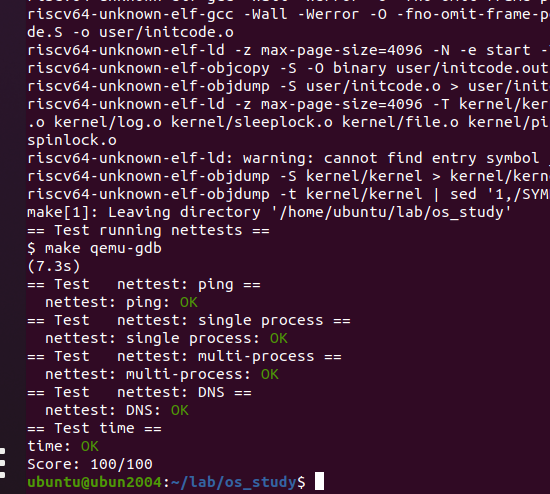

# Lab: networking

您将为网络接口卡（NIC）编写 xv6 设备驱动程序

## 背景

在写代码前，你会发现：重温xv6 book的“第五章：中断和设备驱动”是有帮助的。
你将用一个被称作E1000的网络设备来处理网络通信。
对xv6以及你写的驱动来说，E1000就像一个真正的硬件（连接到真实以太网本地局域网Ethernet Local Area Net）。
事实上，你的驱动将要通讯的E1000是由qemu仿真的，它连接到LAN上也是qemu仿真的。
在这个仿真的LAN上，xv6（the guest）有一个IP地址10.0.2.15。
qemu也安排一个IP为10.0.2.2、运行qemu的计算机出现在LAN中。
当xv6使用E1000发送一个包到10.0.2.2，qemu将包传递到对应计算机（正在运行qemu，the host）应用上。
你将使用qemu的“用户模式网络栈”（user-mode network stack）。

我们已经更新Makefile来启用qemu的用户模式网络栈，以及E1000网卡。
Makefile配置qemu记录所有输入、输出包到文件packets.cap到你的实验目录。
翻看这些记录，对于确认xv6正在传递、接收的包是你期望的，有帮助。展示记录的包：
tcpdump -XXnr packets.pcap
我们已经添加许多文件到这个实验的xv6仓库。
文件kernel/e1000.c包含E1000的初始化代码，以及传递、接收包的空函数（你需要填充）。

kernel/e1000_dev.h包含寄存器定义、E1000定义的标志位

kernel/net.c和kernel/net.h包含一个简单的网络栈（实现了IP/UDP/ARP协议）。
这些文件也包含灵活数据结构代码（承载有包），称作mbuf。
最终，kernel/pci.c包含代码：当xv6启动时，在PCI总线上查找E1000卡。

## 你的工作

你的工作是完成e1000_transmit()和e1000_recv()，都在kernel/e1000.c，以便于驱动可以传递、接收包。

当make grade提示你的方案通过所有测试时，就做对了。

### 浏览E1000软件开发手册

这个手册包含几个与以太网十分相关的控制器。
qemu模拟82540EM。
浏览第二章了解设备。
写驱动，你将需要熟悉第3、14章，以及4.1（并非4.1的子小节）。
你将也需要使用章节13作为参考。
其他章节包含了你的驱动无需交互的E1000组件。
开始不用担心细节；只是了解文档结构，以便于之后可以找到。
E1000有一些高级特性，绝大多数可以忽略。仅小部分基础特性需要用来完成本实验。
**e1000.c中提供给你的e1000_init()函数，配置E1000从RAM*读取将要被传递的包，写接收到的包到RAM。***
**这个技术称为DMA，直接内存访问，参考事实：E1000硬件直接从RAM写、读包。**
因为bursts of packets可能会比驱动处理速度快，e1000_init()给E1000提供多个buffers，E1000可以把包写到buffers。
E1000需要的这些buffers**被描述为RAM中的一组描述符；**
每个**描述符包含一个RAM中的地址，E1000可以把接收到的包写到其中。**
s**truct rx_desc描述 描述符 格式。**
**描述符数组被称为接收环或接受队列。**这是一个环形：卡或驱动到达数组底部时，它转到起始处。
**e1000_init()用mbufalloc()为E1000分配mbuf包buffers，用于DMA。**
**也有一个传递环，驱动把需要E1000发送的包放到里面。**
**e1000_init()配置两个环的尺寸为RX_RING_SIZE和TX_RING_SIZE。**
当net.c中的网络栈需**要发送一个包时，调用e1000_transmit()，用一个mbuf（持有要发送的包）。**
你的传递代码**必须放置一个指针（指向包数据）到TX（transmit）环。**
struct tx_desc描述 描述符格式。
你将需要确保每个mbuf最终被释放，仅在E1000结束传递包之后（E1000在描述符中设置E1000_TXD_STAT_DD位表示）。
当**E1000接收来自以太网的每个包时，它首先DMA包到mbuf（被下个RX ring 描述符指向），然后生成一个中断。**
**你的e1000_recv()代码必须扫描RX ring，并调用net_rx()传递每个新包的mbuf到网络栈（in net.c）。**
你将需要分配一个新mbuf，并放置它到描述符，因此当E1000再次到达RX环中该点时，它就会找到一个新的buffer，DMA一个新的包到该buffer。
除了读写RAM中的描述符环之外，你的驱动将需要与E1000内存映射控制寄存器交互，来检测何时接收到的数据包可用，并通知E1000：驱动已经用要发送的包填充到一些TX描述符。
**全局变量regs持有一个指针（指向E1000的第一个控制寄存器）；你的驱动可以通过像数组一样索引regs获取其他寄存器。**
你将需要特别使用索引E1000_RDT和E1000_TDT。
为了测试你的驱动，在一个窗口中执行make server，另外一个窗口执行make qemu，然后在xv6执行nettests。
nettests的首个测试尝试发送一个UDP包到host操作系统，发送到make server执行的程序。
如果你没有完成实验，E1000驱动将不会真正发送包，且什么也不会发生。
当你完成本实验之后，E1000驱动将发送包，qemu将传递它到你的host电脑，make server将看到它，它将发送一个响应包，然后到E1000驱动，然后nettests将看到响应包。
在host发送回复前，它发送一个ARP请求包给xv6来找到它的48位以太网地址，期望xv6对ARP做出响应。
一旦你已经完成E1000驱动的工作，kernel/net.c将处理这。
如果一切正常，nettests将打印testing ping: OK，make server将打印 a message from xv6！。
tcpdump -XXnr packets.pcap应该产生起始如下的输出：

## 提示

开始时，添加打印语句到e1000_transmit()和e1000_recv()，执行make server和nettests。
你该从你的打印语句中看到：nettests生成一个对e1000_transmit的调用。
一些实现e1000_transmit的提示：
（1）首先向E1000索要TX环索引，在该索引上期待下个包，通过读E1000_TDT控制寄存器。
（2）检测环是否溢出。如果E1000_TXD_STAT_DD没有设置在由E1000_TDT索引的描述符上，那么E1000没有结束之前的传递请求，因此返回一个错误。
（3）另外，使用mbuffree()来释放最后的mbuf（从那个描述符被传递）。
（4）填充描述符。m->head指向内存中包的内容，m->len为包的长度。设置必要的cmd标志位（看E1000手册中的section 3.3），暂存一个指针指向mbuf为了之后释放。
（5）最终，通过加1到E1000_TDT，对TX_RING_SIZE取模运算，更新环位置。
（6）如果e1000_transmit()成功地添加mbuf到环，返回0。失败（没有描述符可用于传递mbuf），返回-1，因此调用者知道释放该mbuf。
一些实现e1000_recv的提示：
（1）首先向E1000索要环索引，下个等待接收的包位于该索引，通过获取E1000_RDT控制寄存器的值，加1对RX_RING_SIZE取模。
（2）通过检查描述符中status部分的E1000_RXD_STAT_DD位，检查是否新包可用。如果不可用，停止。
（3）更新mbuf的m->len到描述符中的length。使用net_rx()传递mbuf到网络栈。
（4）使用mbufalloc()分配一个新mbuf来取代刚刚分配过的，分配给net_rx()。让它的数据指针（m->head）放到描述符。清除描述符的状态位为0。
（5）最终，更新E1000_RDT寄存器为环描述符最后处理的索引。
（6）e1000_init()用mbufs初始化RX环，你将需要了解他是如何做到这一点的，也许还需要借用代码。
（7）在一些点，已到达的包总数将超出环尺寸（16）；确保你的代码可用处理。
你将需要锁来处理这种可能：xv6可能不止一个进程使用E1000，也可能是：中断发生时正在内核线程中使用E1000。

***e1000_transmit是给了一个新的packet, 我们需要在ring里找到下一个空余位置, 然后把它放进去等待传输.***

***e1000_recv是需要遍历这个ring, 把所有新到来的packet交由网络上层的协议/应用去处理.***

**操作系统想要发送数据的时候，将数据放入环形缓冲区数组 tx_ring 内，然后递增 E1000_TDT，网卡会自动将数据发出。当网卡收到数据的时候，网卡首先使用 direct memory access，将数据放入 rx_ring 环形缓冲区数组中，然后向 CPU 发起一个硬件中断，CPU 在收到中断后，直接读取 rx_ring 中的数据即可。**

实验要求实现的两个函数一个对于网卡驱动发送数据, 一个对于驱动接收数据. 在驱动的数据结构中, 主要为发送和接收数据的两个循环队列. 其中每个队列实际上有分为描述符队列和缓冲区指针队列, 缓冲区队列依附于描述符队列, 同时有网卡寄存器记录着队列的首尾指针, 这种设计遵循传统的驱动设计方案, 首指针由硬件管理, 尾指针有软件管理, 二者通过队列满足并发的需要.

