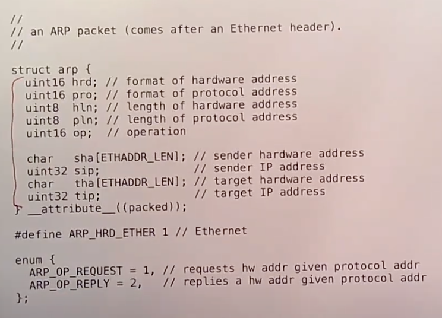

# lec

与最后一个lab，也就是**构建一个网卡驱动相关**。大概看一下操作系统中网络相关的软件会有什么样的结构。

网络连接了不同的主机，这里的连接有两种方式：

相近的主机连接在同一个网络中。这种直接连接的设备会在网络协议栈的底层被屏蔽掉。每个主机上会有不同的应用程序，或许其中一个主机有网络浏览器，另一个主机有HTTP server，它们需要通过这个局域网来相互通信。

路由器是组成互联网的核心，路由器之间的链路，最终将多个局域网连接在了一起。路由器之间的转发称为Routing。

从网络协议的角度来说，局域网通信由以太网协议决定。而局域网之上的长距离网络通信由Internet Protocol协议决定。以上就是网络的概述。

## 二层网络 --- Ethernet

当局域网中的两个主机彼此间要通信时，最底层的协议是以太网协议。你可以认为Host1通过以太网将Frame(帧)发送给Host2。Frame是以太网中用来描述packet的单词，本质上这就是两个主机在以太网上传输的一个个的数据Byte。

以太网协议会在Frame中放入足够的信息让主机能够识别彼此，并且识别这是不是发送给自己的Frame。每个以太网packet在最开始都有一个Header，其中包含了3个数据。Header之后才是payload数据。**Header中的3个数据是：目的以太网地址，源以太网地址，以及packet的类型。**

每一个以太网地址都是48bit的数字，这个数字唯一识别了一个网卡。packet的类型会告诉接收端的主机该如何处理这个packet。接收端主机侧更高层级的网络协议会按照packet的类型检查并处理以太网packet中的payload。

**整个以太网packet，包括了48bit+48bit的以太网地址，16bit的类型，以及任意长度的payload这些都是通过线路传输。**虽然对于软件来说是不可见的，但是在packet的开头还有被硬件识别的表明packet起始的数据（注，Preamble + SFD），在packet的结束位置还有几个bit表明packet的结束（注，FCS）。packet的开头和结束的标志不会被系统内核所看到，其他的部分会从网卡送到系统内核。

虽然以太网地址是唯一的，但是出了局域网，它们对于定位目的主机的位置是没有帮助的。如果网络通信的目的主机在同一个局域网，那么目的主机会监听发给自己的地址的packet。但是如果网络通信发生在两个国家的主机之间，你需要使用一个不同的寻址方法，这就是IP地址的作用。

在实际中，你可以使用tcpdump来查看以太网packet。这将会是lab的一部分。

tcpdump输出了很多信息，其中包括：

- 接收packet的时间
- 第一行的剩下部分是可读的packet的数据
- 接下来的3行是收到packet的16进制数

## 二/三层地址转换 --- ARP

在以太网层面，每个主机都有一个以太网地址。但是为了能在互联网上通信，你需要有32bit的IP地址。

发送方首先会在局域网中广播一个ARP packet，来表示任何拥有了这个32bit的IP地址的主机，请将你的48bit以太网地址返回过来。如果相应的主机存在并且开机了，它会向发送方发送一个ARP response packet。

它会出现在一个以太网packet的payload中。所以你们看到的将会是这样的结构：首先是以太网header，它包含了48bit的目的以太网地址，48bit的源以太网地址，16bit的类型；之后的以太网的payload会是ARP packet，包含了上图的内容。

接收到packet的主机通过查看以太网header中的16bit类型可以知道这是一个ARP packet。

在网络的lab中，XV6会在QEMU模拟的环境下发送IP packet。所以你们可以看到在XV6和其他主机之间有ARP的交互。下图中第一个packet是我的主机想要知道XV6主机的以太网地址，第二个packet是XV6在收到了第一个packet之后，并意识到自己是IP地址的拥有者，然后返回response。

tcpdump能够解析出ARP packet，并将数据打印在第一行。对应ARP packet的格式，在第一个packet中，10.0.2.2是SIP，10.0.2.15是DIP。在第二个packet中，52:54:00:12:34:56对应SHA。

同时，我们也可以自己分析packet的原始数据。对于第一个packet：

- 前14个字节是以太网header，包括了48bit目的以太网地址，48bit源以太网地址，16bit类型。
- 从后往前看，倒数4个字节是TIP，也就是发送方想要找出对应以太网地址的IP地址。每个字节对应了IP地址的一块，所以0a00 020f对应了IP地址10.0.2.15。
- 再向前数6个字节，是THA，也就是目的地的以太网地址，现在还不知道所以是全0。
- 再向前数4个字节是SIP，也就是发送方的IP地址，0a000202对应了IP地址10.0.2.2。
- 再向前数6个字节是SHA，也就是发送方的以太网地址。
- 剩下的8个字节表明了我们感兴趣的是以太网和IP地址格式。

第二个packet是第一个packet的响应。

## 三层网络 --- Internet

IP协议能帮助你向互联网上任意位置发送packet。下图是一个IP packet的header，你们可以在lab配套的代码中的net.h文件找到。

在一个packet发送到世界另一端的网络的过程中，IP header会被一直保留，而Ethernet header在离开本地的以太网之后会被剥离。

**关键的信息是三个部分，目的IP地址（ip_dst），源IP地址（ip_src）和协议（ip_p）。**

IP header的长度是20个字节，所以中括号内的是IP header，

从后向前看：

- 目的IP地址是0x0a000202，也就是10.0.2.2。
- 源IP地址是0x0a00020f，也就是10.0.2.15。
- 再向前有16bit的checksum，也就是0x3eae。IP相关的软件需要检查这个校验和，如果结果不匹配应该丢包。
- 再向前一个字节是protocol，0x11对应的是10进制17，表明了下一层协议是UDP
- 其他的就是我们不太关心的一些字段了，例如packet的长度。

IP header中的protocol字段告诉了目的主机的网络协议栈，这个packet应该被UDP软件处理。

## 四层网络 --- UDP

UDP header中最关键的两个字段是sport源端口和dport目的端口。

当你的应用程序需要发送或者接受packet，它会使用socket API，这包含了一系列的系统调用。一个进程可以使用socket API来表明应用程序对于特定目的端口的packet感兴趣。当应用程序调用这里的系统调用，操作系统会返回一个文件描述符。每当主机收到了一个目的端口匹配的packet，这个packet会出现在文件描述符中，之后应用程序就可以通过文件描述符读取packet。

## 网络协议栈（Network Stack）

假设我们现在在运行Linux或者XV6，我们有一些应用程序比如浏览器，DNS服务器。这些应用程序使用socket API打开了socket layer的文件描述符。Socket layer是内核中的一层软件，它会**维护一个表单来记录文件描述符和UDP/TCP端口号之间的关系。**同时它也会为每个socket维护一个队列用来存储接收到的packet。我们在networking lab中提供的代码模板包含了一个非常原始的socket layer。

**在socket layer之下是UDP和TCP协议层。**在TCP/UDP之下是IP层，IP层的软件通常很简单。虽然我不确定是在同一层还是下一层，与IP层在一起的还有ARP层。再往下的话，我们可以认为还会有一层以太网。

当一个packet从网络送达时，网卡会从网络中将packet接收住并传递给网卡驱动。网卡驱动会将packet向网络协议栈上层推送。在IP层，软件会检查并校验IP header，将其剥离，再把剩下的数据向上推送给UDP。UDP也会检查并校验UDP header，将其剥离，再把剩下的数据加入到socket layer中相应文件描述符对应的队列中。所以一个packet在被收到之后，会自底向上逐层解析并剥离header。当应用程序发送一个packet，会自顶向下逐层添加header，直到最底层packet再被传递给硬件网卡用来在网络中传输。所以内核中的网络软件通常都是被嵌套的协议所驱动。

**在整个处理流程中都会有packet buffer。**所以当收到了一个packet之后，它会被拷贝到一个packet buffer中，这个packet buffer会在网络协议栈中传递。通常在不同的协议层之间会有队列，比如在socket layer就有一个等待被应用程序处理的packet队列，这里的队列是一个linked-list。通常整个网络协议栈都会使用buffer分配器，buffer结构。在我们提供的networking lab代码中，buffer接口名叫MBUF。

## Ring Buffer

现在我们有了一张网卡，有了一个系统内核。当网卡收到了一个packet，它会生成一个中断。系统内核中处理中断的程序会被触发，并从网卡中获取packet。因为我们不想现在就处理这个packet，中断处理程序通常会将packet挂在一个队列中并返回，packet稍后再由别的程序处理。所以中断处理程序这里只做了非常少的工作，也就是将packet从网卡中读出来，然后放置到队列中。

之后，在一个独立的线程中，会有一个叫做IP processing thread的程序。它会读取内存中的packet队列，并决定如何处理每一个packet。其中一个可能是将packet向上传递给UDP，再向上传递给socket layer的某个队列中，最后等待某个应用程序来读取。通常来说，这里的向上传递实际上就是在同一个线程context下的函数调用。

另一种可能就是，这个主机实际上是个路由器，packet从一个网卡进来，经过路由需要从另一个网卡出去。如果IP process thread查看了packet的目的IP地址，并决定将packet从另一个网卡转发出去，它会将packet加入到针对发送网卡的发送队列中。

通常来说网卡会有发送中断程序，当网卡发送了一个packet，并且准备好处理更多packet的时候，会触发一个中断。所以网卡的发送中断也很重要。**在这个结构中，有一点非常重要，这里存在一些并发的组件，它们以不同的方式调度。中断处理程序由网卡的发送或者接受中断触发。**在一个处理器上，IP processing thread不能与中断处理程序同时运行，因为中断处理程序的优先级最高，不过在多核处理器上，并发度可能会更高。最后，应用程序要能够读取socket layer中的packet，应用程序又是另一个独立调度的组件。所有这些组件都会参与到CPU的调度中。

### **我想再讨论一下当packet送到网卡时，网卡会做什么操作？**

对于一个网卡的结构，会有一根线缆连接到外面的世界。网卡会检查线缆上的电信号，并将电信号转换成packet。网卡会接入到一个主机上，主机会带有网卡的驱动软件。我们需要将网卡解码出来的packet传递给主机的内存，这样软件才能解析packet。

**网卡内有许多内置的内存，当packet到达时，网卡会将packet存在自己的缓存中，并向主机发送中断，所以网卡内部会有一个队列。主机的驱动包含了一个循环，它会与网卡交互，并询问当前是否缓存了packet。如果是的话，主机的循环会逐字节的拷贝packet到主机的内存中，再将内存中的packet加到一个队列中。**

### E1000

讨论一下E1000网卡的结构，这是你们在实验中要使用的网卡。E1000网卡会监听网线上的电信号，但是当收到packet的时候，网卡内部并没有太多的缓存，所以网卡会直接将packet拷贝到主机的内存中，而内存中的packet会等待驱动来读取自己。所以，网卡需要事先知道它应该将packet拷贝到主机内存中的哪个位置。E1000是这样工作的，主机上的软件会格式化好一个DMA ring，ring里面存储的是packet指针。所以，DMA ring就是一个数组，里面的每一个元素都是指向packet的指针。

当位于主机的驱动初始化网卡的时候，它会分配一定数量，例如16个1500字节长度的packet buffer，然后再创建一个16个指针的数组。为什么叫ring呢？因为在这个数组中，如果用到了最后一个buffer，下一次又会使用第一个buffer。主机上的驱动软件会告诉网卡DMA ring在内存中的地址，这样网卡就可以将packet拷贝到内存中的对应位置。

当网卡收到packet时，网卡还会记住当前应该在DMA ring的哪个位置并通过DMA将packet传输过去。

传输完成之后，网卡会将内部的记录的指针指向DMA ring的下一个位置，这样就可以拷贝下一个packet。

刚才说的都是接收packet，对应的是RX ring。类似的，驱动还会设置好发送buffer，也就是TX ring。驱动会将需要网卡传输的packet存储在 TX ring中，网卡也需要知道TX ring的地址。

## Receive Livelock

如果处理每个packet要200微秒，那么我们期望看到的是不论负载多高，路由器至少每秒能处理5000个packet。所以我们期望看到的曲线在5000pps之后是一条水平线，路由器每秒处理5000个packet，并丢弃掉其他的packet。

际拥有的曲线会更加的糟糕，当收到的packets超过5000pps时，成功转发的packets随着收到的packet的增多反而趋向于0。

随着packet接收速率的增加，每个收到的packet都会生成一个中断，而这里的中断的代价非常高，因为中断涉及到CPU将一个packet从网卡拷贝到主机的内存中。如果我们知道packet将会以10K每秒的速率到达，并且我们知道我们不能处理这么多packet，那么我们可以期望的最好结果就是每秒转发5000个packet，并且丢弃5000个packet之外的其他packet。但是实际上，5000个packet之外的其他packet，每个都生成了一个昂贵的中断，收到的packet越多，生成的中断就越多。而中断有更高的优先级，所以每一个额外的packet都会消耗CPU时间，导致更少的CPU时间可以用来完成packet的转发。最后，100%的CPU时间都被消耗用来处理网卡的输入中断，CPU没有任何时间用来转发packet。

**由于调度的策略，输入中断的优先级更高，使得转发packet的任务可能分配不到任何CPU时间。**

## 如何解决Livelock

这种解决方法的最直接结果就是，当packet的输入速率达到了5000pps，随着输入速率的增加，转发性能维持在5000pps。

曲线后半部分的水平是一种完美的non-livelock性能曲线。之所以是水平的，是因为受CPU的限制，最多只能处理5000pps的转发。

在这个解决方案中，**还是存在处理packet的线程和中断处理程序**。当网卡第一次触发中断时，会导致中断处理函数的运行。但是中断处理函数并不会从网卡拷贝packet，相应的，它会唤醒处理packet的线程，并且关闭网卡的中断，这样接下来就收不到任何中断了。处理packet的线程会有一个循环，在循环中它会检查并从网卡拉取几个packet，论文中我记得是最多拉取5个packet，之后再处理这些packet。**所以现在处理packet的线程是从网卡读取packet，而不是从中断处理程序读取。** 

**如果网卡中没有等待处理的packet，那么处理线程会重新打开网卡中断，并进入sleep状态。**因为最后打开了中断，当下一个packet到达时，中断处理程序会唤醒处理packet线程，线程会从sleep状态苏醒并继续处理packet。

这里的处理方式实际上是将中断模式（Interrupt Scheme）转变成了轮询模式（Polling Scheme）。在高负载的情况下，中断会被关闭，并且CPU会一直运行这里的循环中，不断读取packet并处理packet。因为中断被关闭了，CPU用来运行主线程的时间不会被中断占据。在低负载的情况下，中断会被打开，在收到packet之后，线程会被中断处理程序直接唤醒。

在Livelock曲线的转折点之前，都是靠中断来处理的。在转折点之前，如果网卡收到了一个packet，处理线程会立即被唤醒并读出packet。但是在转折点之后，处理线程就一直在轮询模式而不是中断模式。在转折点之后，肯定会有丢包，因为现在输入速率和输出速率之间是有差异的，而这个差异间的packet都被丢弃了。

**Livelock发生的根本原因是我们浪费时间处理了一些最终会被丢弃的packet，这里的处理是徒劳。**

另一种发生Livelock的可能是，当负载增加时，我们可能会消耗100%的CPU时间在packet处理线程上，而留给应用程序的CPU时间为0，这时还是会发生Livelock。