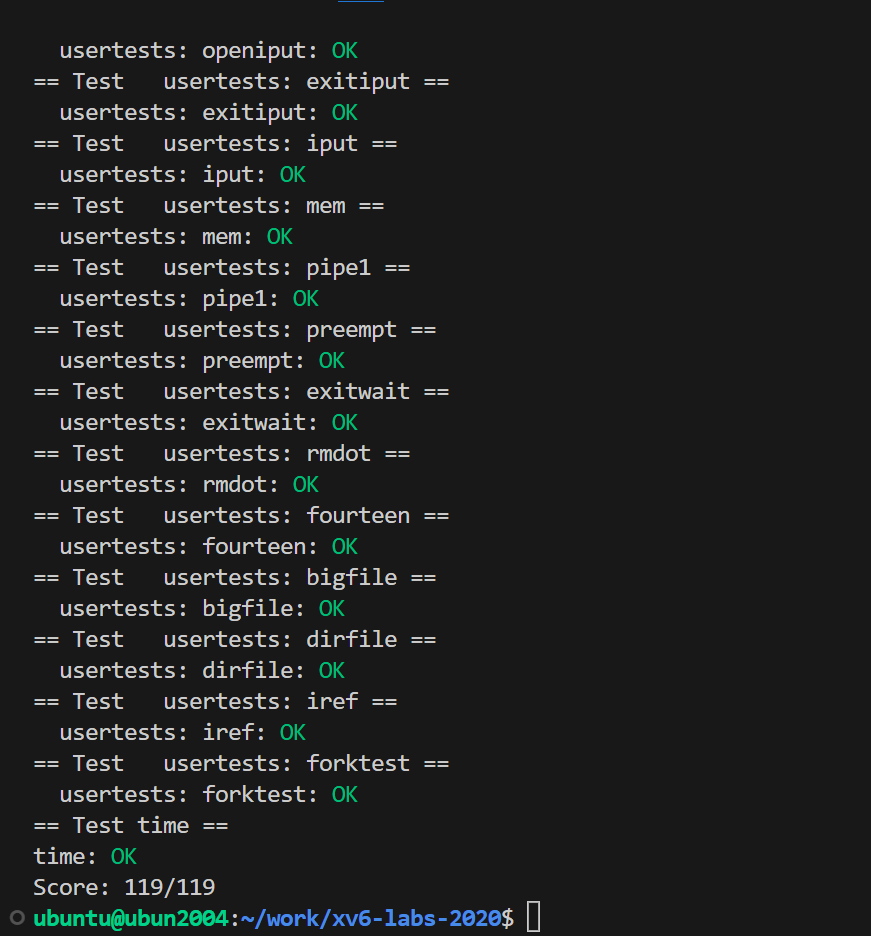

# Page faults 课程实验

[操作系统MIT6.S081：P6-＞Page faults](https://blog.csdn.net/InnerPeaceHQ/article/details/126125423?ydreferer=aHR0cHM6Ly9ibG9nLmNzZG4ubmV0L2lubmVycGVhY2VocS9jYXRlZ29yeV8xMTgxNDIxNC5odG1sP3lkcmVmZXJlcj1hSFIwY0hNNkx5OWliRzluTG1OelpHNHVibVYwTDBsdWJtVnlVR1ZoWTJWSVVTOWhjblJwWTJ4bEwyUmxkR0ZwYkhNdk1USTFPVE14TkRjeg%3D%3D)

今天的课程内容是page fault以及通过page fault实现的一系列虚拟内存功能，相关的功能如下：
①lazy allocation
②copy-on-write fork
③demand paging
④memory mapped files
----几乎所有操作系统(如Linux)都实现了这些功能，然而XV6中这些功能都没实现。在XV6中，一旦用户空间的进程触发了page fault，该进程就会被杀掉，这是非常保守的处理方式。
----这节课中，我们将会探讨发生page fault时可以做的一些有趣的事情。这节课对于代码的讲解会比较少，相应的在设计层面会有更多的内容，毕竟我们也没有代码可以讲解(因为XV6中没有实现)。
虚拟内存优点：**①Isolation(隔离性)**，**②level of indirection(提供了一层抽象)**

到目前为止，我们介绍的内存地址映射相对来说比较静态。不管是用户页表还是内核页表，都是在最开始的时候设置一次、在进程fork时设置一次，之后就不会再做任何变动。

## **page fault**

page fault可以让这里的地址映射关系变得动态起来。通过page fault，内核可以动态地改变映射来更新页表。现在可以动态地更新虚拟地址这一层抽象，结合页表和page fault，内核将会有巨大的灵活性。利用动态变更页表实现的有趣功能。但是在那之前，首先我们需要思考的是：**什么样的信息对于page fault是必须的？或者说，当发生page fault时，内核需要什么样的信息才能够响应page fault？**

1. **引起page fault的内存地址**

需要出错的虚拟地址(触发page fault的源)。一些相关的panic，当一个用户应用程序触发了page fault，page fault会使用trap机制将程序切换到内核运行，内核会打印出错的虚拟地址，并且这个地址会被保存在`stval`寄存器中。

2. **引起page fault的原因类型**

想要对不同场景的page fault有不同的响应。在`scause`(Supervisor cause寄存器，保存了trap机制中进入到supervisor mode的原因)寄存器的介绍中，有多个与page fault相关的原因。**所以第二个信息存在`scause`寄存器中，其中总共有3个类型的原因与page fault相关，分别是读、写和指令。**page fault和其他的异常使用与系统调用相同的trap机制来从用户空间切换到内核空间。**如果是因为page fault触发的trap机制而进入到内核空间，`stval`寄存器和`scause`寄存器都会有相应的值。**

3. **引起page fault时的程序计数器值**

第三个信息是触发page fault指令的虚拟地址。从上节课可以知道，作为trap处理代码的一部分，这个地址存放在sepc(Supervisor Exception Program Counter)寄存器中，同时会保存在trapframe->epc中。我们之所以关心触发page fault时的程序计数器值，是因为我们想在处理程序中修复页表，结束后回去继续运行那条因为page fault而中断的指令。
**总结：** 从硬件和XV6的角度来说，当出现了page fault，有3个对我们来说极其有价值的信息，分别是：
**①引起page fault的内存地址**
**②引起page fault的原因类型**
**③引起page fault时的程序计数器值，这表明了page fault在用户空间发生的位置**

## Lazy page allocation

### **sbrk系统调用**

sbrk是XV6提供的系统调用，它使得用户应用程序能扩大自己的堆区(heap)大小。当一个应用程序启动的时候，**sbrk指向的是堆的最底端，同时也是栈的最顶端。这个位置通过代表进程的数据结构中的`sz`字段表示，这里以`p->sz`表示。**

当调用sbrk时，它的参数是一个整数，代表了你想要申请的page数量(根据Linux man page，实际中sbrk的参数是字节数)。sbrk会扩展堆区的上边界，这意味着当sbrk实际发生或者被调用的时候，内核会分配一些物理内存，并将这些内存映射到用户应用程序的地址空间，然后将内存内容初始化为0，再返回sbrk系统调用。应用程序可以通过多次sbrk系统调用来增加它所需要的内存，应用程序还可以通过给sbrk传入负数作为参数来减少或者压缩它的地址空间。
**Lazy allocation**

通过使用虚拟内存和页面错误处理程序，可以完成延迟分配内存：

----sbrk系统调基本上不做任何事情，唯一需要做的事情就是将`p->sz`提升至`p->sz + n`，其中`n`是需要新分配的page数。

----但是内核在这个时间点并不会分配任何物理内存。之后当应用程序使用到了新申请的那部分内存时会触发page fault，因为我们还没有将新的内存映射到用户页表。

----当我们看到了一个page fault，相应的虚拟地址大于旧的p->sz，小于新的p->sz(旧的p->sz+n)，那么我们就知道这是一个来自于堆区的地址，但是内核还没有分配任何物理内存。所以对于这个page fault的响应也很明了：在page fault handler中，通过kalloc函数分配一个内存page；初始化这个page内容为0；将这个内存page映射到用户页表中；最后重新执行指令。

## Zero fill on demand

 在一个正常的操作系统中，如果执行exec，exec会申请地址空间，里面会存放text和data。因为BSS里面保存了未被初始化的全局变量，这里或许有许多个page，但是所有的page内容都为0。通常可以优化的地方是，我有如此多的内容全是0的page，在物理内存中我只需要分配一个page，这个page的内容全是0，然后将所有虚拟地址空间的全0的page都map到这一个物理page上。这样至少在程序启动的时候能节省大量的物理内存分配。(只读)

之后在某个时间点，应用程序尝试写BSS中的一个page时，比如说需要更改一两个变量的值，**我们会得到page fault。对于这个特定场景中的page fault，我们该做什么呢？**

在物理内存中**申请一个新的内存page，将其内容设置为0，**因为我们预期这个内存的内容为0。之后我们**需要更新这个page的mapping关系，首先PTE要设置成可读可写，然后将其指向新的物理page。**这里相当于更新了PTE，之后我们可以重新执行指令。

## Copy-on-write(COW) fork

当我们创建子进程时，与其创建分配并拷贝内容到新的物理内存，其实我们可以直接共享父进程的物理内存page。所以这里我们可以设置子进程的PTE指向父进程对应的物理内存page。一旦子进程想要修改这些内存的内容，相应的更新应该对父进程不可见，因为我们希望在父进程和子进程之间有强隔离性。**为了确保进程间的隔离性，我们可以将这里的父进程和子进程的PTE的标志位都设置成只读的。**

**当我们需要更改内存的内容时，我们会得到page fault。**因为现在在向一个只读的PTE写数据。

**page fault的处理：** 在得到page fault之后，我们需要拷贝相应的物理page。假设现在是子进程在执行store指令，那么我们**会分配一个新的物理内存page，然后将page fault相关的物理内存page拷贝到新分配的物理内存page中**，并将新分配的物理内存page映射到子进程的页表中。**新分配的物理内存page只对子进程的地址空间可见，所以我们可以将相应的PTE设置成可读写，并且我们可以重新执行store指令。**实际上，对于触发刚刚page fault的物理page，因为现在只对父进程可见，相应的PTE对于父进程也变成可读写的了。重新执行用户指令是指调用userret函数，也就是前面介绍的返回到用户空间的方法。

[此处有精彩问答](https://blog.csdn.net/InnerPeaceHQ/article/details/126125423?ydreferer=aHR0cHM6Ly9ibG9nLmNzZG4ubmV0L2lubmVycGVhY2VocS9jYXRlZ29yeV8xMTgxNDIxNC5odG1sP3lkcmVmZXJlcj1hSFIwY0hNNkx5OWliRzluTG1OelpHNHVibVYwTDBsdWJtVnlVR1ZoWTJWSVVTOWhjblJwWTJ4bEwyUmxkR0ZwYkhNdk1USTFPVE14TkRjeg%3D%3D)

当发生page fault时，我们其实是在向一个只读的地址执行写操作。**内核如何能分辨现在是一个copy-on-write fork的场景，而不是应用程序在向一个正常的只读地址写数据。**是不是说默认情况下，用户程序的PTE都是可读写的，除非在copy-on-write fork的场景下才可能出现只读的PTE？
内核必须要能够识别这是一个copy-on-write场景。几乎所有的page table硬件都支持了这一点。可以做的一件事情就是，将PTE标志位例如8位标识为当前是一个copy-on-write page。当内核在管理这些page table时，对于copy-on-write相关的page，内核可以设置相应的bit位，这样当发生page fault时，我们可以发现如果copy-on-write bit位设置了，我们就可以执行相应的操作了。

**现在释放内存page的依据是**在没有子进程的情况下释放。是的，我们需要对于每一个物理内存page的引用进行计数，当我们释放虚拟page时，我们将物理内存page的引用数减1。如果引用数等于0，那么我们就能释放物理内存page。

## Demand paging

对于exec，在虚拟地址空间中，我们为text和data分配好地址段，但是相应的PTE并不对应任何物理内存page。对于这些PTE，我们只需要将valid bit位设置为0即可。如果我们修改XV6使其按照上面的方式工作，应用程序是从地址0开始运行。而text区域从地址0开始向上增长，所以位于地址0的指令是会触发第一个page fault的指令，因为我们还没有真正的加载内存。
如何处理这里的page fault呢？首先我们可以发现，这些page是on-demand page。我们需要在某个地方记录了这些page对应的程序文件，我们在page fault handler中需要从程序文件中读取page数据，加载到内存中。之后将内存page映射到页表。最后再重新执行指令。
如果我们将要读取的文件它的text和data区域可能大于物理内存的容量。又或者多个应用程序按照demand paging的方式启动，它们二进制文件的和大于实际物理内存的容量。对于demand paging来说，假设内存已经耗尽了，这时如果得到了一个page fault，需要从文件系统拷贝中拷贝一些内容到内存中，但你又没有任何可用的物理内存page，该怎么办？
**一个选择是撤回page(evict page)。**

部分内存page中的内容写回到文件系统再撤回page。可以使用这个刚刚空闲出来的page分配给刚刚的page fault handler，再重新执行指令。

**关键问题是，什么样的page可以被撤回？并且该使用什么样的策略来撤回page？**

Least Recently Used的page应该被撤回。如果你想实现LRU，你需要找到一个在一定时间内没有被访问过的page，那么这个page可以被用来撤回。而被访问过的page不能被撤回。所以Access bit通常被用来实现这里的LRU策略。

## Memory mapped files

Memory mapped files的核心思想是将完整或者部分文件加载到内存中，这样就可以通过内存地址相关的load或者store指令来操纵文件。为了支持这个功能，一个现代的操作系统会提供一个叫做mmap的系统调用。这个系统调用会接收一个虚拟内存地址(VA)，长度(len)，protection，一些标志位，一个打开文件的文件描述符和偏移量(offset)。
----这里的语义就是，**从文件描述符对应的文件的偏移量的位置开始，映射长度为len的内容到虚拟内存地址VA，同时我们需要加上一些保护，比如只读或者读写。**

当完成操作之后，会有一个对应的unmap系统调用，参数是虚拟地址（VA），长度（len）。来表明应用程序已经完成了对文件的操作，在unmap时间点，我们需要将dirty block写回到文件中。我们可以很容易的找到哪些block是dirty的，因为它们在PTE中的dirty bit为1。

当然，**在任何聪明的内存管理机制中，所有的这些都是以lazy的方式实现。**不会立即将文件内容拷贝到内存中，而是先记录一下这个PTE属于这个文件描述符。相应的信息通常在VMA结构体中保存，VMA全称是Virtual Memory Area。例如对于这里的文件f，会有一个VMA，在VMA中我们会记录文件描述符、偏移量等，这些信息用来表示对应的内存虚拟地址的实际内容在哪，这样当我们得到一个位于VMA地址范围的page fault时，内核可以从磁盘中读数据，并加载到内存中。所以这里回答之前一个问题，dirty bit是很重要的，因为在unmap中你需要向文件回写dirty block。

## xv6 页面错误异常

xv6对异常的响应非常无聊：如果用户空间发生异常，内核会杀死出错的进程。如果内核中发生异常，内核会触发panic。

`fork`通过调用`uvmcopy`(kernel/vm.c:309)为子进程分配物理内存，从而使子进程拥有与父进程相同的内存内容。如果子进程和父进程可以共享父进程的物理内存，效率会更高。然而，一个简单的实现是行不通的，因为它会导致父子进程通过对共享栈和堆的写入来中断彼此的执行。

**RISC-V的三种page fault**

父进程和子进程可以使用由页面错误驱动的COW fork安全地共享物理内存。当CPU无法将虚拟地址转换为物理地址时，CPU会生成page fault异常。RISC-V有3种不同的page fault：

**加载页面错误(当加载指令无法翻译其虚拟地址时)**

**存储页面错误(当存储指令无法翻译其虚拟地址时)**

**指令页面错误(当指令的地址无法转换时)。**

**`scause`寄存器中的值指示页面错误的类型，而`stval`寄存器包含无法转换的地址。**

**COW fork**

---COW fork的基本策略是父子进程最初共享所有的物理页面，但将它们映射为只读。

因此，当子进程或父进程执行存储指令时，RISC-V CPU 会引发page fault异常。为响应此异常，内核复制包含错误地址的页面。它在子级的地址空间中映射一个权限为读/写的副本，在父级的地址空间中映射另一个权限为读/写的副本。更新页表后，内核在导致故障的指令处恢复故障进程的执行。由于内核已经更新了相关的PTE以允许写入，所以错误指令现在将正确地执行。
----这个COW策略对fork很有效，因为子进程经常在fork之后立即调用exec，用新的地址空间替换它的地址空间。在那种常见的情况下，子进程只会遇到较少的page fault，内核可以避免拷贝父进程内存完整的副本。此外，COW fork是透明的，无需对应用程序进行任何修改即可受益。

**lazy allocation**

当应用程序调用`sbrk`时，内核增加地址空间，但在页表中将新地址标记为无效。其次，在其中一个新地址出现页面错误时，内核分配物理内存并将其映射到页表中。

内核仅在应用程序实际使用它时才分配内存。与 COW fork 一样，内核可以对应用程序透明地实现此功能。

**从磁盘分页**

如果应用程序需要比可用物理RAM更多的内存，内核可以驱逐一些页面：将它们写入磁盘等存储设备并将它们的PTE标记为无效。如果应用程序读取或写入被逐出的页面，CPU将遇到page fault。然后内核可以检查故障地址。如果地址属于磁盘上的一个页面，则内核分配一个物理内存页面，将该页面从磁盘读取到该内存，将PTE更新为有效并引用该内存，然后恢复应用程序。

