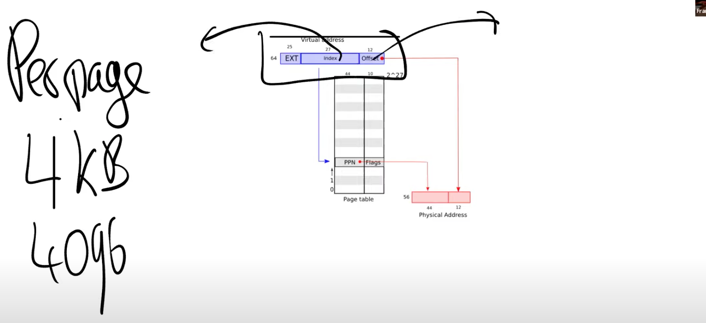
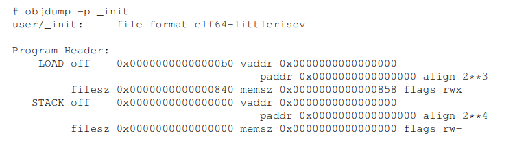
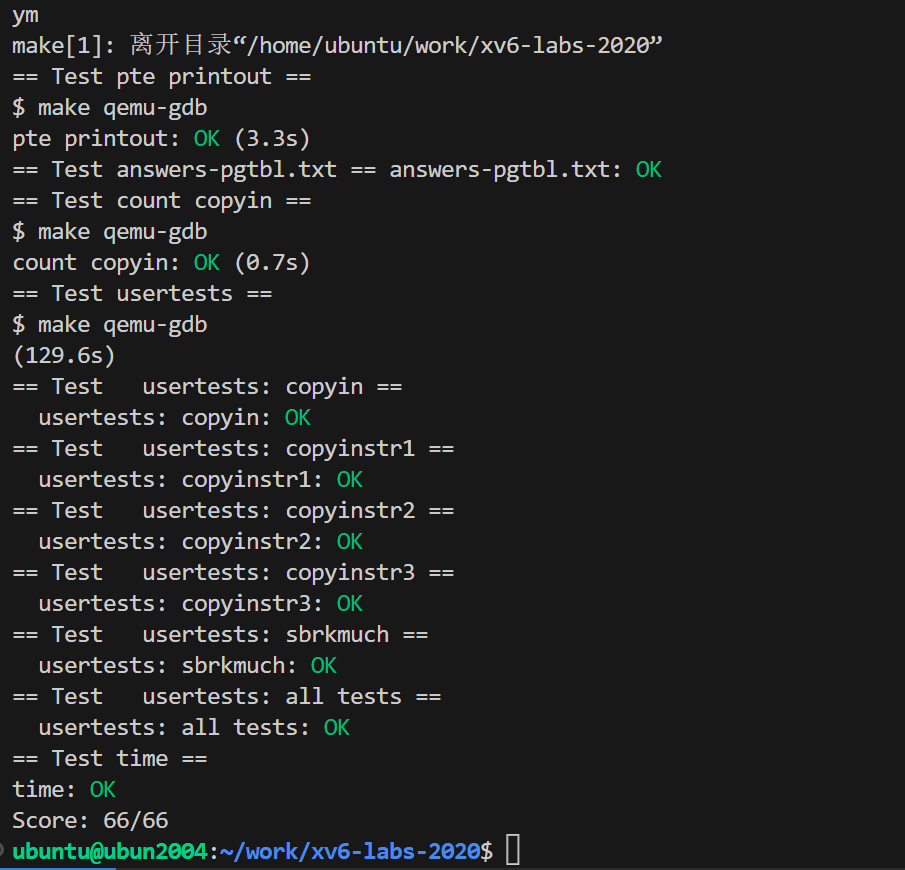

# [Lab pgtbl: Page tables](https://pdos.csail.mit.edu/6.S081/2020/labs/pgtbl.html)

可以只在一个CPU上运行QEMU（见最初的make参数）make CPUS=1 qemu-gdb

# 前置知识

存在某种形式的映射关系；并且映射关系对于实现隔离性来说有帮助。隔离性是我们讨论虚拟内存的主要原因。页表决定了内存地址 的含义，以及物理内存的哪些部分可以被访问。

## 讨论地址空间

给包括内核在内的所有程序专属的地址空间。所以，当我们运行cat时，它的地址空间从0到某个地址结束。当我们运行Shell时，它的地址也从0开始到某个地址结束。内核的地址空间也从0开始到某个地址结束。**现在我们的问题是如何在一个物理内存上，创建不同的地址空间，因为归根到底，我们使用的还是一堆存放了内存信息的DRAM芯片。**

页表是在硬件中通过处理器和内存管理单元（Memory Management Unit）实现。虚拟内存地址会被转到内存管理单元（MMU，Memory Management Unit），内存管理单元会将虚拟地址翻译成物理地址。之后这个物理地址会被用来索引物理内存，并从物理内存加载，或者向物理内存存储数据。**为了能够完成虚拟内存地址到物理内存地址的翻译，MMU会有一个表单，表单中，一边是虚拟内存地址，另一边是物理内存地址。**内存地址对应关系的表单也保存在内存中。所以CPU中需要有一些寄存器用来存放表单在物理内存中的地址。

**MMU并不会保存page table，它只会从内存中读取page table，然后完成翻译**

**这里的基本想法是每个应用程序都有自己独立的表单，并且这个表单定义了应用程序的地址空间。所以当操作系统将CPU从一个应用程序切换到另一个应用程序时，同时也需要切换SATP寄存器中的内容，从而指向新的进程保存在物理内存中的地址对应表单。**

## 介绍RISC-V中page table 如何工作

不要为每个地址创建一条表单条目，而是为每个page创建一条表单条目，所以每一次地址翻译都是针对一个page。RISC-V中，一个page是4KB，也就是4096Bytes。

内存地址的翻译方式略微的不同：

**首先对于虚拟内存地址，我们将它划分为两个部分，index和offset，index用来查找page，offset对应的是一个page中的哪个字节。**当MMU在做地址翻译的时候，通过读取虚拟内存地址中的index可以知道物理内存中的page号，这个page号对应了物理内存中的4096个字节。之后虚拟内存地址中的offset指向了page中的4096个字节中的某一个，假设offset是12，那么page中的第12个字节被使用了。将offset加上page的起始地址，就可以得到物理内存地址。

如果每个进程都有自己的page table，那么每个page table表会有多大呢？

page table最多会有2^27个条目（虚拟内存地址中的index长度为27），这是个非常大的数字。如果每个进程都使用这么大的page table，进程需要为page table消耗大量的内存，并且很快物理内存就会耗尽。。实际中，page table是一个多级的结构。

.png)

[一些有用的问答](https://mit-public-courses-cn-translatio.gitbook.io/mit6-s081/lec04-page-tables-frans/4.3-ye-biao-page-table)

## 页表缓存（Translation Lookaside Buffer）

当处理器第一次查找一个虚拟地址时，硬件通过3级page table得到最终的PPN，TLB会保存虚拟地址到物理地址的映射关系。这样下一次当你访问同一个虚拟地址时，处理器可以查看TLB，TLB会直接返回物理地址，而不需要通过page table得到结果。

## Kernel Page Table

当机器刚刚启动时，还没有可用的page，XV6操作系统会设置好内核使用的虚拟地址空间，也就是这张图左边的地址分布。

.png)

第一件事情是，有一些page在虚拟内存中的地址很靠后，比如kernel stack在虚拟内存中的地址就很靠后。这是因为在它之下有一个未被映射的Guard page，这个Guard page对应的PTE的Valid 标志位没有设置，这样，如果kernel stack耗尽了，它会溢出到Guard page，但是因为Guard page的PTE中Valid标志位未设置，会导致立即触发page fault，这样的结果好过内存越界之后造成的数据混乱。立即触发一个panic（也就是page fault），你就知道kernel stack出错了。同时我们也又不想浪费物理内存给Guard page，所以Guard page不会映射到任何物理内存，它只是占据了虚拟地址空间的一段靠后的地址。

**这是众多你可以通过page table实现的有意思的事情之一。你可以向同一个物理地址映射两个虚拟地址，你可以不将一个虚拟地址映射到物理地址。可以是一对一的映射，一对多映射，多对一映射。**

## xv6的页表

xv6 执行一些技巧：在几个地 址空间中映射同一内存(trampoline 页)，以及用一个未映射页来保护内核和用户的栈。指令操作的是虚拟地址，而物理内存使用物理地址做索引。

xv6 运行在 Sv39 RISC-V 上，这意味着只使用 64 位虚拟地址的底部 39 位，顶部 25  位未被使用。 页表在逻辑上是一个 2^27（134,217,728） 页表项（Page Table Entry, PTE）的数组。每个 PTE 包含一个 44 位的物理页号(Physical Page  Number，PPN)和一些标志位。**分页硬件通过利用 39 位中的高 27 位索引到页表中找到一 个 PTE 来转换一个虚拟地址，并计算出一个 56 位的物理地址，它的前 44 位来自于 PTE 中的 PPN，而它的后 12 位则是从原来的虚拟地址复制过来的。**

要告诉硬件使用页表，内核必须将根页表页的物理地址写入 satp 寄存器中。每个 CPU 都有自己的 satp 寄存器。这样不同的 CPU 可以运行不同的进程，每个进程 都有自己的页表所描述的私有地址空间。

### 内核地址空间

Xv6 为每个进程维护页表，一个是进程的用户地址空间，外加一个内核地址空间的单页 表。内核配置其地址空间的布局，使其能够通过可预测的虚拟地址访问物理内存和各种硬件 资 源 。

###  Code: creating an address space

核心数据结构 是 pagetable_t，它实际上是一个指向 RISC-V 根页表页的指针；pagetable_t 可以是内核页 表，也可以是进程的页表。核心函数是 walk 和 mappages，前者通过虚拟地址得到 PTE， 后者将虚拟地址映射到物理地址。以 kvm 开头的函数操作内核页表；以 uvm 开头的函数 操作用户页表；其他函数用于这两种页表。copyout 可以将内核数据复制到用户虚拟地址， copyin 可以将用户虚拟地址的数据复制到内核空间地址，用户虚拟地址由系统调用的参数 指定；它们在 vm.c 中，因为它们需要显式转换这些地址，以便找到相应的物理内存。

### 物理内存分配

内核必须在运行时为页表、用户内存、内核堆栈和管道缓冲区分配和释放物理内存。xv6 使用内核地址结束到 PHYSTOP 之间的物理内存进行运行时分配。它每次分配和释放整个 4096 字节的页面。它通过保存空闲页链表，来记录哪些页是空闲的。分配包括从链表中删 除一页；释放包括将释放的页面添加到空闲页链表中。

###  Code: Physical memory allocator

分配器在 kalloc.c(kernel/kalloc.c:1)中。分配器的数据结构是一个可供分配的物理内存 页的空闲页链表，每个空闲页的链表元素是一个结构体 run（kernel/kalloc.c:17）。分配器从 哪里获得内存来存放这个结构体呢？它把每个空闲页的 run 结构体存储在空闲页本身，因 为那里没有其他东西存储。链表和锁被 包裹在一个结构体中，以明确锁保护的是结构体中的字段。

Kinit 通过调用 freerange 来添加内存到空闲页链表，freerange 则对每一页都调用 kfree。**freerange 使用 PGROUNDUP 来确保它 只添加对齐的物理地址到空闲链表中。分配器开始时没有内存;这些对 kfree 的调用给了它 一些内存管理。**

**分配器有时把地址当作整数来处理，以便对其进行运算（如 freerange 遍历所有页）， 有时把地址当作指针来读写内存（如操作存储在每页中的 run 结构体）；这种对地址的双重 使用是分配器代码中充满 C 类型转换的主要原因。另一个原因是，释放和分配本质上改变 了内存的类型。**

 kfree 将页面预存入释放列表：它将 pa（物理地址）转为指向结构体 run 的指针，在 r->next 中记录空闲链表之前的节点，并将释放列表设为 r，kalloc 移除并返回 空闲链表中的第一个元素。

### 进程地址空间

每个进程都有一个单独的页表，当 xv6 在进程间切换时，也会改变页表。 一个进程的用户内存从虚拟地址 0 开始，可以增长到 MAXVA(kernel/riscv.h:348)，原则上允 许一个进程寻址 256GB 的内存。

**当一个进程要求 xv6 提供更多的用户内存时，xv6 首先使用 kalloc 来分配物理页，然后 将指向新物理页的 PTE 添加到进程的页表中。**

**。首先，不同的进程页表将用户地址转 化为物理内存的不同页，这样每个进程都有私有的用户内存。第二，每个进程都认为自己的 内存具有从零开始的连续的虚拟地址，而进程的物理内存可以是不连续的。第三，内核会映 射带有 trampoline 代码的页，该 trampoline 处于用户地址空间顶端，因此，在所有地址 空间中都会出现一页物理内存。**

**为了检测用户栈溢出分配的栈内存，xv6 会在 stack 的下方放置一个无效的保护页。如 果用户栈溢出，而进程试图使用栈下面的地址，硬件会因为该映射无效而产生一个页错误异 常。**

### Code: sbrk

①`sbrk`是进程缩小或增长其内存的系统调用。该系统调用由函数`growproc`(kernel/proc.c:239)实现。根据`n`是正数还是负数，`growproc`调用`uvmalloc`或`uvmdealloc`。
----`uvmalloc`(kernel/vm.c:229)使用`kalloc`分配物理内存，并使用`mappages`将PTE添加到用户页表中。
----`uvmdealloc`调用`uvmunmap`(kernel/vm.c:174)，它使用`walk`来查找对应的PTE，并使用`kfree`来释放PTE引用的物理内存。
②xv6使用进程的页表不仅告诉硬件如何映射用户虚拟地址，是明晰哪一个物理页面已经被分配给该进程的唯一记录。这就是释放用户内存(在`uvmunmap`中)需要检查用户页表的原因。

### **exec**

`exec`是创建地址空间的用户部分的系统调用。它使用一个存储在文件系统中的文件初始化地址空间的用户部分。`exec`(kernel/exec.c:13) 使用`namei`(kernel/exec.c:26)打开二进制`path`，这在第8章中有解释。然后，它读取ELF头。
**ELF文件格式**
xv6应用程序以广泛使用的ELF格式进行描述，定义在(kernel/elf.h)中。一个ELF二进制文件包含一个ELF头`struct elfhdr`(kernel/elf.h:6)、一系列程序节的头`struct proghdr`(kernel/elf.h:25)。每个`proghdr`描述了必须加载到内存中的应用程序节。xv6的程序只有一个程序节的头，但其他系统对于指令和数据部分可能有单独的头。
**工作流程：**
①第一步是快速检查该文件是否可能包含ELF二进制文件。ELF二进制文件以4字节的"magic number”：`0x7F`、`“E”`、`“L”`、`“F”`或`ELF_MAGIC`(kernel/elf.h:3)开头。如果ELF头有正确的magic number，则exec假定二进制文件格式正确。
②`exec`使用`proc_pagetable`(kernel/exec.c:38)分配一个没有用户映射的新页表，使用`uvmalloc`(kernel/exec.c:52)为每个ELF段分配内存，并使用`loadseg`(kernel/exec.c:10)将每个段加载进内存。`loadseg`使用`walkaddr`查找已分配内存的物理地址，在该物理地址处写入ELF段的每个page，并使用`readi`从文件中读取。
**程序节标题**
`/init`(使用`exec`创建的第一个用户程序)的程序节标题如下所示：

程序节头的`filesz`可能小于`memsz`，表明它们之间的间隙应该用0填充(对于C全局变量)而不是从文件中读取。对于`/init`，`filesz`是2112字节，`memsz`是2136字节，因此`uvmalloc`分配了足够的物理内存来容纳2136字节，但从文件`/init`中仅读取2112字节。
③现在`exec`分配并初始化用户栈。它只分配一个栈页。`exec`一次将参数中的一个字符串复制到栈顶，并将指向它们的指针记录在`ustack`中。它在传递给`main`的 `argv`列表的末尾放置一个空指针。`ustack`中的前三个条目是fake return program counter、`argc`和`argv`指针。
④`exec`在堆栈页面的下方放置一个不可访问的页面，因此尝试使用多个页面的程序会出错。这个不可访问的页面还允许exec处理过大的参数，在这种情况下，`exec`用于将参数复制到栈的`copyout`(kernel/vm.c:355)函数将注意到目标页面不可访问，并将返回-1。
⑤在准备新的内存图像的过程中，如果`exec`检测到像无效程序段这样的错误，它会跳转到标签`bad`，释放新的图像，并返回-1。`exec`必须等待系统调用将成功后再释放旧图像：如果旧图像消失，系统调用无法返回-1。`exec`中唯一的错误情况发生在创建图像期间。图像完成后，`exec`可以提交到新页表(kernel/exec.c:113)并释放旧页表(kernel/exec.c:117)。
**exec的风险：**
----`exec`将ELF文件中的字节加载到ELF文件指定地址的内存中。用户或进程可以将它们想要的任何地址放入ELF文件中。因此`exec`是有风险的，因为ELF文件中的地址可能会意外或故意引用内核。对一个设计不严谨的内核来说，后果可能是一次崩溃，甚至是内核的隔离机制被恶意破坏(即安全漏洞)。xv6执行了许多检查来避免这些风险。例如，`if(ph.vaddr + ph.memsz < ph.vaddr)`检查总和是否溢出64位整数。危险在于用户可能会构造一个ELF二进制文件，其中的`ph.vaddr`指向用户选择的地址，并且`ph.memsz`足够大以至于总和溢出到0x1000，这看起来像是一个有效值。在旧版本的xv6中，用户地址空间也包含内核(但在用户模式下不可读写)，用户可以选择与内核内存对应的地址，从而将数据从ELF二进制文件中复制到内核中。在xv6的RISC-V版本中，这不会发生，因为内核有自己的单独页表。`loadeg`加载到进程的页表中，而不是内核的页表中。
----内核开发人员很容易忽略关键检查，而现实世界的内核长期以来一直缺少检查，用户程序可以利用这些缺陷来获取内核权限。xv6很可能无法完整地验证提供给内核的用户级数据，恶意用户程序可能会利用这些数据来绕过xv6的隔离。

## 实验

在本实验室中，您将探索页表并对其进行修改，以简化从用户空间向内核空间复制数据的功能。

开始编码前，请阅读 xv6 一书的第 3 章及相关文件：

kern/`memlayout.h`，用于捕捉内存布局。
kern/vm.c，包含大部分虚拟内存（VM）代码。
kernel/kalloc.c，包含分配和释放物理内存的代码。

### A kernel page table per process 

xv6 原本的设计是，用户进程在用户态使用各自的用户态页表，但是一旦进入内核态（例如使用了系统调用），则切换到内核页表（通过修改 satp 寄存器，trampoline.S）。然而这个内核页表是全局共享的，也就是全部进程进入内核态都共用同一个内核态页表：

本 Lab 目标是让每一个进程进入内核态后，都能有自己的独立**内核页表**，为第三个实验做准备。

### 实验描述

### 实验背景

xv6有一个独立的内核页表，每当在内核中执行操作时都会使用它。内核页表直接映射到物理地址，因此内核虚拟地址 x 直接映射到物理地址 x。xv6为每个进程的用户地址空间提供了一个单独的页表，仅包含该进程的用户内存的映射，从虚拟地址0开始。因为内核页表不包含这些映射，所以用户地址在内核中是无效的。因此，当内核需要使用通过系统调用传递的用户指针(例如，传递给write()的缓冲区指针)时，内核必须首先将指针转换为物理地址。本节和下一节的目标是允许内核直接使用用户指针。

### 实验目的

①你的第一项工作是修改内核，以便每个进程在内核中执行时都使用自己的内核页表副本。
②修改struct proc为每个进程维护一个内核页表，并修改调度器使其在切换进程时切换内核页表。对于这一步，每个进程的内核页表应该与现有的全局内核页表相同。
③如果usertests运行正确，你就通过了这部分的实验。
注：阅读本实验开始时提到的参考手册中对应的章节和代码。了解虚拟内存代码的工作原理后，将更容易正确地修改虚拟内存代码。页表设置中的错误可能会由于缺少映射而导致陷阱、可能导致加载和存储影响物理内存的意外页面、可能导致从错误的内存页面执行指令。

### 实验提示

①为进程添加一个代表内核页表的字段到struct proc。
②为一个新的进程生成内核页表的合理方法是实现kvminit的修改版本，该修改版本生成新页表，而不是修改kernel_pagetable。你需要从allocproc调用此函数。
③确保每个进程的内核页表都有该进程的内核栈的映射。在未修改的xv6中，所有内核栈都在procinit中设置。你需要将部分或全部功能移至allocproc。
④修改scheduler()以便将进程的内核页表加载到内核的satp寄存器中(请参阅kvminithart以获得灵感)。在调用w_satp()之后不要忘记调用sfence_vma()。
⑤scheduler()应该在没有进程运行时使用kernel_pagetable。
⑥在freeproc中释放进程的内核页表。

需要注意的是： 释放页表的第一步是先释放页表内的内核栈，因为页表内存储的内核栈地址本身就是一个虚拟地址，需要先将这个地址指向的物理地址进行释放。然后是释放页表，直接遍历所有的页表，释放所有有效的页表项即可，这个功能可以仿照freewalk函数。由于freewalk函数将对应的物理地址也直接释放了，我们这里释放的进程的内核页表仅仅只是用户进程的一个备份，释放时仅释放页表的映射关系即可，不能将真实的物理地址也释放了。因此不能直接调用freewalk函数，而是需要进行更改，我们创建一个针对释放进程内核页表的版本proc_freekernelpagetable。
⑦你将需要一种方法来释放页表，而无需同时释放叶物理内存页面。
⑧vmprint在调试页表时可能会派上用场。
⑨修改xv6的函数或添加新的函数都可以。你可能至少需要在kernel/vm.c和kernel/proc.c中执行此操作。(但是，不要修改kernel/vmcopyin.c、kernel/stats.c、user/usertests.c和user/stats.c。）
⑩缺少页表映射可能会导致内核遇到页面错误。它将打印一个包含sepc=0x00000000XXXXXXXX的错误。你可以通过在kernel/kernel.asm中搜索XXXXXXXX来找出故障发生的位置。

### Simplify `copyin/copyinstr` ([hard](https://pdos.csail.mit.edu/6.S081/2020/labs/guidance.html))

在上一个实验中，已经使得每一个进程都拥有独立的内核态页表了，这个实验的目标是，**在进程的内核态页表中维护一个用户态页表映射的副本**，这样使得内核态也可以对用户态传进来的指针（逻辑地址）进行解引用。这样做相比原来 copyin 的实现的优势是，原来的 copyin 是通过软件模拟访问页表的过程获取物理地址的，而在内核页表内维护映射副本的话，可以利用 CPU 的硬件寻址功能进行寻址，效率更高并且可以受快表加速。

要实现这样的效果，我们需要在每一处内核对用户页表进行修改的时候，将同样的修改也同步应用在进程的内核页表上，使得两个页表的程序段（0 到 PLIC 段）地址空间的映射同步。

### 实验目的

内核的copyin函数读取用户指针指向的内存。copyin通过将这些指针转换为物理地址来实现这一点，内核可以直接取消引用。它通过在软件中遍历进程页表来执行此转换。你在这部分实验中的工作是**将用户映射添加到每个进程的内核页表(在上一节中创建)，从而允许copyin(和相关的字符串函数copyinstr)直接取消引用用户指针。**

测试条件

将kernel/vm.c中的copyin主体替换为对copyin_new的调用(在kernel/vmcopyin.c中定义)。对copyinstr和copyinstr_new执行相同的操作。**将用户地址的映射添加到每个进程的内核页表，以便copyin_new和copyinstr_new工作。**如果usertests运行正确并且所有的make Grade测试都通过了，那么你就通过了这个实验。
注：该方案依赖于用户虚拟地址范围，不与内核用于其自己的指令和数据的虚拟地址范围重叠。xv6使用从零开始的虚拟地址作为用户地址空间，幸运的是内核的内存从更高的地址开始。但是，这种方案确实将用户进程的最大大小限制为小于内核的最低虚拟地址。内核启动后，该地址是xv6中的0xC000000，即PLIC寄存器的地址。参见kernel/vm.c、kernel/memlayout.h中的kvminit()以及文中的图3-4。你需要修改xv6以防止用户进程变得大于PLIC地址。

实验提示

①先用对copyin_new的调用替换copyin()，然后让它工作，然后再转到copyinstr。
②**在内核更改进程的用户映射的每一点，都以相同的方式更改进程的内核页表。 这些点包括fork()、exec()和sbrk()。（因为将用户地址的映射添加到了每个进程的用户页表了，即将进程的用户页表的映射关系复制一份到进程的内核页表中。）**

**根据实验提示②，`fork`、`exec`和`growproc`(`sbrk`通过`growproc`完成内存伸缩)会改变进程的用户页表，需要加上随之改变进程的内核页表的功能，即将进程的用户页表的映射关系复制一份到进程的内核页表中。**

③不要忘记在userinit的内核页表中包含第一个进程的用户页表。
④用户地址的PTE在进程的内核页表中需要什么权限？(在内核模式下无法访问设置了PTE_U的页面)
⑤不要忘记上述PLIC限制。

实际应用

Linux使用与你实现的技术类似的技术。直到几年前，许多内核在用户和内核空间中使用相同的每进程页表，并为用户和内核地址提供映射，以避免在用户和内核空间之间切换时切换页表。但是，该设置允许诸如Meltdown和Spectre之类的侧信道攻击。

实验思考

解释为什么第三个测试srcva + len < srcva在copyin_new()中是必需的：给出前两个测试失败的srcva和len值(即它们不会导致返回 -1)但第三个测试为真(导致返回-1)。

