# Sleep and wake up

## 线程切换过程中锁的限制

在XV6中，任何时候调用switch函数都会从一个线程切换到另一个线程，通常是在用户进程的内核线程和调度器线程之间切换。在调用switch函数之前，总是会先获取线程对应的用户进程的锁。

**所以过程是这样，一个进程先获取自己的锁，然后调用switch函数切换到调度器线程，调度器线程再释放进程锁。**

实际上的代码顺序更像这样：

1. 一个进程出于某种原因想要进入休眠状态，比如说出让CPU或者等待数据，它会先获取自己的锁；
2. 之后进程将自己的状态从RUNNING设置为RUNNABLE；
3. 之后进程调用switch函数，其实是调用sched函数在sched函数中再调用的switch函数；
4. switch函数将当前的线程切换到调度器线程；
5. 调度器线程之前也调用了switch函数，现在恢复执行会从自己的switch函数返回；
6. 返回之后，调度器线程会释放刚刚出让了CPU的进程的锁

在第1步中获取进程的锁的原因是，这样可以阻止其他CPU核的调度器线程在当前进程完成切换前，发现进程是RUNNABLE的状态并尝试运行它。**为什么要阻止呢？因为其他每一个CPU核都有一个调度器线程在遍历进程表单，如果没有在进程切换的最开始就获取进程的锁的话，其他CPU核就有可能在当前进程还在运行时，认为该进程是RUNNABLE并运行它。而两个CPU核使用同一个栈运行同一个线程会使得系统立即崩溃。**

所以，**在进程切换的最开始，进程先获取自己的锁，并且直到调用switch函数时也不释放锁。**而另一个线程，也就是调度器线程会在进程的线程完全停止使用自己的栈之后，再释放进程的锁。释放锁之后，就可以由其他的CPU核再来运行进程的线程，因为这些线程现在已经不在运行了。

在线程切换的过程中，还有一点我之前没有提过。**XV6中，不允许进程在执行switch函数的过程中，持有任何其他的锁。**所以，进程在调用switch函数的过程中，必须要持有p->lock（注，也就是进程对应的proc结构体中的锁），但是同时又不能持有任何其他的锁。**我们在XV6中禁止在调用switch时持有除进程自身锁（注，也就是p->lock）以外的其他锁。**

之前的课程中我们讲过acquire函数在等待锁之前会关闭中断，否则的话可能会引起死锁（注，详见10.8），所以我们不能在等待锁的时候处理中断。

**在XV6中，死锁是通过禁止在线程切换的时候加锁来避免的。**

## Sleep&Wakeup 接口

当你在写一个线程的代码时，有些场景需要等待一些特定的事件，或者不同的线程之间需要交互。

Coordination是帮助我们解决这些问题并帮助我们实现这些需求的工具。Coordination是非常基础的工具，就像锁一样，在实现线程代码时它会一直出现。

一种非常直观的方法是通过循环实现busy-wait。另一方面，我们就不想在这一直循环并且浪费本可以用来完成其他任务的CPU时间。这时我们想要通过类似switch函数调用的方式出让CPU，并在我们关心的事件发生时重新获取CPU。

**Coordination就是有关出让CPU，直到等待的事件发生再恢复执行。XV6使用的是Sleep&Wakeup这种方式。**

看一下XV6的代码，重写了UART的驱动代码，XV6通过这里的驱动代码从console中读写字符。

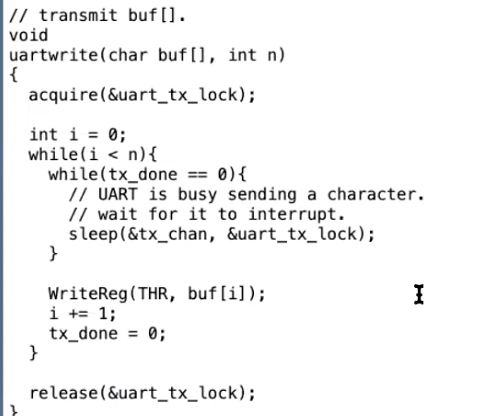

UART硬件一次只能接受一个字符的传输，而通常来说会有很多字符需要写到UART硬件。你可以向UART硬件写入一个字符，并等待UART硬件说：好的我完成了传输上一个字符并且准备好了传输下一个字符，之后驱动程序才可以写入下一个字符。UART硬件会在完成传输一个字符后，触发一个中断。所以UART驱动中除了uartwrite函数外，还有名为uartintr的中断处理程序。这个中断处理程序会在UART硬件触发中断时由trap.c代码调用。

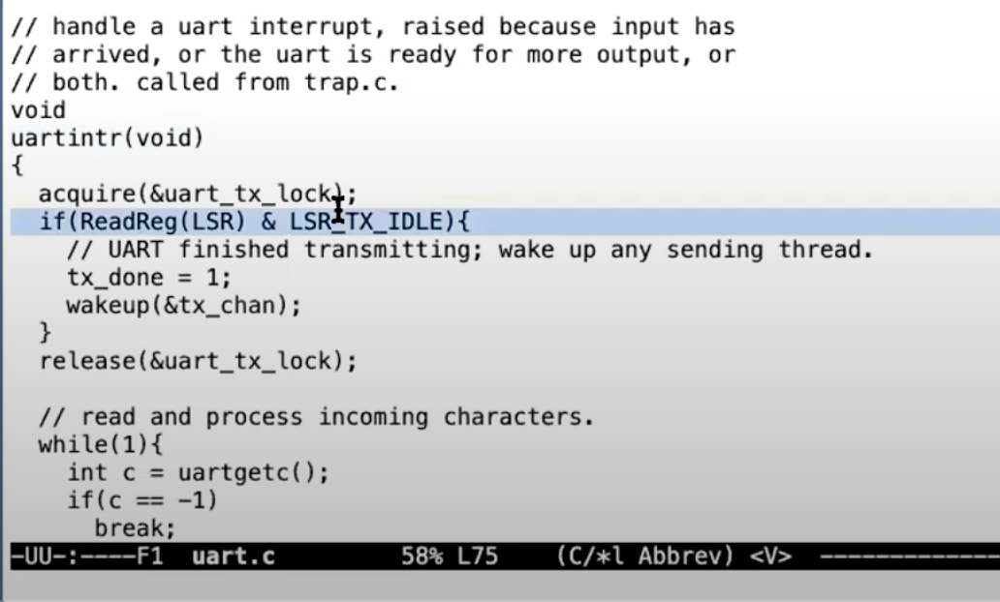

中断处理程序会在最开始读取UART对应的memory mapped register，并检查其中表明传输完成的相应的标志位，也就是LSR_TX_IDLE标志位。如果这个标志位为1，代码会将tx_done设置为1，并调用wakeup函数。这个函数会使得uartwrite中的sleep函数恢复执行，并尝试发送一个新的字符。

***所以这里的机制是，如果一个线程需要等待某些事件，比如说等待UART硬件愿意接收一个新的字符，线程调用sleep函数并等待一个特定的条件。当特定的条件满足时，代码会调用wakeup函数。***这里的sleep函数和wakeup函数是成对出现的。

sleep函数的具体实现，它会做很多事情最后再调用switch函数来出让CPU。有件事情需要注意，**sleep和wakeup函数需要通过某种方式链接到一起。** ***也就是说，如果我们调用wakeup函数，我们只想唤醒正在等待刚刚发生的特定事件的线程。***所以，sleep函数和wakeup函数都带有一个叫做sleep channel的参数。**我们在调用wakeup的时候，需要传入与调用sleep函数相同的sleep channel。**

不过sleep和wakeup函数只是接收表示了sleep channel的64bit数值，它们并不关心这个数值代表什么。当我们调用sleep函数时，我们通过一个sleep channel表明我们等待的特定事件，当调用wakeup时我们希望能传入相同的数值来表明想唤醒哪个线程。

对于sleep函数，有一个有趣的参数，我们需要将一个锁作为第二个参数传入，一个更简单的不带锁作为参数的sleep函数，会有什么样的结果。这里的结果就是**lost wakeup。**

## Lost wakeup

假设sleep只是接收任意的sleep channel作为唯一的参数。它其实不能正常工作，我们称这个sleep实现为broken_sleep。你可以想象一个sleep函数内会将进程的状态设置为SLEEPING，表明当前进程不想再运行，而是正在等待一个特定的事件。

sleep函数中还会做很多其他操作。我们需要记录特定的sleep channel值，这样之后的wakeup函数才能发现是当前进程正在等待wakeup对应的事件。最后再调用switch函数出让CPU。

之后是wakeup函数。我们希望唤醒所有正在等待特定sleep channel的线程。所以wakeup函数中会查询进程表单中的所有进程，如果进程的状态是SLEEPING并且进程对应的channel是当前wakeup的参数，那么将进程的状态设置为RUNNABLE。

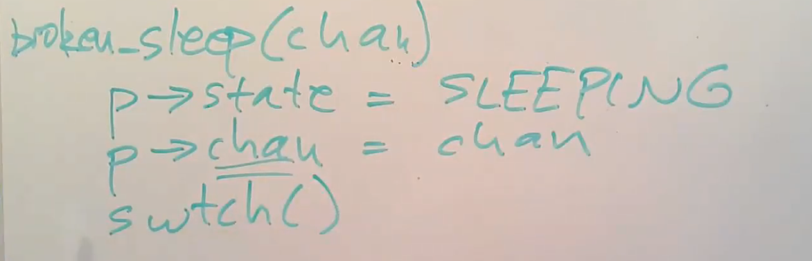

使用刚刚介绍的稍微简单的接口。

首先是定义done标志位。

之后是定义uartwrite函数。在函数中，对于buffer内的每一个字符，检查done标志位，如果标志位为0，就调用sleep函数并传入tx_channel。之后将字符传递给UART并将done设置为0。

之后是中断处理函数uartintr。函数中首先将done标志位设置为1，并调用wakeup。

这里uartwrite和uartintr两个函数需要使用锁来协调工作。

1. 第一个原因是done标志位，任何时候我们有了共享的数据，我们需要为这个数据加上锁。

2. 另一个原因是两个函数都需要访问UART硬件，通常来说让两个线程并发的访问memory mapped register是错误的行为。

所以我们需要在两个函数中加锁来避免对于done标志位和硬件的竞争访问。***我们该在哪个位置加锁？***在中断处理程序中较为简单，我们在最开始加锁，在最后解锁

难的是如何在uartwrite函数中加锁。一种可能是，每次发送一个字符的过程中持有锁，所以在每一次遍历buffer的起始和结束位置加锁和解锁。

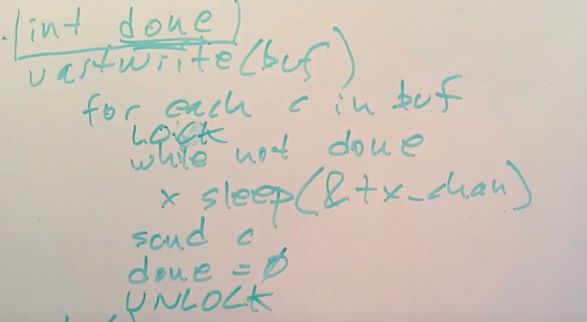

为什么这样肯定不能工作？一个原因是，我们能从while not done的循环退出的唯一可能是中断处理程序将done设置为1。但是如果我们为整个代码段都加锁的话，中断处理程序就不能获取锁了，中断程序会不停“自旋”并等待锁释放。而锁被uartwrite持有，在done设置为1之前不会释放。而done只有在中断处理程序获取锁之后才可能设置为1。所以我们不能在发送每个字符的整个处理流程都加锁。

上面加锁方式的问题是，***uartwrite在期望中断处理程序执行的同时又持有了锁。而我们唯一期望中断处理程序执行的位置就是sleep函数执行期间，其他的时候uartwrite持有锁是没有问题的。***

所以另一种实现可能是，在传输字符的最开始获取锁，因为我们需要保护共享变量done，但是在调用sleep函数之前释放锁。这样中断处理程序就有可能运行并且设置done标志位为1。之后在sleep函数返回时，再次获取锁。

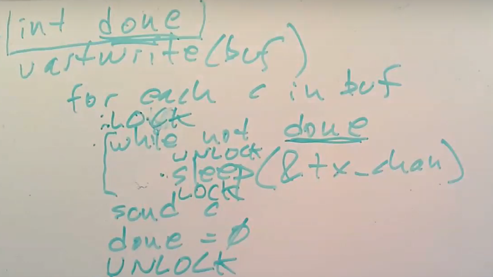

接下来，我们会探索为什么只接收一个参数的broken_sleep在这不能工作。为了让锁能正常工作，我们需要在调用broken_sleep函数之前释放uart_tx_lock，并在broken_sleep返回时重新获取锁。broken_sleep内的代码与之前在白板上演示的是一样的。也就是首先将进程状态设置为SLEEPING，并且保存tx_chan到进程结构体中，最后调用switch函数。

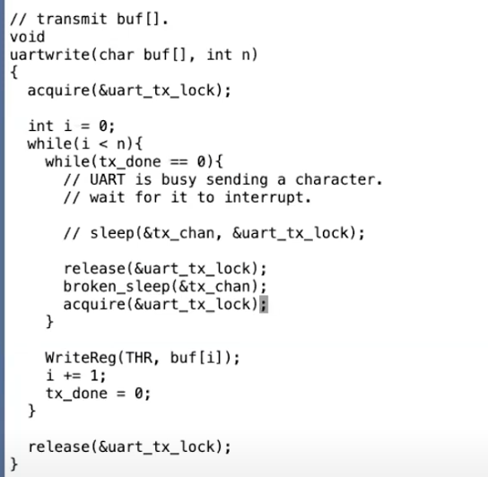

**sleep之前释放了锁，但是在释放锁和broken_sleep之间可能会发生中断。**

### （仔细阅读）

**一旦释放了锁，当前CPU的中断会被重新打开。因为这是一个多核机器，所以中断可能发生在任意一个CPU核。在上面代码标记的位置，其他CPU核上正在执行UART的中断处理程序，并且正在acquire函数中等待当前锁释放。所以一旦锁被释放了，另一个CPU核就会获取锁，并发现UART硬件完成了发送上一个字符，之后会设置tx_done为1，最后再调用wakeup函数，并传入tx_chan。目前为止一切都还好，除了一点：现在写线程还在执行并位于release和broken_sleep之间，也就是写线程还没有进入SLEEPING状态，所以中断处理程序中的wakeup并没有唤醒任何进程，因为还没有任何进程在tx_chan上睡眠。之后写线程会继续运行，调用broken_sleep，将进程状态设置为SLEEPING，保存sleep channel。但是中断已经发生了，wakeup也已经被调用了。所以这次的broken_sleep，没有人会唤醒它，因为wakeup已经发生过了。这就是lost wakeup问题。**

**tx_done标志位的作用是什么？**

这是一种简单的在uartintr和uartwrite函数之间通信的方法。tx_done标志位为1表示已经完成了对于前一个字符的传输，并且uartwrite可以传输下一个字符，所以这是用来在中断处理程序和uartwrite之间通信的标志位。

**当从sleep函数中唤醒时，不是已经知道是来自UART的中断处理程序调用wakeup的结果吗？这样的话tx_done有些多余。**

我想你的问题也可以描述为：为什么需要通过一个循环while(tx_done == 0)来调用sleep函数？

这个问题的答案适用于一个更通用的场景：实际中不太可能将sleep和wakeup精确匹配

并不是说sleep函数返回了，你等待的事件就一定会发生。举个例子，假设我们有两个进程同时想写UART，它们都在uartwrite函数中。可能发生这种场景，当一个进程写完一个字符之后，会进入SLEEPING状态并释放锁，而另一个进程可以在这时进入到循环并等待UART空闲下来。之后两个进程都进入到SLEEPING状态，当发生中断时UART可以再次接收一个字符，两个进程都会被唤醒，但是只有一个进程应该写入字符，所以我们才需要在sleep外面包一层while循环。实际上，你可以在XV6中的每一个sleep函数调用都被一个while循环包着。因为事实是，你或许被唤醒了，但是其他人将你等待的事件拿走了，所以你还得继续sleep。这种现象还挺普遍的。

## 如何避免Lost wakeup

通过消除下面的窗口时间来实现。

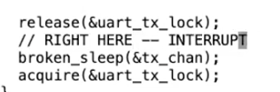

首先我们必须要释放uart_tx_lock锁，因为中断需要获取这个锁，但是我们又**不能在释放锁和进程将自己标记为SLEEPING之间留有窗口。**这样中断处理程序中的wakeup才能看到SLEEPING状态的进程，并将其唤醒，进而我们才可以避免lost wakeup的问题。所以，我们应该消除这里的窗口。

为了实现这个目的，我们需要将sleep函数设计的稍微复杂点。即使sleep函数不需要知道你在等待什么事件，它还是需要你知道你在等待什么数据，并且传入一个用来保护你在等待数据的锁。sleep函数需要特定的条件才能执行，而sleep自己又不需要知道这个条件是什么。在我们的例子中，sleep函数执行的特定条件是tx_done等于1。虽然sleep不需要知道tx_done，但是它需要知道保护这个条件的锁，也就是这里的uart_tx_lock。在调用sleep的时候，锁还被当前线程持有，之后这个锁被传递给了sleep。

在接口层面，sleep承诺可以原子性的将进程设置成SLEEPING状态，同时释放锁。这样**wakeup就不可能看到这样的场景：锁被释放了但是进程还没有进入到SLEEPING状态**。所以sleep这里将**释放锁和设置进程为SLEEPING状态这两个行为合并为一个原子操作。**

所以我们需要有一个锁来保护sleep的条件，并且这个锁需要传递给sleep作为参数。更进一步的是，当调用wakeup时，锁必须被持有。如果程序员想要写出正确的代码，都必须遵守这些规则来使用sleep和wakeup。

**sleep和wakeup如何使用这一小块额外的信息（注，也就是传入给sleep函数的锁）和刚刚提到的规则，来避免lost wakeup。**

首先我们来看一下proc.c中的wakeup函数。

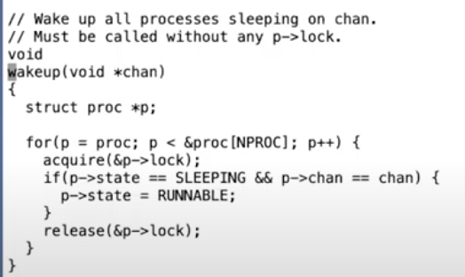

查看整个进程表单，对于每个进程首先加锁，这点很重要。之后查看进程的状态，如果进程当前是SLEEPING并且进程的channel与wakeup传入的channel相同，将进程的状态设置为RUNNABLE。最后再释放进程的锁。

查看带有锁作为参数的sleep函数。

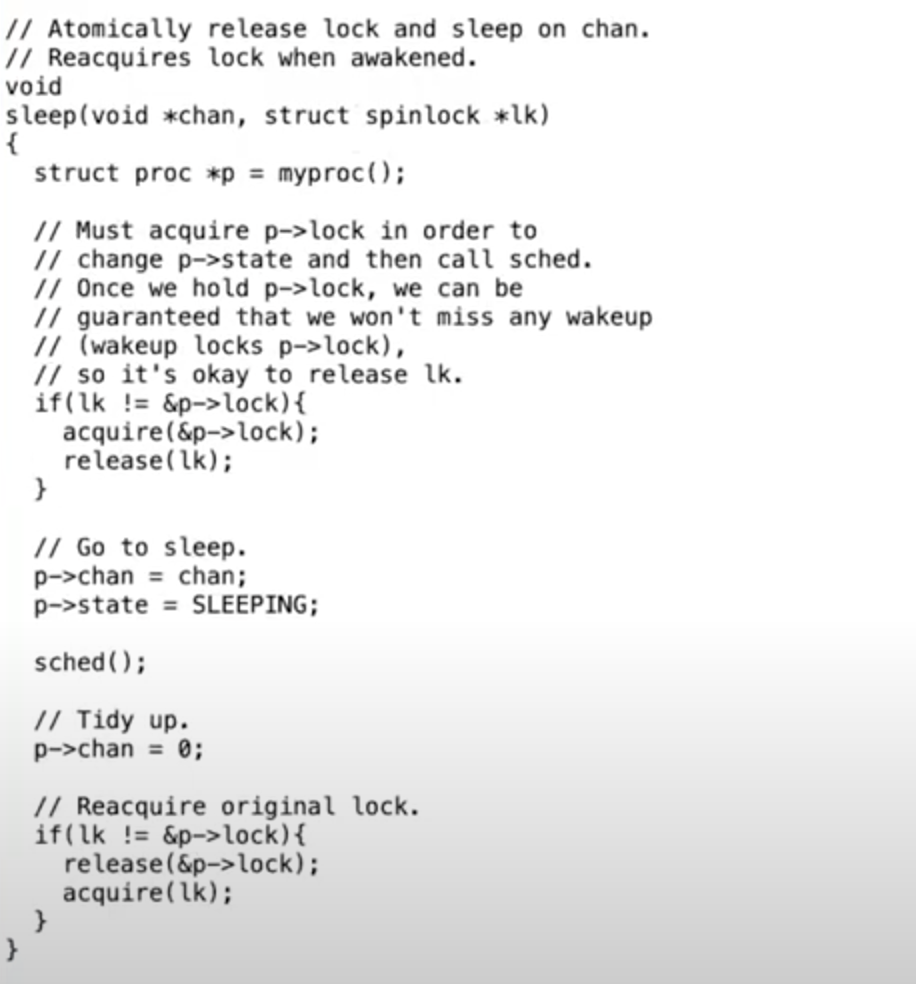

我们已经知道了sleep函数需要释放作为第二个参数传入的锁，这样中断处理程序才能获取锁。函数中第一件事情就是释放这个锁。当然在释放锁之后，**我们会担心在这个时间点相应的wakeup会被调用并尝试唤醒当前进程，而当前进程还没有进入到SLEEPING状态。**所以我们不能让wakeup在release锁之后执行。为了让它不在release锁之后执行，在release锁之前，sleep会获取即将进入SLEEPING状态的进程的锁。

如果你还记得的话，wakeup在唤醒一个进程前，需要先获取进程的锁。**所以在整个时间uartwrite检查条件之前到sleep函数中调用sched函数之间，这个线程一直持有了保护sleep条件的锁或者p->lock。**让我回到UART的代码并强调一下这一点。

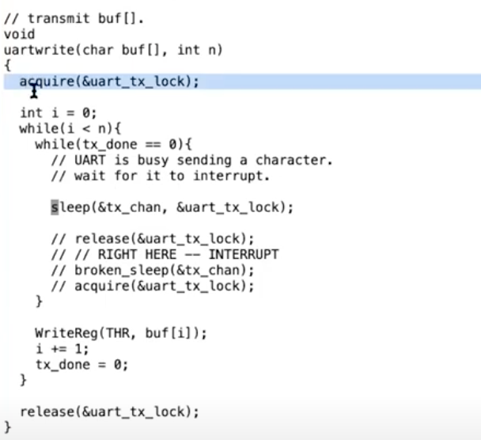

uartwrite在最开始获取了sleep的condition lock，并且一直持有condition lock直到调用sleep函数。所以它首先获取了condition lock，之后检查condition（注，也就是tx_done等于0），之后在持有condition lock的前提下调用了sleep函数。此时wakeup不能做任何事情，wakeup现在甚至都不能被调用直到调用者能持有condition lock。所以现在wakeup必然还没有执行。

sleep函数在释放condition lock之前，先获取了进程的锁。在释放了condition lock之后，wakeup就可以被调用了，但是除非wakeup获取了进程的锁，否则wakeup不能查看进程的状态。所以，在sleep函数中释放了condition lock之后，wakeup也还没有执行。

在持有进程锁的时候，将进程的状态设置为SLEEPING并记录sleep channel，之后再调用sched函数，这个函数中会再调用switch函数（注，详见11.6），此时sleep函数中仍然持有了进程的锁，wakeup仍然不能做任何事情。

如果你还记得的话，当我们从当前线程切换走时，调度器线程中会释放前一个进程的锁（注，详见11.8）。所以在调度器线程释放进程锁之后，wakeup才能终于获取进程的锁，发现它正在SLEEPING状态，并唤醒它。

这里的效果是由之前定义的一些规则确保的，这些规则包括了：

1. **调用sleep时需要持有condition lock，这样sleep函数才能知道相应的锁。**
2. **sleep函数只有在获取到进程的锁p->lock之后，才能释放condition lock。**
3. **wakeup需要同时持有两个锁才能查看进程。**

这样的话，我们就不会再丢失任何一个wakeup，也就是说我们修复了lost wakeup的问题。

## Pipe中的sleep和wakeup

前面这个特定的场景中，sleep等待的condition是发生了中断并且硬件准备好了传输下一个字符。在一些其他场景，内核代码会调用sleep函数并等待其他的线程完成某些事情。

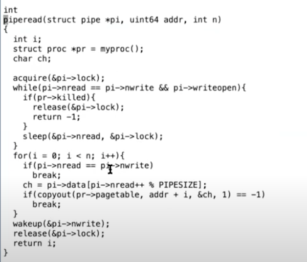

当read系统调用最终调用到piperead函数时，**pi->lock会用来保护pipe，这就是sleep函数对应的condition lock。**piperead需要等待的condition是pipe中有数据，而这个condition就是pi->nwrite大于pi->nread，也就是写入pipe的字节数大于被读取的字节数。如果这个condition不满足，那么piperead会调用sleep函数，并等待condition发生。**同时piperead会将condition lock也就是pi->lock作为参数传递给sleep函数，以确保不会发生lost wakeup。**

之所以会出现lost wakeup，是因为在一个不同的CPU核上可能有另一个线程刚刚调用了pipewrite。

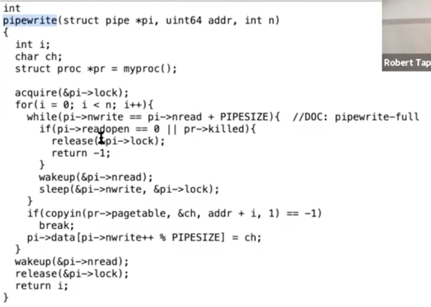

**pipewrite会向pipe的缓存写数据，并最后在piperead所等待的sleep channel上调用wakeup。** ***而我们想要避免这样的风险：***在piperead函数检查发现没有字节可以读取，到piperead函数调用sleep函数之间，另一个CPU调用了pipewrite函数。因为这样的话，另一个CPU会向pipe写入数据并在piperead进程进入SLEEPING之前调用wakeup，进而产生一次lost wakeup。

在pipe的代码中，pipewrite和piperead都将sleep包装在一个while循环中。piperead中的循环等待pipe的缓存为非空（pipewrite中的循环等待的是pipe的缓存不为full）。之所以要将sleep包装在一个循环中，是因为可能有多个进程在读取同一个pipe。如果一个进程向pipe中写入了一个字节，这个进程会调用wakeup进而同时唤醒所有在读取同一个pipe的进程。但是因为pipe中只有一个字节并且总是有一个进程能够先被唤醒。

**sleep函数中最后一件事情就是重新获取condition lock。所以调用sleep函数的时候，需要对condition lock上锁（注，在sleep函数内部会对condition lock解锁），在sleep函数返回时会重新对condition lock上锁。这样第一个被唤醒的线程会持有condition lock，而其他的线程在重新对condition lock上锁的时候会在锁的acquire函数中等待。**

那个幸运的进程会从sleep函数中返回，之后通过检查可以发现pi->nwrite比pi->nread大1，所以进程可以从piperead的循环中退出，并读取一个字节，之后pipe缓存中就没有数据了。

之后piperead函数释放锁并返回。接下来，第二个被唤醒的线程，它的sleep函数可以获取condition lock并返回，但是通过检查发现pi->nwrite等于pi->nread（注，因为唯一的字节已经被前一个进程读走了），所以这个线程以及其他所有的等待线程都会重新进入sleep函数。***所以这里也可以看出，几乎所有对于sleep的调用都需要包装在一个循环中，这样从sleep中返回的时候才能够重新检查condition是否还符合。***

### 小总结

sleep和wakeup的规则稍微有点复杂。因为你需要向sleep展示你正在等待什么数据，你需要传入锁并遵循一些规则，某些时候这些规则还挺烦人的。**另一方面sleep和wakeup又足够灵活，因为它们并不需要理解对应的condition，只是需要有个condition和保护这个condition的锁。**

## exit系统调用

每个进程最终都需要退出，我们需要清除进程的状态，释放栈。在XV6中，一个进程如果退出的话，我们需要释放用户内存，释放page table，释放trapframe对象，将进程在进程表单中标为REUSABLE，这些都是典型的清理步骤。当进程退出或者被杀掉时，有许多东西都需要被释放。产生的两大问题：

1. 首先我们不能直接单方面的摧毁另一个线程，因为：另一个线程可能正在另一个CPU核上运行，并使用着自己的栈；也可能另一个线程正在内核中持有了锁；也可能另一个线程正在更新一个复杂的内核数据，如果我们直接就把线程杀掉了，我们可能在线程完成更新复杂的内核数据过程中就把线程杀掉了。我们不能让这里的任何一件事情发生。
2. 另一个问题是，即使一个线程调用了exit系统调用，并且是自己决定要退出。它仍然持有了运行代码所需要的一些资源，例如它的栈，以及它在进程表单中的位置。当它还在执行代码，它就不能释放正在使用的资源。所以我们需要一种方法让线程能释放最后几个对于运行代码来说关键的资源。

V6有两个函数与关闭线程进程相关。第一个是exit，第二个是kill。让我们先来看位于proc.c中的exit函数。

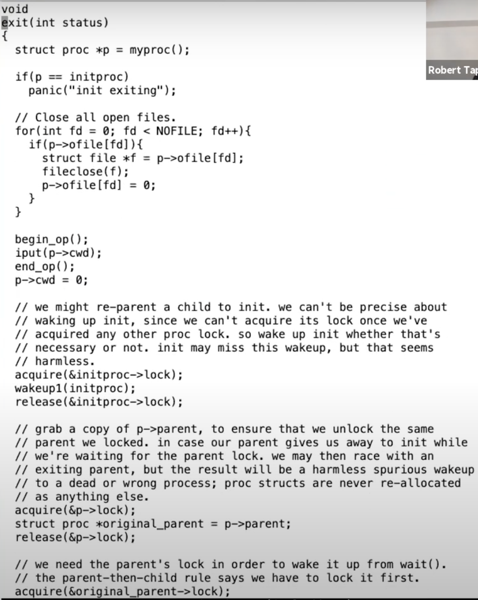

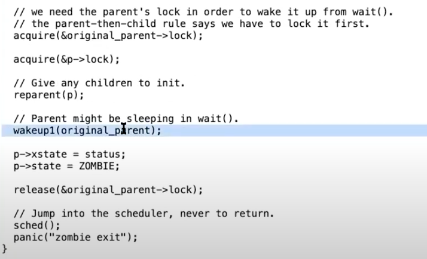

这就是exit系统调用的内容。从exit接口的整体来看，在**最后它会释放进程的内存和page table，关闭已经打开的文件，同时我们也知道父进程会从wait系统调用中唤醒，所以exit最终会导致父进程被唤醒。**这些都是我们预期可以从exit代码中看到的内容。

在exit过程中也需要将对这个目录的引用（对于当前目录的记录，随着cd命令可以改变）释放给文件系统。

**如果一个进程要退出，但是它又有自己的子进程，接下来需要设置这些子进程的父进程为init进程。**

我们接下来会看到，每一个正在exit的进程，都有一个父进程中的对应的wait系统调用。父进程中的wait系统调用会完成进程退出最后的几个步骤。***所以如果父进程退出了，那么子进程就不再有父进程，当它们要退出时就没有对应的父进程的wait。所以在exit函数中，会为即将exit进程的子进程重新指定父进程为init进程，也就是PID为1的进程。***

之后，我们需要通过调用wakeup函数唤醒当前进程的父进程，当前进程的父进程或许正在等待当前进程退出。接下来，进程的状态被设置为ZOMBIE。现在进程还没有完全释放它的资源，所以它还不能被重用。

现在我们还没有结束，因为我们还没有释放进程资源。我们在还没有完全释放所有资源的时候，通过调用sched函数进入到调度器线程。

到目前位置，进程的状态是ZOMBIE，并且进程不会再运行，因为调度器只会运行RUNNABLE进程。同时进程资源也并没有完全释放，如果释放了进程的状态应该是UNUSED。但是可以肯定的是进程不会再运行了，因为它的状态是ZOMBIE。所以调度器线程会决定运行其他的进程。

## wait系统调用

如果一个进程exit了，并且它的父进程调用了wait系统调用，父进程的wait会返回。wait函数的返回表明当前进程的一个子进程退出了。所以接下来我们看一下wait系统调用的实现。

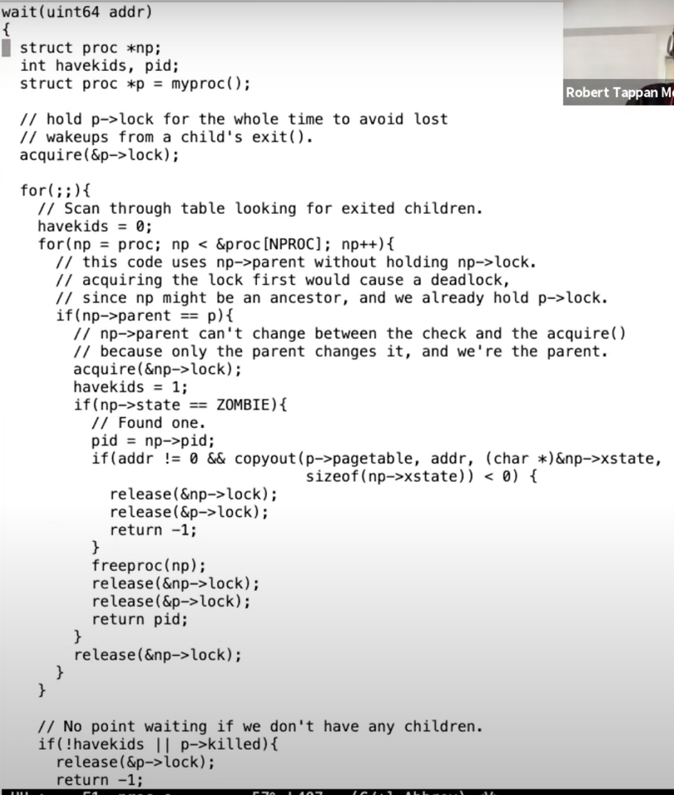

它里面包含了一个大的循环。当一个进程调用了wait系统调用，它会扫描进程表单，**找到父进程是自己且状态是ZOMBIE的进程**。从上一节可以知道，**这些进程已经在exit函数中几乎要执行完了。之后由父进程调用的freeproc函数，来完成释放进程资源的最后几个步骤**。我们看一下freeproc的实现

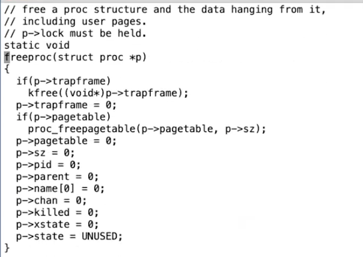

这是关闭一个进程的最后一些步骤。如果由正在退出的进程自己在exit函数中执行这些步骤，将会非常奇怪。如果我们需要释放进程内核栈，那么也应该在这里释放。但是因为内核栈的guard page，我们没有必要再释放一次内核栈。不管怎样，当进程还在exit函数中运行时，任何这些资源在exit函数中释放都会很难受，**所以这些资源都是由父进程释放的。**

wait不仅是为了父进程方便的知道子进程退出，wait实际上也是进程退出的一个重要组成部分。在Unix中，对于每一个退出的进程，都需要有一个对应的wait系统调用，这就是为什么当一个进程退出时，它的子进程需要变成init进程的子进程。init进程的工作就是在一个循环中不停调用wait，因为每个进程都需要对应一个wait，这样它的父进程才能调用freeproc函数，并清理进程的资源。

**当父进程完成了清理进程的所有资源，子进程的状态会被设置成UNUSED。之后，fork系统调用才能重用进程在进程表单的位置。**

**这里我想要强调的是，直到子进程exit的最后，它都没有释放所有的资源，**因为它还在运行的过程中，所以不能释放这些资源。相应的其他的进程，也就是父进程，释放了运行子进程代码所需要的资源。这样的设计可以让我们极大的精简exit的实现。

## kill系统调用

Unix中的一个进程可以将另一个进程的ID传递给kill系统调用，并让另一个进程停止运行。实际上，在XV6和其他的Unix系统中，kill系统调用基本上不做任何事情。

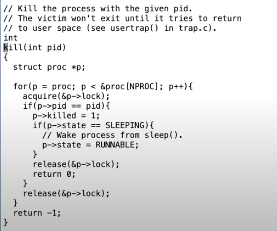

它先扫描进程表单，找到目标进程。然后只是将进程的proc结构体中killed标志位设置为1。如果进程正在SLEEPING状态，将其设置为RUNNABLE。

而目标进程运行到内核代码中能安全停止运行的位置时，会检查自己的killed标志位，如果设置为1，目标进程会自愿的执行exit系统调用。你可以在trap.c中看到所有可以安全停止运行的位置，

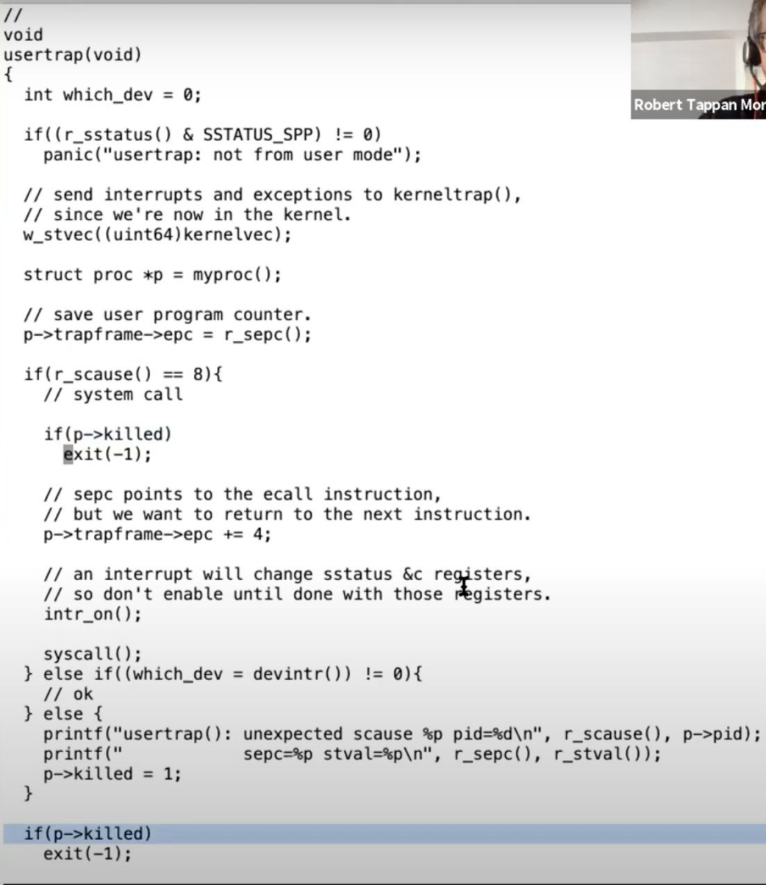

在usertrap函数中（注，详见6.6），在执行系统调用之前，如果进程已经被kill了，进程会自己调用exit。在这个内核代码位置，代码并没有持有任何锁，也不在执行任何操作的过程中，所以进程通过exit退出是完全安全的。

类似的，在usertrap函数的最后，也有类似的代码。**在执行完系统调用之后**，进程会再次检查自己是否已经被kill了。即使进程是被中断打断，这里的检查也会被执行。例如当一个定时器中断打断了进程的运行，我们可以通过检查发现进程是killed状态，之后进程会调用exit退出。

**所以kill系统调用并不是真正的立即停止进程的运行，它更像是这样：如果进程在用户空间，那么下一次它执行系统调用它就会退出，又或者目标进程正在执行用户代码，当时下一次定时器中断或者其他中断触发了，进程才会退出。所以从一个进程调用kill，到另一个进程真正退出，中间可能有很明显的延时。**

*如果进程不在用户空间执行，而是正在执行系统调用的过程中，然后它被kill了，我们需要做什么特别的操作吗？*

之所以会提出这个问题，是因为进程可能正在从console读取即将输入的字符，而你可能要明天才会输入一个字符，所以当你kill一个进程时，最好进程不是等到明天才退出。出于这个原因，在XV6的很多位置中，如果进程在SLEEPING状态时被kill了，进程会实际的退出。让我来给你展示这里的机制。

你可以看到如果目标进程是SLEEPING状态，kill函数会将其状态设置为RUNNABLE，这意味着，即使进程之前调用了sleep并进入到SLEEPING状态，调度器现在会重新运行进程，并且进程会从sleep中返回。让我们来查看一下这在哪生效的。在pipe.c的piperead函数中，

如果一个进程正在sleep状态等待从pipe中读取数据，然后它被kill了。kill函数会将其设置为RUNNABLE，之后进程会从sleep中返回，返回到循环的最开始。pipe中大概率还是没有数据，之后在piperead中，会判断进程是否被kill了（注，if(pr->killed)）。如果进程被kill了，那么接下来piperead会返回-1，并且返回到usertrap函数的syscall位置，因为piperead就是一种系统调用的实现。

之后在usertrap函数中会检查p->killed，并调用exit。

所以对于SLEEPING状态的进程，如果它被kill了，它会被直接唤醒，包装了sleep的循环会检查进程的killed标志位，最后再调用exit。

同时还有一些情况，如果进程在SLEEPING状态中被kill了并不能直接退出。例如，一个进程正在更新一个文件系统并创建一个文件的过程中，进程不适宜在这个时间点退出，因为我们想要完成文件系统的操作，之后进程才能退出。我会向你展示一个磁盘驱动中的sleep循环，这个循环中就没有检查进程的killed标志位。

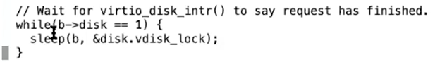

这里一个进程正在等待磁盘的读取结束，这里没有检查进程的killed标志位。因为现在可能正在创建文件的过程中，而这个过程涉及到多次读写磁盘。我们希望完成所有的文件系统操作，完成整个系统调用，之后再检查p->killed并退出。