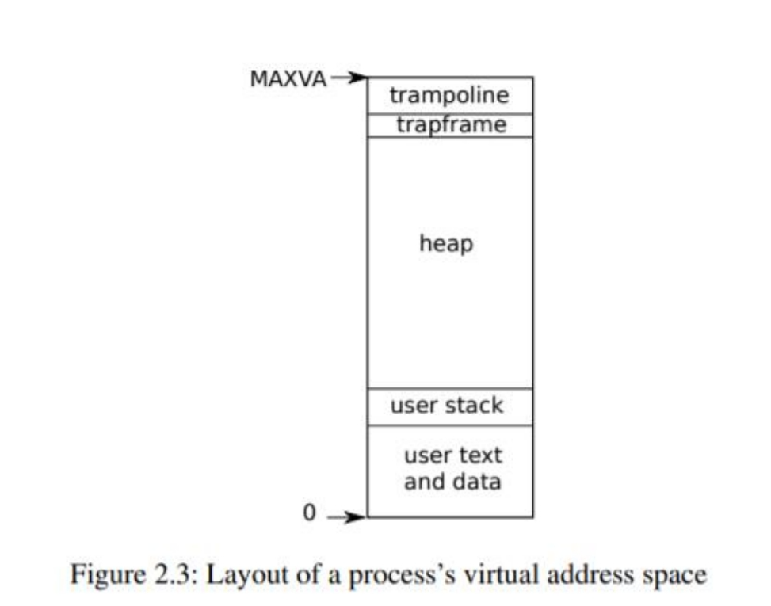
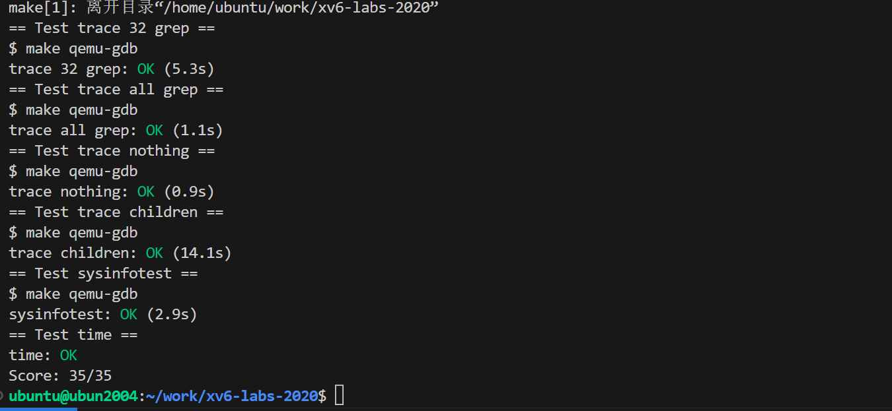
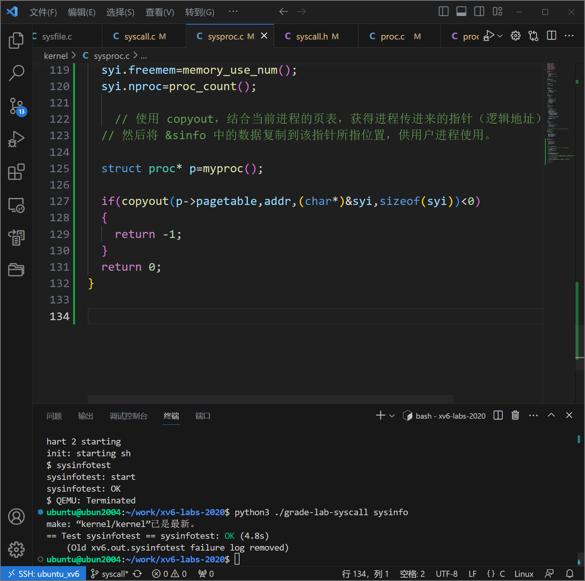
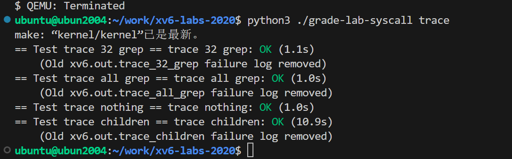

# 系统调用

在上一个实验中，您使用系统调用编写了一些实用程序。在本实验中，您将向xv6添加一些新的系统调用，这将帮助您理解它们是如何工作的，并将向您展示xv6内核的一些内部结构。您将在以后的实验中添加更多的系统调用。

# 提前阅读

## 操作系统组织

一个操作系统必须满足三个要求：多路复用、隔离和 交互。

xv6 进程是 xv6 中的隔离单元，以及 xv6 启动时第一个进程的创建

## 抽象物理资源

为了实现强隔离，禁止应用程序直接访问敏感的硬件资源，而将资源抽象为服务是很有 帮助的。

eg:现文件系统是一个比直接使用磁盘更方便的抽象。

另一个例子是，Unix 进程使用 exec 来建立它们的内存映像，而不是直接与物理内存交 互。这使得操作系统可以决定将进程放在内存的什么位置；如果内存紧张，操作系统甚至可 能将进程的部分数据存储在磁盘上。

## 用户模式、监控模式和系统调用

强隔离要求应用程序和操作系统之间有一个分界线。为了实现强隔离，操作系统必须安排应用程序不能修改（甚至 不能读取）操作系统的数据结构和指令，应用程序不能访问其他进程的内存

CPU 可以执行指令：机器 模式、监督者（supervisor）模式和用户模式

**机器模式下执行的指令具有完全的权限，机器模式主要用于配置计算机。**

在监督者（supervisor）模式下，CPU 被允许执行特权指令

如果用户模式下的应用程序试图执行一条特权指令，CPU 不 会执行该指令，而是切换到监督者模式，这样监督者模式的代码就可以终止应用程序，

**处于监督者模式的软件也可以执行特权指令，被称为运行在内核空间。运行在内核空间（或监督者模式）的软件称为内核。**

**CPU 提供了一个特殊的指令，可以将 CPU 从用户模式切换到监督模式，并在内核指定的入口处进入内核。（eg:ecall指令）**。一旦 CPU 切换到监督者模式，内核就可以验证 系统调用的参数，决定是否允许应用程序执行请求的操作，然后拒绝或执行该操作。内核控制监督者模式的入口点是很重要的

## 内核的组织

操作系统的哪一部分应该在监督者模式下运行。一种可能是整个 操作系统驻留在内核中，这样所有系统调用的实现都在监督者模式下运行。这种组织方式称 为**宏内核**。这种组织方式中，整个操作系统以全硬件权限运行。这种组织方式很方便，因为操作 系统设计者不必决定操作系统的哪一部分不需要全硬件权限。

**一个错误是致命 的，因为监督者模式下的错误往往会导致内核崩溃。如果内核崩溃，计算机就会停止工作， 因此所有的应用程序也会崩溃。计算机必须重启。**

为了降低内核出错的风险，操作系统设计者可以尽量减少在监督者模式下运行的操作系 统代码量，而在用户模式下执行操作系统的大部分代码。这种内核组织方式称为**微内核**。在微内核中，内核接口由一些低级函数组成，用于启动应用程序、发送消息、访问设备 硬件等。这种组织方式使得内核相对简单，因为大部分操作系统驻留在用户级服务器中。

## 进程概述

xv6 中的隔离单位（和其他 Unix 操作系统一样）是一个进程。进程抽象可以防止一个进 程破坏或监视另一个进程的内存、CPU、文件描述符等。它还可以防止进程破坏内核，所以 进程不能破坏内核的隔离机制。

**内核用来实现进程 的机制包括：用户/监督模式标志、地址空间和线程的时间分割。**

**一个进程为程序提供了一个看似私有的内存系统，或者说是地址空间，其他进程不能对其进行读写。 进程还为程序提供了“私有”的 CPU，用来执行程序的指令。**

Xv6 使用页表（由硬件实现）给每个进程提供自己的地址空间。RISC-V 页表将虚拟地址 (RISC-V 指令操作的地址)转换(或 "映射")为物理地址(CPU 芯片发送到主存储器的地址)。



Xv6 为每个进程维护一个单独的页表，定义该进程的地址空间。进程的 用户空间内存的地址空间从虚拟地址 0 开始的。指令存放在最前面，其次是全局变量，然后 是栈，最后是一个堆区（用于 malloc），进程可以根据需要扩展

在地址空间的顶端，xv6 保留了一页，用于 trampoline 和映射进程 trapframe 的页，以便切换到内核，我们将在第 4 章中解释。

xv6 内核为每个进程维护了许多状态，它将这些状态在proc 结构体中(kernel/proc.h:86)。**一个进程最重要的内核状态是它的页表、内核栈和运行状态。**我们用 p->xxx 来表示 proc 结构的元素，例如，p->pagetable 是指向进程页表的指针。

每个进程都有一个执行线程（简称线程），执行进程的指令。一个线程可以被暂停，然 后再恢复。**为了在进程之间透明地切换，内核会暂停当前运行的线程，并恢复另一个进程的 线程。线程的大部分状态（局部变量、函数调用返回地址）都存储在线程的栈中。每个进程 有两个栈：用户栈和内核栈（p->kstack）。当进程在执行用户指令时，只有它的用户栈在使 用，而它的内核栈是空的。当进程进入内核时（为了系统调用或中断），内核代码在进程的 内核栈上执行；当进程在内核中时，它的用户栈仍然包含保存的数据，但不被主动使用。进 程的线程在用户栈和内核栈中交替执行。内核栈是独立的（并且受到保护，不受用户代码的 影响），所以即使一个进程用户栈被破坏了，内核也可以执行。**

**一个进程可以通过执行 RISC-V ecall 指令进行系统调用。该指令提高硬件权限级别，并 将程序计数器改变为内核定义的入口点。入口点的代码会切换到内核栈，并执行实现系统调 用的内核指令。当系统调用完成后，内核切换回用户栈，并通过调用 sret 指令返回用户空 间，降低硬件特权级别，恢复执行系统调用前的用户指令。**进程的线程可以在内核中阻塞等待 I/O，当 I/O 完成后，再从离开的地方恢复。

**p->state 表示进程是创建、就绪、运行、等待 I/O，还是退出。 **

**p->pagetable 以 RISC-V 硬件需要的格式保存进程的页表，当进程在用户空间执行时， xv6 使分页硬件使用进程的 p->pagetable。进程的页表也会记录分配给该进程内存的物理 页地址。**

## 内核如何启动和运行第一个进程

当 RISC-V 计算机开机时，它会初始化自己，并运行一个存储在只读存储器中的 boot loader。Boot loader 将 xv6 内核加载到内存中。然后，在机器模式下，CPU 从 _entry （kernel/entry.S:6）开始执行 xv6。RISC-V 在禁用分页硬件的情况下启动：虚拟地址直接映 射到物理地址。

_entry 处 的 指 令 设 置 了 一 个 栈 ， 这 样 xv6 就 可 以 运 行 C 代 码 。Xv6 在 文 件 start.c(kernel/start.c:11)中声明了初始栈的空间，即 stack0。在_entry 处的代码加载栈指针寄 存器 sp，地址为 stack0+4096，也就是栈的顶部，因为 RISC-V 的栈是向下扩张的。现在内 核就拥有了栈，_entry 调用 start(kernel/start.c:21)，并执行其 C 代码。

**函数 start 执行一些只有在机器模式下才允许的配置，然后切换到监督者模式。为了进 入监督者模式，RISC-V 提供了指令 mret。**这条指令最常用来从上一次的调用中返回，上一次调用从监督者模式到机器模式。start 并 不是从这样的调用中返回，而是把事情设置得像有过这样的调用一样：在寄存器 mstatus 中将先前的特权模式设置为监督模式，通过将 main 的地址写入寄存器 mepc 将返回地址设置为 main，通过将 0 写入页表寄存器 satp 禁用监督模式下的虚拟地址转换，并将所有中断和异常委托给监督模式。

在进入监督者模式之前，start 还要执行一项任务：对时钟芯片进行编程以初始化定时 器中断。**在完成了这些基本管理后，start 通过调用 mret "返回" 到监督者模式。这将导致 程序计数器变为 main（kernel/main.c:11）的地址。**

在 main(kernel/main.c:11) 初 始 化 几 个 设 备 和 子 系 统 后 ， 它 通 过 调 用 userinit(kernel/proc.c:212)来创建第一个进程。第一个进程执行一个用 RISC-V 汇编编写的小 程序 initcode.S（user/initcode.S:1），它通过调用 exec 系统调用重新进入内核。exec 用一个新的程序（本例中是/init）替换当前进程的内存和寄存器。一旦内核完成 exec，它就会在/init 进程中返回到用户空间。init (user/init.c:15)在需要时会 创建一个新的控制台设备文件，然后以文件描述符 0、1 和 2 的形式打开它。然后它在控制 台上启动一个 shell。这样系统就启动了。

##  Code: Calling system calls

第 2 章最后，initcode.S 调用了 exec 系统调用（user/initcode.S:11）。让我们看看用户调用是如何在内核中实现 exec 系统调用的。用户代码将 exec 的参数放在寄存器 a0 和 a1 中，并将系统调用号放在 a7 中。系统调 用号与函数指针表 syscalls 数组(kernel/syscall.c:108)中的项匹配。

当系统调用函数返回时，syscall 将其返回值记录在 p->trapframe->a0 中。用户空间 的 exec()将会返回该值，因为 RISC-V 上的 C 调用通常将返回值放在 a0 中。系统调用返回 负数表示错误，0 或正数表示成功。如果系统调用号无效，syscall 会打印错误并返回 1。

**内核的系统调用实现需要找到用户代码传递的参数。因为用户代码调用系统调用的包装 函数，参数首先会存放在寄存器中，这是 C 语言存放参数的惯例位置。**函数 argint、 argaddr 和 argfd 从 trapframe 中以整数、指针或文件描述符的形式检索第 n 个系统调用参 数。它们都调用 argraw 在 trapframe 中检索相应的数据(kernel/syscall.c:35)。

一些系统调用传递指针作为参数，而内核必须使用这些指针来读取或写入用户内存。例 如，exec 系统调用会向内核传递一个指向用户空间中的字符串的指针数组。这些指针带来 了两个挑战。首先，用户程序可能是错误的或恶意的，可能会传递给内核一个无效的指针或 一个旨在欺骗内核访问内核内存而不是用户内存的指针。第二，xv6 内核页表映射与用户页 表映射不一样，所以内核不能使用普通指令从用户提供的地址加载或存储。

**内核实现了安全地将数据复制到用户提供的地址或从用户提供的地址复制数据的函数。** 例如 fetchstr(kernel/syscall.c:25)。文件系统调用，如 exec，使用 fetchstr 从用户空间中检 索字符串文件名参数，fetchstr 调用 copyinstr 来做这些困难的工作。

copyinstr (kernel/vm.c:406) 将用户页表 pagetable 中的虚拟地址 srcva 复制到 dst， 需指定最大复制字节数。它使用 walkaddr（调用 walk 函数）在软件中模拟分页硬件的操 作，以确定 srcva 的物理地址 pa0。walkaddr (kernel/vm.c:95)检查用户提供的虚拟地址是否 是进程用户地址空间的一部分，所以程序不能欺骗内核读取其他内存。类似的函数 copyout， 可以将数据从内核复制到用户提供的地址。

# 系统调用跟踪

将添加一项系统调用跟踪功能。将创建一个新的跟踪系统调用来控制跟踪。它应该接受一个参数，即一个整数 "掩码"，该掩码的位数指定了要跟踪的系统调用。例如，要跟踪 fork 系统调用，程序会调用 trace(1<<SYS_fork)，其中 SYS_fork 是 kernel/syscall.h 中的系统调用编号。你必须修改 xv6 内核，以便在每个系统调用即将返回时，如果掩码中设置了系统调用编号，就打印出一行。该行应包含进程 ID、系统调用名称和返回值；无需打印系统调用参数。跟踪系统调用应启用对调用该调用的进程及其随后分叉的子进程的跟踪，但不应影响其他进程。

我们提供了一个跟踪用户级程序，可在启用跟踪功能的情况下运行另一个程序（参见 user/trace.c）。运行完成后，您将看到如下输出：

在上面的第一个示例中，trace只调用grep跟踪read系统调用。32是1<<SYS_read。在第二个示例中，trace在跟踪所有系统调用时运行grep;2147583647设置了所有31个低位。在第三个示例中，不跟踪程序，因此不打印跟踪输出。在第四个示例中，正在跟踪usertest中所有forkforkfork测试的后代的fork系统调用。如果程序的行为如上所示(尽管进程id可能不同)，那么您的解决方案就是正确的。trace 32 grep hello README

一些提示:

运行make qemu，您将看到编译器无法编译user/trace.c，因为系统调用的用户空间存根还不存在:将系统调用的原型添加到user/user.h，将存根添加到user/usys.pl，将系统调用号添加到kernel/ sycall .h。Makefile调用perl脚本user/usys.pl，生成user/usys.S，实际的系统调用存根，它使用RISC-V调用指令转换到内核。修复编译问题后，运行trace 32 grep hello README;它将失败，因为您还没有在内核中实现系统调用。

在kernel/sysproc.c中添加sys_trace()函数，该函数通过在进程结构中的新变量中记住其参数来实现新的系统调用(参见kernel/proc.h)。从用户空间检索系统调用参数的函数在kernel/syscall.c中，您可以在kernel/ sysproc .c中看到它们的使用示例。

修改fork()(参见kernel/proc.c)将跟踪掩码从父进程复制到子进程。

修改kernel/ sycall .c中的sycall()函数以打印跟踪输出。您需要添加一个要索引的系统调用名称数组。

## 系统调用全流程

```
user/user.h:		用户态程序调用跳板函数 trace()
user/usys.S:		跳板函数 trace() 使用 CPU 提供的 ecall 指令，调用到内核态
kernel/syscall.c	到达内核态统一系统调用处理函数 syscall()，所有系统调用都会跳到这里来处理。
kernel/syscall.c	syscall() 根据跳板传进来的系统调用编号，查询 syscalls[] 表，找到对应的内核函数并调用。
kernel/sysproc.c	到达 sys_trace() 函数，执行具体内核操作
```

# Sysinfo ([moderate](https://pdos.csail.mit.edu/6.S081/2020/labs/guidance.html))

添加一个系统调用，返回空闲的内存、以及已创建的进程数量。

在本作业中，你将添加一个系统调用 sysinfo，用于收集运行系统的信息。系统调用需要一个参数：指向 struct sysinfo 的指针（参见 kernel/sysinfo.h）。内核应填写该结构体的字段：freemem 字段应设置为可用内存的字节数，nproc 字段应设置为状态不是 UNUSED 的进程数。我们提供了一个测试程序 sysinfotest；如果打印出 "sysinfotest：OK"，则作业通过.

在统计可用内存容量以及进程数量的函数时，逻辑简单，但是需要注意源文件中使用的何种数据结构组织内存页及进程，之后遍历操作即可。

在uint64 sys_sysinfo(void)编写时，根据提示内容需要将内核的部分复制到用户空间，举例时file类似的东西，需要看懂函数的逻辑，file的封装过，所以是两个函数，起始就是在内核定义好结构体直接复制到用户控件。





