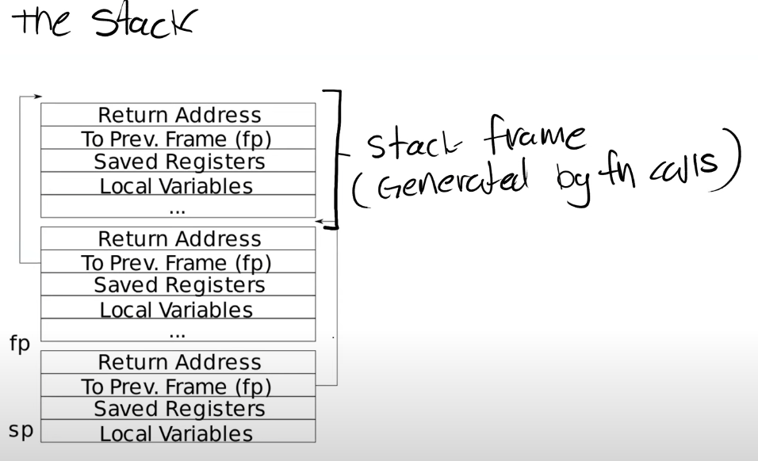
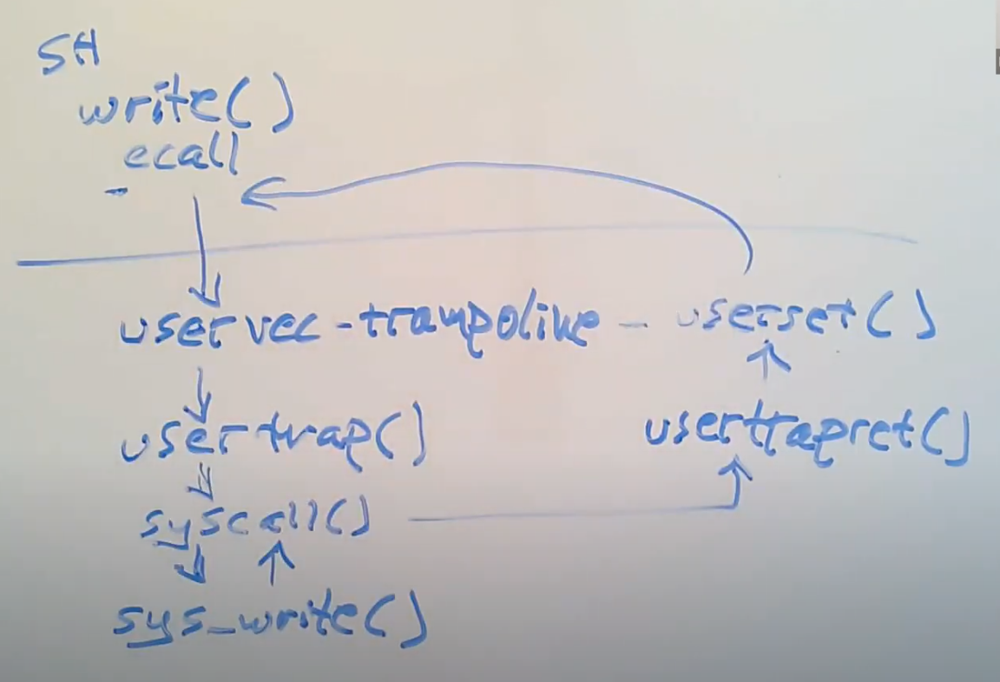
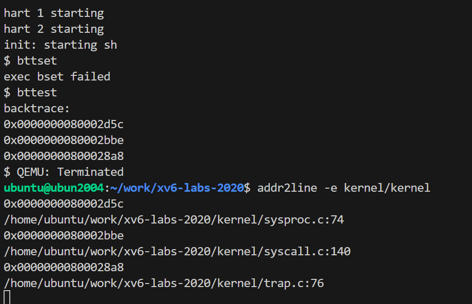
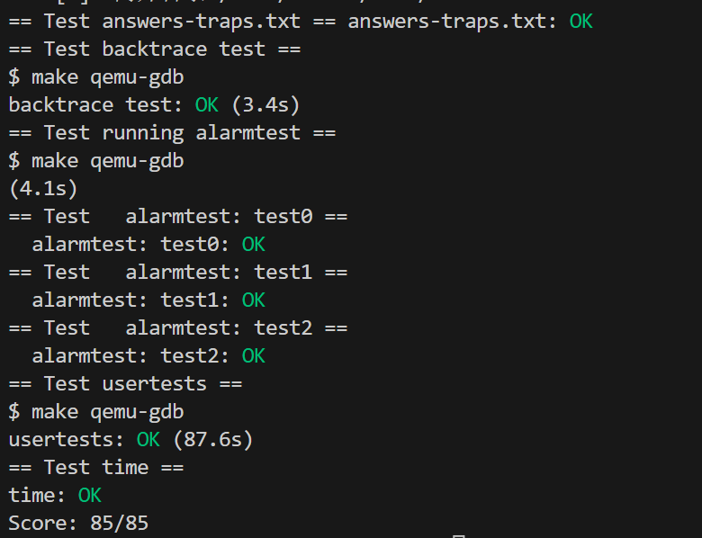

# 前置知识

准备资料中介绍了c数据类型及对齐知识，以及RISC-V调用协定中，寄存器和传参的相关信息。

## C程序到汇编程序的转换

寄存器之所以重要是因为汇编代码并不是在内存上执行，而是在寄存器上执行，也就是说，当我们在做add，sub时，我们是对寄存器进行操作。

当我们调用函数时，你可以看到这里有a0 - a7寄存器。通常我们在谈到寄存器的时候，我们会用它们的ABI名字。不仅是因为这样描述更清晰和标准，同时也因为在写汇编代码的时候使用的也是ABI名字。

a0到a7寄存器是用来作为函数的参数。如果一个函数有超过8个参数，我们就需要用内存了。从这里也可以看出，当可以使用寄存器的时候，我们不会使用内存，我们只在不得不使用内存的场景才使用它。

Saver有两个可能的值：Caller调用者，Callee被调用者。

Caller Saved寄存器在函数调用的时候不会保存

Callee Saved寄存器在函数调用的时候会保存

总结：对于任何一个Caller Saved寄存器，作为调用方的函数要小心数据的变化。对于任何一个Callee Saved寄存器，作为被调用方的函数要小心寄存器的值不会相应的变化。

## 栈

栈之所以很重要的原因是，它使得我们的函数变得有组织，且能够正常返回。
下面是一个非常简单的栈的布局图，其中每一个区域都是一个栈帧(Stack Frame)，每执行一次函数调用就会产生一个Stack Frame。

栈的工作流程：
----每一次我们调用一个函数，函数都会为自己创建一个Stack Frame，并且只给自己用。函数通过移动Stack Pointer来完成Stack Frame的空间分配。对于Stack来说，是从高地址开始向低地址使用，所以栈总是向下扩展。当我们想要创建一个新的Stack Frame的时候，总是对当前的Stack Pointer做减法。
**有关Stack Frame有两件事情是确定的：**
①Return address总是会出现在Stack Frame的第一位。
②指向前一个Stack Frame的指针也会出现在栈中的固定位置。

Stack Frame必须要被汇编代码创建，所以通常，在汇编代码中，函数的最开始你们可以看到函数序言(Function prologue)，之后是函数体，最后是函数尾声(Epollgue)。这就是一个汇编函数通常的样子。

[精彩讲解](https://blog.csdn.net/InnerPeaceHQ/article/details/125931473)

## trap机制

**trap的使用场景**

掌握程序运行时如何完成用户空间和内核空间的切换是非常必要的。每当

- 程序执行系统调用
- 程序出现了类似page fault、运算时除以0的错误
- 一个设备触发了中断使得当前程序运行需要响应内核设备驱动

都会发生这样的切换 。这里用户空间和内核空间的切换通常被称为trap，

**寄存器状态**

我们最关心的状态可能是32个用户寄存器，有意思的寄存器是

①栈指针(Stack Pointer)，也叫做栈寄存器，保存栈帧的地址。
②程序计数器(Program Counter Register)
③模式(Mode)，表明当前模式的标志位。这个标志位表明了当前是supervisor mode还是user mode。当我们在运行Shell的时候，自然是在user mode。
还有一堆控制CPU工作方式的寄存器：
④SATP(Supervisor Address Translation and Protection)寄存器，它包含了指向页表的物理内存地址。
⑤STVEC(Supervisor Trap Vector Base Address Register)寄存器，它指向了内核中处理trap的指令的起始地址。
⑥SEPC(Supervisor Exception Program Counter)寄存器，在trap的过程中保存程序计数器的值。
⑦SSCRATCH(Supervisor Scratch Register)寄存器。
这些寄存器表明了执行系统调用时计算机的状态。
**寄存器状态修改**

可以肯定的是，在`trap`的最开始，CPU的所有状态都设置成运行用户代码而不是内核代码。在trap处理的过程中，我们需要更改一些这里的状态，或者对状态做一些操作，这样我们才可以运行系统内核中普通的C程序。接下来我们预览一下需要做的操作：

①首先，我们需要保存32个用户寄存器。因为很显然我们需要恢复用户应用程序的执行，尤其是当用户程序随机地被设备中断所打断时，我们希望内核能够响应中断，之后在用户程序完全无感知的情况下再恢复用户代码的执行。所以这意味着32个用户寄存器不能被内核弄乱。但是这些寄存器又要被内核代码所使用，所以在trap之前，你必须先在某处保存这32个用户寄存器。
②程序计数器也需要在某个地方保存，它几乎跟一个用户寄存器的地位是一样的，我们需要能够在用户程序运行中断的位置继续执行用户程序。
③我们需要将mode改成supervisor mode，因为我们想要使用内核中的各种各样的特权指令。
④satp寄存器现在正指向用户页表，而用户页表只包含了用户程序所需要的内存映射和一两个其他的映射，它并没有包含整个内核数据的内存映射。所以在运行内核代码之前，我们需要将satp指向内核页表。
⑤我们需要将栈寄存器指向位于内核的一个地址，因为我们需要一个栈来调用内核的C函数。
一旦我们设置好了，并且所有的硬件状态都适合在内核中使用， 我们需要跳入内核的C代码。一旦我们运行在内核的C代码中，那就跟平常的C代码是一样的。
**今天讨论的是如何将将程序执行从用户空间切换到内核的一个位置，这样我们才能运行内核的C代码。**

1. 我们不想让用户代码干扰到这里的user/kernel切换，`trap`中涉及到的硬件和内核机制不能依赖任何来自用户空间东西。比如说我们不能依赖32个用户寄存器，它们可能保存的是恶意的数据。所以，XV6的`trap`机制不会查看这些寄存器，而只是将它们保存起来。

2. 我们想要让`trap`机制对用户代码是透明的。也就是说，我们想要执行`trap`，然后在内核中执行代码，之后再恢复代码到用户空间。

3. 当然，系统调用的具体实现(如write在内核的具体实现)以及内核中任何的代码也必须小心并安全地写好。因此，即使从用户空间到内核空间的切换十分安全，整个内核的其他部分也必须非常安全，并时刻小心用户代码可能会尝试欺骗它。

4. 保存mode标志的寄存器需要讨论一下。当我们在用户空间时，这个标志位对应的是user mode，当我们在内核空间时，这个标志位对应supervisor mode。但是有一点很重要：当这个标志位从user mode变更到supervisor mode时，我们能得到什么样的权限。实际上，这里获得的额外权限实在是有限。也就是说，并不是像你可以在supervisor mode完成但是不能在user mode完成一些工作那么有特权。我们接下来看看supervisor mode可以控制什么。

   ----可以读写控制寄存器。比如说，当你在supervisor mode时，你可以：读写SATP寄存器，也就是页表的指针；STVEC，也就是处理trap的内核指令地址；SEPC，保存当发生trap时的程序计数器；SSCRATCH等等。在supervisor mode你可以读写这些寄存器，而用户代码不能做这样的操作。
   ----可以使用PTE_U标志位为0的PTE。当PTE_U标志位为1时，表明用户代码可以使用这个页表。如果这个标志位为0，则只有supervisor mode可以使用这个页表。
   这两点就是supervisor mode可以做的事情，除此之外就不能再干别的事情了。

6. 注意： 需要特别指出的是，supervisor mode中的代码并不能读写任意物理地址。在supervisor mode中，就像普通的用户代码一样，也需要通过页表来访问内存。如果一个虚拟地址并不在当前由SATP指向的页表中，又或者SATP指向的页表中PTE_U=1，那么supervisor mode不能使用那个地址。所以，即使我们在supervisor mode，我们还是受限于当前页表设置的虚拟地址。

## trap代码执行流程

我们跟踪如何在Shell中调用write系统调用。从Shell的角度来说，这就是个Shell代码中的C函数调用。但是实际上，`write`通过执行`ecall`指令来执行系统调用，`ecall`指令会切换到具有supervisor mode的内核中。

①在这个过程中，内核中执行的第一个指令是一个由汇编语言写的函数，叫做`uservec`。这个函数是内核代码**trampoline.s**文件的一部分。

之后，在这个汇编函数中，代码执行跳转到了由C语言实现的函数`usertrap`中，这个函数在**trap.c**中。

现在代码运行在C中，所以代码更加容易理解。在`usertrap`这个C函数中，我们执行了一个叫做`syscall`的函数。

这个函数会在一个表单中，根据传入的代表系统调用的数字进行查找，并在内核中执行具体实现了系统调用功能的函数。对于我们来说，这个函数就是`sys_write`。

`sys_write`会将要显示数据输出到console上。当它完成了之后，它会返回到`syscall`函数，然后`syscall`函数返回到用户空间。

因为我们现在相当于在`ecall`之后中断了用户代码的执行，为了用户空间的代码恢复执行，需要做一系列的事情。在`syscall`函数中，会调用一个函数叫做`usertrapret`，它也位于**trap.c**中，这个函数完成了部分在C代码中实现的返回到用户空间的工作。

除此之外，最终还有一些工作只能在汇编语言中完成。这部分工作通过汇编语言实现，并且存在于**trampoline.s**文件中的`userret`函数中。

最终，在这个汇编函数中会调用机器指令返回到用户空间，并且恢复`ecall`之后的用户程序的执行。

## ecall指令之前的状态

## ecall指令之后的状态

[详细过程（write系统调用为例）讲解](https://blog.csdn.net/InnerPeaceHQ/article/details/125996866?ydreferer=aHR0cHM6Ly9ibG9nLmNzZG4ubmV0L2lubmVycGVhY2VocS9jYXRlZ29yeV8xMTgxNDIxNC5odG1s)

### ecall改变了什么

我们是通过`ecall`走到trampoline page的，而`ecall`实际上只会改变三件事情：

1. `ecall`将代码从user mode改到supervisor mode。
2. `ecall`将程序计数器的值保存在了`sepc`寄存器，我们可以通过打印程序计数器看到这里的效果。

尽管其他的寄存器还是用户寄存器，**但是这里的程序计数器明显已经不是用户代码的程序计数器**，这里的程序计数器是从`stvec`寄存器拷贝过来的值。我们也可以打印`sepc`(Supervisor Exception Program Counter)寄存器，这是`ecall`保存用户程序计数器的地方。

3. `ecall`会跳转到`stvec`寄存器指向的指令。

### **距离执行内核中的C代码还需要做什么工作**

现在`ecall`帮我们做了一点点工作，但是实际上我们离执行内核中的C代码还差的很远。接下来：

1. 我们需要保存32个用户寄存器的内容，这样当我们想要恢复用户代码执行时，我们才能恢复这些寄存器的内容
2. 因为现在我们还在用户页表，我们需要切换到内核页表。
3. 我们需要创建或者找到一个内核栈，并将Stack Pointer寄存器的内容指向那个内核栈，这样才能给C代码提供栈。
4. 我们还需要跳转到内核中C代码的某些合理的位置。

**RISC-V的ecall**不会做上述工作。**ecall尽量的简单可以提升软件设计的灵活性。**

## uservec函数

现在需要做的第一件事情就是保存寄存器的内容。

其他的机器中，我们或许直接就将32个寄存器中的内容写到物理内存中某些合适的位置。但是在RISC-V中不能这样做，因为在RISC-V中，supervisor mode下的代码不允许直接访问物理内存。所以我们只能使用页表中的内容

**对于保存用户寄存器，XV6在RISC-V上的实现包括了两个部分：**

1. XV6在每个用户页表映射了trapframe page，这样每个进程都有自己的trapframe page。这个page包含了很多有趣的不同类型的数据，但是现在最重要的数据是用来保存用户寄存器的32个空槽位。所以，在trap处理代码中，现在的好消息是我们在用户页表中有一个之前由内核设置好的映射关系，这个映射关系指向了一个可以用来存放这个进程的用户寄存器的内存位置。这个位置的虚拟地址总是`0x3ffffffe000`。**所以，如何保存用户寄存器的一半答案是，内核非常方便的将trapframe page映射到了每个用户页表。**

2. 另一半的答案在于我们之前提过的`sscratch`寄存器。在进入到用户空间之前，内核会将trapframe page的地址保存在这个寄存器中，也就是`0x3fffffe000`这个地址。更重要的是，RISC-V有一个指令允许交换任意两个寄存器的值。而`sscratch`寄存器的作用就是保存另一个寄存器的值，并将自己的值加载给另一个寄存器。如果我查看**trampoline.S**代码。第一件事情就是执行`csrrw`指令，这个指令交换了`a0`和`sscratch`两个寄存器的内容。

**切换页表**

程序现在仍然在trampoline的最开始，也就是`uservec`函数的最开始，之后完成页表切换。接下来我们就要以内核栈、内核页表跳转到`usertrap`函数。

## usertrap函数

现在我们在usertrap，有很多原因都可以让程序运行进入到usertrap函数中来，比如系统调用，运算时除以0，使用了一个未被映射的虚拟地址，或者是设备中断。u**sertrap某种程度上存储并恢复硬件状态，但是它也需要检查触发trap的原因，以确定相应的处理方式**，我们在接下来执行usertrap的过程中会同时看到这两个行为。
**它做的第一件事情是更改`stvec`寄存器。取决于trap是来自于用户空间还是内核空间，XV6处理trap的方法是不一样的。**在内核中执行任何操作之前，`usertrap`中先将`stvec`指向了`kernelvec`变量，这是内核空间trap处理代码的位置，而不是用户空间trap处理代码的位置。出于各种原因，我们需要知道当前运行的是什么进程，我们通过调用`myproc`函数来做到这一点。

**接下来我们要保存用户程序计数器，它仍然保存在`sepc`寄存器中，但是可能发生这种情况**：当程序还在内核中执行时，我们可能切换到另一个进程，并进入到那个程序的用户空间，然后那个进程可能再调用一个系统调用进而导致sepc寄存器的内容被覆盖。所以，我们需要保存当前进程的sepc寄存器到一个与该进程关联的内存中，这样这个数据才不会被覆盖。这里我们使用trapframe来保存这个程序计数器。

**接下来我们需要找出我们现在会在`usertrap`函数的原因。根据触发`trap`的原因**，RISC-V的`scause`寄存器会有不同的数字。数字8表明，我们现在在`trap`代码中是因为系统调用。

**在RISC-V中，存储在`sepc`寄存器中的程序计数器，是用户程序中触发`trap`的指令的地址。**当我们恢复用户程序时，**我们希望在下一条指令恢复**，也就是`ecall`之后的一条指令。所以对于系统调用，我们对于保存的用户程序计数器加4，这样我们会在`ecall`的下一条指令恢复，而不是重新执行`ecall`指令。

**我们需要显式的打开中断。**

**调用syscall函数，**根据系统调用的编号查找相应的系统调用函数。`syscall`函数直接通过trapframe来获取函数的参数，就像这里刚刚可以查看trapframe中的`a7`寄存器一样，我们可以查看`a0`寄存器，这是第一个参数，`a1`是第二个参数，`a2`是第三个参数。

现在syscall执行了真正的系统调用，之后`sys_write`返回了。这里向trapframe中的`a0`赋值的原因是：所有的系统调用都有一个返回值，比如`write`会返回实际写入的字节数，而RISC-V上的C代码的习惯是函数的返回值存储于寄存器`a0`。之后，当我们返回到用户空间，trapframe中的`a0`槽位的数值会写到实际的`a0`寄存器。

**最后，usertrap调用了一个函数`usertrapret`。**

## usertrapret函数

在返回到用户空间之前内核要做的工作。

它首先关闭了中断。我们设置了`stvec`寄存器指向trampoline代码，在那里最终会执行`sret`指令返回到用户空间。

接下来的几行填入了trapframe的内容，这些内容对于执行trampoline代码非常有用。这里的代码就是：

①存储了内核页表的指针。
②存储了当前用户进程的内核栈。
③存储了usertrap函数的指针，这样trampoline代码才能跳转到这个函数。
④从tp寄存器中读取当前的CPU核编号，并存储在trapframe中，这样trampoline代码才能恢复这个数字，因为用户代码可能会修改这个数字。

## userret函数

第一步是切换页表。幸运的是，用户页表也映射了trampoline page，所以程序还能继续执行而不是崩溃。

这里，我们将`sscratch`寄存器恢复成保存好的用户的`a0`寄存器。在这里`a0`是trapframe的地址，因为C代码`usertrapret`函数中将trapframe地址作为第一个参数传递过来了。

接下来的这些指令将`a0`寄存器指向的trapframe中之前保存的寄存器的值加载到对应的各个寄存器中。之后，我们离能真正运行用户代码就很近了。

接下来，在我们即将返回到用户空间之前，我们交换`sscratch`寄存器和`a0`寄存器的值。现在我们还在kernel中，`sret`是我们在kernel中的最后一条指令，当我执行完这条指令：

①程序会切换回user mode
②`sepc`寄存器的数值会被拷贝到PC寄存器(程序计数器)
③重新打开中断
现在我们回到了用户空间，打印`pc`寄存器。

**所以，现在我们回到了用户空间，执行完`ret`指令之后我们就可以从`write`系统调用返回到Shell中了。或者更严格的说，是从触发了系统调用的`write`库函数中返回到Shell中。**

## xv6 trap [xv6参考手册第4章\]-＞Trap与系统调用](https://blog.csdn.net/InnerPeaceHQ/article/details/126058335)

xv6 trap的处理流程分四个阶段进行：
①RISC-V CPU采取的一系列硬件操作
②为内核C代码执行而准备的汇编程序集向量。
③决定如何处理trap的C程序
④系统调用或设备驱动程序服务代码。
虽然三种trap类型之间的共同点表明内核可以使用单个代码路径处理所有trap，但对于三种不同情况使用单独的汇编向量和 C trap处理程序很方便：来自用户空间的trap、来自内核空间的trap、定时器中断。

### 一、RISC-V的trap机制

重要的控制寄存器

每个RISC-V CPU都有一组控制寄存器，内核写入这些寄存器来告诉CPU如何处理trap，并且内核还可以读取这些寄存器以找出已发生的trap。riscv.h(kernel/riscv.h:1)包含xv6使用的寄存器的定义。以下是最重要的一些寄存器的概述：
①stvec：内核在此处写入其trap处理程序的地址，RISC-V跳转到这里来处理trap。
②sepc：当trap发生时，RISC-V将程序计数器保存在这里(因为pc会被stvec覆盖)。sret(从trap返回)指令将sepc复制到pc。内核可以写入sepc来控制sret的去向。
③scause：RISC-V在此处放置了一个数字来描述trap的原因。
④sscratch：内核在此处放置一个值，该值在trap处理程序的一开始就派上用场。
⑤sstatus：sstatus中的SIE位控制是否启用设备中断。如果内核清除SIE，RISC-V将推迟设备中断，直到内核设置SIE。SPP位指示trap是来自user模式还是supervisor模式，并控制sret返回到何种模式。
----上述寄存器与在supervisor模式下处理的trap有关，在用户模式下不能读写这些寄存器。对于在机器模式下处理的trap，有一组等效的控制寄存器。xv6仅将它们用于定时器中断的特殊情况。
----多核芯片上的每个CPU都有自己的一组寄存器，在任何给定时间都可能有多个CPU同时处理trap。
----当需要强制trap时，RISC-V硬件对所有类型的trap(定时器中断除外)执行以下操作：
①如果trap是设备中断并且sstatus SIE位清零，请不要进行以下任何操作。
②通过清除SIE禁用中断。
③将pc复制给sepc。
④将当前模式(user或supervisor)保存在sstatus的SPP位中。
⑤设置scause以反映trap的原因。
⑥将模式设置为supervisor。
⑦将stvec复制给pc。
⑧在新pc处开始执行。
----**注意CPU不会切换到内核页表，不会切换到内核中的栈，也不会保存除pc以外的任何寄存器。内核软件必须来执行这些任务。**CPU在trap期间做最少工作的原因之一是为软件提供了灵活性。例如，某些操作系统在某些情况下不需要页表切换，这可以提高性能。
----你可能想知道是否可以进一步简化CPU硬件的trap处理序列。例如，假设CPU没有切换程序计数器。然后一个trap可以在运行用户指令的同时切换到supervisor模式。这些用户指令可能会破坏用户/内核隔离，例如通过修改satp寄存器以指向允许访问所有物理内存的页表。因此CPU切换到内核指定的指令地址(stvec)是很重要的。

### 二、来自用户空间的trap

用户空间trap的执行与返回顺序
如果用户程序进行系统调用(ecall指令)、执行非法操作、设备中断，则在用户空间执行时可能会发生trap。来自用户空间的trap的高级路径是uservec(kernel/trampoline.S:16)，然后是usertrap(kernel/trap.c:37)。返回时，先是usertrapret(kernel/trap.c:90)，然后userret(kernel/trampoline.S:16)。
**注：** **来自用户代码的trap比来自内核的trap更具挑战性，因为`satp`指向不映射内核的用户页表，栈指针可能包含无效甚至恶意值。**

**uservec在用户页表与内核页表中的映射**
由于RISC-V硬件在trap期间不切换页表，所以用户页表必须包含uservec的映射，即stvec指向的trap向量指令。uservec必须切换satp以指向内核页表。为了在切换后继续执行指令，uservec必须映射到内核页表中与用户页表中相同的地址。

**trampoline在用户页表与内核页表中的映射**
xv6使用包含uservec的trampoline页面来满足这些约束。xv6在内核页表和每个用户页表中将trampoline页映射到相同的虚拟地址。这个虚拟地址是TRAMPOLINE)。trampoline的内容在trampoline.S中设置，并且(在执行用户代码时)stvec设置为uservec(kernel/trampoline.S:16)。

**sscratch寄存器的作用**
当`uservec`启动时，所有32个寄存器都包含被中断代码拥有的值。但是`uservec`需要能够修改一些寄存器才能设置`satp`并生成保存寄存器的地址。RISC-V以`sscratch`寄存器的形式提供了帮助。

**trapframe保存用户寄存器**

`uservec`的下一个任务是保存用户寄存器。

**usertrap的工作**

`usertrap`的工作是确定trap的原因，对其进行处理，然后返回(kernel/-trap.c:37)。

----如上所述，它首先更改stvec，以便内核中的trap将由kernelvec处理。
----它保存了 sepc(保存的用户程序计数器)，再次保存是因为usertrap中可能有一个进程切换，这可能导致sepc被覆盖。
----如果trap是系统调用，则由系统调用处理；如果设备中断，则由devintr处理；否则它是一个异常，内核会杀死出错的进程。
----系统调用路径向保存的用户pc添加了4，因为在系统调用的情况下，RISC-V会留下指向ecall指令的程序指针(返回后需要执行ecall之后的下一条指令)。
----在退出的过程中，usertrap检查进程是已经被杀死还是应该让出CPU(如果这个陷阱是计时器中断)。
**usertrapret的工作**
----返回用户空间的第一步是调用usertrapret(kernel/trap.c:90)。该函数设置RISC-V 控制寄存器，为来自用户空间的未来trap做准备。这涉及将stvec更改为引用 uservec，准备uservec所依赖的trapframe字段，并将sepc设置为先前保存的用户程序计数器。
----最后，usertrapret在映射到用户和内核页表的trampoline页上调用userret；原因是userret中的汇编代码会切换页表。

**userret的工作**

### 三、代码：调用系统调用

让我们看看用户调用如何在内核中实现exec系统调用。
①用户代码将exec的参数放在寄存器a0和a1中，并将系统调用号放在a7中。系统调用号与syscalls数组中的条目相匹配(syscall数组是一个函数指针表 (kernel/syscall.c:108))。ecall指令trap进内核并执行uservec、usertrap，然后是 syscall，正如我们在上面看到的。
②syscall(kernel/syscall.c:133)从trampoline帧中保存的a7中检索系统调用号，并使用它来索引syscalls。对于第一个系统调用，a7包含SYS_exec(ker nel/syscall.h:8)，导致调用系统调用接口函数sys_exec。
③当系统调用接口函数返回时，syscall将其返回值记录在p->trapframe->a0中。这将导致原始用户空间对exec()的调用返回该值，因为RISC-V上的C调用约定将返回值放在a0中。系统调用通常返回负数表示错误，返回零或正数表示成功。如果系统调用号无效，则syscall打印错误并返回-1

### 四、代码：系统调用参数

①内核中的系统调用接口需要找到用户代码传递的参数。因为用户代码调用系统调用封装函数，所以参数被放置在RISC-V C调用所约定的位置：寄存器。内核trap代码将用户寄存器保存到当前进程的trapframe中，内核代码可以在其中找到它们。函数argint、argaddr和argfd从trapframe中检索第n个系统调用参数作为整数、指针或文件描述符。它们都调用argraw来检索相应的的已保存的用户寄存器(kernel/syscall.c:35)。

②一些系统调用将指针作为参数传递，内核必须使用这些指针来读取或写入用户内存。例如，exec系统调用向内核传递一个指针数组，该数组指向用户空间中的字符串参数。这些指标提出了两个挑战。首先，用户程序可能有缺陷或恶意，并且可能向内核传递无效指针或旨在欺骗内核访问内核内存而不是用户内存的指针。其次，xv6内核页表映射与用户页表映射不同，因此内核不能使用普通指令从用户提供的地址加载或存储。
③内核实现了安全地将数据传入和传出用户提供的地址的功能。fetchstr就是一个例子(kernel/syscall.c:25)。诸如exec之类的文件系统调用使用fetchstr从用户空间检索字符串文件名参数。fetchstr调用copyinstr来做这件事工作。
④copyinstr(kernel/vm.c:406)从用户页表中的虚拟地址srcva复制最多max字节到dst。它使用walkaddr(调用walk)在软件中遍历页表以确定srcva的物理地址 pa0。由于内核将所有物理RAM地址映射到同一个内核虚拟地址，因此copyinstr可以直接将字符串字节从pa0复制到dst。walkaddr(kernel/vm.c:95)检查用户提供的虚拟地址是否为进程用户地址空间的一部分，因此程序无法欺骗内核读取其他内存。类似的函数copyout将数据从内核复制到用户提供的地址。

### 五、来自内核空间的trap

### 六、页面错误异常

xv6对异常的响应非常无聊：如果用户空间发生异常，内核会杀死出错的进程。如果内核中发生异常，内核会触发panic。

**RISC-V的三种page fault**

加载页面错误(当加载指令无法翻译其虚拟地址时)、存储页面错误(当存储指令无法翻译其虚拟地址时)和指令页面错误(当指令的地址无法转换时)。`scause`寄存器中的值指示页面错误的类型，而`stval`寄存器包含无法转换的地址。

# lab4

本实验探讨如何使用[trap](https://so.csdn.net/so/search?q=trap&spm=1001.2101.3001.7020)实现系统调用。你将首先使用栈进行热身练习，然后你将实现用户级trap处理程序。

