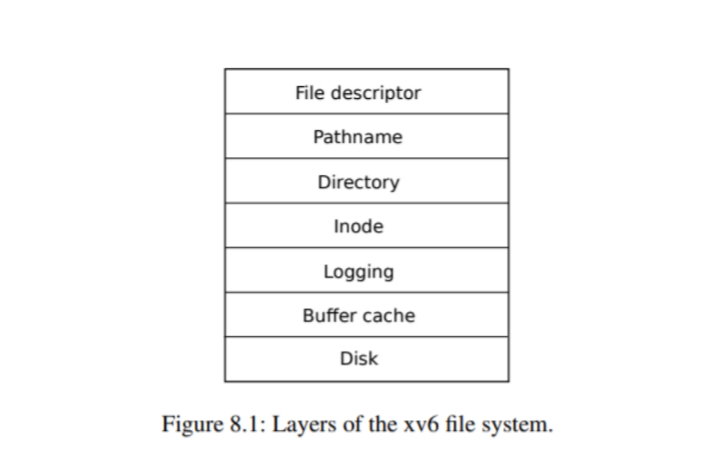
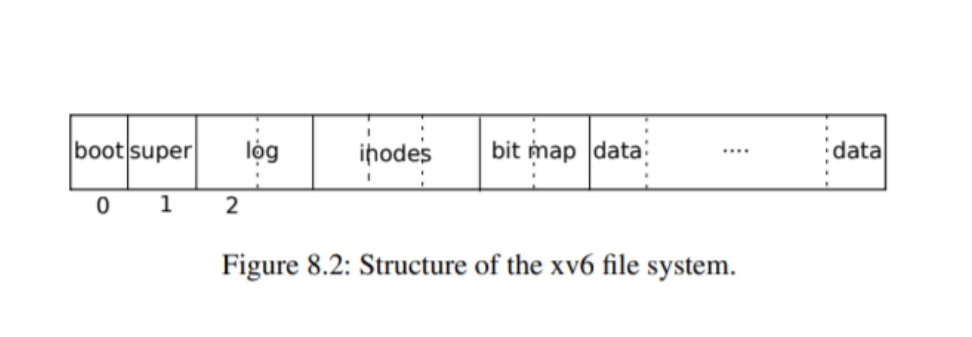
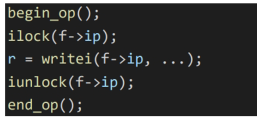
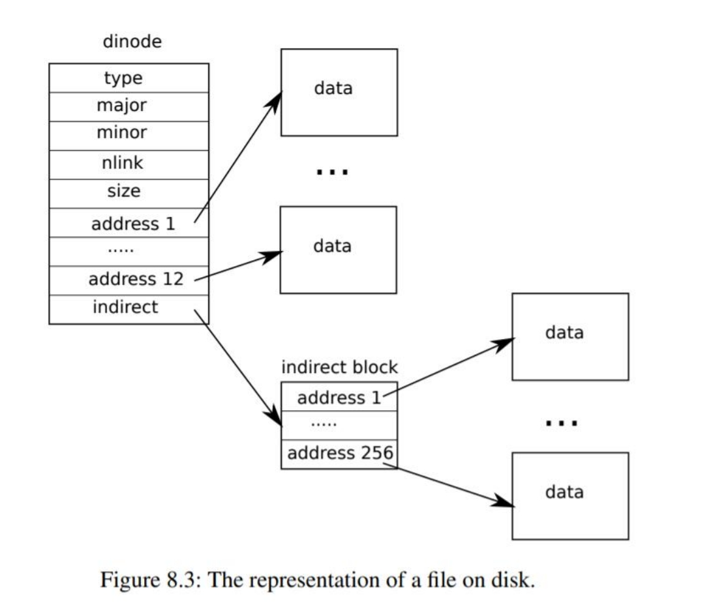

文件系统的目的是**组织和存储数据**。文件系统通常支持用户和应用程序之间的**数据共享， 以及支持持久性**，以便数据在重启后仍然可用。

xv6 文件系统提供了类 Unix 的文件、目录和路径名，并将其数据存储在 virtio 磁盘上以实现持久化。该文件系统解决了几个挑战：

1. 文件系统需要磁盘上的数据结构来表示命名目录和文件的树，记录保存每个文件内容的块的身份，并记录磁盘上哪些区域是空闲的。
2. 文件系统必须支持崩溃恢复。也就是说，如果发生崩溃（如电源故障），文件系统 必须在重新启动后仍能正常工作。风险在于，崩溃可能会中断更新序列，并在磁盘 上留下不一致的数据结构（例如，一个块既在文件中使用，又被标记为空闲）。
3. 不同的进程可能并发在文件系统上运行，所以文件系统代码必须协调维护每一个临 界区。
4. 访问磁盘的速度比访问内存的速度要慢几个数量级，所以文件系统必须维护缓存， 用于缓存常用块。

xv6 文件系统的实现分为七层，如图 8.1 所示。磁盘层在 virtio 磁盘上读写块。Buffer 缓存层缓存磁盘块，并同步访问它们，确保一个块只能同时被内核中的一个进程访问。 日志层允许上层通过事务更新多个磁盘块，并确保在崩溃时，磁盘块是原子更新的（即 全部更新或不更新）。inode 层将一个文件都表示为一个 inode，每个文件包含一个唯一 的 i-number 和一些存放文件数据的块。目录层将实现了一种特殊的 inode，被称为目 录，其包含一个目录项序列，每个目录项由文件名称和 i-number 组成。路径名层提供了层次化的路径名，如/usr/rtm/xv6/fs.c，可以用递归查找解析他们。文件描述符层用 文件系统接口抽象了许多 Unix 资源（如管道、设备、文件等），使程序员的生产力得到 大大的提高。

文件系统必须安排好磁盘存储 inode 和内容块的位置。为此，xv6将磁盘分为几个部分。文件系统不使用块0（它存放boot sector）。第1块称为superblock， 它包含了文件系统的元数据（以块为单位的文件系统大小、数据块的数量、inode 的数 量和日志中的块数）。从块 2 开始存放着日志。日志之后是 inodes，每个块会包含多个 inode。在这些块之后是位图块(bitmap)，记录哪些数据块在使用。其余的块是数据块， 每个数据块要么在位图块中标记为空闲，要么持有文件或目录的内容。超级块由一个单 独的程序 mkfs 写入，它建立了一个初始文件系统。

# Buffer cache layer

buffer缓存有两项工作。(1)同步访问磁盘块，以确保磁盘块在内存中只有一个buffer 缓存，并且一次只有一个内核线程能使用该 buffer 缓存；(2)缓存使用较多的块，这样它 们就不需要从慢速磁盘中重新读取。代码见 bio.c。

buffer 缓存的主要接口包括 bread 和 bwrite，bread 返回一个在内存中可以读取和 修改的块副本 buf，bwrite 将修改后的 buffer 写到磁盘上相应的块。内核线程在使用完 一个 buffer 后，必须通过调用 brelse 释放它。buffer 缓存为每个 buffer 的都设有 sleeplock，以确保每次只有一个线程使用 buffer（从而使用相应的磁盘块）；bread 返回的 buffer 会被锁定，而 brelse 释放锁。

buffer 缓存有固定数量的 buffer 来存放磁盘块，这意味 着如果文件系统需要一个尚未被缓存的块，buffer 缓存必须回收一个当前存放其他块的 buffer

# Code: Buffer cache

**buffer 缓存是一个由 buffer 组成的双端链表。**

由函数 binit 用静态数组 buf 初始化这个 链表， binit 在启动时由 main(kernel/main.c:27)调用。访问 buffer 缓存是通过链表，而不是 buf 数组。

buffer 有两个与之相关的状态字段。字段 valid 表示是否包含该块的副本（是否从磁盘 读取了数据）。字段 disk 表示缓冲区的内容已经被修改需要被重新写入磁盘。

bget (kernel/bio.c:59)扫描 buffer 链表，寻找给定设备号和扇区号来查找缓冲区 (kernel/bio.c:65-73)。如果存在，bget 就会获取该 buffer 的 sleep-lock。然后 bget 返回被 锁定的 buffer。

如果给定的扇区没有缓存的 buffer，bget 必须生成一个，可能会使用一个存放不同扇 区的 buffer，它再次扫描 buffer 链表，寻找没有被使用的 buffer(b->refcnt = 0)；任何这样 的 buffer 都可以使用。bget 修改 buffer 元数据，记录新的 设备号和扇区号，并获得其 sleep-lock。请注意，b->valid = 0 可以确保 bread 从磁盘读取 块数据，而不是错误地使用 buffer 之前的内容。

Bget 通过从第一次循环检查块是否被缓存，第二次循环来生成一个相应的 buffer（通过设置 dev、blockno 和 refcnt），在进行这两步操作 时，需要一直持有 bache.lock 。持有 bache.lock 会保证上面两个循环在整体上是原子的。

**bget 在 bcache.lock 保护的临界区之外获取 buffer 的 sleep-lock 是安全的，因为非零 的 b->refcnt 可以防止缓冲区被重新用于不同的磁盘块。*sleep-lock 保护的是块的缓冲内容 的读写，而 bcache.lock 保护被缓存块的信息。***

当调用者处理完一个buffer后，必须调用brelse来释放它。brelse (kernel/bio.c:117)释放 sleep-lock，并将该 buffer 移动到链表的头部(kernel/bio.c:128- 133)。移动 buffer 会使链表按照 buffer 最近使用的时间（最近释放）排序，链表中的第一个 buffer 是最近使用的，最后一个是最早使用的。，先检查最近使用的 缓冲区（从 bcache.head 开始，通过 next 指针）将减少扫描时间。扫描选取可使用 buffer 的方法是通过从后向前扫描（通过 prev 指针）选取最近使用最少的缓冲区。

#  Logging layer

Xv6 通过简单的日志系统来解决文件系统操作过程中崩溃带来的问题。**xv6的系统调用不直接写磁盘上的文件系统数据结构**。相反，它**将写入的数据记录在磁盘上的日志中**。**一旦系统调用记录了全部的写入数据，它就会在磁盘上写一个特殊的提交记录，**表明该日志包含了一个**完整的操作**。这时，系统调用就会将**日志中的写入数据写到磁盘上相应的位置**。在执行完成后，系统调用将磁盘上的日志清除。

如果系统崩溃并重启，文件系统会在启动过程中恢复自己。如果日志被标记为包含一个 完整的操作，那么恢复代码就会将写入的内容复制到它们在磁盘文件系统中的相应位置。日志未被标记为包含完整的操作，则恢复代码将忽略并清除该日志。

为什么xv6的日志系统可以解决文件系统操作过程中的崩溃问题？如果崩溃发生在**操作提交之前，那么磁盘上的日志将不会被标记为完成，恢复代码将忽略它**，磁盘的状态就**像操作根本没有开始**一样。如果崩溃发生在操作提交之后，那么恢复代码会重新执行写操作，可能会重复执行之前的写操作。不管是哪种情况，日志都会使**写与崩溃为原子**的，即恢复后， **所有操作的写入内容，要么都在磁盘上，要么都不在**。

# Log design

日志贮存在一个固定位置，由 superblock 指定。**它由一个 header 块组成，后面是一连 串的更新块副本（日志块）。**header 块包含一个扇区号数组，其中的每个扇区号都对应一个 日志块，header 还包含日志块的数量。磁盘上 header 块中的数量要么为零，表示日志中 没有事务，要么为非零，表示日志中包含一个完整的提交事务，并有指定数量的日志块。Xv6 在事务提交时会修改 header 块，将日志块复制到文件系统后，会将数量设为零。因此，一 个事务中途的崩溃将导致日志 header 块中的计数为零；提交后的崩溃的计数为非零。

**为了应对崩溃，每个系统调用都包含一个原子写序列。**为了允许不同进程并发执行文件 系统操作，日志系统可以**将多个系统调用的写操作累积到一个事务中。**因此，一次提交可能 涉及多个完整系统调用的写入。**为了避免一个系统调用被分裂到不同的事务中，只有在没有文件系统相关的系统调用正在进行时，日志系统才会提交。**

将几个事务一起提交的方法被称为组提交（group commit）。组提交可以减少磁盘操作的次数，因为它将提交的固定成本分摊在了多个操作上。组提交可以让文件系统同时执行更 多的并发写，也可以让磁盘在一次磁盘轮转中把它们全部写入。Xv6 的 virtio 驱动不支持这 种批处理，但 xv6 的文件系统实现了这种方式。

Xv6 在磁盘上**划出固定的空间来存放日志**。在**一个事务中，系统调用所写的块总数必须 适应这个空间的大小**。这将导致两个后果：

1. 系统调用写入的日志大小必须小于日志空间的大小。这对大多数系统调用来说都不 是问题，但有两个系统调用可能会写很多块，write 和 unlink。大文件的 write 可能会写很 多数据块和 bitmap 块，以及一个 inode 块；取消链接一个大文件可能会写很多 bitmap 块和 一个 inode。Xv6 的 write 系统调用将大的写操作分解成多个小的写操作，以适应在日志空 间的大小，而 unlink 不会引起问题，因为 xv6 文件系统只使用一个位图块。
2. 日志空间有限的另一个后果是，日志系统只会在确定了系统调用的写操作可以适应 剩余日志空间之后，才会开始执行该系统调用。

# Code: logging

系统调用中一般用法如下：

**begin_op(kernel/log.c:126)会一直等到日志系统没有 commiting，并且有足够的日志空 间 来 容 纳 这 次 调 用 的 写** 。 log.outstanding 统 计 当 前 系 统 调 用 的 数 量 ， 可 以 通 过 log.outstanding 乘以 MAXOPBLOCKS 来计算已使用的日志空间。自增 log.outstanding 既 能预留空间，又能防止该系统调用期间进行提交。该代码假设每次系统调用最多写入 MAXOPBLOCKS 个块。

log_write (kernel/log.c:214) 是 bwrite 的代理。它将扇区号记录在内存中，在磁盘上的 日志中使用一个槽，并自增 buffer.refcnt 防止该 buffer 被重用。**在提交之前，块必须留在 缓存中，即该缓存的副本是修改的唯一记录；在提交之后才能将其写入磁盘上的位置；该次 修改必须对其他读可见。**

当一个块在一个事务中被多次写入时，他们在日志中的槽 是相同的。这种优化通常被称为 absorption(吸收)。例如，在一个事务中，包含多个文件的 多个 inode 的磁盘块被写多次，这是常见的情况。通过将几次磁盘写吸收为一次，文件系统 可以节省日志空间，并且可以获得更好的性能，因为只有一份磁盘块的副本必须写入磁盘。

**end_op (kernel/log.c:146)首先递减 log.outstanding。如果计数为零，则通过调用 commit()来提交当前事务。**

Commit 分为四个阶段：

1. write_log()(kernel/log.c:178)将事务中修改的每个块从 buffer 缓存中复制到磁盘上的 日志槽中。
2.  write_head()(kernel/log.c:102)将 header 块写到磁盘上，就表明已提交，为提交点， 写完日志后的崩溃，会导致在重启后重新执行日志。
3. install_trans(kernel/log.c:69)从日志中读取每个块，并将其写到文件系统中对应的位 置。
4. 最后修改日志块计数为 0，并写入日志空间的 header 部分。这必须在下一个事务开 始之前修改，这样崩溃就不会导致重启后的恢复使用这次的 header 和下次的日志块。

recover_from_log (kernel/log.c:116) 是 在 initlog (kernel/log.c:55) 中 调 用 的 ， 而 initlog 是在第一个用户进程运行 (kernel/proc.c:539) 之前, 由 fsinit(kernel/fs.c:42) 调用 的。它读取日志头，如果日志头显示日志中包含一个已提交的事务，则会像 end_op 那样执 行日志。

一个使用了日志的例子是 filewrite (kernel/file.c:135)。这个事务看起来像这样

这段代码被包裹在一个循环中，它将大的写分解成每次只有几个扇区的单独事务，以避 免溢出日志空间。调用 writei 写入许多块作为这个事务的一部分：文件的 inode，一个或 多个 bitmap 块，以及一些数据块。

# Code: Block allocator

文件和目录存储在磁盘块中，必须从空闲池中分配，xv6 的块分配器在磁盘上维护一个 bitmap，每个块对应一个位。0 表示对应的块是空闲的，1 表示正在使用中。程序 mkfs 设置 引导扇区、超级块、日志块、inode 块和位图块对应的位。

块分配器提供了两个函数：balloc申请一个新的磁盘块，bfree释放一个块。balloc (kernel/fs.c:71)会有一个循环遍历每一个块，从块0开始，直到 sb.size，即文件系统中的块 数。它寻找一个位为 0 的空闲块。如果 balloc 找到了这样一个块，它就会更新 bitmap 并 返回该块。为了提高效率，这个循环被分成两部分。外循环读取 bitmap 的一个块，内循环 检查块中的所有 BPB 位。如果两个进程同时试图分配一个块，可能会发生竞争，但 buffer 缓 存只允许块同时被一个进程访问，这就避免了这种情况的发生。

Bfree (kernel/fs.c:90) 找到相应的 bitmap 块并清除相应的位。bread 和 brelse 暗含的 独占性避免了显式锁定。

balloc 和 bfree 必须在事务中被调用。

# Inode layer

术语 inode 有两种相关的含义。1、它可能指的是**磁盘上的数据结构**，其中包含了文件 的大小和数据块号的列表；2、inode 可能指的是**内存中的 inode**，它包含了磁盘上 inode 的副本以及内核中需要的其他信息。

磁盘上的 inode 被放置磁盘的一个连续区域。每一个 inode 的大小都是一样的，所以， 给定一个数字 n，很容易找到磁盘上的第 n 个 inode。事实上，这个数字 n，被称为 inode 号 或 i-number，在实现中就是通过这个识别 inode 的。

结构体 dinode(kernel/fs.h:32)定义了磁盘上的 inode。type 字段区分了文件、目录和特 殊文件（设备）。type 为 0 表示该 inode 是空闲的。nlink 字段统计引用这个 inode 的目录项 的数量，当引用数为 0 时就释放磁盘上的 inode 及其数据块。size 字段记录了文件中内容的 字节数。addrs 数组记录了持有文件内容的磁盘块的块号。

内核将在使用的 inode 保存在内存中；结构体 inode (kernel/file.h:17)是磁盘 dinode 的 拷贝。内核只在有指针指向 inode 才会储存。ref 字段为指向 inode 的指针的数量，如果引 用数量减少到零，内核就会从内存中丢弃这个 inode。iget 和 iput 函数引用和释放 inode， 并修改引用计数。指向 inode 的指针可以来自文件描述符，当前工作目录，以及短暂的内核 代码，如 exec。

在 xv6 的 inode 代码中，有四种锁或类似锁的机制。icache.lock 保证了一个 inode 在缓 存只有一个副本，以及缓存 inode 的 ref 字段计数正确。每个内存中的 inode 都有一个包含 sleep-lock 的锁字段，它保证了可以独占访问 inode 的其他字段（如文件长度）以及 inode 的文件或目录内容块的。一个 inode 的 ref 如果大于 0，则会使系统将该 inode 保留在缓存 中，而不会重用该 inode。最后，每个 inode 都包含一个 nlink 字段(在磁盘上，缓存时会复 制到内存中)，该字段统计链接该 inode 的目录项的数量；如果一个 inode 的链接数大于零， xv6 不会释放它。

iget()返回的 inode 指针在调用 iput()之前都是有效的；inode 不会被删除，指针所引用 的内存也不会被另一个 inode 重新使用。iget()提供了对 inode 的非独占性访问，因此可以 有许多指针指向同一个 inode。文件系统代码中的许多部分都依赖于 iget()的这种行为，既 是为了保持对 inode 的长期引用(如打开的文件和当前目录)，也是为了防止竞争，同时避免 在操作多个 inode 的代码中出现死锁(如路径名查找)。

inode 缓存只缓存被指针指向的 inode。它的主要工作其实是同步多个进程的访问，缓 存是次要的。如果一个 inode 被频繁使用，如果不被 inode 缓存保存，buffer 缓存可能会把 它保存在内存中。inode 缓存是 write-through 的，这意味着缓存的 inode 被修改，就必须 立即用 iupdate 把它写入磁盘。

# Code: Inodes

要创建一个新的 inode(例如，当创建一个文件时)，xv6 会调用ialloc(kernel/fs.c:196)。 71 Ialloc 类似于 balloc：它遍历磁盘上的 inode ，寻找一个被标记为空闲的 inode。当它找到 后，它会修改该 inode 的 type 字段来使用它，最后调用 iget (kernel/fs.c:210) 来从 inode  缓存中返回一个条目。由于一次只能有一个进程持有对 bp 的引用，所以 ialloc 可以正确执 行。ialloc 可以确保其他进程不会同时看到 inode 是可用的并使用它。

Iget (kernel/fs.c:243) 在 inode 缓存中寻找一个带有所需设备号和 inode 号码的 active 条目 (ip->ref > 0)。如果它 找到了，它就返回一个 新的对该 inode 的 引用 (kernel/fs.c:252-256)。当 iget 扫描时，它会记录第一个空槽的位置 (kernel/fs.c:257- 258)， 当它需要分配一个缓存条目时，它会使用这个空槽。

在读写 inode 的元数据或内容之前，代码必须使用 ilock 锁定它。Ilock(kernel/fs.c:289) 使用 sleep-lock 内部有一个睡眠锁来锁定。一旦 ilock 锁定了 inode，它就会根据自己的需 要从磁盘（更有可能是 buffer 缓存）读取 inode。函数 iunlock (kernel/fs.c:317)释放睡眠锁， 这会唤醒正在等待该睡眠锁的进程。

Iput (kernel/fs.c:333) 通过递减引用次数 (kernel/fs.c:356) 释放指向 inode 的指针。如 果递减后的引用数为 0，inode 缓存中的 就会释放掉该 inode 在 inode 缓存中的槽位，该 槽位就可以被其他 inode 使用。

如果 iput 发现没有指针指向该 inode，并且没有任何目录项链接该 inode（不在任何目 录中出现），那么该 inode 和它的数据块必须被释放。Iput 调用 itrunc 将文件截断为零字节， 释放数据块；将 inode 类型设置为 0（未分配）；并将 inode 写入磁盘（kernel/fs.c:338）。

在释放 inode 的情况下，iput 中的锁定协议值得仔细研究。其中一个危险是，并发线程可能会在 ilock 中等待使用该 inode（例如，读取文件或列出目录），而不会准备好发现该 inode 已不再分配。这种情况不会发生，因为如果系统调用没有指向缓存 inode 的链接，而 ip->ref 又是一个链接，那么系统调用就无法获得指向缓存 inode 的指针（如果有，ip->ref 应该为 2）。这一个引用就是调用 iput 的线程所拥有的引用。的确，iput 会在 icache.lock 临界部分之外检查引用计数是否为 1，但此时链接计数已知为零，因此没有线程会尝试获取新的引用。 另一个主要危险是，对 ialloc 的并发调用可能会使 iput返回一个正在被释放的inode。只有在 iupdate 写入磁盘后，inode 类型为零时，才会发生这种情况。 这种竞赛是良性的；分配线程会礼貌地等待获取 inode 的睡眠锁，然后再读取或写入 inode，此时 iput 就完成了。

iput()会写磁盘。这意味着任何使用文件系统的系统调用都会写磁盘，因为系统调用可 能是最后一个对文件有引用的调用。甚至像 read()这样看似只读的调用，最终也可能会调用 iput()。这又意味着，即使是只读的系统调用，如果使用了文件系统，也必须用事务来包装。

崩溃发生在 iput()中是相当棘手的。当文件的链接数降到零时，iput()不会立即截断一 个文件，因为一些进程可能仍然在内存中持有对 inode 的引用：一个进程可能仍然在对文件 进行读写，因为它成功地打开了 inode。但是，如果崩溃发生在该文件的最后一个文件描述 符释放时，那么该文件将被标记为已在磁盘上分配，但没有目录项指向它。

文件系统处理这种情况的方法有两种。简单的解决方法是，是在重启后的恢复时，文件 系统会扫描整个文件系统，寻找那些被标记为已分配的文件，但没有指向它们的目录项。如 果有这样的文件存在，那么就可以释放这些文件。

第二种解决方案不需要扫描文件系统。在这个解决方案中，文件系统在磁盘上（例如， 在 superblock 中）记录链接数为 0 但引用数不为 0 的文件的 inode 的 inumber。如果文件 系统在其引用计数达到 0 时删除该文件 。当文件的引用数为 0 时，文件系统会删除该文件，同时它更新磁盘上的列表，从列表中删除该 inode。恢复时，文件系统会释放列表中的任何 文件。

Xv6 没有实现这两种解决方案，这意味着 inode 可能会在磁盘上被标记分配，即使它们 不再使用。这意味着随着时间的推移，xv6 可能会面临磁盘空间耗尽的风险。

# Code: Inode content

磁盘上的 inode，即 dinode 结构体，包含一个 size 和一个块号数组（见图 8.3）。inode 数据可以在 dinode 的 addrs 数组中找到。开始的 NDIRECT 个数据块放置在数组中的前 NDIRECT 个条目中，这些块被称为直接块。接下来的 NINDIRECT 个数据块并没有放置在 inode 中，而是被存放在叫做间接块的数据块中。addrs 数组中的最后一个条目给出了放置 间接块的地址。因此，一个文件的前 12 kB ( NDIRECT x BSIZE)字节可以从 inode 中列出的 块中加载，而接下来的 256 kB ( NINDIRECT x BSIZE)字节只能在查阅间接块后才能取出。 对于磁盘这是一种不错的表示方式，但对客户机就有点复杂了。**Bmap 返回 inode ip 的第 bn 个数据块的磁盘块号。如果 ip 没有第 bn 个的数据块，bmap 就会分配一个。**

函数 bmap(kernel/fs.c:378)从简单的情况开始：最前面的 NDIRECT 个块储存在 inode(kernel/fs.c:383-387)中，接下来的 NINDIRECT 个块放置在 ip->addrs[NDIRECT]指向 的的间接块中。Bmap 读取间接块(kernel/fs.c:394)，然后从块内的正确的位置读取一个块号 73 (kernel/fs.c:395)。如果块号超过了 NDIRECT+NINDIRECT，bmap 就会 panic；writei 会检 查并防止这种情况(kernel/fs.c:490)。

Bmap 根据需要分配块。ip->addrs[bn]或间接条目为 0 时表示没有块。当 bmap 遇到 0 时，它会用新的块号来代替 0(kernel/fs.c:384-385) (kernel/fs.c:392-393)。 

itrunc 释放文件的块，将 inode 的大小重置为零。Itrunc (kernel/fs.c:410) 首先释放直 接块(kernel/fs.c:416-421)，然后释放间接块中指向的块(kernel/fs.c:426- 429)，最后释放间接 块本身(kernel/fs.c:431-432)。 

Bmap 使 得 readi 和 writei 可 以 很 容 易 地 获 取 一 个 inode 的数据。 Readi  (kernel/fs.c:456)首先要确定偏移量和计数没有超过文件末端。从文件超出末尾开始的读会返 回一个错误(kernel/fs.c:461-462)，而从文件末尾开始或读取过程中超出末尾的读会不会返回 错误，只是返回的字节数会少于请求的字节数(kernel/fs.c:463-464)。

 主循环会把文件中的每一个块的数据复制到 dst 中(kernel/fs.c:466-474)。writei (kernel/fs.c:483)与 readi 相同，但有三个不同：（1）、从文件末尾开始或越过文件末尾的写入 会使文件增长，但不会超过文件的最大长度(kernel/fs.c:490-491)；（2）、循环将数据复制到 缓冲区而不是 out(kernel/fs.c:36)；（3）、如果写使文件增长了，writi 必须更新它的大小 (kernel/fs.c:504-511)。 

readi 和 writei 开始都会检查 ip->type == T_DEV。这种情况处理的是数据不在文件系 统中的特殊设备；我们将在文件描述符层中再讨论这种情况。

函数 stati (kernel/fs.c:442) 将 inode 元数据复制到 stat 结构体中，通过 stat 系统调 用暴露给用户程序。

# directory layer

目录的实现机制和文件很类似。它的 inode 类型是 T_DIR，它的数据是一个目录项的序 列。每个条目是一个结构体 dirent(kernel/fs.h:56)，它包含一个名称和一个 inode 号。名称 最多包含 DIRSIZ(14)个字符，较短的名称以 NULL(0)结束。inode 号为 0 的目录项是空闲的。

函数 dirlookup (kernel/fs.c:527)在一个目录中搜索一个带有给定名称的条目。如果找到 了，它返回一个指向相应 inode 的指针，解锁该 inode，并将*poff 设置为目录中条目的字 节偏移量，以便调用者编辑它。如果 dirlookup 找到一个对应名称的条目，则更新*poff，并 返回一个通过 iget 获得的未被锁定的 inode。Dirlookup 是 iget 返回未锁定的 inode 的原因。

调用者已经锁定了 dp，所以如果查找的是 “.” ，当前目录的别名，在返回之前试图锁定 inode， 就会试图重新锁定 dp 而死锁。(还有更复杂的死锁情况，涉及到多个进程和”..”，父目录的 别名；”.”不是唯一的问题。) 调用者可以先解锁 dp，然后再锁定 ip，保证一次只持有一个 锁。

函数 dirlink (kernel/fs.c:554)会在当前目录 dp 中创建一个新的目录项，通过给定的名称 和 inode 号。如果名称已经存在，dirlink 将返回一个错误(kernel/fs.c:560- 564)。主循环读取 目录项，寻找一个未使用的条目。当它找到一个时，它会提前跳出循环 (kernel/fs.c:538-539)，并将 off 设置为该可用条目的偏移量。否则，循环结束时，将 off 设置为 dp->size。不管 是哪种方式，dirlink 都会在偏移量 off 的位置添加一个新的条目到目录中(kernel/fs.c:574- 577)

# Code: Path names

查找路径名会对每一个节点调用一次 dirlookup。Namei (kernel/fs.c:661) 解析路径并返 回相应的 inode。函数 nameiparent 是 namei 的一个变种：它返回相应 inode 的父目录 inode，并将最后一个元素复制到 name 中。这两个函数都通过调用 namex 来实现。

Namex (kernel/fs.c:626)首先确定路径解析从哪里开始。如果路径以斜线开头，则从根 目录开始解析；否则，从当前目录开始解析(kernel/fs.c:630-633)。然后它使用 skipelem 来 遍历路径中的每个元素(kernel/fs.c:635)。循环的每次迭代都必须在当前 inode ip 中查找 name。迭代的开始是锁定 ip 并检查它是否是一个目录。如果不是，查找就会失败 (kernel/fs.c:636-640)。(锁定 ip 是必要的，不是因为 ip->type 可能会改变，而是因为在 ilock 运行之前，不能保证 ip->type 已经从磁盘载入)。如果调用的是 nameiparent，而且这是最 后一个路径元素，按照之前 nameiparent 的定义，循环应该提前停止，最后一个路径元素 已经被复制到 name 中，所以 namex 只需要返回解锁的 ip(kernel/fs.c:641-645)。最后，循 环使用 dirlookup 查找路径元素，并通过设置 ip = next 为下一次迭代做准备(kernel/fs.c:646- 651)。当循环遍历完路径元素时，它返回 ip。

namex 可能需要很长的时间来完成：它可能会涉及几个磁盘操作，通过遍历路径名得 到的目录的 inode 和目录块（如果它们不在 buffer 缓存中）。Xv6 经过精心设计，如果一个 内核线程对 namex 的调用在阻塞在磁盘 I/O 上，另一个内核线程查找不同的路径名可以同 时进行。Namex 分别锁定路径中的每个目录，这样不同目录的查找就可以并行进行。

这种并发性带来了一些挑战。例如，当一个内核线程在查找一个路径名时，另一个内核 线程可能正在取消链接一个目录，这会改变目录数。一个潜在的风险是，可能一个查找线程 正在搜索的目录可能已经被另一个内核线程删除了，而它的块已经被另一个目录或文件重用 了。 Xv6 避免了这种竞争。例如，在 namex 中执行 dirlookup 时，查找线程会持有目录的 锁，dirlookup 返回一个使用 iget 获得的 inode。iget 会增加 inode 的引用次数。只有从 dirlookup 收到 inode 后，namex 才会释放目录上的锁。现在另一个线程可能会从目录中取 消链接 inode，但 xv6 还不会删除 inode，因为 inode 的引用数仍然大于零。 另一个风险是死锁。例如，当查找". "时，next 指向的 inode 与 ip 相同。在释放对 ip 的 锁之前锁定 next 会导致死锁。为了避免这种死锁，namex 在获得对 next 的锁之前就会解锁 目录。这里我们再次看到为什么 iget 和 ilock 之间的分离是很重要的。

# File descriptor layer 文件描述符

Unix 接口很酷的一点是：Unix 中的大部分资源都是以文件的形式来表示的。包括控制 台、管道等设备，当然还有真实的文件。文件描述符层就是实现这种统一性的一层。

Xv6 给每个进程提供了自己的打开文件表，或者说文件描述符表，就像我们在第一章中 看到的那样。每个打开的文件由一个结构体 file(kernel/file.h:1)表示，它包装 inode 或管道， 也包含一个 I/O 偏移量。每次调用 open 都会创建一个新的打开文件（一个新的结构体 file）， 如果多个进程独立打开同一个文件，那么不同的 file 实例会有不同的 I/O 偏移量。另一方面， 一个打开的文件（同一个结构文件）可以在一个进程的文件表中出现多次，也可以在多个进 75 程的文件表中出现。

如果一个进程使用 open 打开文件，然后使用 dup 创建别名，或者使用 fork 与子进程共享文件，就会出现这种情况。引用计数可以跟踪特定打开文件的引用数量。 一个文件的打开方式可以为读，写，或者读写。通过 readable 和 writable 来指明。

系统中所有打开的文件都保存在一个全局文件表中，即 ftable。文件表的功能有: 分配 文件(filealloc)、创建重复引用(fileup)、释放引用(fileclose)、读写数据(fileeread和filewrite)。

Filealloc (kernel/file.c:30) 扫描文件表， 寻找一个未引用的文件 (f->ref == 0)，并返回一个新的引用；fileup (kernel/file.c:48) 增加 引用计数；fileclose (kernel/file.c:60) 减少引用计数。当一个文件的引用数达到 0 时，fileclose 会根据类型释放底层的管道或 inode。

函 数 filestat 、 fileread 和 filewrite 实 现 了 对 文 件 的 统 计 、 读 和 写 操 作 。 Filestat(kernel/file.c:88)只允许对 inodes 进行操作，并调用 stati。Fileread 和 filewrite 首先 检查打开模式是否允许该操作，然后再调用管道或 inode 的相关实现。如果文件代表一个 inode，fileread 和 filewrite 使用 I/O 偏移量作为本次操作的偏移量，然后前移偏移量 （kernel/file.c:122- 123）（kernel/file.c:153-154）。Pipes 没有偏移量的概念。回想一下 inode 的 函 数 需 要 调 用 者 处 理 锁 的 相 关 操 作 （ kernel/file.c:94-96）（ kernel/file.c:121-124） （kernel/file.c:163-166）。inode 加锁附带了一个不错的作用，那就是读写偏移量是原子式更 新的，这样多个进程写一个文件时，自己写的数据就不会被其他进程所覆盖，尽管他们的写 入可能最终会交错进行。

# System calls

函数 sys_link 和 sys_unlink 可以编辑目录，创建或删除对 inodes 的引用。它们是使 用事务的另一个很好的例子。Sys_link (kernel/sysfile.c:120) 首先获取它的参数，两个字符串 old 和 new (kernel/sysfile.c:125) 。假设 old 存在并且不是一个目录 (kernel/sysfile.c:129- 132)，sys_link 会递增它的 ip->nlink 计数。然后 sys_link 调用 nameiparent 找到 new  (kernel/sysfile.c:145) 的父目录和最终路径元素，并创建一个指向 old 的 inode 的新目录项 (kernel/sysfile.c:148)。新的父目录必须存在，并且和现有的 inode 在同一个设备上，inode 号 只在同一个磁盘上有意义。如果出现这样的错误，sys_link 必须返回并减少 ip->nlink。

事务简化了这个函数的实现，因为它需要更新多个磁盘块，但我们不必担心做这些事情 的顺序。它们要么全部成功，要么都不成功。例如，如果没有事务，在创建链接之前更新 ip->nlink，会使文件系统暂时处于不安全的状态，中间的崩溃可能会造成破坏。有了事务， 我们就不用担心这个问题了。

Sys_link 为一个现有的 inode 创建一个新的名字。而函数 create (kernel/sysfile.c:242)为 一个新的 inode 创建一个新的名字。它是三个文件创建相关的系统调用的综合：使用 O_CREATE 标志的 open 创建一个新的普通文件，mkdir 创建一个新的目录，以及 mkdev 创 建一个新的设备文件。和 sys_link 一样，create 也是通过调用 nameiparent 来获取父目录 的 inode。然后调用 dirlookup 来检查名称是否已经存在 (kernel/sysfile.c:252)。如果名称存 在，create 的行为取决于它被用于哪个系统调用：open，mkdir，mkdev 的语义不同。如果 create 是由 open 使用的 (type == T_FILE)，如果能根据该名字存在且为普通文件，那么打 76 开 就 会 成 功 ， 所 以 create 也 会 成 功 (kernel/sysfile.c:256) 。 否 则 ， 就 会 报 错 （kernel/sysfile.c:257-258）。如果这个名字不存在，create 就会用 ialloc 分配一个新的 inode(kernel/sysfile.c:261)。如果新的 inode 是一个目录，create 会在该目录添加条目“.”和 “..”。最后，现在数据已经被正确地初始化了，create 可 以 把 它 链 接 到 父 目 录 中 (kernel/sysfile.c:274)。和 sys_link 一样，create 同时拥有两个 inode 锁：ip 和 dp。没有死锁 的可能性，因为 inode ip 是新分配的：系统中没有其他进程会持有 ip 的锁并尝试锁住 dp。。

使 用 create ， 很 容 易 实 现 sys_open 、 sys_mkdir 和 sys_mknod 。 Sys_open (kernel/sysfile.c:287)是其中最复杂的，因为创建一个新文件只是它做的一小部分。如果 open 的打开模式包含为 O_CREATE，它就会调用 create (kernel/sysfile.c:301)。否则，它会调用 namei (kernel/sysfile.c:307)。Create 会返回一个锁定的 inode，但 namei 不会，所以 sys_open 必须锁定 inode。这比较有一个方便的地方是目录只会以读打开，而不是写。假设 inode 是 通过某种方式获得的，sys_open 会分配一个文件和一个文件描述符(kernel/sysfile.c:325)，然 后设置 file 相关的字段(kernel/sysfile.c:337- 94 342)。注意，没有其他进程可以访问这个部分 初始化的文件，因为它只在当前进程的表中。

函数 sys_pipe 通过提供创建 管道对的方法将管道实现与文件系统连接起来。它的参数是一个指针，该指针指向一个长度 为 2 的 int 类型数组，它将在这里记录两个新的文件描述符。然后它分配管道并装入文件描 述符。