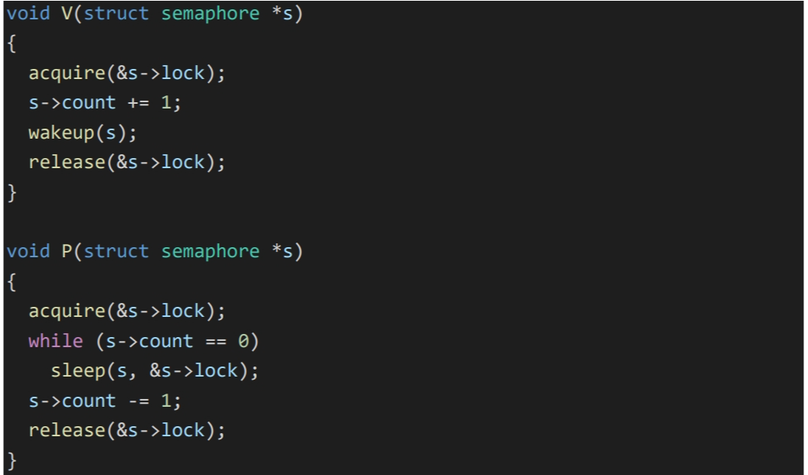

# 7.5 Sleep and wakeup

睡眠 和唤醒通常被称为 序 列 协 调 (sequence coordination) 或 条 件 同 步 (conditional  synchronization) 机制。为了说明这一点，让我们考虑一个叫做信号量(semaphore)[4]的同步机制，它协调生产 者和消费者。

信号量维护一个计数并提供两个操作。V 操作（针对生产者）增加计数。P 操 作（针对消费者）等待，直到计数非零，然后将其递减并返回。

如果生产者很少生产，消费者将把大部分时间花在 while 循环 中，希望得到一个非零的计数。消费者的 CPU 可以通过反复轮询(polling) s->count 来找 到比忙碌等待(busy waiting)更有效的工作。避免忙碌等待需要一种方法，让消费者让出 CPU， 只有在 V 增加计数后才恢复。

让我们想象一对调用， sleep 和 wakeup，其工作原理如下。Sleep(chan)睡眠 chan 上，chan 可以为任意值，称为 等待通道(wait chan)。Sleep 使调用进程进入睡眠状态，释放 CPU 进行其他工作。Wakeup(chan)唤醒所有在 chan 上 sleep 的进程（如果有的话），使它们的 sleep 调用返回。 如果没有进程在 chan 上等待，则 wakeup 不做任何事情。我们更改信号量实现，以使用 sleep 和 wakeup。

**存在可能丢失唤醒的问题**

。假设执行 P 的 s->count == 0 这一 行时。当 P 在 sleep 之前，V 在另一个 CPU 上运行：它将 s->count 改为非零，并调用 wakeup，wakeup 发现没有进程在睡眠，因此什么也不做。现在 P 继续执行：它调用 sleep 并进入睡眠状态。这就造成了一个问题：P 正在 sleep，等待一个已经发生的 V 调用。除非 我们运气好，生产者再次调用 V，否则消费者将永远等待，即使计数是非零。

**这个问题的根源在于，P 只有在 s->count == 0 时才会 sleep 的不变式被违反，当 V 运 行在错误的时刻时。**

保护这个不变式的一个不正确的方法是移动 P 中的锁的获取，这样它对 计数的检查和对 sleep 的调用是原子的：

为锁会阻止 V 在 s->count == 0 和 sleep 之间执行。它做到了这一点，但它也会**死锁。**P 在 sleep 时保持着锁，所以 V 将永 远阻塞在等待锁的过程中。

***我们将通过改变 sleep 的接口来修正前面的方案：调用者必须将条件锁(condition lock) 传递给 sleep，这样在调用进程被标记为 SLEEPING 并在 chan 上等待后，它就可以释放锁。***锁将强制并发的 V 等待到 P 完成使自己进入 SLEEPING 状态，这样 wakeup 就会发现 SLEEPING 的消费者并将其唤醒。一旦消费者再次被唤醒，sleep 就会重新获得锁，然后再 返回。我们新的正确的睡眠/唤醒方案可以使用如下(sleep 函数改变了)

**P 持有 s->lock 会阻止了 V 在 P 检查 c->count 和调用 sleep 之间试图唤醒它。但是， 请注意，我们需要 sleep 来原子地释放 s->lock 并使消费者进程进入 SLEEPING 状态。**

#  Code: Sleep and wakeup

让我们看看 sleep (kernel/proc.c:548) 和 wakeup (kernel/proc.c:582) 的实现。其基本思想是让 sleep 将当前进程标记为 SLEEPING，然后调用 sched 让出 CPU；wakeup 则寻 找给定的等待通道上睡眠的进程，并将其标记为 RUNNABLE。sleep 和 wakeup 的调用者可 以使用任何方便的数字作为 chan。Xv6 经常使用参与等待的内核数据结构的地址。

Sleep 首先获取 p->lock (kernel/proc.c:559)。现在进入睡眠状态的进程同时持有 p->lock 和 lk。在调用者(在本例中为 P)中，持有 lk 是必要的：它保证了没有其他进程(在本 例中，运行 V 的进程)可以调用 wakeup(chan)。现在 sleep 持有 p->lock，释放 lk 是安全 的：其他进程可能会调用 wakeup(chan)，但 wakeup 会等待获得 p->lock，因此会等到 sleep 将进程状态设置为 SLEEPING，使 wakeup 不会错过 sleep 的进程。

有一个复杂情况：如果 lk 和 p->lock 是同一个锁，如果 sleep 仍试图获取 p->lock， 就会和自己死锁。但是如果调用 sleep 的进程已经持有 p->lock，那么它就不需要再做任何 事情来避免错过一个并发的 wakeup。这样的情况发生在，wait (kernel/proc.c:582)调用 sleep 并持有 p->lock 时。

现在 sleep 持有 p->lock，而没有其他的锁，它可以通过记录它睡眠的 chan，将进程 状态设置 SLEEPING，并调用 sched(kernel/proc.c:564-567)来使进程进入睡眠状态。稍后我 们就会明白为什么在进程被标记为 SLEEPING 之前，p->lock 不会被释放（由调度器）。

在某些时候，一个进程将获取条件锁，设置睡眠等待的条件，并调用 wakeup(chan)。重要的是，wakeup 是在持有条件锁的情况下被调用的。Wakeup 循环浏览进程表 （kernel/proc.c:582）。它获取每个被检查的进程的 p->lock，因为它可能会修改该进程的状 态，也因为 p->sleep 确保 sleep 和 wakeup 不会相互错过。

**为什么 sleep 和 wakeup 的锁规则能保证睡眠的进程不会错过 wakeup？**sleep 进程从 检查条件之前到标记为 SLEEPING 之后的这段时间里，持有条件锁或它自己的 p->lock 或 两者都持有。调用 wakeup 的进程在 wakeup 的循环中持有这两个锁。因此，唤醒者要么在 消费者检查条件之前使条件为真；要么唤醒者的 wakeup 在消费者被标记为 SLEEPING 之后 检查它。 无论怎样，wakeup 就会看到这个睡眠的进程，并将其唤醒（除非有其他事情先将 其唤醒）。

**有时会出现多个进程在同一个 chan 上睡眠的情况**；例如，有多个进程从管道中读取数 据。调用一次 wakeup 就会把它们全部唤醒。其中一个进程将首先运行，并获得 sleep 参数 传递的锁，（就管道而言）读取数据都会在管道中等待。其他进程会发现，尽管被唤醒了， 但没有数据可读。从他们的角度来看，唤醒是“虚假的“，他们必须再次睡眠。**出于这个原因，sleep 总是在一个检查条件的循环中被调用。**

如果两次使用 sleep/wakeup 不小心选择了同一个通道，也不会有害：它们会看到虚假 的唤醒，上面提到的循环允许发生这种情况。

#  Code: Pipes

pipewrite 和 piperead 的实现

每个管道由一个结构体 pipe 表示，它包含一个锁和一个数据缓冲区。nread 和 nwrite 两个字段统计从缓冲区读取和写入的字节总数。

缓冲区呈环形：buf[PIPESIZE-1]之后写入的 下一个字节是 buf[0]。计数不呈环形。这个约定使得实现可以区分满缓冲区(nwrite ==  nread+PIPESIZE)和空缓冲区(nwrite == nread)，但这意味着**对缓冲区的索引必须使用 buf[nread % PIPESIZE]，而不是使用 buf[nread] (nwrite 也是如此)。**

假设对 piperead 和 pipewrite 的调用同时发生在两个不同的 CPU 上。Pipewrite (kernel/pipe.c:77)首先获取管道的锁，它保护了计数、数据和相关的不变式。然后，Piperead (kernel/pipe.c:103)也试图获取这个锁，但是不会获取成功。它在 acquire(kernel/spinlock.c:22) 中循环，等待锁的到来。当 piperead 等待时，pipewrite 会循环写，依次将每个字节添加到 管道中(kernel/pipe.c:95)。在这个循环中，可能会发生缓冲区被填满的情况(kernel/pipe.c:85)。 在这种情况下，**pipewrite 调用 wakeup 来提醒所有睡眠中的 reader 有数据在缓冲区中等待，然后在&pi->nwrite 上 sleep，等待 reader 从缓冲区中取出一些字节。Sleep 函数内会释放 pi->lock，然后 pipwrite 进程睡眠。**

现在 pi->lock 可用了，piperead 设法获取它并进入它的临界区：它发现 pi->nread !=  pi->nwrite (pipewrite 进 入 睡 眠 状 态 是 由 于 pi->nwrite ==  pi->nread+PIPESIZE ，所以它进入 for 循环，将数据从管道中复制出来 ，并按复制的字节数增加 nread。现在又可写了，所以 **piperead 在返回 之前调用 wakeup** 来唤醒在睡眠的 writer。**Wakeup 找到一个在 &pi->nwrite 上睡眠的进程，这个进程正在运行 pipewrite，但在缓冲区填满时停止了。它 将该进程标记为 RUNNABLE。**

管道代码对 reader 和 writer 使用单独的睡眠 chan（pi->nread 和 pi->nwrite）；这可 能会使系统在有多个 reader 和 writer 等待同一个管道的情况下更有效率。**管道代码在循环 内 sleep，**检查 sleep 条件；如果有多个 reader 和 writer，除了第一个被唤醒的进程外，其 他进程都会看到条件仍然是假的，然后再次睡眠。

#  Code: Wait, exit, and kill

一个子进程的 exit 和其父进程的 wait 之间的交互。在子进程退出的时候，父进程可能 已经在 wait 中睡眠了，也可能在做别的事情；在后一种情况下，后续的 wait 调用必须观察 子进程的退出，也许是在它调用 exit 之后很久。

**xv6 在 wait 观察到子进程退出之前，记录子进程退出的方式是让 exit 将调用进程设置为 ZOMBIE 状态，**在那里停留，**直到父进程的 wait 注意到它**，将子进程的状态改为 UNUSED，复制子进程的退出状态，并将子进程的进程ID返回给父进程。

**如果父进程比子进程先退出，父进程就把子进程交给 init 进程，而 init 进程则循环的调用 wait；这样每个子进程都有一个“父进程”来清理。**

Wait 使用调用进程 的 p->lock 作为条件锁，以避免唤醒丢失，它在开始时获取该锁。然后它扫描进程表。如果它发现一个处于 ZOMBIE 状态的子进程，它 释放这个子进程的资源和它的 proc 结构，将子进程的退出状态复制到提供给 wait 的地址 (如果它不是 0)，并返回子进程的 ID。

**如果 wait 找到了子进程但没有一个退出，它调用 sleep 等待其中一个子进程退出，然后再次扫描。**这里，在 sleep 中释放的条件 锁是等待进程的 p->lock，也就是上面提到的特殊情况。**。请注意，wait 经常持有两个锁；它 在试图获取任何子锁之前，会先获取自己的锁；因此 xv6 的所有锁都必须遵守相同的锁顺序 （父进程的锁，然后是子进程的锁），以避免死锁。**

Exit记录退出状态，释放一些资源，将所有子进程交给 init 进程， 在父进程处于等待状态时唤醒它，将调用进程标记为 zombie，并永久放弃 CPU。退出的进程必须持有父进程的锁，同时将自己状态设置为 ZOMBIE 并唤醒父 进程，因为父进程的锁是条件锁，可以防止在等待中丢失 wakeup。子进程也必须持有自己 的 p->lock，否则父进程可能会看到它的状态为 ZOMBIE，并在它还在运行时释放它。锁的 获取顺序对避免死锁很重要：因为 wait 在子锁之前获取父锁，所以 exit 必须使用相同的顺 序。

**Exit 调用了一个专门的唤醒函数 wakeup1，它只唤醒父函数，而且只有父进程在 wait 中睡眠的情况下才会去唤醒它。**在将自己的状态设置为 ZOMBIE 之前， 唤醒父进程可能看起来并不正确，但这是安全的：尽管 wakeup1 可能会导致父进程运行， 但 wait 中的循环不能检查子进程，直到子进程的 p->lock 被调度器释放为止，所以 wait 不 能查看退出的进程，直到 exit 将其状态设置为 ZOMBIE 之后(kernel/proc.c:386)。

exit 允许一个进程自行终止，而 kill（kernel/proc.c:611）则允许一个进程请求另一个进 程终止。kill 的作用很小：它只是设置进程 的 p->killed，如果它在 sleep，则 wakeup 它。**kill 的作用很小：它只是设置进程 的 p->killed，如果它在 sleep，则 wakeup 它。**最终，进程会进入或离开内核，这时如果 p->killed 被设置，usertrap 中的代码会调用 exit。如果进程在用户空间运行，它将很快通 过进行系统调用或因为定时器（或其他设备）中断而进入内核。

如果进程处于睡眠状态，kill 调用 wakeup 会使进程从睡眠中返回。**这是潜在的危险， 因为正在等待的条件可能不为真。**