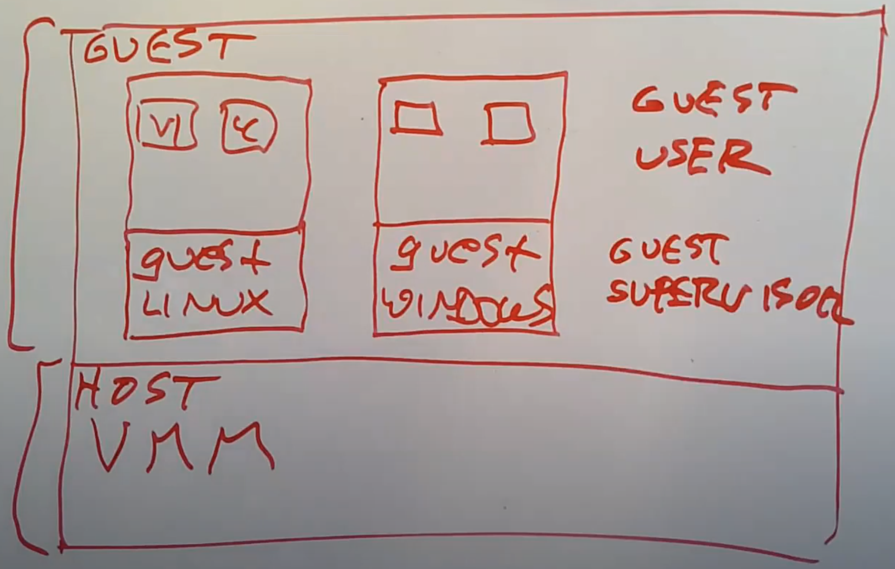

# [微内核讲解](./png/https://mit-public-courses-cn-translatio.gitbook.io/mit6-s081/lec18-os-organization-robert)

# 虚拟机

## Why Virtual Machine?

- 第一个部分是Trap and Emulate，这部分会介绍如何在RISC-V或者QEMU上构建属于自己的Virtual Machine Monitor（注，有些场合也称为Hypervisor）。
- 第二部分会描述最近在硬件上对于虚拟化的支持。

在架构的最底层，位于硬件之上存在一个Virtual Machine Monitor（VMM），它取代了标准的操作系统内核。VMM的工作是模拟多个计算机用来运行Guest操作系统。VMM往上一层，如果对比一个操作系统的架构应该是用户空间，但是现在是叫做Guest空间。所以在今天的架构图里面，上面是Guest空间，下面是Host空间（注，也就是上面运行Guest操作系统，下面运行VMM）。

在Guest空间，会有一个或者多个Guest操作系统内核，或许其中一个是Linux kernel。这里的Linux kernel会觉得自己就是个普通的内核，并在自己之上还运行一堆用户进程，例如VI，C Compiler。我们或许还有另一个Guest运行了Windows操作系统，同时也包含了Windows用户进程。所以，在Host空间运行的是VMM，在Guest空间运行的是普通的操作系统。除此之外，在Guest空间又可以分为Guest Supervisor Mode，也就是Guest操作系统内核运行的模式，和Guest User Mode。

VMM的主要目的是提供对计算机的模拟，这样你可以不做修改就启动普通的Linux，普通的Windows系统，并运行在虚拟机内，并且不用担心任何奇怪的事情发生。所以，VMM必须要能够完全按照实际硬件的行为来模拟Guest Supervisor Mode和Guest User Mode。

**这里借助的技术是：将操作系统内核从之前的内核空间上移至用户空间，并在操作系统内核之下增加新的一层（注，也就是虚拟机的内核是运行在宿主机的用户空间，虚拟机的内核通过新增加的一层VMM来对接底层硬件）以提供这里的灵活性。**

对于这们课程来说，我们之所以要学习虚拟机是因为VMM提供了对于操作系统的一种不同视角。**在操作系统的架构中，内核之上提供的封装单元是我们熟悉的进程，内核管理的是多个用户进程。而在VMM的架构中，VMM之上提供的封装单元是对计算机的模拟。**某种程度上来说，传统操作系统内核的内容下移了一层到了VMM。

几个目的：

- 让运行在Guest中的代码完全不能区分自己是运行在一个虚拟机还是物理机中，因为我们希望能在虚拟机中运行任何操作系统，甚至是你没有听说过的操作系统，这意味着对于任何操作系统的行为包括使用硬件的方式，虚拟机都必须提供提供对于硬件的完全相同的模拟，这样任何在真实硬件上能工作的代码，也同样能在虚拟机中工作。
- 也不希望Guest可以从虚拟机中逃逸。有可能你的客户运行的不是普通的Linux而是一个特殊的修改过的Linux，并且会试图突破虚拟机的限制来访问其他用户的虚拟机或者访问Amazon用来实现虚拟机隔离的VMM。所以Guest不能从虚拟机中逃逸还挺重要的。Guest可以通过VMM使用内存，但是不能使用不属于自己的内存。类似的，Guest也不应该在没有权限的时候访问存储设备或者网卡。所以这里我们会想要非常严格的隔离。虚拟机在很多方面比普通的Linux进程提供了更加严格的隔离。Linux进程经常可以相互交互，它们可以杀掉别的进程，它们可以读写相同的文件，或者通过pipe进行通信。但是在一个普通的虚拟机中，所有这些都不被允许。运行在同一个计算机上的不同虚拟机，彼此之间是通过VMM完全隔离的。所以出于安全性考虑人们喜欢使用虚拟机，这是一种可以运行未被信任软件的方式，同时又不用担心bug和恶意攻击。

## Trap-and-Emulate --- Trap

该如何构建我们自己的VMM呢？

一种实现方式是完全通过软件来实现，你可以想象写一个类似QEMU的软件，这个软件读取包含了XV6内核指令的文件，查看每一条指令并模拟RISC-V的状态，这里的状态包括了通过软件模拟32个寄存器（**通过软件解析来在生产环境中构建虚拟机**）。

一种**广泛使用的策略是在真实的CPU上运行Guest指令。**所以如果我们要在VMM之上运行XV6，我们需要先将XV6的指令加载到内存中，之后再跳转到XV6的第一条指令，这样你的计算机硬件就能直接运行XV6的指令。当然，这要求你的计算机拥有XV6期望的处理器（注，也就是RISC-V）。

但是实际中你又不能直接这么做，假设在普通操作系统中只能在kernel mode中执行的指令。前面说过，我们将Guest kernel按照一个Linux中的普通用户进程来运行，所以Guest kernel现在运行在User mode，而在User mode加载SATP寄存器是个非法的操作，假设这会导致我们的程序（注，也就是虚拟机）crash。但是将Guest kernel运行在宿主机的Supervisor mode危险，所以我们不能直接简单的在真实的CPU上运行Guest kernel。

### 相应的，这里会使用一些技巧。

**首先将Guest kernel运行在宿主机的User mode，这是最基本的策略。**这意味着，当我们自己写了一个VMM，然后通过VMM启动了一个XV6系统，VMM会将XV6的kernel指令加载到内存的某处，再设置好合适的Page Table使得XV6看起来自己的内存是从地址0开始向高地址走。之后VMM会使用trap或者sret指令来跳转到位于User mode的Guest操作系统的第一条指令，这样不论拥有多少条指令，Guest操作系统就可以一直执行下去。

一旦Guest操作系统需要使用privileged指令（**也就是在普通操作系统中只能在kernel mode中执行的指令**），因为它当前运行在User mode而不是Supervisor mode，会使得它触发trap并走回到我们的VMM中（注，在一个正常操作系统中，如果在User mode执行privileged指令，会通过trap走到内核，但是现在VMM替代了内核），之后我们就可以获得控制权。所以当Guest操作系统尝试修改SATP寄存器，RISC-V处理器会通过trap走回到我们的VMM中，之后我们的VMM就可以获得控制权。并且我们的VMM也可以查看是什么指令引起的trap，并做适当的处理。这里核心的点在于Guest操作系统并没有实际的设置SATP寄存器。

我这里假设VMM运行在Supervisor mode。所以在这里的图中，VMM就是宿主机的kernel。这里我们不是启动类似Linux的操作系统，而是启动VMM（注，类似VMware的ESXi）。VMM以privileged权限运行，并拥有硬件的完整控制权限，这样我们就可以在VMM里面设置各种硬件寄存器。有一些VMM就是这么运行的，你在硬件上启动它们，并且只有VMM运行在Supervisor mode。实际上还有很多很多其他的虚拟机方案，比如说在硬件上启动Linux，之后要么Linux自带一个VMM，要么通过可加载的内核模块将VMM加载至Linux内核中，这样VMM可以在Linux内核中以Supervisor mode运行。今天我们要讨论的论文就是采用后者。

***这里主要的点在于，我们自己写的可信赖的VMM运行在Supervisor mode，而我们将不可信赖的Guest kernel运行在User mode，通过一系列的处理使得Guest kernel看起来好像自己是运行在Supervisor mode。***

在RISC-V上，如果在User mode尝试运行任何一个需要Supervisor权限的指令都会触发trap。所以每当Guest操作系统尝试执行类似于读取SCAUSE寄存器，读写STVEC寄存器，都会触发一个trap，并走到VMM，之后我们就可以获得控制权。

## Trap-and-Emulate --- Emulate

VMM会为每一个Guest维护一套虚拟状态信息。所以VMM里面会维护虚拟的STVEC寄存器，虚拟的SEPC寄存器以及其他所有的privileged寄存器。当Guest操作系统运行指令需要读取某个privileged寄存器时，首先会通过trap走到VMM，因为在用户空间读取privileged寄存器是非法的。之后VMM会检查这条指令并发现这是一个比如说读取SEPC寄存器的指令，之后VMM会模拟这条指令，并将自己维护的虚拟SEPC寄存器，拷贝到trapframe的用户寄存器中。之后，VMM会将trapframe中保存的用户寄存器拷贝回真正的用户寄存器，通过sret指令，使得Guest从trap中返回。这时，用户寄存器a0里面保存的就是SEPC寄存器的值了，之后Guest操作系统会继续执行指令。最终，Guest读到了VMM替自己保管的虚拟SEPC寄存器。

VMM是怎么区分不同的Guest？

VMM会为每个Guest保存一份虚拟状态信息，然后它就像XV6知道是哪个进程一样，VMM也知道是哪个Guest通过trap走到VMM的。XV6有一个针对每个CPU的变量表明当前运行的是哪个进程，类似的VMM也有一个针对每个CPU的变量表明当前是哪个虚拟机在运行，进而查看对应的虚拟状态信息。

**在实际的硬件中会有对应寄存器，那么为什么我们不直接使用硬件中的寄存器，而是使用虚拟的寄存器？**

这里的原因是，VMM需要使用真实的寄存器。举个例子，想象一下SCAUSE寄存器，当Guest操作系统尝试做任何privileged操作时（注，也就是读写privileged寄存器），会发生trap。硬件会将硬件中真实的SCAUSE寄存器设置成引起trap的原因，这里的原因是因为权限不够。但是假设Guest操作系统只是从Guest用户进程执行了一个系统调用，Guest操作系统需要看到SCAUSE的值是系统调用。也就是说Guest操作系统在自己的trap handler中处理来自Guest用户进程的系统调用时，需要SCAUSE的值表明是系统调用。

而实际的SCAUSE寄存器的值却表明是因为指令违反了privilege规则才走到的trap。**通常情况下，VMM需要看到真实寄存器的值，而Guest操作系统需要能看到符合自己视角的寄存器的值。**（注，在Guest操作系统中，可能有两种情况会触发trap，一种是Guest用户空间进程的系统调用，也就是正常操作系统中正常的trap流程，另一种是Guest内核空间读取privileged寄存器时，因为Guest内核空间实际上也是在宿主机的用户空间，导致这是个非法操作并触发trap。Robert这边举的例子的流程应该是这样，**Guest用户进程执行系统调用，在这一个瞬间SCAUSE寄存器的值是ECALL，也就是8，但是稍后在Guest系统内核的trap handler中需要读取SCAUSE的值，以确定在Guest中引起trap的原因，但是这就触发了第二种trap，SCAUSE的值会变成Illegal Access。我们不能让Guest系统内核看到这个值，所以VMM这里将它变成ECALL并返回。）**

***在这种虚拟机的实现中，Guest整个运行在用户空间，任何时候它想要执行需要privilege权限的指令时，会通过trap走到VMM，VMM可以模拟这些指令。***

这种实现风格叫做Trap and Emulate。你可以完全通过软件实现这种VMM，也就是说你可以只通过修改软件就将XV6变成一个可以运行在RISC-V上的VMM，然后再在之上运行XV6虚拟机。当然，与常规的XV6一样，VMM需要运行在Supervisor mode。

所有以S开头的寄存器，也就是所有的Supervisor控制寄存器都必须保存在虚拟状态信息中。。同时还有一些信息并不能直接通过这些控制寄存器体现，但是又必须保存在这个虚拟状态信息中。其中一个信息就是mode。

VMM怎么知道Guest当前的mode呢？当Guest从Supervisor mode返回到User mode时会执行sret指令，而sret指令又是一个privileged指令，所以会通过trap走到VMM，进而VMM可以看到Guest正在执行sret指令，并将自己维护的mode从Supervisor变到User。

虚拟状态信息中保存的另外一个信息是hartid，它代表了CPU核的编号。

## Trap-and-Emulate --- Page Table

有关Trap and Emulate的实现还有两个重要的部分，一个是Page Table，另一个是外部设备。

Page Table包含了两个部分，第一个部分是Guest操作系统在很多时候会修改SATP寄存器（注，SATP寄存器是物理内存中包含了Page Table的地址，详见4.3），当然这会变成一个trap走到VMM，之后VMM可以接管。但是我们不想让VMM只是简单的替Guest设置真实的SATP寄存器，因为这样的话Guest就可以访问任意的内存地址，而不只是VMM分配给它的内存地址，所以我们不能让Guest操作系统简单的设置SATP寄存器。

**当Guest设置SATP寄存器时，真实的过程是，我们不能直接使用Guest操作系统的Page Table，VMM会生成一个新的Page Table来模拟Guest操作系统想要的Page Table。**

所以现在的Page Table翻译过程略微有点不一样，首先是Guest kernel包含了Page Table，但是这里是将Guest中的虚拟内存地址（注，下图中gva）映射到了Guest的物理内存地址（注，下图中gpa）。Guest物理地址是VMM分配给Guest的地址空间，例如32GB。并且VMM会告诉Guest这段内存地址从0开始，并一直上涨到32GB。但是在真实硬件上，这部分内存并不是连续的。所以**我们不能直接使用Guest物理地址，因为它们不对应真实的物理内存地址。**

相应的，VMM会为每个虚拟机维护一个映射表，将Guest物理内存地址映射到真实的物理内存地址，我们称之为主机物理内存地址（注，下图中的hpa）。这个映射表与Page Table类似，对于每个VMM分配给Guest的Guest物理内存Page，都有一条记录表明真实的物理内存Page是什么。

当Guest向SATP寄存器写了一个新的Page Table时，在对应的trap handler中，VMM会创建一个Shadow Page Table，Shadow Page Table的地址将会是VMM向真实SATP寄存器写入的值。Shadow Page Table由上面两个Page Table组合而成，**所以它将gva映射到了hpa。Shadow Page Table是这么构建的：**

- 从Guest Page Table中取出每一条记录，查看gpa。
- 使用VMM中的映射关系，将gpa翻译成hpa。
- 再将gva和hpa存放于Shadow Page Table。

在创建完之后，VMM会将Shadow Page Table设置到真实的SATP寄存器中，再返回到Guest内核中（注，这样的效果是，Guest里面看到的Page Table就是一个正常的Page Table，而Guest通过SATP寄存器指向的Page Table，将虚拟内存地址翻译得到的又是真实的物理内存地址）。

所以，**Guest kernel认为自己使用的是一个正常的Page Table，但是实际的硬件使用的是Shadow Page Table。**这种方式可以阻止Guest从被允许使用的内存中逃逸。Shadow Page Table只能包含VMM分配给虚拟机的主机物理内存地址。Guest不能向Page Table写入任何VMM未分配给Guest的内存地址。这是VMM实现隔离的一个关键部分。

- 学生提问：如果Guest操作系统想要为一个进程创建一个新的Page Table，会发生什么呢？
- Robert教授：Guest会完全按照Linux或者XV6的行为来执行。首先是格式化Page Table Entries以构造一个Page Table。之后执行指令将Page Table的地址写入到SATP寄存器，这就是Guest操作系统的行为。但是它又不能设置实际的SATP寄存器，因为这是一个privileged操作，所以设置SATP寄存器会触发trap并走到VMM。VMM会查看trap对应的指令，并发现Guest要尝试设置SATP寄存器，之后VMM会创建一个新的Shadow Page Table。VMM会查看Guest尝试要设置的Page Table的每一条记录，通过gpa->hpa的映射关系，将gva和hpa的对应关系翻译出来。如果Guest尝试使用一个不被允许的物理地址，VMM会生成一个真实的Page Fault。之后VMM会将Shadow Page Table设置到真实的SATP寄存器中，并返回到Guest中。

Shadow Page Table是实现VMM时一个比较麻烦的地方。除了设置SATP寄存器，Guest操作系统还有另一种方式可以与Page Table进行交互。**XV6有时候会直接修改属于自己的Page Table Entry，或者读取PTE中的dirty bit。**如果你读了RISC-V的文档，你可以发现在RISC-V上，如果软件更改了PTE，RISC-V不会做任何事情。如果你修改了PTE，RISC-V并不承诺可以立即观察到对于PTE的修改，在修改那一瞬间，你完全是不知道PTE被修改了（注，这里主要对比的是privileged指令，因为如果在用户空间执行了privileged指令，会立刻触发trap，而这里修改PTE不会有任何的额外的动作）。相应的，文档是这么说的，如果你修改PTE并且希望MMU可以看到这个改动，你需要执行sfence.vma指令，这个指令会使得硬件注意到你对Page Table的修改。所以如果你要自己写一个VMM，你在RISC-V上的VMM会完全忽略Guest对于PTE的修改，但是你知道Guest在修改完PTE之后将会执行sfence.vma指令，并且这是一个privileged指令，因为它以s开头，所以这条指令会通过trap走到VMM，VMM就可以知道sfence.vma指令被执行了。之后VMM会重新扫描Guest的当前Page Table，查找更新了的Page Table Entry。如果修改合法的话，VMM会将修改体现在Shadow Page Table中，并执行真实的sfence.vma指令来使得真实的硬件注意到Shadow Page Table的改动。最后再会返回到Guest操作系统中。

## 5 Trap-and-Emulate --- Devices

Trap and Emulate的最后一个部分，也就是虚拟机的外部设备。需要能够至少使得Guest认为所有它需要的外部设备是存在的。

这里人们通常会使用三种策略。

1. 第一种是，模拟一些需要用到的并且使用非常广泛的设备，例如磁盘。这里的实现方式是，Guest操作系统仍然会像与真实硬件设备交互一样，通过Memory Map控制寄存器与设备进行交互。通常来说，操作系统会假设硬件已经将自己的控制寄存器映射到了内核地址空间的某个地址上。在VMM中不会映射这些内存地址对应的Page，相应的会将这些Page设置成无效。这样当Guest操作系统尝试使用UART或者其他硬件时，一访问这些地址就会通过trap走到VMM。**VMM中会对磁盘或者串口设备有一些模拟，通过这些模拟，VMM知道如何响应Guest的指令，之后再恢复Guest的执行。**每一次Guest与外设硬件的交互，都会触发一个trap。
2. 第二种策略是提供虚拟设备，而不是模拟一个真实的设备。**通过在VMM中构建特殊的设备接口，可以使得Guest中的设备驱动与VMM内支持的设备进行高效交互。**现在的Guest设备驱动中可能没有Memory Mapped寄存器了，但是相应的在内存中会有一个命令队列，Guest操作系统将读写设备的命令写到队列中。在XV6中也使用了一个这种方式的设备驱动，在XV6的virtio_disk.c文件中，你可以看到一个设备驱动尝试与QEMU实现的虚拟磁盘设备交互。在这个驱动里面要么只使用了很少的，要么没有使用Memory Mapped寄存器，所以它基本不依赖trap，相应的它在内存中格式化了一个命令队列。之后QEMU会从内存中读取这些命令，但是并不会将它们应用到磁盘中，而是将它们应用到一个文件，对于XV6来说就是fs.image。这种方式比直接模拟硬件设备性能要更高，因为你可以在VMM中设计设备接口使得并不需要太多的trap。
3. 第三个策略是对于真实设备的pass-through，这里典型的例子就是网卡。现代的网卡具备硬件的支持，可以与VMM运行的多个Guest操作系统交互。你可以配置你的网卡，使得它表现的就像多个独立的子网卡，每个Guest操作系统拥有其中一个子网卡。经过VMM的配置，Guest操作系统可以直接与它在网卡上那一部分子网卡进行交互，并且效率非常的高。

以上就是实现外部设备的各种策略。我认为在实现一个VMM时，主要的困难就在于构建外部设备和设备驱动，并使得它们能正确的与Guest操作系统配合工作。这里或许是实现VMM的主要工作，尤其是当你使用第一种策略时。

## 硬件对虚拟机的支持

[19.6 硬件对虚拟机的支持 - MIT6.S081 (gitbook.io)](https://mit-public-courses-cn-translatio.gitbook.io/mit6-s081/lec19-virtual-machines-robert/19.6-ying-jian-dui-xu-ni-ji-de-zhi-chi)

## 对特权CPU功能的安全用户级访问

[论文讨论的相关东西)](https://mit-public-courses-cn-translatio.gitbook.io/mit6-s081/lec19-virtual-machines-robert/19.7-dune)

# Meltdown

[有关安全](https://mit-public-courses-cn-translatio.gitbook.io/mit6-s081/lec22-meltdown-robert/22.7-meltdown-fix)

# RCU[魏学明白](https://mit-public-courses-cn-translatio.gitbook.io/mit6-s081/lec23-rcu-robert/23.7-rcu-zong-jie)

今天的话题是如何在多核CPU计算机上获得好的性能，只会涉及这个话题的很小的一个部分，也就是**在面对内核中需要频繁读但是不需要频繁写的共享数据时，如何获得更好的性能。**

一个现代的计算机，或许包含了4、8、16、64个并行运行的CPU核，这些CPU核共享了内存数据，操作系统内核将会是一个并行运行的程序。如果你想要获得好的性能，你需要确保内核能尽可能的在多个CPU核上并行的完成它的工作。

**问题是内核中包含了大量的共享数据。**这意味着，即使两个完全不相关的进程在执行两个系统调用，如果这两个系统调用需要分配内存或使用磁盘缓存或者涉及到线程调度决策，它们可能最终会使用内核中相同的数据结构，因此我们需要有办法能让它们在使用相同数据的同时，又互不影响。

**我们之前看过其中一种可以保证正确性的方法，也就是spinlock。**它的工作就是当两个进程可能会相互影响时，阻止并行运行。降低性能。它使得正确性有了保障，但是又绝对的阻止了并行执行。

关注需要频繁读的数据，我们需要保证读操作在面对写操作时是安全的。

所以一种改进这里场景的方法是使用一种新的锁，它可以允许多个读取线程和一个写入线程。

## 读写锁 (Read-Write Lock)

这种锁被称为读写锁（Read-Write Lock），它的接口相比spinlock略显复杂。如果只是想要读取数据，那么可以调用r_lock，将锁作为参数传入，同样的还会有个r_unlock，数据的读取者使用这些接口。数据的写入者调用w_lock和w_unlock接口。

这里的语义是，要么你可以有多个数据的读取者获取了读锁，这样可以获得并行执行读操作的能力；要么你只能有一个数据写入者获取了写锁。但是不能两种情况同时发生，**读写锁排除了某人获取了数据的写锁，同时又有别人获取读锁的可能性。你要么只有一个数据写入者，要么有多个数据读取者，不可能有别的可能。**

但实际上如果你深入细节，你会发现当你使用读写锁时，尤其对于大部分都是读取操作的数据结构，会有一些问题。为了了解实际发生了什么，我们必须看一下读写锁的代码实现。

Linux实际上有读写锁的实现，上面是一种简化了的Linux代码。首先有一个结构体是rwlock，这与XV6中的lock结构体类似。rwlock结构体里面有一个计数器n，

- 如果n等于0那表示锁没有以任何形式被被任何人持有
- 如果n等于-1那表示当前有一个数据写入者持有写锁
- 如果n大于0表示有n个数据读取者持有读锁。我们需要记录这里的数字，因为我们只有在n减为0的时候才能让数据写入者持有写锁。

r_lock函数会一直**在一个循环里面等待数据写入者释放锁。**首先它获取读写锁中计数器n的拷贝，如果n的拷贝小于0的话那意味着存在一个数据写入者，我们只能继续循环以等待数据写入者退出。如果n的拷贝不小于0，我们会增加读写锁的计数器。但是我们只能在读写锁的计数器仍然大于等于0的时候，对其加1。

所以我们不能直接对n加1，因为如果一个数据写入者在我们检查n和我们增加n之间潜入了，那么我们有可能在数据写入者将n设置为-1的同时，将n又加了1。**所以我们只能在检查完n大于等于0，且n没有改变的前提下，将其加1。**

人们通过利用特殊的原子指令来实现这一点，其中一个使用起来很方便的指令是compare-and-swap（CAS）。CAS接收三个参数，第一个参数是内存的某个地址，第二个参数是我们认为内存中该地址持有的数值，第三个参数是我们想设置到内存地址的数值。CAS的语义是，硬件首先会设置一个内部的锁，使得一个CAS指令针对一个内存地址原子的执行；之后硬件会检查当前内存地址的数值是否还是x；如果是的话，将其设置为第三个参数，也就是x+1，之后CAS指令会返回1；如果不是的话，并不会改变内存地址的数值，并返回0。这里必须是原子性，因为这里包含了两个操作，首先是检查当前值，其次是设置一个新的数值。

上面介绍了w_lock与r_lock同时调用的场景。多个r_lock同时调用的场景同样也很有趣。假设n从0开始，当两个r_lock同时调用时，我们希望当两个r_lock都返回时，n变成2，因为我们希望两个数据读取者可以并行的使用数据。两个r_lock在最开始都将看到n为0，并且都会通过传入第二个参数0，第三个参数1来调用CAS指令，但是只有一个CAS指令能成功。CAS是一个原子操作，一次只能发生一个CAS指令。不管哪个CAS指令先执行，将会看到n等于0，并将其设置为1。另一个CAS指令将会看到n等于1，返回失败，并回到循环的最开始，这一次x可以读到1，并且接下来执行CAS的时候，第二个参数将会是1，第三个参数是2，这一次CAS指令可以执行成功。最终两次r_lock都能成功获取锁，其中一次r_lock在第一次尝试就能成功，另一次r_lock会回到循环的最开始再次尝试并成功。

**在刚刚两个数据读取者要获取锁的过程中，第二个数据读取者需要再经历一次循环，这看起来有点浪费，如果有多个数据读取者，那么它们都需要重试。**

**即使没有任何的数据写入者，仅仅是在多个CPU核上有大量的数据读取者，r_lock也可能会有非常高的代价。**在一个多核的系统中，每个CPU核都有一个关联的cache，也就是L1 cache。每当CPU核读写数据时，都会保存在cache中。除此之外，还有一些内部连接的线路使得CPU可以彼此交互，因为如果某个CPU核修改了某个数据，它需要告诉其他CPU核不要去缓存这个数据，这个过程被称为(cache) invalidation。

如果有多个数据读取者在多个CPU上同时调用r_lock，它们都会读取读写锁的计数l->n，并将这个数据加载到CPU的cache中，它们也都会调用CAS指令，但是第一个调用CAS指令的CPU会修改l->n的内容。作为修改的一部分，它需要使得其他CPU上的cache失效。所以执行第一个CAS指令的CPU需要通过线路发送invalidate消息给其他每一个CPU核，之后其他的CPU核在执行CAS指令时，需要重新读取l->n，但是这时CAS指令会失败，因为l->n已经等于1了，但x还是等于0。之后剩下的所有数据读取者都会回到循环的最开始，重复上面的流程，但这一次还是只有一个数据读取者能成功。

所以r_lock中最关键的就是它对共享数据做了一次写操作。所以我们期望找到一种方式能够在读数据的同时，又不需要写数据，哪怕是写锁的计数器也不行。这样读数据实际上才是一个真正的只读操作。

## RCU实现(1) - 基本实现

一种可能的解决方案是：数据读取者完全不使用锁。如果没有数据的写入者，那么不会有任何问题。

接下来我们看一下存在数据写入者时的三种可能场景：

- 首先是数据的写入者只修改了链表元素的内容，将链表元素中的字符串改成了其他的字符串。
- 第二种场景是数据写入者插入了一个链表元素。
- 第三种场景是数据写入者删除了一个链表元素。

视这三种场景并看一下同时发生数据的读写会有什么问题？

- 如果数据写入者想要修改链表元素内的字符串，而数据读取者可能正在读取相同字符串。如果不做任何特殊处理，数据读取者可能会读到部分旧的字符串和部分新的字符串。这是我们需要考虑的一个问题。
- 如果数据写入者正在插入一个链表元素，假设要在链表头部插入一个元素，数据写入者需要将链表的头指针指向新元素，并将新元素的next指针指向之前的第一个元素。这里的问题是，数据的写入者可能在初始化新元素之前，就将头指针指向新元素，也就是说这时新元素包含的字符串是无效的并且新元素的next指针指向的是一个无效的地址。这是插入链表元素时可能出错的地方。
- 如果数据写入者正在删除一个链表元素，我们假设删除的是第一个元素，所以需要将链表的头指针指向链表的第二个元素，之后再释放链表的第一个元素。这里的问题是，如果数据读取者正好在读链表的第一个元素，而数据写入者又释放了这个元素，那么数据读取者看到的是释放了的元素，这个链表元素可能接下来被用作其他用途，从数据读取者的角度来说看到的是垃圾数据。

我们不能直接让数据读取者在无锁情况下完成读取操作，但是我们可以修复上面提到的问题，这就带出了RCU（Read Copy Update）这个话题。**RCU的主要任务就是修复上面的三种数据读取者可能会陷入问题的场景，它的具体做法是让数据写入者变得更加复杂一些，所以数据写入者会更慢一些。**

数据写入者不允许修改链表元素的内容。假设我们有一个链表，数据写入者想要更新链表元素E2。**现在不能直接修改E2的内容，RCU会创建并初始化一个新的链表元素。所以新的内容会写到新的链表元素中，之后数据写入者会将新链表元素的next指针指向E3，之后在单个的写操作中将E1的next指针指向新的链表元素。**

所以这里不是修改链表元素的内容，而是用一个包含了更新之后数据的新链表元素代替之前的链表元素。对于数据读取者来说，如果遍历到了E1并正在查看E1的next指针：

- 要么看到的是旧的元素E2，这并没有问题，因为E2并没有被改变；
- 要么看到的是新版本的E2，这也没有问题，因为数据写入者在更新E1的next指针之前已经完全初始化好了新版本的E2。

**这里核心的点在于，数据读取者永远也不会看到一个正在被修改的链表元素内容。**

##  RCU实现(2) - Memory barrier

实现RCU的第二个部分就是数据读取者和数据写入者都需要使用memory barriers，这里背后的原因是因为我们这里没有使用锁。对于数据写入者来说，memory barrier应该放置在committing write之前，这样可以告知编译器和硬件，先完成所有在barrier之前的写操作，再完成barrier之后的写操作。所以在E1设置next指针指向E2‘的时候，E2’必然已经完全初始化完了。（避免了所有的编译器和许多微处理器都会重排内存操作）

对于数据读取者，需要先将E1的next指针加载到某个临时寄存器中，我们假设r1保存了E1的next指针，之后数据读取者也需要一个memory barrier，然后数据读取者才能查看r1中保存的指针。

这里的barrier表明的意思是，在完成E1的next指针读取之前，不要执行其他的数据读取，这样数据读取者从E1的next指针要么可以读到旧的E2，要么可以读到新的E2‘。通过barrier的保障，我们可以确保成功在r1中加载了E1的next指针之后，再读取r1中指针对应的内容。

因为数据写入者中包含的barrier确保了在committing write时，E2’已经初始化完成。如果数据读取者读到的是E2‘，数据读取者中包含的barrier确保了可以看到初始化之后E2’的内容。

## RCU实现(3) - 读写规则

前面有同学也提到过，数据写入者会将E1的next指针从指向旧的E2切换到指向新的E2‘，但是可能有数据读取者在切换之前读到了旧的E2，并且仍然在查看旧的E2。我们需要在某个时候释放旧的E2，但是最好不要在某些数据读取者还在读的时候释放。

所以我们需要等待最后一个数据读取者读完旧的E2，然后才能释放旧的E2。这就是RCU需要解决的第三个问题，**数据写入者到底要等待多久才能释放E2？你可以想到好几种方法来实现这里的等待。**

数据读取者和写入者都需要遵循一些规则，使得数据写入者可以在稍后再释放链表元素。规则如下：

1. 数据读取者不允许在context switch（注，是指线程切换的context switch，详见11.4）时持有一个被RCU保护的数据（也就是链表元素）的指针。所以数据读取者不能在RCU critical 区域内出让CPU。
2. 对于数据写入者，它会在每一个CPU核都执行过至少一次context switch之后再释放链表元素。

## RCU总结